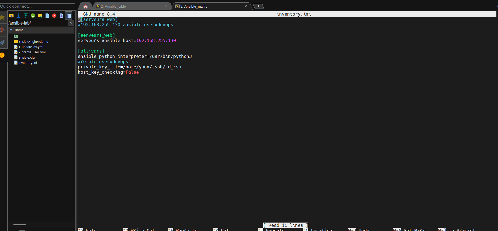
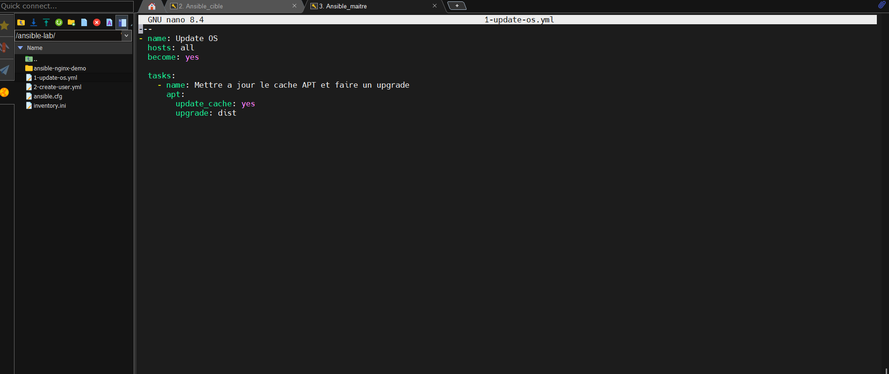
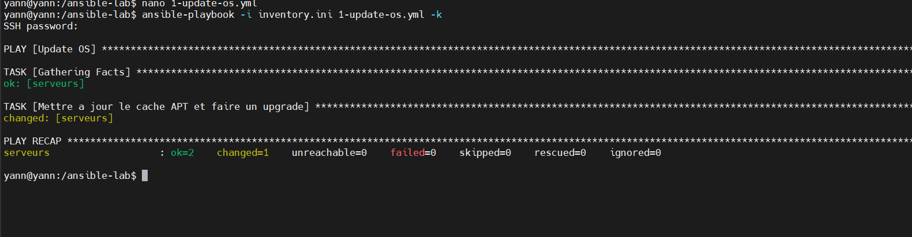
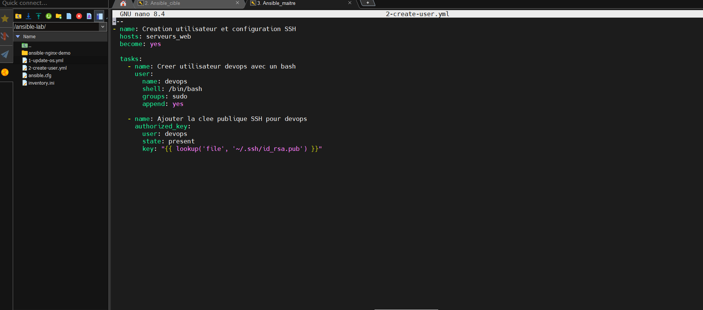
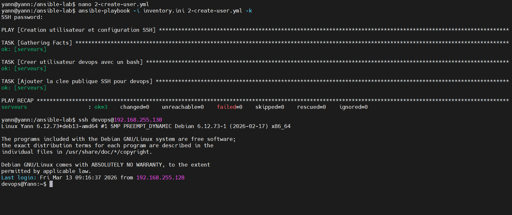
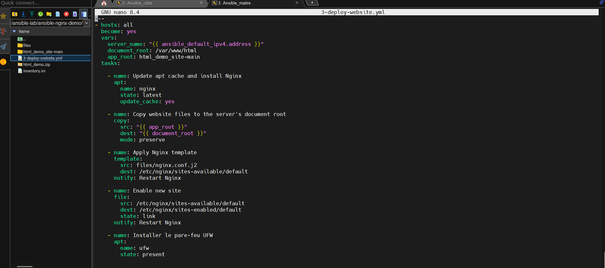
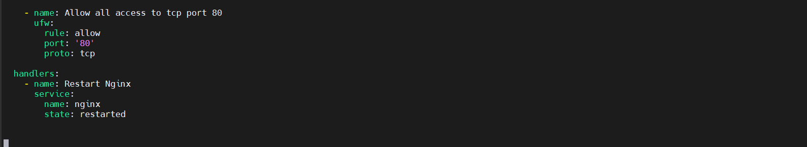
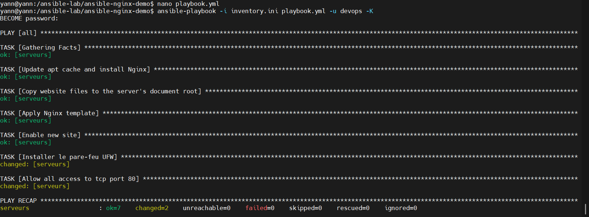

  

**Auteur** : Yann (Administrateur Infrastructure Sécurisée)

**Projet** : Mars 2026

## 1er Livrable ##

## 2ème livrable ##

* Ce playbook permet d'automatiser l'équivalent de ces deux commandes Linux sur toutes tes machines en même temps :

  * sudo apt update (update_cache: yes : rafraîchit la liste des logiciels disponibles).

  * sudo apt dist-upgrade (upgrade: dist : installe toutes les nouvelles mises à jour de sécurité et de système).

* Ce playbook permet de préparer un accès sécurisé et automatisé un serveur.

    * Création d'un user : Il crée un nouvel utilisateur nommé devops sur le serveur et lui donne le droit de passer administrateur (en l'ajoutant au groupe sudo).

  * Verrouillage par clé SSH : Il lit la clé publique (id_rsa.pub) et va la glisser dans le "coffre-fort" du nouvel utilisateur devops sur le serveur distant.

**ce playbook automatise entièrement la mise en ligne d'un site web sécurisé.**

* Voici ses 5 actions principales dans l'ordre :

  * Installation : Il installe le serveur web Nginx.

  * Déploiement : Il prend tes fichiers web locaux et les copie sur le serveur distant.

  * Configuration : Il applique tes paramètres Nginx personnalisés.

  * Sécurité : Il installe le pare-feu UFW et ouvre uniquement le port web standard (le port 80).

  * Relance intelligente (Handler) : Il redémarre Nginx à la toute fin uniquement si la configuration a été modifiée.

## 3ème livrable ##

.png)

2.png)

## 4ème livrable ##

**Ordre d'exécution des Playbooks.**

[Readme](Readme.md)

