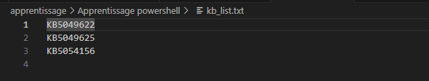
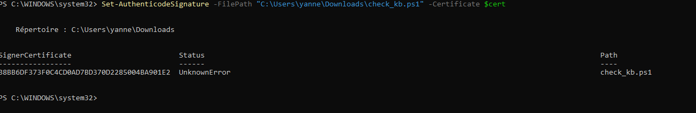

<p align="center">
  
</p>

# **Apprentissage et script Powershell**

1.Vérifiez à l'aide d'un langage de script si vous avez les KB5049622, KB5049625 et Un KB présent de votre choix présent sur votre OS

Windows. Le script devra afficher en Vert les KB présents et en rouge les KB absents.

```powershell
$kbs = @("KB5049622", "KB5049625", "KB5054156")
$installed = (Get-HotFix).HotFixID
$kbs | Out-File "kb_list.txt"
foreach ($kb in $kbs) {
    if ($installed -contains $kb) {
        Write-Host "$kb est présent" -ForegroundColor Green
    }
    else {
        Write-Host "$kb est absent" -ForegroundColor Red
    }
}
```


2. Une fois que votre script fonctionne, placer la liste des KB dans un fichier texte nommé kb_list.txt, le script devra lire ce

fichier pour obtenir la liste des KB.

```powershell
$kbs = @("KB5049622", "KB5049625", "KB5054156")
$installed = (Get-HotFix).hotfixID
$kbs | Out-File "kb_list.txt"
foreach ($kb in $kbs) {
    if ($installed -contains $kb) 
{
    write-host "$kb est present" -foregroundcolor Green
}
else {
    write-host "$kb est absent" -foregroundcolor Red
}
}
```



3. Proposer une procédure, à écrire en commentaire du script, pour appliquer ce script sur un parc Windows AD.

PROCÉDURE DE DÉPLOIEMENT DU SCRIPT SUR UN PARC WINDOWS AD

Objectif :

Vérifier la présence de correctifs (KB) sur tous les postes
d’un domaine Active Directory via une GPO.

Étapes :
Copier le script PowerShell check_kb.ps1 et le fichier kb_list.txt dans un dossier partagé accessible :
"\\Réseau\sysvol\share\scripts\check_kb.ps1"

Ouvrir la console "Gestion des stratégies de groupe" (GPMC.msc)
Créer une nouvelle GPO nommée :
"Vérification des KB Windows"
Éditer la GPO :

Configuration ordinateur → Stratégies → Scripts (Démarrage/Arrêt)
Ajouter un script de démarrage avec la commande suivante :
powershell.exe -ExecutionPolicy Bypass -File "\\Réseau\sysvol\share\scripts\check_kb.ps1"

Lier la GPO à l’unité d’organisation contenant les postes ciblés.
Forcer l’application de la stratégie sur un poste :
gpupdate /force

Résultat :
À chaque démarrage du poste, le script s’exécute et affiche
la présence ou l’absence des KB listés.

4. Signer votre script afin d'en prouver l'integrité et l'authenticité. (Certificat autosigné toleré)

# SIG # Begin signature block

# MIIFZwYJKoZIhvcNAQcCoIIFWDCCBVQCAQExCzAJBgUrDgMCGgUAMGkGCisGAQQB

# gjcCAQSgWzBZMDQGCisGAQQBgjcCAR4wJgIDAQAABBAfzDtgWUsITrck0sYpfvNR

# AgEAAgEAAgEAAgEAAgEAMCEwCQYFKw4DAhoFAAQUfDn8ZRc83f2l8c6E/niAcSi3

# WDWgggMEMIIDADCCAeigAwIBAgIQETk/mXf2kL9DTIEiCJcazTANBgkqhkiG9w0B

# AQsFADAYMRYwFAYDVQQDDA1TY3JpcHRTaWduaW5nMB4XDTI1MTAyMzEyNTM1M1oX

# DTI2MTAyMzEzMTM1M1owGDEWMBQGA1UEAwwNU2NyaXB0U2lnbmluZzCCASIwDQYJ

# KoZIhvcNAQEBBQADggEPADCCAQoCggEBAMx6mFVizyeYQP8B80bGbvAY/wxqfOUY

# uRU7lCiFDR49Rg06Ge7x1QcZZyBeIKvBCIOGl3dRNg11hLdZ98iwJSQ5gGFHTxfZ

# ZLY7+gFmVDEOOH1rA6sgFYF5tfTQwsYNKaf8obuxYWg4z9I48Gx4fVgclaLbxS0O

# jEgNceDTqSFVcUFppa+l4mCyKVyMq0+2gQAUohjnvB56GBEl1byqm+DAklnS2o4d

# IULUYTCePjZ0g7fo1MtWtj7qGaW4Jldaw+5L/7zMSOD00nuAfDLQc5Ov+kwOAPmZ

# XbUIJFYkcSk1ya2sWaGPRF71pz08KNBfS68bajdG/VP2udtrj7YptRECAwEAAaNG

# MEQwDgYDVR0PAQH/BAQDAgeAMBMGA1UdJQQMMAoGCCsGAQUFBwMDMB0GA1UdDgQW

# BBQ2hRPrgLDdVg8hn1OzwG4yPWfG6zANBgkqhkiG9w0BAQsFAAOCAQEAbk4372vH

# xRCmvLzZA34d952+ENqjrk0AJKbTTNqVxjGuc5WeXtcizZ1pCbLvYdlJQUQMih+b

# NX6cvf3L1MB4112cK4yQ4icVYSkVqtjQmLZ9U/5KKYTRrLlBye7riuljKKvKn5Zp

# HTBpPAVgtAeQOpZeJgfvftc3Vd1foh208j1sRT+W2lm44AY5eaudB3B1AWztSvBE

# qQ5tqOhxgOmF8tWN24ksRq4tQRHp24gForrnsDZyFL0zTfJ+Sm3uqNeU3hVn9H0H

# dLsrfG6FNukYlhDifRW296rnj3TG/aeABGMki4yX82FzTXFFK+D2M9KSAKVfKyP9

# rWA8TJk0rFdinTGCAc0wggHJAgEBMCwwGDEWMBQGA1UEAwwNU2NyaXB0U2lnbmlu

# ZwIQETk/mXf2kL9DTIEiCJcazTAJBgUrDgMCGgUAoHgwGAYKKwYBBAGCNwIBDDEK

# MAigAoAAoQKAADAZBgkqhkiG9w0BCQMxDAYKKwYBBAGCNwIBBDAcBgorBgEEAYI3

# AgELMQ4wDAYKKwYBBAGCNwIBFTAjBgkqhkiG9w0BCQQxFgQUJw6tb8B5AINT4fmu

# rMsNzUAkAoYwDQYJKoZIhvcNAQEBBQAEggEAGuOGcjDAQ3u/denjYMZYGzI+9mqu

# 5fzwvJaNCZ1uh3SRp/mGGzEJzJ0Zme1OOwaLv5T4F0X9e99LywUqzSj0GmPolm0w

# dZNiFR46h2c157fq+qANqpp2t4Lvx01rpxJn9sBoPnXfDZU8upZc2802zj5xtxzr

# D2grdeA5nhf7l7ksGNF+S/VtLhA5pguyswEYlz6FFT3mP2N7mfAGOzgyGL3uzOCQ

# Msnm5eOwEyJo2MdyEz33IIYST6UaiQChVAtQ4n5fAFeqsMQddX762/0rUjtvpj/W

# cyR+LRPOOjwvKA23LhYv1uVvpYfBbwVTjM192OAIc9LMR1nkKABbTRe3JA==

# SIG # End signature block




**Auteur : ESCRIVA Yann**

**Projet : Octobre 2025**
