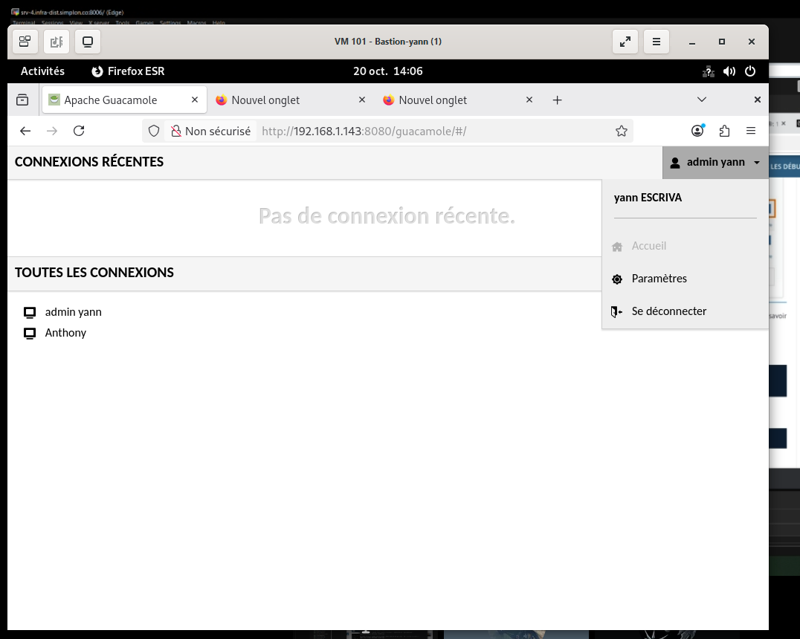
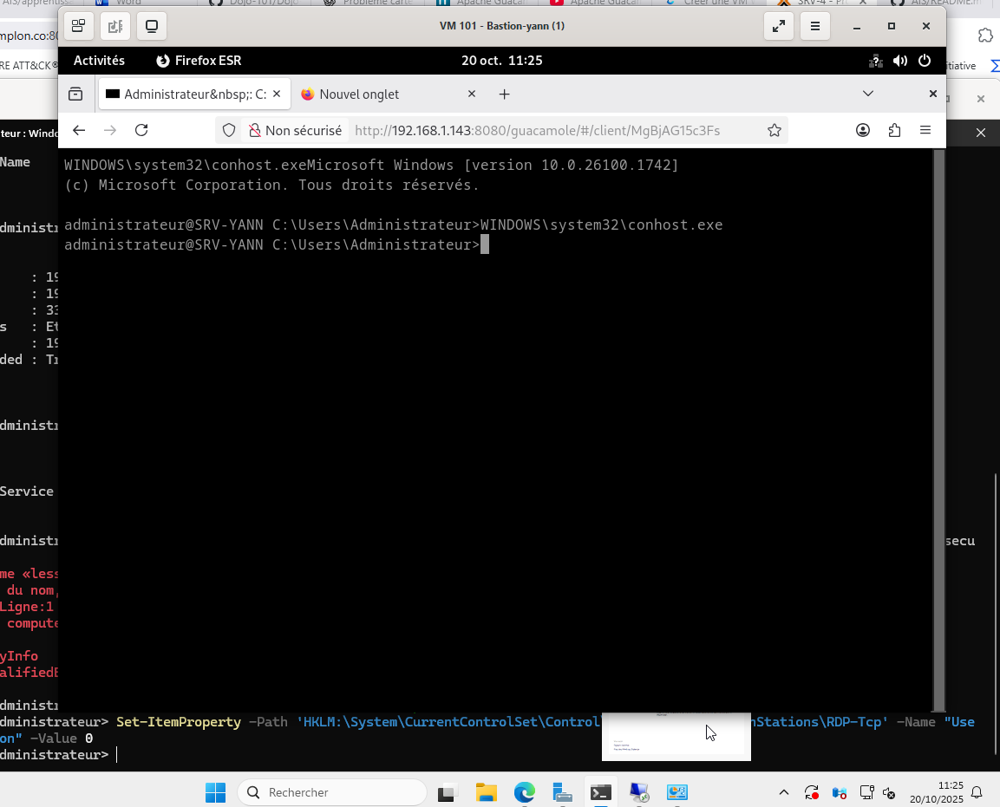
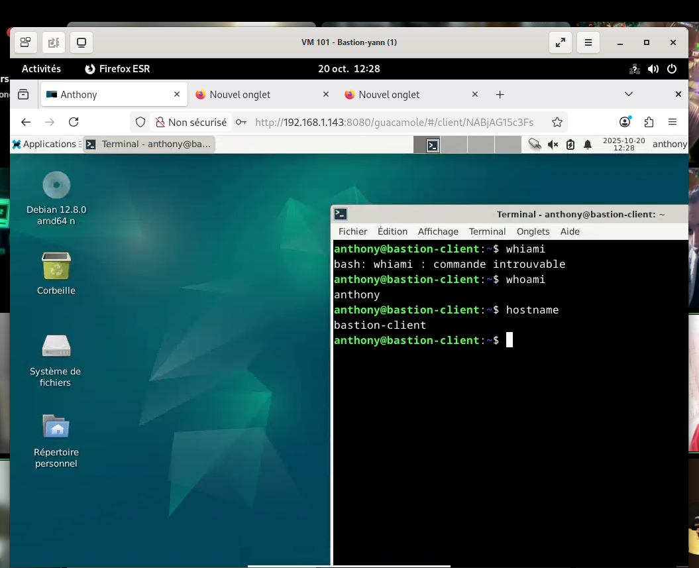

  

**Etude comparative des différentes solutions Bastions**

**Auteur** : Yann (Administrateur Infrastructure Sécurisée)

**Projet** : Janvier 2026

| **Solution**                         | **Azure Bastion**                      | **Apache Guacamole**                     | **Teleport**                              |
| ------------------------------------------ | -------------------------------------------- | ---------------------------------------------- | ----------------------------------------------- |
| **Type**                             | Commercial (SaaS, Cloud)                     | Open Source, Auto-hébergé                    | Open Source, Cloud-ready                        |
| **Protocoles pris en charge**        | RDP, SSH                                     | RDP, SSH, VNC                                  | SSH, Kubernetes, Databases                      |
| **Sécurité (MFA, Audit, Logging)** | Accès sans IP publique, MFA                 | Chiffrement SSL, authentification centralisée | MFA, enregistrement des sessions, audit avancé |
| **Facilité de déploiement**        | Facile (intégré à Azure)                  | Moyen (nécessite un serveur Tomcat)           | Facile (binaire unique, SaaS disponible)             |
| **Coût**                            | Payant (facturation à l’usage)             | Gratuit (nécessite hébergement)              | Gratuit (payant en SaaS)                        |
| **Scalabilité**                     | Automatique (Azure)                          | Dépend du serveur sous-jacent                 | Très scalable, adapté au Cloud                |
| **Audit et Logs**                    | Logs dans Azure Monitor                      | Journaux d’accès configurables               | Audit avancé des sessions                      |
| **Cas d’usage principal**           | Accès distant sécurisé aux machines Azure | Accès bureau à distance via navigateur       | Bastion SSH moderne pour infra cloud-native     |

**Apache Guacamole** : c’est une solution puissante, surtout si on veut une interface web centralisée pour accéder à plusieurs machines distantes en toute sécurité. Voici ses principaux avantages :

Accès 100% web Aucun client RDP/SSH/VNC. n’est nécessaire. On se connecte simplement via son navigateur. Très pratique pour le télétravail ou l’accès multi-OS.

Sécurité renforcée, Toutes les connections sont centralisées, chiffrées (SSL/TLS) et peuvent être soumises à une authentification (LDAP, base de données, etc.).

Multi-protocoles, Gère plusieurs types d’accès : RDP, SSH, VNC.

Multi-utilisateurs et rôles, on peut gérer plusieurs comptes, définir des permissions par utilisateur ou par groupe et limiter l’accès à certaines
connections.

Audit des connections on peut garder une trace des connections effectuées, pratique pour la supervision ou les audits.

Pas d’installation côté client Parfait pour des environnements hétérogènes. Fonctionne sous Windows, Linux, MacOs, Android, iOS sans installer d’applications.

Open Source et personnalisable, Gratuit et modifiable. On peut adapter son interface ou ses fonctionnalités selon ses besoins.

Intégration possible avec LDAP/Active Directory Idéal pour une gestion centralisée des utilisateurs dans un environnement pro.

Cas d’usage typique, Accès distant sécurisé pour des techniciens prestataires, ou administrateurs.

Supervision de plusieurs serveurs sans ouvrir de ports RDP ou SSH en direct.

Centralisation des accès distants dans un intranet ou une DMZ.

**Test de Apache Guacamole :**

Interface de la page :

Connections SSH

Connection RDP

