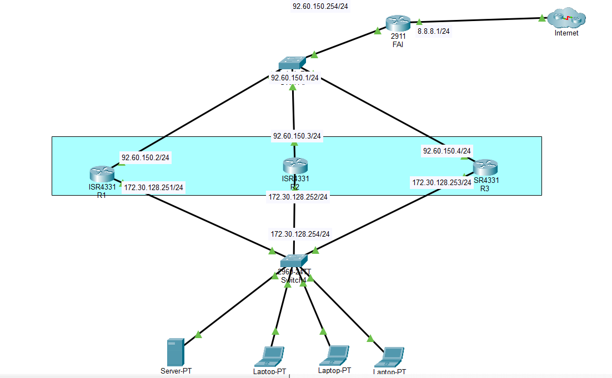

  

## TP Réseau HSRP

### 1. Objectif

Le but de cet exercice est d’effectuer une analyse de type « reverse engineering » à partir d’une
infrastructure fonctionnelle, sur le thème de HSRP.

### 2. Prérequis

* Poste de travail avec le logiciel Packet Tracer installé
* Fichier Packet Tracer pré-configuré

### 3. Tâches à réaliser

* Analyser l’infrastructure
* Analyser la configuration
* Proposer un guide des commandes de configuration HSRP

### 4. Topologie

### 5. Tâches à réaliser

**Analyse de l’infrastructure**
* Analyser l'infrastructure et la configuration des équipements

* Qu’est-ce que HSRP ? Proposer une définition simple.

HSRP (Hot Standby Router Protcol) C'est un protocol cisco de redondance qui permet d'assurer la continuité d'accès au réseau au cas ou un routeur tombe en panne.

* Pourquoi utilise-t-on HSRP et quel problème résout-il ? Expliquer l'intérêt de HSRP dans ce
réseau.

On utilise HSRP pour assurer la haute disponibilité de la passerelle réseau.
Il résout le risque de coupure réseau, de se fait il ya un 2 ième routeur qui est en standby pour assurer la continuité du réseau et récupérer l'adresse IP virtuelle.

**Analyse de la configuration existante**
* Identifier les routeurs primaires et les routeurs de secours HSRP, quels sont leurs rôles
respectifs ?

Le router R1 est actif sur le réseau 172.30.128.0/24 et le R3 est en secours sur le même réseau.

Le router R2 est actif sur le réseau 92.60.150.0/24 et le R3 est en secours sur le même réseau.

* Noter les adresses IP virtuelles (VIP) et physiques (R1, R2, R3) utilisées dans les groupes HSRP,
à quoi servent ces différentes adresses ?

**R1** :Ip virtuelles :172.30.128.254 et 92.60.150.1
        Ip physiques :172.30.128.251 et 92.60.150.2

**R2** :Ip virtuelles :172.30.128.254 et 92.60.150.1
        Ip physiques :172.30.128.252 et 92.60.150.3

**R3** :Ip virtuelles :172.30.128.254 et 92.60.150.1
        Ip physiques :172.30.128.253 et 92.60.150.4

Les IP physiques permettent aux routeurs de fonctionner et de communiquer entre eux,
tandis que l’IP virtuelle garantit une passerelle unique et hautement disponible pour les clients, évitant toute coupure réseau en cas de défaillance d’un routeur.

* Identifier les interfaces réseau participant à HSRP sur chaque routeur, leurs priorités, les délais
et les autres paramètres HSRP configurés sur les routeurs. Que comprenez-vous ?

Configuration HSRP
Interfaces concernées : interfaces LAN de R1, R2, R3

IP physiques : 172.30.128.251 / .252 / .253 et 92.60.150.2 / .3 / .4

IP virtuelle : 172.30.128.254 et 92.60.150.1

Priorité la plus haute = routeur actif

Les autres = secours

Ce sont les priorités qui décide quel routeur va prendre le relai en cas de panne, si priorité équivalente c'est l'IP la plus haute qui va prendre le relai.

HSRP garantit une passerelle toujours disponible en cas de panne d’un routeur

* À l'aide des informations que vous avez collectées, proposer un guide de commandes de
configuration HSRP. Expliquer brièvement le rôle de chaque commande utilisée. Identifier les
éléments clés tels que le numéro de groupe HSRP, les adresses IP virtuelles, les priorités, les
délais, ainsi que les commandes permettant d'activer HSRP sur l'interface.

`enable` : Mode root

`conf t` : Mode configuration

`interface GigabitEthernet0/0` : Séléction interface

`ip address 172.30.128.251 255.255.255.0` : address ip de l'interface

`standby 1 ip 172.30.128.254` : 
* 1 → numéro du groupe HSRP
* 172.30.128.254 = IP virtuelle, utilisée comme passerelle par défaut par les clients

`standby 1 priority 120`
* plus la valeur est élevée = le routeur devient actif

`standby 1 preempt` : 
* Permet au routeur de reprendre son rôle actif s’il a la priorité la plus haute après redémarrage

`standby 1 timers 3 10` : 
* 3 = intervalle d’envoi des messages hello
* 10 = hold time (temps avant de déclarer un routeur actif en panne)

### Auteur : ESCRIVA Yann

### Projet : Janvier 2025

