## TP1 CyberChef – Cryptographie appliquée

#### 1 Objectifs 

* Utiliser CyberChef pour appliquer différentes techniques de chiffrement, hachage, et encodage 
* Visualiser le fonctionnement de la cryptographie symétrique et asymétrique 
* Comprendre les différences entre encodage, hachage et chiffrement 

### 2 Consignes 

* Travail en binôme 
* Utilisation de l’application web « CyberChef » : https://gchq.github.io/CyberChef/  
* Pour chaque section 
  * Réaliser les opérations demandées dans CyberChef 
  * Appliquer les méthodes sur un message de votre choix puis transmettre ce message à votre binôme afin qu’il le décode/déchiffre 
  * Répondre aux questions 

### 3 Contenu de ce TP 

1. Chiffrement de César 
2. Encodage de Vigenère 
3. Chiffrement symétrique AES 
4. Chiffrement asymétrique RSA 
5. Hachage 
6. Encodage 

### 4 Tâches à réaliser 

**I. Partie 1 : Chiffrement de César**

Dans « CyberChef » utilisez la recette « ROT13 » 

1. Avec une « Box Height » de 13, chiffrer la phrase suivante : RENDEZ-VOUS À MIDI 
 * . Quel est le texte chiffré ? 

 * Déchiffrez ce texte pour vérifier le résultat

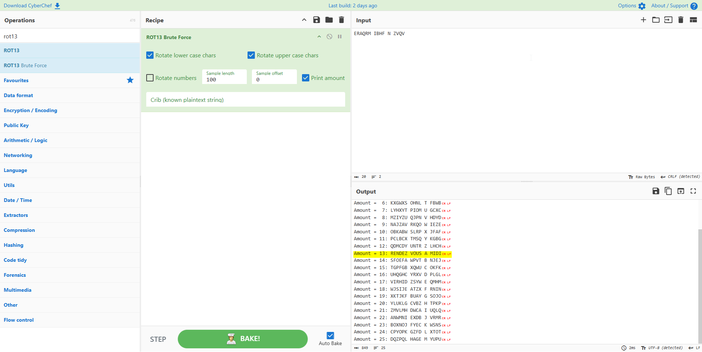 
  
1. Chiffrer le nom de votre film préféré avec une « Box Height » de votre choix 

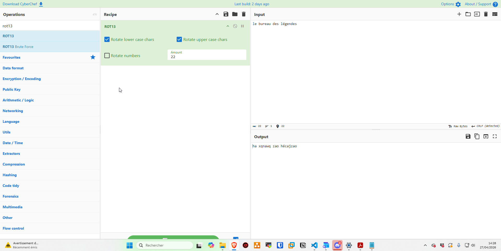

   * Transmettre le texte chiffré à votre binôme sans lui communiquer la clé 
   * Au sein de votre binôme, essayer de retrouver le message en sens inverse

**II. Partie 2 : Vigenère**

Dans « CyberChef » utilisez la recette « Vigenère Encode » 
* Encodez le nom de votre plat préféré avec la clé 'KEY' 
  * Quel est le texte chiffré ? 

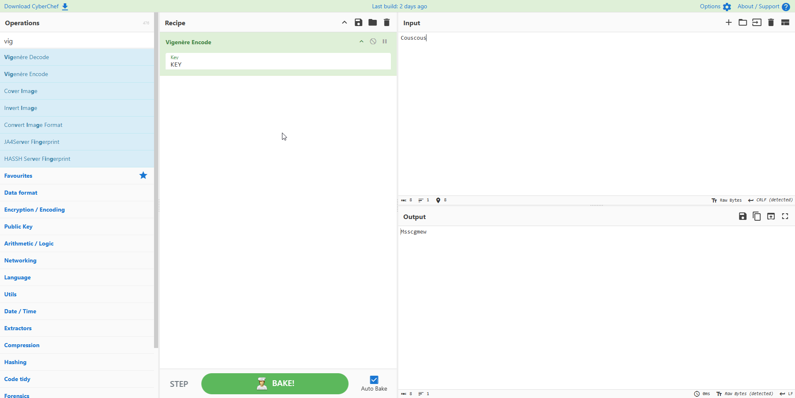

* Transmettre le texte chiffré à votre binôme 
* Transmettre la clé à votre binôme par un autre canal 
  * Au sein de votre binôme, déchiffrez le message pour découvrir vos plats préférés respectifs

**III. Partie 3 : Chiffrement symétrique AES**

Dans « CyberChef » utilisez les recettes « AES Encrypt » et « AES Decrypt » 
**Découverte** 

* Chiffrez la chaîne 'TESTSECRET1234567' avec les paramètres suivants  
  * Key : c34fa73d7c5f8901a23e4cd98e7f650d9a17d4e8f902fa0d3286d0beaad219b6
  * IV :  
  * Mode : ECB 
  * Input : mode Raw 
  * Output : Hex 

* Que constatez-vous si vous modifiez 1 caractère du texte initial ? 

Le résultat chiffrer va ètre totalement différent.

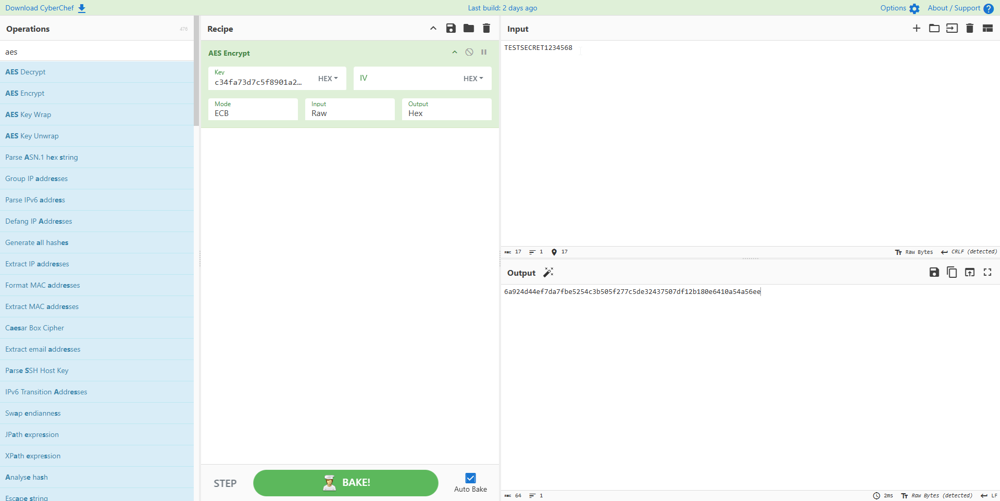

* Déchiffrez le texte AES chiffré précédemment en adaptant les paramètres 
  * Vous devez retrouver le texte d'origine

**Transmission d’un message chiffré à votre binôme**

* Générer une clé adéquate 
* Chiffrez le nom de votre équipe de sport préférée avec les paramètres suivants 
  * Key : « la clé que vous avez généré » 
  * IV :  
  * Mode : ECB 
  * Input : mode Raw 
  * Output : Hex 
 * Transmettre le texte chiffré à votre binôme 
* Transmettre la clé à votre binôme par un autre canal 
  * Au sein de votre binôme, déchiffrez le message pour découvrir vos équipes de sport préférées respectives 

**IV. Partie 4 : RSA**

Génération d’une paire de clés RSA
* Utilisez Generate RSA Key Pair avec une taille de 1024 bits
  * Que contiennent les clés générées ? (formats, longueur…)
Découverte?

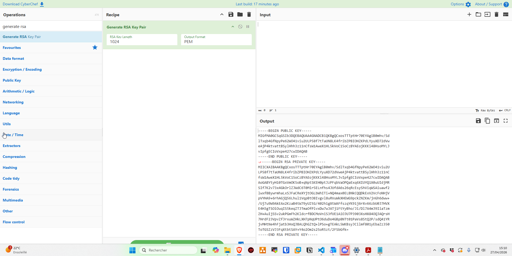

  * Longueur : La paire de clés générée a une taille de 1024 bits. 
  * Contenu des clés : La clé publique (à distribuer) contient deux éléments mathématiques : le module ($n$) et l'exposant public ($e$).
  * La clé privée (à garder secrète) contient le module ($n$), l'exposant public ($e$), l'exposant privé ($d$, qui permet le déchiffrement), ainsi que les nombres premiers ($p$ et $q$) utilisés lors de la génération.
  * Formats observés :Format PEM : C'est le format texte par défaut (encodé en Base64). Il est facilement lisible dans un éditeur et encadré par des balises claires comme -----BEGIN PUBLIC KEY----- et -----END PUBLIC KEY-----.Format DER : C'est le format binaire pur des clés, plus compact, mais illisible dans un éditeur de texte classique.
* Chiffrez le message suivant avec votre clé publique : LE MESSAGE EST SECRETSIMPLE
  * Quelle est la sortie chiffrée ?
* Utilisez votre clé privée pour déchiffrer le message
  * La sortie est-elle identique au message d’origine ?
Oui elle est identique.
Transmission d’un message chiffré à votre binôme
* Récupérez la clé publique de votre binôme
* Chiffrez votre réplique préférée avec les paramètres suivants
  * Key : « la clé publique de votre binôme»
  * Encryption scheme : RSA-OAEP
  * Message Digest Algorithm : SHA-1
* Transmettre le texte chiffré à votre binôme
  * Votre binôme, doit déchiffrer le message à l’aide de sa clé privée pour découvrir votre
réplique préférée
  * Inversez ensuite les rôles pour que chacun connaisse la réplique privée de son binôme

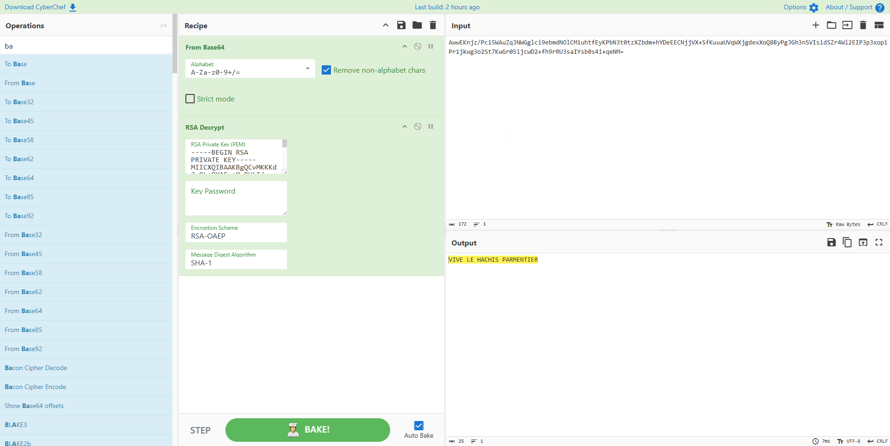

**V. Partie 5 : Hachage**

* Utilisez différents algorithmes de hachage sur la chaîne ADMIN123
  * SHA-1
  * SHA-2 : 256, 512
  * SHA-3 : 256, 512
* Quelles sont les tailles des hashs produits ?
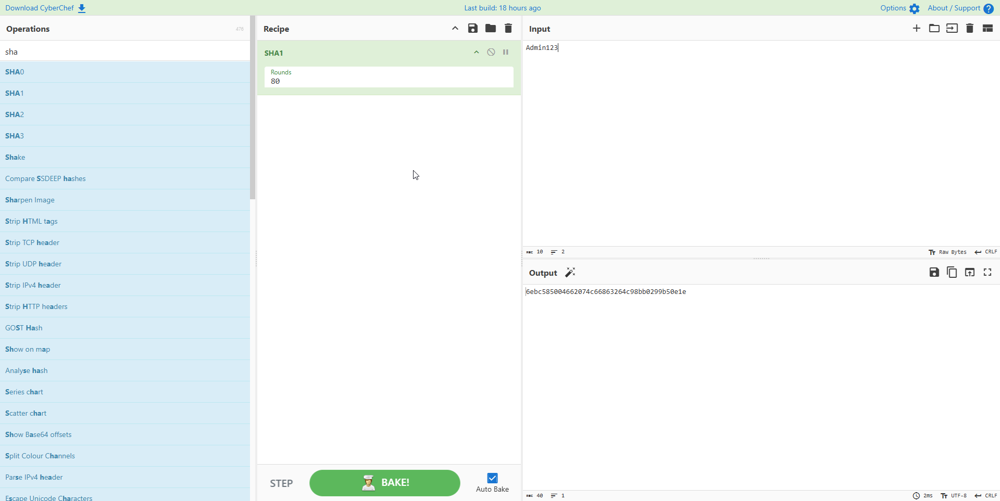
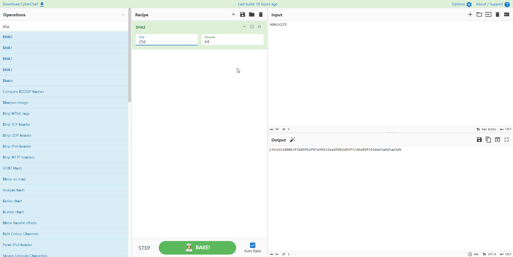

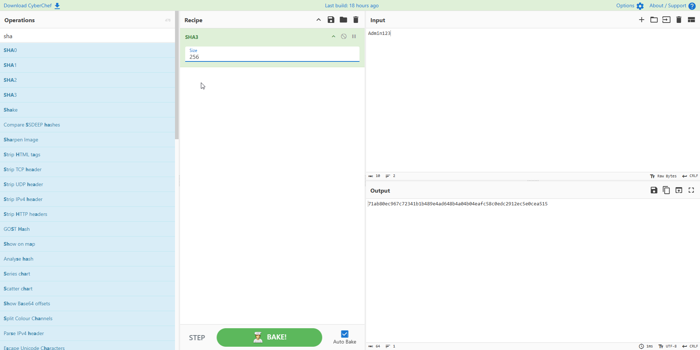

SHA1 = 40
SHA2 256, 512 = 64, 128
SHA3 256, 512 = 64, 128

  * Est-il possible de retrouver le mot de passe à partir du hash ?

En théorie non, mais un mot de passe comme Admin123 c'est tout à fait possible.

  * Essayez deux textes légèrement différents (TEST et TESt)
    * Que constatez-vous dans les résultats des hashs ?

 Pas les mêmes hashs

* Hacher le texte « hello » en SHA1 (80 rounds)

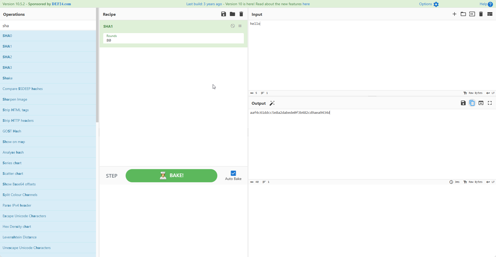

  * Crackez le hash sur https://crackstation.net/

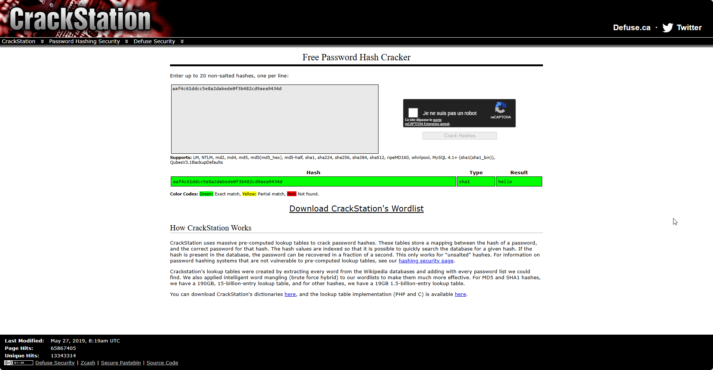

    * Le hash est cracké en quelques secondes, comment cela est-ce possible ?

Parce que hello est un mot dans la worldlist simple et court

* Répéter le point précédent avec SHA1 (50 rounds)

  * Le hash est-il cracké ? Pourquoi ?

Non le hash n'est pas craqué car CrackStation utilise des bases de données contenant des hashs pré-calculés avec le SHA-1 standard (qui comporte 80 rounds). En réduisant le nombre de rounds à 50, on modifie l'algorithme : l'empreinte générée pour le mot « hello » devient totalement différente du standard et n'existe donc pas dans leur base de données.

**VI. Partie 6 : Encodage**

* Encodez le mot « Bonjour » en base 64
  * Que représente le résultat ?

Que représente le résultat ? Il représente le mot bonjour en langage informatique.

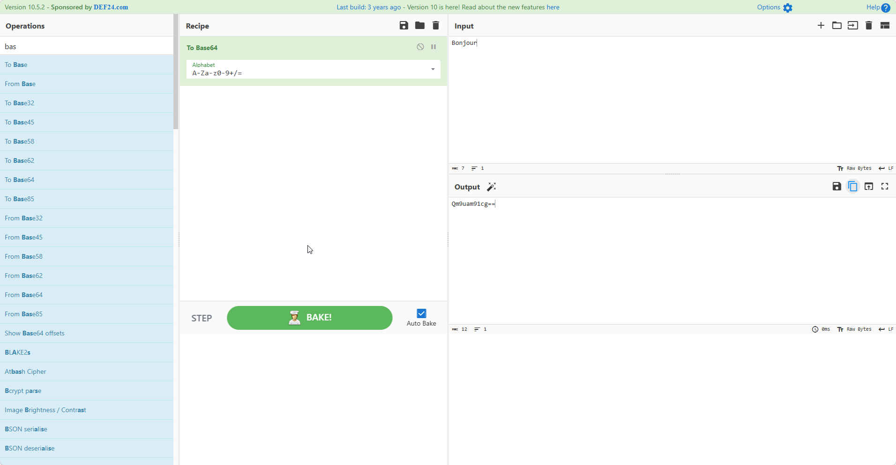

* Décoder le résultat obtenu précédemment

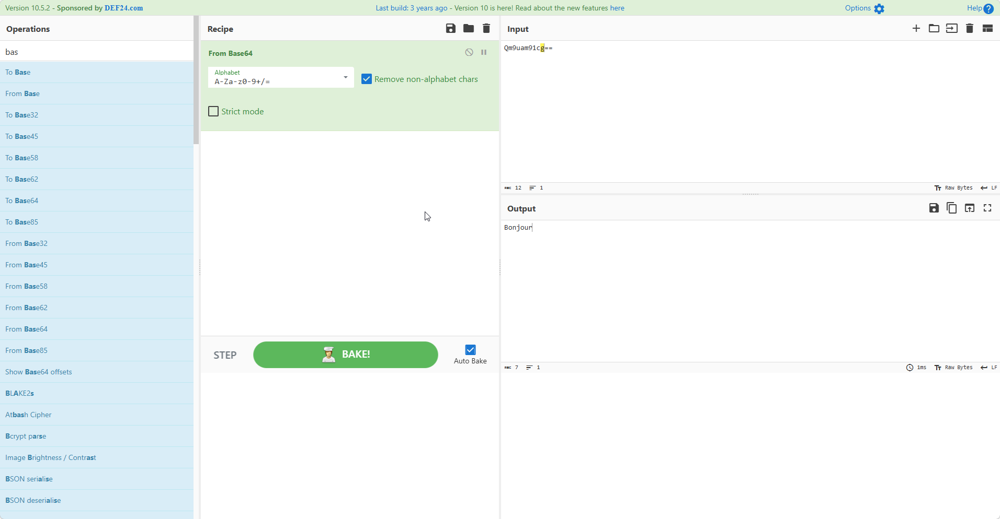

  * Peut-on confondre encodage et chiffrement ? Pourquoi ?

Non, et voici pourquoi :

Chiffrement
objectif : confidentialité
nécessite une clé
sans clé → difficile/impossible à lire
“secret”

Encodage (Base64)
objectif : représentation
aucune clé
totalement réversible
tout le monde peut décoder
“transformation”

**VII. Bonus**

* Le diaporama contient un message caché, tentez de le découvrir !
  * Indice : plusieurs opérations utilisées dans le cadre de ce TP ont été utilisées pour cacher ce message…

The Hacker Manifesto
(The Conscience of a Hacker)
Par The Mentor – 8 janvier 1986

Another one got caught today, it's all over the papers. "Teenager Arrested in Computer Crime Scandal", "Hacker Arrested after Bank Tampering"...

Damn kids. They're all alike.

But did you, in your three-piece psychology and 1950's technobrain, ever take a look behind the eyes of the hacker? Did you ever wonder what made him tick, what forces shaped him, what may have molded him?

I am a hacker, enter my world...

Mine is a world that begins with school... I'm smarter than most of the other kids, this crap they teach us bores me...

Damn underachiever. They're all alike.

I'm in junior high or high school. I've listened to teachers explain for the fifteenth time how to reduce a fraction. I understand it. "No, Ms. Smith, I didn't show my work. I did it in my head..."

Damn kid. Probably copied it. They're all alike.

I made a discovery today. I found a computer. Wait a second, this is cool. It does what I want it to. If it makes a mistake, it's because I screwed it up. Not because it doesn't like me...

Or feels threatened by me...
Or thinks I'm a smart ass...
Or doesn't like teaching and shouldn't be here...

Damn kid. All he does is play games. They're all alike.

And then it happened... a door opened to a world... rushing through the phone line like heroin through an addict's veins, an electronic pulse is sent out, a refuge from the day-to-day incompetencies is sought... a board is found.

This is it... this is where I belong...

I know everyone here... even if I've never met them, never talked to them, may never hear from them again... I know you all...

Damn kid. Tying up the phone line again. They're all alike...

You bet your ass we're all alike... we've been spoon-fed baby food at school when we hungered for steak...

The bits of meat that you did let slip through were pre-chewed and tasteless. We've been dominated by sadists, or ignored by the apathetic. The few that had something to teach found us willing pupils, but those few are like drops of water in the desert.

This is our world now... the world of the electron and the switch, the beauty of the baud. We make use of a service already existing without paying for what could be dirt-cheap if it wasn't run by profiteering gluttons, and you call us criminals.

We explore... and you call us criminals.
We seek after knowledge... and you call us criminals.
We exist without skin color, without nationality, without religious bias... and you call us criminals.
You build atomic bombs, you wage wars, you murder, cheat, and lie to us and try to make us believe it's for our own good, yet we're the criminals.

Yes, I am a criminal.
My crime is that of curiosity.
My crime is that of judging people by what they say and think, not what they look like.
My crime is that of outsmarting you, something that you will never forgive me for.

I am a hacker, and this is my manifesto.
You may stop this individual, but you can't stop us all...
After all, we're all alike.

