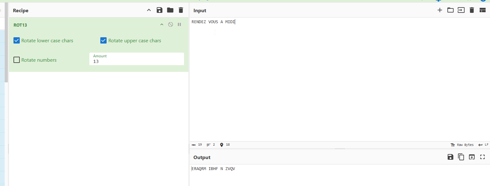
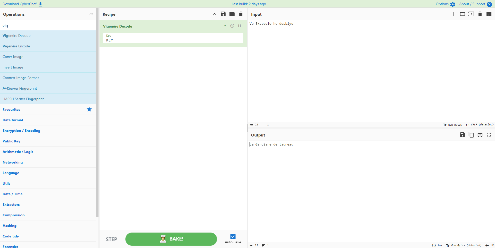
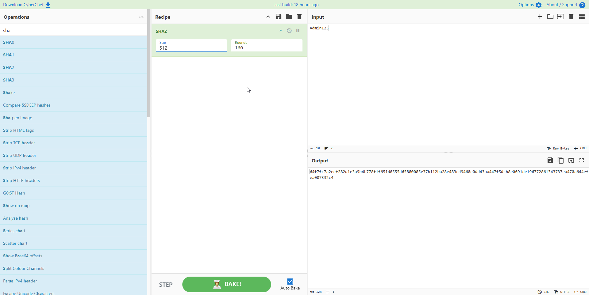
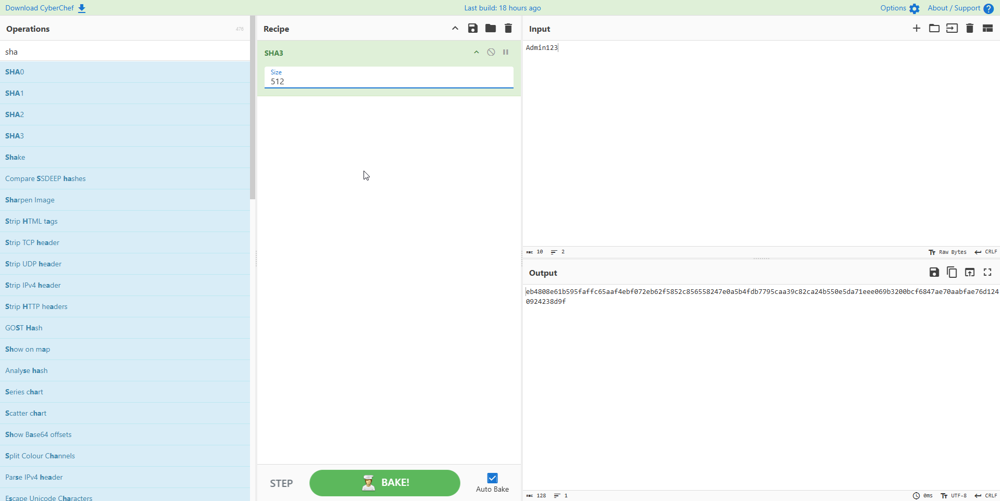

## TP1 CyberChef – Cryptographie appliquée

#### 1 Objectifs 

* Utiliser CyberChef pour appliquer différentes techniques de chiffrement, hachage, et encodage 
* Visualiser le fonctionnement de la cryptographie symétrique et asymétrique 
* Comprendre les différences entre encodage, hachage et chiffrement 

### 2 Consignes 

* Travail en binôme 
* Utilisation de l’application web « CyberChef » : https://gchq.github.io/CyberChef/  
* Pour chaque section 
  * Réaliser les opérations demandées dans CyberChef 
  * Appliquer les méthodes sur un message de votre choix puis transmettre ce message à votre binôme afin qu’il le décode/déchiffre 
  * Répondre aux questions 

### 3 Contenu de ce TP 

1. Chiffrement de César 
2. Encodage de Vigenère 
3. Chiffrement symétrique AES 
4. Chiffrement asymétrique RSA 
5. Hachage 
6. Encodage 

### 4 Tâches à réaliser 

**I. Partie 1 : Chiffrement de César**

Dans « CyberChef » utilisez la recette « ROT13 » 

1. Avec une « Box Height » de 13, chiffrer la phrase suivante : RENDEZ-VOUS À MIDI 
 * . Quel est le texte chiffré ? 

 * Déchiffrez ce texte pour vérifier le résultat

 
  
1. Chiffrer le nom de votre film préféré avec une « Box Height » de votre choix 

   * Transmettre le texte chiffré à votre binôme sans lui communiquer la clé 
   * Au sein de votre binôme, essayer de retrouver le message en sens inverse

**II. Partie 2 : Vigenère**

Dans « CyberChef » utilisez la recette « Vigenère Encode » 
* Encodez le nom de votre plat préféré avec la clé 'KEY' 
  * Quel est le texte chiffré ? 

* Transmettre le texte chiffré à votre binôme 
* Transmettre la clé à votre binôme par un autre canal 
  * Au sein de votre binôme, déchiffrez le message pour découvrir vos plats préférés respectifs

**III. Partie 3 : Chiffrement symétrique AES**

Dans « CyberChef » utilisez les recettes « AES Encrypt » et « AES Decrypt » 
**Découverte** 

* Chiffrez la chaîne 'TESTSECRET1234567' avec les paramètres suivants  
  * Key : c34fa73d7c5f8901a23e4cd98e7f650d9a17d4e8f902fa0d3286d0beaad219b6
  * IV :  
  * Mode : ECB 
  * Input : mode Raw 
  * Output : Hex 

* Que constatez-vous si vous modifiez 1 caractère du texte initial ? 

Le résultat chiffrer va ètre totalement différent.

* Déchiffrez le texte AES chiffré précédemment en adaptant les paramètres 
  * Vous devez retrouver le texte d'origine

 

**Transmission d’un message chiffré à votre binôme**

* Générer une clé adéquate 
* Chiffrez le nom de votre équipe de sport préférée avec les paramètres suivants 
  * Key : « la clé que vous avez généré » 
  * IV :  
  * Mode : ECB 
  * Input : mode Raw 
  * Output : Hex 
 * Transmettre le texte chiffré à votre binôme 
* Transmettre la clé à votre binôme par un autre canal 
  * Au sein de votre binôme, déchiffrez le message pour découvrir vos équipes de sport préférées respectives 

**IV. Partie 4 : RSA**

Génération d’une paire de clés RSA
* Utilisez Generate RSA Key Pair avec une taille de 1024 bits
  * Que contiennent les clés générées ? (formats, longueur…)
Découverte?

  * Longueur : La paire de clés générée a une taille de 1024 bits. 
  * Contenu des clés : La clé publique (à distribuer) contient deux éléments mathématiques : le module ($n$) et l'exposant public ($e$).
  * La clé privée (à garder secrète) contient le module ($n$), l'exposant public ($e$), l'exposant privé ($d$, qui permet le déchiffrement), ainsi que les nombres premiers ($p$ et $q$) utilisés lors de la génération.
  * Formats observés :Format PEM : C'est le format texte par défaut (encodé en Base64). Il est facilement lisible dans un éditeur et encadré par des balises claires comme -----BEGIN PUBLIC KEY----- et -----END PUBLIC KEY-----.Format DER : C'est le format binaire pur des clés, plus compact, mais illisible dans un éditeur de texte classique.
* Chiffrez le message suivant avec votre clé publique : LE MESSAGE EST SECRETSIMPLE
  * Quelle est la sortie chiffrée ?
* Utilisez votre clé privée pour déchiffrer le message
  * La sortie est-elle identique au message d’origine ?
Oui elle est identique.
Transmission d’un message chiffré à votre binôme
* Récupérez la clé publique de votre binôme
* Chiffrez votre réplique préférée avec les paramètres suivants
  * Key : « la clé publique de votre binôme»
  * Encryption scheme : RSA-OAEP
  * Message Digest Algorithm : SHA-1
* Transmettre le texte chiffré à votre binôme
  * Votre binôme, doit déchiffrer le message à l’aide de sa clé privée pour découvrir votre
réplique préférée
  * Inversez ensuite les rôles pour que chacun connaisse la réplique privée de son binôme

**V. Partie 5 : Hachage**

* Utilisez différents algorithmes de hachage sur la chaîne ADMIN123
  * SHA-1
  * SHA-2 : 256, 512
  * SHA-3 : 256, 512
* Quelles sont les tailles des hashs produits ?

SHA1 = 40
SHA2 256, 512 = 64, 128
SHA3 256, 512 = 64, 128

  * Est-il possible de retrouver le mot de passe à partir du hash ?

En théorie non, mais un mot de passe comme Admin123 c'est tout à fait possible.

  * Essayez deux textes légèrement différents (TEST et TESt)
    * Que constatez-vous dans les résultats des hashs ?

 Pas les mêmes hashs

* Hacher le texte « hello » en SHA1 (80 rounds)

  * Crackez le hash sur https://crackstation.net/

    * Le hash est cracké en quelques secondes, comment cela est-ce possible ?

Parce que hello est un mot dans la worldlist simple et court

* Répéter le point précédent avec SHA1 (50 rounds)

  * Le hash est-il cracké ? Pourquoi ?

**VI. Partie 6 : Encodage**

* Encodez le mot « Bonjour » en base 64
  * Que représente le résultat ?
* Décoder le résultat obtenu précédemment
  * Peut-on confondre encodage et chiffrement ? Pourquoi ?

**VII. Bonus**

* Le diaporama contient un message caché, tentez de le découvrir !
  * Indice : plusieurs opérations utilisées dans le cadre de ce TP ont été utilisées pour cacher ce message…