## TP1 CyberChef – Cryptographie appliquée


### 4 Tâches à réaliser 

**I. Partie 1 : Chiffrement de César**

Dans « CyberChef » utilisez la recette « ROT13 » 

1. Avec une « Box Height » de 13, chiffrer la phrase suivante : RENDEZ-VOUS À MIDI 
 * . Quel est le texte chiffré ? 


 * Déchiffrez ce texte pour vérifier le résultat

 
  
1. Chiffrer le nom de votre film préféré avec une « Box Height » de votre choix 


   * Transmettre le texte chiffré à votre binôme sans lui communiquer la clé 
   * Au sein de votre binôme, essayer de retrouver le message en sens inverse


**II. Partie 2 : Vigenère**

Dans « CyberChef » utilisez la recette « Vigenère Encode » 
* Encodez le nom de votre plat préféré avec la clé 'KEY' 
  * Quel est le texte chiffré ? 


* Transmettre le texte chiffré à votre binôme 
* Transmettre la clé à votre binôme par un autre canal 
  * Au sein de votre binôme, déchiffrez le message pour découvrir vos plats préférés respectifs


**III. Partie 3 : Chiffrement symétrique AES**

Dans « CyberChef » utilisez les recettes « AES Encrypt » et « AES Decrypt » 
**Découverte** 

* Chiffrez la chaîne 'TESTSECRET1234567' avec les paramètres suivants  
  * Key : c34fa73d7c5f8901a23e4cd98e7f650d9a17d4e8f902fa0d3286d0beaad219b6
  * IV :  
  * Mode : ECB 
  * Input : mode Raw 
  * Output : Hex 


* Que constatez-vous si vous modifiez 1 caractère du texte initial ? 

Le résultat chiffrer va ètre totalement différent.


* Déchiffrez le texte AES chiffré précédemment en adaptant les paramètres 
  * Vous devez retrouver le texte d'origine


**Transmission d’un message chiffré à votre binôme**

* Générer une clé adéquate 
* Chiffrez le nom de votre équipe de sport préférée avec les paramètres suivants 
  * Key : « la clé que vous avez généré » 
  * IV :  
  * Mode : ECB 
  * Input : mode Raw 
  * Output : Hex 
 * Transmettre le texte chiffré à votre binôme 
* Transmettre la clé à votre binôme par un autre canal 
  * Au sein de votre binôme, déchiffrez le message pour découvrir vos équipes de sport préférées respectives 


**IV. Partie 4 : RSA**

Génération d’une paire de clés RSA
* Utilisez Generate RSA Key Pair avec une taille de 1024 bits
  * Que contiennent les clés générées ? (formats, longueur…)
Découverte?


  * Longueur : La paire de clés générée a une taille de 1024 bits. 
  * Contenu des clés : La clé publique (à distribuer) contient deux éléments mathématiques : le module ($n$) et l'exposant public ($e$).
  * La clé privée (à garder secrète) contient le module ($n$), l'exposant public ($e$), l'exposant privé ($d$, qui permet le déchiffrement), ainsi que les nombres premiers ($p$ et $q$) utilisés lors de la génération.
  * Formats observés :Format PEM : C'est le format texte par défaut (encodé en Base64). Il est facilement lisible dans un éditeur et encadré par des balises claires comme -----BEGIN PUBLIC KEY----- et -----END PUBLIC KEY-----.Format DER : C'est le format binaire pur des clés, plus compact, mais illisible dans un éditeur de texte classique.
* Chiffrez le message suivant avec votre clé publique : LE MESSAGE EST SECRETSIMPLE
  * Quelle est la sortie chiffrée ?
* Utilisez votre clé privée pour déchiffrer le message
  * La sortie est-elle identique au message d’origine ?
Oui elle est identique.
Transmission d’un message chiffré à votre binôme
* Récupérez la clé publique de votre binôme
* Chiffrez votre réplique préférée avec les paramètres suivants
  * Key : « la clé publique de votre binôme»
  * Encryption scheme : RSA-OAEP
  * Message Digest Algorithm : SHA-1
* Transmettre le texte chiffré à votre binôme
  * Votre binôme, doit déchiffrer le message à l’aide de sa clé privée pour découvrir votre
réplique préférée
  * Inversez ensuite les rôles pour que chacun connaisse la réplique privée de son binôme


**V. Partie 5 : Hachage**

* Utilisez différents algorithmes de hachage sur la chaîne ADMIN123
  * SHA-1
  * SHA-2 : 256, 512
  * SHA-3 : 256, 512
* Quelles sont les tailles des hashs produits ?


SHA1 = 40
SHA2 256, 512 = 64, 128
SHA3 256, 512 = 64, 128

  * Est-il possible de retrouver le mot de passe à partir du hash ?

En théorie non, mais un mot de passe comme Admin123 c'est tout à fait possible.

  * Essayez deux textes légèrement différents (TEST et TESt)
    * Que constatez-vous dans les résultats des hashs ?

 Pas les mêmes hashs

* Hacher le texte « hello » en SHA1 (80 rounds)


  * Crackez le hash sur https://crackstation.net/


    * Le hash est cracké en quelques secondes, comment cela est-ce possible ?

Parce que hello est un mot dans la worldlist simple et court

* Répéter le point précédent avec SHA1 (50 rounds)

  * Le hash est-il cracké ? Pourquoi ?

Non le hash n'est pas craqué car CrackStation utilise des bases de données contenant des hashs pré-calculés avec le SHA-1 standard (qui comporte 80 rounds). En réduisant le nombre de rounds à 50, on modifie l'algorithme : l'empreinte générée pour le mot « hello » devient totalement différente du standard et n'existe donc pas dans leur base de données.

**VI. Partie 6 : Encodage**

* Encodez le mot « Bonjour » en base 64
  * Que représente le résultat ?

Que représente le résultat ? Il représente le mot bonjour en langage informatique.


* Décoder le résultat obtenu précédemment


  * Peut-on confondre encodage et chiffrement ? Pourquoi ?

Non, et voici pourquoi :

Chiffrement
objectif : confidentialité
nécessite une clé
sans clé → difficile/impossible à lire
“secret”

Encodage (Base64)
objectif : représentation
aucune clé
totalement réversible
tout le monde peut décoder
“transformation”


**VII. Bonus**

* Le diaporama contient un message caché, tentez de le découvrir !
  * Indice : plusieurs opérations utilisées dans le cadre de ce TP ont été utilisées pour cacher ce message…

The Hacker Manifesto
(The Conscience of a Hacker)
Par The Mentor – 8 janvier 1986

Another one got caught today, it's all over the papers. "Teenager Arrested in Computer Crime Scandal", "Hacker Arrested after Bank Tampering"...

Damn kids. They're all alike.

But did you, in your three-piece psychology and 1950's technobrain, ever take a look behind the eyes of the hacker? Did you ever wonder what made him tick, what forces shaped him, what may have molded him?

I am a hacker, enter my world...

Mine is a world that begins with school... I'm smarter than most of the other kids, this crap they teach us bores me...

Damn underachiever. They're all alike.

I'm in junior high or high school. I've listened to teachers explain for the fifteenth time how to reduce a fraction. I understand it. "No, Ms. Smith, I didn't show my work. I did it in my head..."

Damn kid. Probably copied it. They're all alike.

I made a discovery today. I found a computer. Wait a second, this is cool. It does what I want it to. If it makes a mistake, it's because I screwed it up. Not because it doesn't like me...

Or feels threatened by me...
Or thinks I'm a smart ass...
Or doesn't like teaching and shouldn't be here...

Damn kid. All he does is play games. They're all alike.

And then it happened... a door opened to a world... rushing through the phone line like heroin through an addict's veins, an electronic pulse is sent out, a refuge from the day-to-day incompetencies is sought... a board is found.

This is it... this is where I belong...

I know everyone here... even if I've never met them, never talked to them, may never hear from them again... I know you all...

Damn kid. Tying up the phone line again. They're all alike...

You bet your ass we're all alike... we've been spoon-fed baby food at school when we hungered for steak...

The bits of meat that you did let slip through were pre-chewed and tasteless. We've been dominated by sadists, or ignored by the apathetic. The few that had something to teach found us willing pupils, but those few are like drops of water in the desert.

This is our world now... the world of the electron and the switch, the beauty of the baud. We make use of a service already existing without paying for what could be dirt-cheap if it wasn't run by profiteering gluttons, and you call us criminals.

We explore... and you call us criminals.
We seek after knowledge... and you call us criminals.
We exist without skin color, without nationality, without religious bias... and you call us criminals.
You build atomic bombs, you wage wars, you murder, cheat, and lie to us and try to make us believe it's for our own good, yet we're the criminals.

Yes, I am a criminal.
My crime is that of curiosity.
My crime is that of judging people by what they say and think, not what they look like.
My crime is that of outsmarting you, something that you will never forgive me for.

I am a hacker, and this is my manifesto.
You may stop this individual, but you can't stop us all...
After all, we're all alike.


## TP2 AES et RSA avec Open SSL

### Contenu de ce TP

1. Chiffrement symétrique AES
2. Chiffrement asymétrique RSA

#### I. Chiffrement symétrique AES

En utilisant OpenSSL

**A.Découverte**•

* Chiffrez la chaîne 'TESTSECRET1234567' avec les paramètres suivants
  * Mode de chiffrement AES 256 bits en CBC
  * Sortie en base64
  * Ajouter un sel (salt) pour sécuriser la dérivation de clé
  * Fournir une passphrase (pour dériver la clé)
* Quelle est la clé réelle utilisée et comment est-elle générée ?

la clé réelle utilisée est : 9AF991C6AB5DB6FF449ABD96FC84EED5D92AEFE3E010DAC53F0F3FD6855BF311


* Déchiffrez le texte AES chiffré précédemment en adaptant les paramètres
  * Vous devez retrouver le texte d'origine


**B. Transmission d’un message chiffré à votre binôme (passphrase)**

* Chiffrez le nom de votre voiture préférée avec les paramètres suivants
  * Mode de chiffrement AES 256 bits en CBC
  * Sortie en base64
  * Ne pas ajouter de sel (salt) pour sécuriser la dérivation de clé
  * Fournir une passphrase (pour dériver la clé)
* Transmettre le texte chiffré à votre binôme
* Transmettre la passphrase à votre binôme par un autre canal
  * Au sein de votre binôme, déchiffrez le message pour découvrir vos voitures préférées respectives


* Transmission d’un message chiffré à votre binôme
* Générez une clé de chiffrement et un vecteur d'initialisation (IV) à partir d’une passphrase sans
sel
  * Notez les valeurs renvoyées
* Chiffrez le nom de votre chanson préférée en utilisant la clé et l’IV générés précédemment
* Transmettre le texte chiffré à votre binôme
* Transmettre la clé et l’IV à votre binôme par un autre canal
  * Au sein de votre binôme, déchiffrez le message pour découvrir votre chanson préférée respective.


#### II. RSA

En vous inspirant de l’exercice AES, réalisez l’équivalent avec RSA :

**A.Génération de la paire de clés RSA**

* Générez une paire de clés RSA de 2048 bits


**B. Chiffrement d’un message**
* Écrivez un court message (ex. : le nom de votre destination de tourisme préférée)
* Chiffrez-le avec la clé publique de votre binôme

**C. Échange et déchiffrement**
* Transmettez le fichier chiffré (message_rsa.bin) à votre binôme.
* Votre binôme doit déchiffrer le message avec sa clé privée


## TP3 Authentification par clé SSH

### Contenu de ce TP

1. Génération de la clé SSH
2. Dépôt de la clé publique dans le serveur distant
3. Configuration du serveur pour forcer l’authentification par clé
4. Validation du fonctionnement

#### I. Configuration initiale

**Génération de la clé SSH**

* Générer une paire de clé RSA 4096
  * Deux fichiers doivent être générés :
    * id_rsa (clé privée, à ne pas partager)
    * id_rsa.pub (clé publique)


**Dépôt de la clé publique dans le serveur distant**

* Copier `id_rsa.pub` dans le home de l'utilisateur
* Déplacer la clé à l'emplacement correct et ajuster les droits (créer les dossiers nécessaires le cas échéant)


**Configuration du serveur pour forcer l’authentification par clé**

* Adapter le fichier de configuration ssh pour forcer l’authentification par clé uniquement


* Redémarrer le service SSH pour appliquer la configuration

#### II. Validation du fonctionnement

* Connectez-vous au serveur sans mot de passe à l’aide de votre clé privée


* Répondez aux questions suivantes :
  * Ce qui se passe si vous supprimez la clé privée

Si je supprime la clé privé sans modifier les fichiers de conf , je ne peux plus me connecter.

  * Comment réactiver l'authentification par mot de passe en cas de besoin

je modifie PubkeyAuthentication no et PasswordAuthentication yes et on redémarre le service.


## TP4 RockYou John !

### Consignes

* Vous devez cracker les différents fichiers mis à votre disposition
* Utiliser pour cela John The Ripper et la wordlist « RockYou »

  * Basique

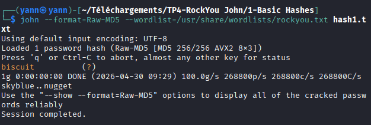
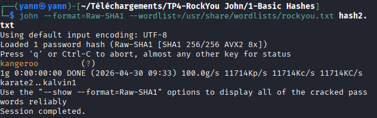
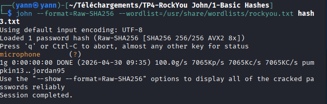
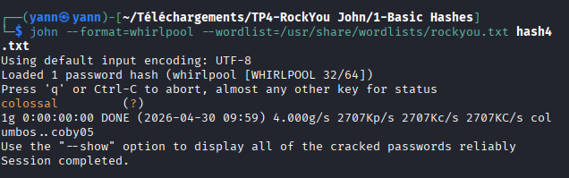

  * Authentification Windows

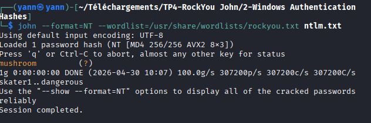

  * /etc/shadow

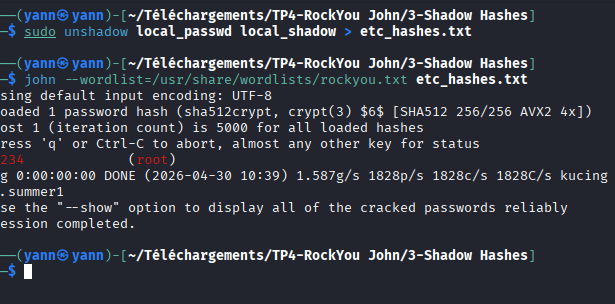
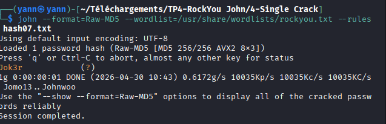

  * Fichiers Zip protégés par mot de passe

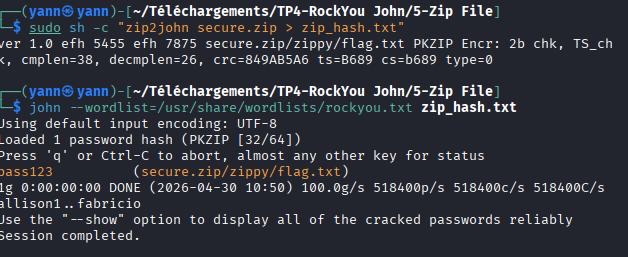

  * Fichiers RAR protégés par mot de passe

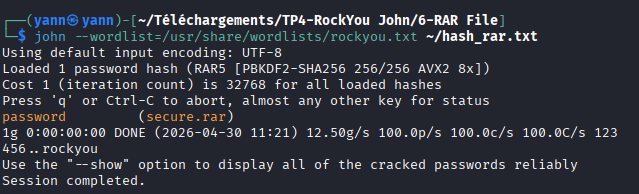

  * Clés SSH  2 Consignes

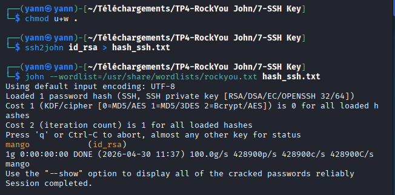


## TP5 : Déploiement d'une PKI et d'un Serveur Web Sécurisé (LXC sur Proxmox)

### Architecture et Prérequis

Vous allez déployer 3 conteneurs LXC sur Proxmox. Ces conteneurs seront connectés à un Bridge Linux (qui simule votre switch) et placés derrière un firewall pfSense virtuel.

Dans ce guide, le segment réseau d'exemple utilisé est `192.168.1.0/24`

*   **dns-yann** : IP `192.168.1.10`
*   **pki-yann** : IP `192.168.1.20`
*   **web-yann** : IP `192.168.1.30`
*   **client-yann** : IP `192.168.1.11`

### Étape 1 : Création des Conteneurs LXC sur Proxmox

Pour chaque service (DNS, PKI, WEB), créez un conteneur LXC en suivant cette procédure depuis l'interface Proxmox :

### Étape 2 : Exécution des scripts d'installation

Connectez-vous en `root` sur chacun de vos conteneurs et exécutez les scripts correspondants. 

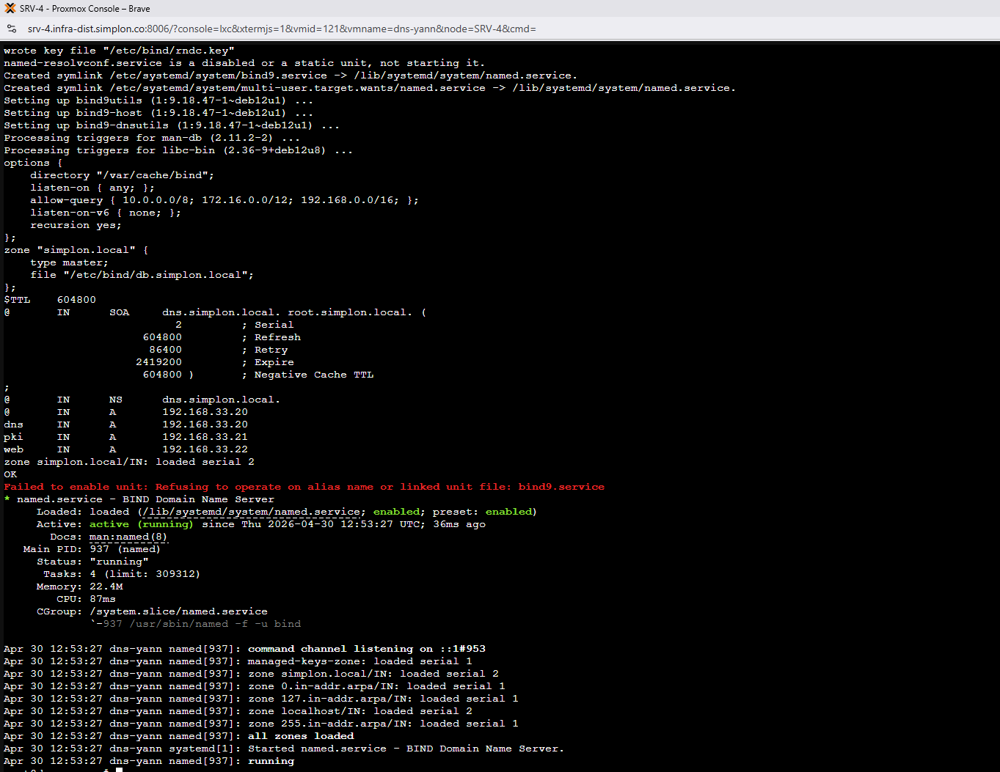
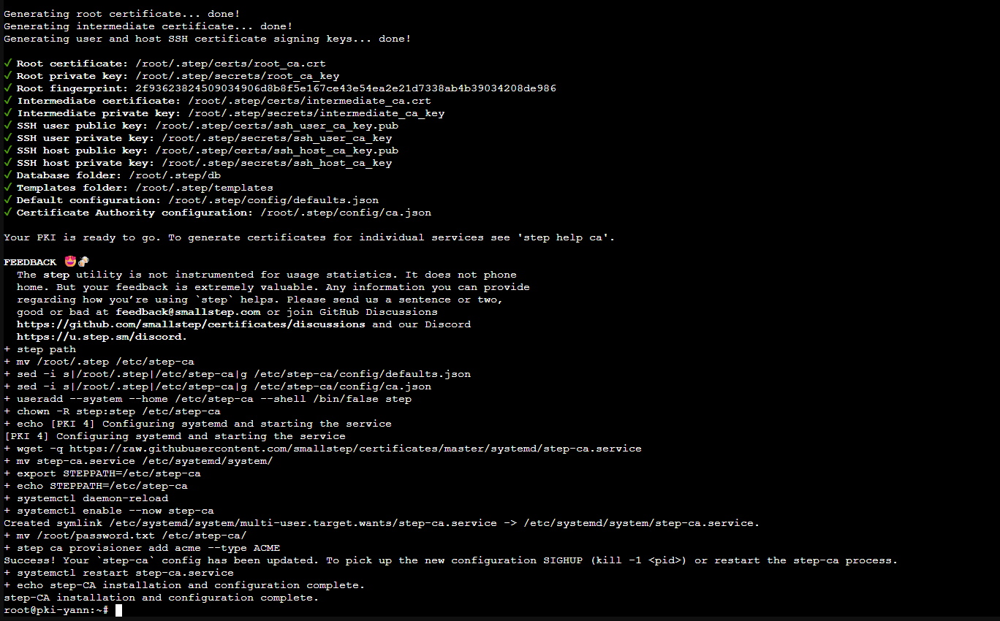
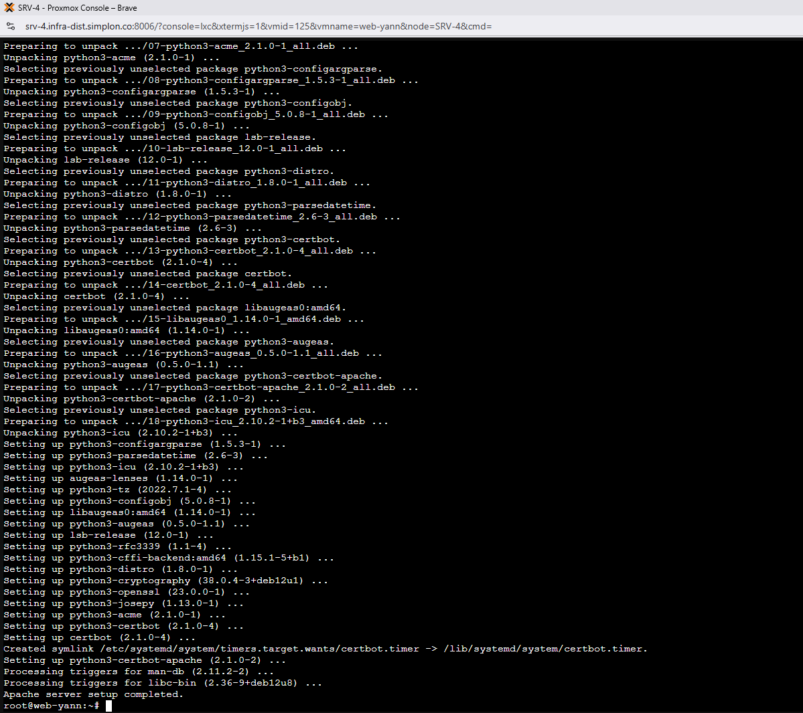

### Étape 3 : Exercice Pratique

#### A. Informations sur l'infrastructure

*   **PKI** : L'autorité de certification exécute Smallstep. Elle est configurée pour émettre des certificats SSL (ACME). Le certificat racine est dans `/etc/step-ca/certs`.
*   **WEB** : Exécute Apache2, configuré pour répondre sur `http://web.simplon.local`.

#### B. Configuration de la VM Client (hôte)

Une fois les conteneurs déployés, vous devez pouvoir accéder au site web depuis une VM Debian ou Windows dans le même segment réseau que l'infra PKI.
⚠️ **Action requise** : Changez la configuration de votre carte réseau pour utiliser **l'IP de votre conteneur DNS** comme DNS primaire (ex: `192.168.1.10`).

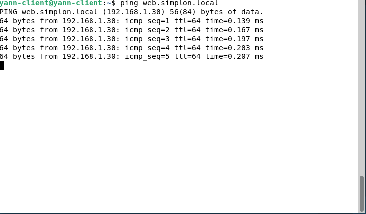
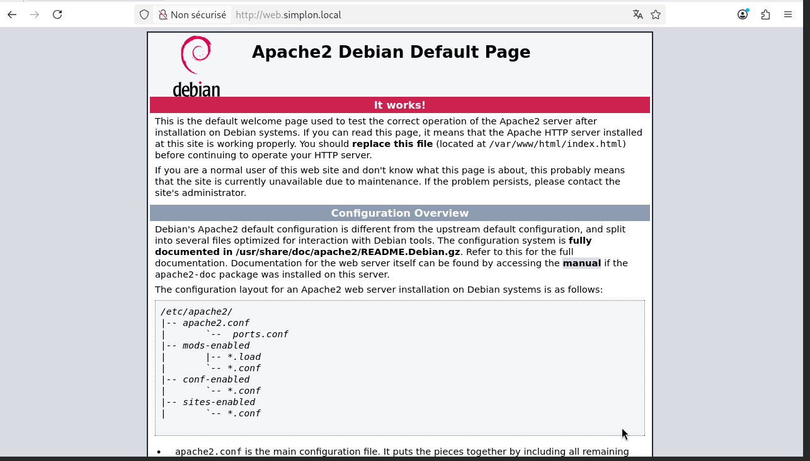

#### C. Test HTTP et Capture

1.  Ouvrez **Wireshark** sur votre VM Client et lancez une capture sur l'interface réseau connectée au réseau du lab.
2.  Ouvrez votre navigateur et allez sur `http://web.simplon.local`
3.  Observez le trafic en clair dans Wireshark (Filtre : `http`).

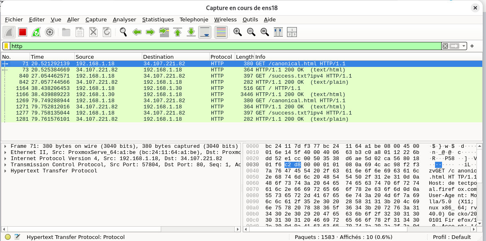  

#### D. Mise en place du SSL

Votre objectif : Mettre en place SSL sur le serveur web à l'aide de Certbot et de votre autorité PKI interne.
*   **Que constatez-vous lors du premier test en HTTPS ?**
  
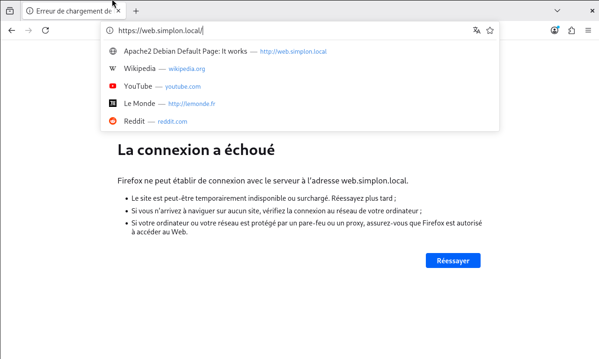

Comme vu su la capture ci dessous, lors du 1er test en HTTPS, la connexion échoue.

*   **Comment résoudre le problème lié au certificat auto-signé / autorité inconnue ?**
  
Mettre un vrai certificat valide

#### E. Obtenir et déployer le certificat SSL avec Certbot

**Toujours sur le serveur WEB :**
Lancez Certbot en lui indiquant l'URL ACME de votre PKI interne :
```bash
certbot --apache --server https://pki.simplon.local:8443/acme/acme/directory
```
*   **Email** : Renseignez un email (ex: `admin@simplon.local`).
*   **Terms of Service** : Acceptez (A).
*   **EFF** : Refusez (N).
*   **Names** : Sélectionnez `simplon.local` (ou tapez 1).
*   **Redirect** : Choisissez `2` (Redirect) pour forcer tout le trafic HTTP vers HTTPS.
   
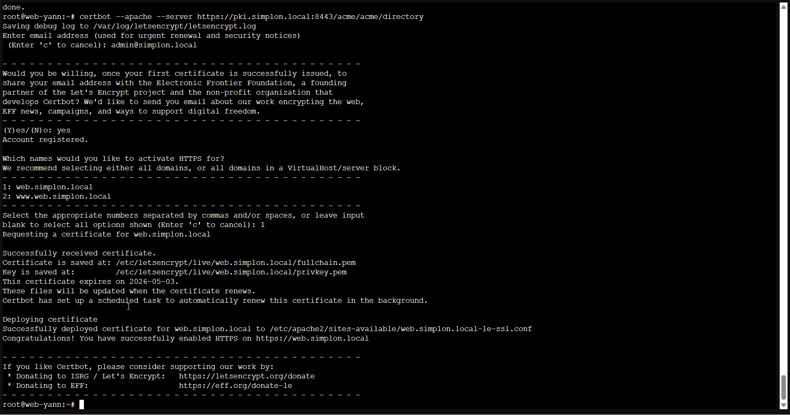

#### F. Test HTTPS et Validation Client

1.  Lancez une nouvelle capture Wireshark.
2.  Allez sur `https://web.simplon.local/`.
3.  **Analyse** : Le trafic est désormais chiffré. Quel protocole est utilisé ? (Regardez dans Wireshark, vous devriez voir du `TLS 1.3`).
Normalement vous devez voire du TLS 1.3. Si ce n’est pas le cas, votre navigateur n’est pas a jour ou est mal configuré
Dans Chrome, taper > chrome://flags/#tls13-variant

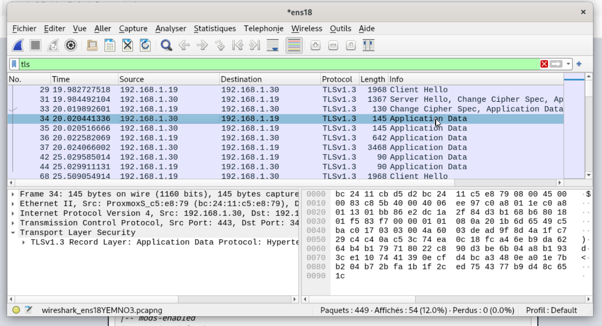

1.  **Alerte de sécurité du navigateur** : Votre navigateur affichera un avertissement de sécurité. C'est normal, votre VM Client ne connaît pas encore la PKI interne !
2.  **Résolution côté client** :
    *   Depuis votre VM Client, rendez-vous sur l'URL : `https://pki.simplon.local:8443/roots.pem`
    *   Le certificat racine se télécharge.*   

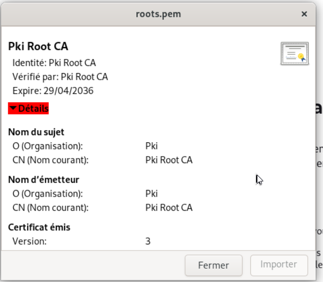

*  Importez-le dans le magasin de certificats de votre système d'exploitation ou directement dans les paramètres de votre navigateur (Autorités de certification de confiance).  

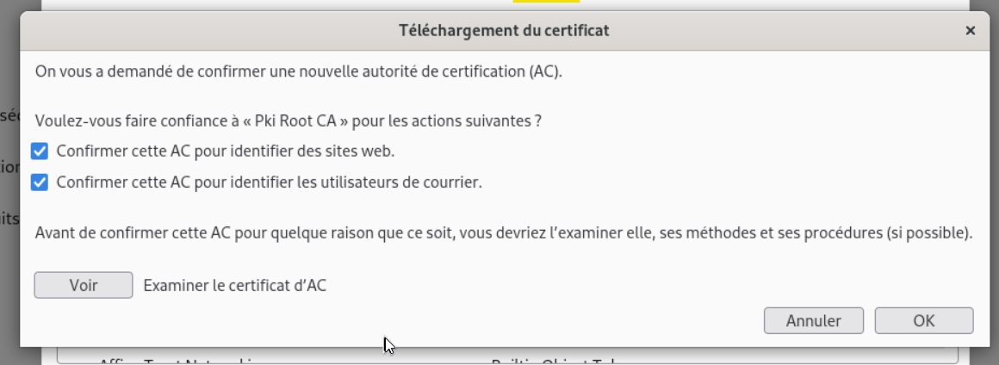

* Rechargez la page web : le cadenas vert doit s'afficher.

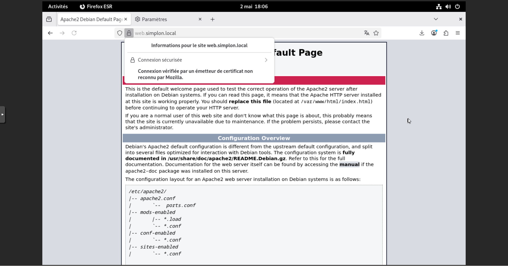