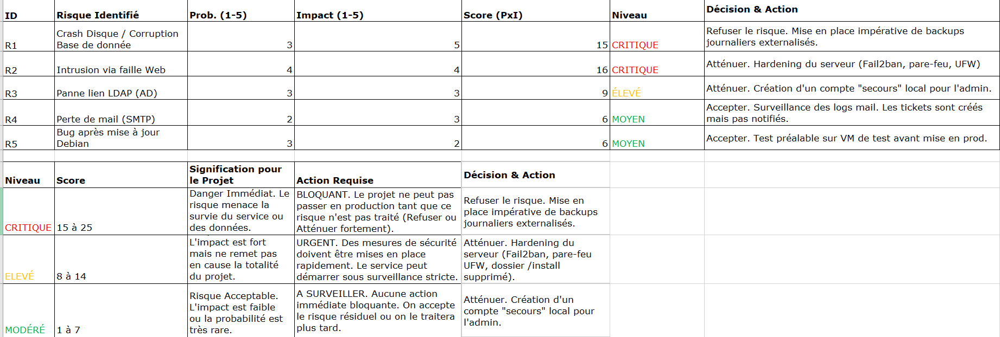

  

# Projet : Document d'Architecture Technique de déploiement de GLPI

### Contexte :

Mise en place d’une solution GLPI destinée à la gestion de parc informatique et au support utilisateurs, dans un premier temps en environnement de test, avec une mise en production ultérieure.

L’infrastructure repose sur une Machine Virtuelle hébergée sur un hyperviseur Proxmox et un système d’exploitation Debian 13.

### 1. Analyse des Besoins Clients

Avant tout déploiement technique, il est nécessaire de valider le périmètre avec le client :

**1.1 Périmètre fonctionnel**

* Gestion de parc informatique :
  * Inventaire matériel et logiciel
  * Suivi du cycle de vie des équipements
  * Historique des modifications

* Helpdesk :
  * Gestion des tickets (Incidents, demandes)
  * Affectation aux agents (support informatique, administrateurs, prestataires)
  * Notification par mail

* Gestion des utilisateurs :
  * Authentification centralisés via Active Directory (LDAPS)
  * Gestion des rôles et profils utilisateurs 

**1.2 Volumétrie**

  * Nombre d’utilisateurs finaux : à valider
  * Nombre d’agents techniques : à valider
  * Nombre estimé d’équipements inventoriés : à valider

**1.3 Environnement existant**

* Présence d'un active directory
* Infrastructure virtualisée sous proxmox
* Serveur de de messagerie existant

### 2. Analyse des Risques

*(Voir la matrice des risques détaillée ci-dessous)*

### 3. Prérequis Infrastructure (Hardware)

Le déploiement s'effectuera sur une **Machine Virtuelle (VM)** hébergée sur un hyperviseur **Proxmox**.

**OS Cible :** Debian 13 .

| Ressource           | Recommandation   | Justification                                                                    |
| :-------------------- | :----------------- | :--------------------------------------------------------------------------------- |
| **vCPU**            | **2 vCPU**       | Suffisant pour le traitement PHP/Web standard.                                   |
| **RAM**             | **4 Go**         | Minimum recommandé (Passer à 8 Go si >500 utilisateurs).                       |
| **Stockage**        | **50 Go (SSD)**  | OS + Base de données + Stockage des pièces jointes/Documents.                  |
| **Partitionnement** | **LVM Standard** | Séparer`/var` et `/home` si possible pour la sécurité et la gestion des logs. |

### 4. Prérequis Logiciels

**4.1 Système**

  * OS : Debian 13

**4.2 Stack applicative (LAMP)**

  * Serveur Web : Apache2
  * Base de données : MariaDB 10.11 minimum (ou MySQL 8.0)
  * Langage : PHP 8.2 minimum

**4.3 Extensions PHP requises**

  * php-mysqli
  * php-curl
  * php-gd
  * php-intl
  * php-ldap
  * php-zip
  * php-mbstring
  * php-xml

### 5. Prérequis Réseau et Flux

**5.1 Configuration IP**

  * Adresse IPv4 fixe
  * Enregistrement DNS de type A pointant vers la VM GLPI

**Matrice de Flux (Firewall)**

|  Sens  | Protocole |  Port  | Service | Description                                         |
| :-------: | :---------: | :-------: | :-------- | :---------------------------------------------------- |
| **IN** |    TCP    | **80** | HTTP    | Redirection automatique vers HTTPS.                 |
| **IN** |    TCP    | **443** | HTTPS   | Accès sécurisé pour les utilisateurs et agents.  |
| **IN** |    TCP    | **22** | SSH     | Administration système (Restreint aux IPs Admins). |
| **OUT** |    TCP    | **636** | LDAPS   | Liaison sécurisée vers l'Active Directory.        |
| **OUT** |    TCP    | **587** | SMTP    | Relais vers serveur de messagerie.                  |

### 6. Stratégie de Sécurité

**6.1 Sécurisation des accès**

  * Mise en place obligatoire du HTTPS
  * Certificat SSL via Let’s Encrypt
  * Reverse Proxy possible (ex : Nginx Proxy Manager)
  
**6.2 Durcissement du système**
  
  * Désactivation de l’accès SSH root
  * Authentification SSH par clé
  * Pare-feu (UFW)
  * Fail2ban (SSH / Apache)
  * Mises à jour de sécurité automatiques

**6.3 Sauvegardes et PRA**
  * Base de données : dump SQL quotidien
  * Fichiers : sauvegarde de /var/www/glpi
  * Stockage externe : NAS ou Cloud
  * Restauration testée périodiquement

### 7. Supervision et exploitation

  * Surveillance des ressources : CPU, RAM, disque
  * Supervision de la disponibilité HTTP(S)
  * Centralisation et consultation des logs
  * Outils possibles : Zabbix, Centreon

### 8. Environnements

  * Environnement de test
  * VM dédiée
  * Données fictives
  * Validation des mises à jour
  * Environnement de production
  * Accès restreint
  * Sauvegardes renforcées
  * Procédure de mise à jour validée

### 9. Planning prévisionnel

  * Installation de Debian 13 et durcissement système
  * Installation et configuration de la stack LAMP
  * Déploiement de GLPI
  * Suppression du dossier /install
  * Configuration LDAP (LDAPS) et SMTP
  * Tests fonctionnels (recette)
  * Validation avant mise en production

**Auteur : ESCRIVA Yann**

**Projet : Décembre 2025**
