<p align="center">
  
</p>


# Procédure de déploiement : Agent GLPI et Inventaire Réseau SNMP

**Auteur :** Yann (Administrateur Infrastructure Sécurisée) 

**Projet :** Janvier 2026


**Contexte :** Mise en place d'une remontée automatique d'inventaire réseau (Switchs) vers GLPI.


**Objectif :**

Installer et configurer l'agent GLPI sur un serveur Debian 13 pour effectuer la découverte et l'inventaire réseau via le protocole SNMP.

### Prérequis :

### Prérequis

* **Serveur :** Debian 12 ou supérieur.
* **Privilèges :** Accès Root ou utilisateur avec droits sudo.
* **Serveur GLPI :** Accessible via HTTPS.
* **Informations nécessaires :** URL du serveur GLPI, identifiants SNMPv3 des équipements (Utilisateur, mots de passe de chiffrement SHA/AES).

### Partie 1 : Installation de l'Agent

Nous utilisons les paquets .deb officiels pour garantir une installation propre, stable et facile à maintenir via apt.

**Nettoyage** (Optionnel)

Cette étape est nécessaire uniquement si une installation manuelle précédente a échoué.

```Bash
sudo apt purge glpi-agent -y
sudo rm -rf /usr/local/bin/glpi-agent
sudo rm -rf /etc/glpi-agent
```

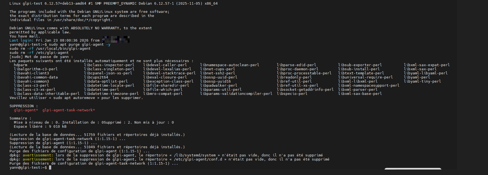

**Téléchargement des paquets**

Il est nécessaire de télécharger le cœur de l'agent et le module réseau (indispensable pour le support SNMP).

**Télécharger l'agent principal (Version 1.15)**

```bash
wget https://github.com/glpi-project/glpi-agent/releases/download/1.15/glpi-agent_1.15-1_all.deb
```

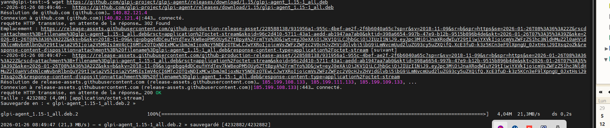

**Télécharger le module Network (Obligatoire pour scanner les switchs)**

```bash
wget https://github.com/glpi-project/glpi-agent/releases/download/1.15/glpi-agent-task-network_1.15-1_all.deb
```

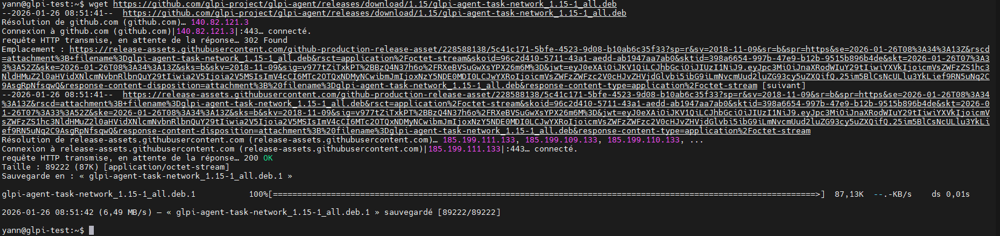

**Installation**

Nous utilisons **apt** pour gérer automatiquement les dépendances (Perl, librairies système, etc.).

**Installer l'agent et le module réseau simultanément**

```bash
sudo apt install ./glpi-agent_1.15-1_all.deb ./glpi-agent-task-network_1.15-1_all.deb -y
```

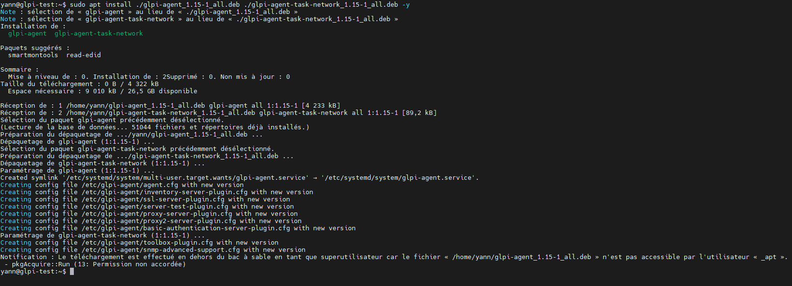

**Vérification de l'installation des modules**

Une fois installé, nous vérifions que l'agent a bien chargé les tâches réseaux.

```Bash
sudo glpi-agent --list-tasks
```

**Résultat attendu :**

La liste doit contenir les lignes suivantes :

* NetDiscovery (v...) 
* NetInventory (v...)

Si ces lignes sont absentes, le paquet glpi-agent-task-network est manquant.

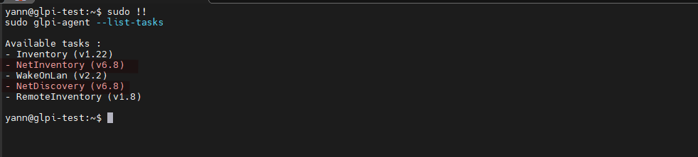


### Partie 2 : Configuration de l'Agent

**Configuration du serveur et du SSL**

Par défaut, le fichier de configuration est commenté (inactif), ce qui empêche le démarrage du service. Il faut définir l'URL du serveur manuellement.

Ouvrir le fichier de configuration :

```bash
sudo nano /etc/glpi-agent/agent.cfg
```

Modifications à effectuer : Rechercher la ligne # server = ... au début du fichier.

* Enlever le # (décommenter).
* Indiquer l'URL du serveur.
* Ajouter la ligne no-ssl-check si le certificat est auto-signé.

**Le fichier doit ressembler à ceci :**

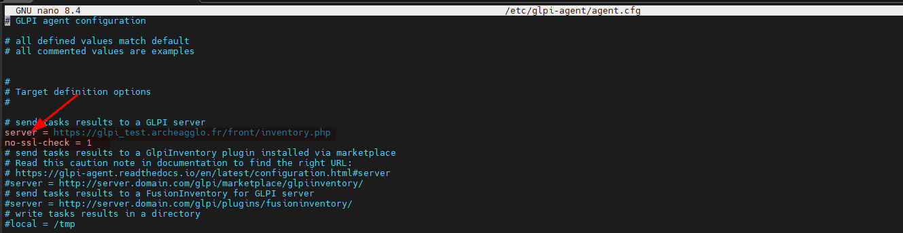

**Vérification du Service Systemd**

Nous nous assurons que le service pointe vers le bon exécutable installé par APT (/usr/bin).

**Éditer la configuration du service de manière sécurisée**

```bash
sudo systemctl edit --full glpi-agent.service
```

**Vérifier la ligne ExecStart. Elle doit correspondre exactement à ceci :**

```Ini, TOML
ExecStart=/usr/bin/glpi-agent --daemon --no-fork $OPTIONS
```

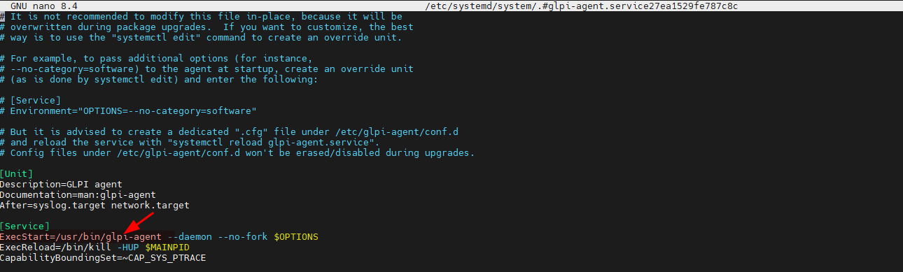

(Si le chemin indique /usr/local/bin, le corriger vers /usr/bin).

**Redémarrage et Validation**

* Recharger la configuration des démons

```bash
sudo systemctl daemon-reload
```

* Redémarrer l'agent pour appliquer les changements

```bash
sudo systemctl restart glpi-agent
```

**Vérifier que le statut est "Active (running)"**

```bash
sudo systemctl status glpi-agent
```

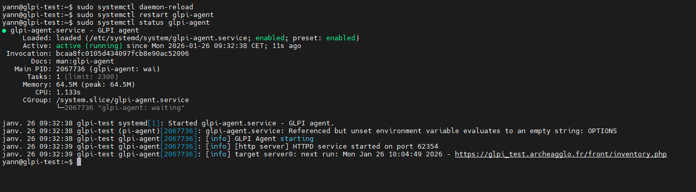

* Première communication forcée

Pour que l'agent apparaisse dans la liste des agents sur l'interface web, il faut qu'il communique au moins une fois avec succès.

```bash
sudo glpi-agent --force
```

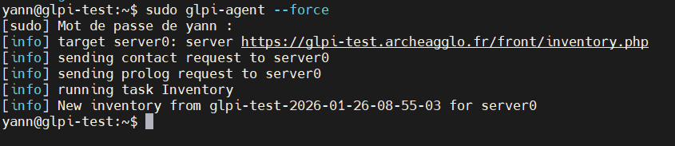


### Partie 3 : Configuration dans GLPI (Interface Web)

**Activation de l'Agent**

* Aller dans **Administration > Inventaire > agents**.
* Sélectionner l'agent nouvellement remonté.
* Aller dans l'onglet **Modules**
* Activer les options suivantes :
  * Découverte réseau : Oui
  * Inventaire réseau : Oui

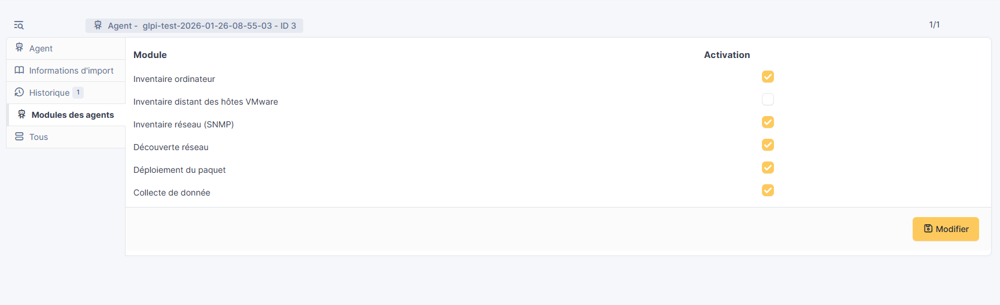

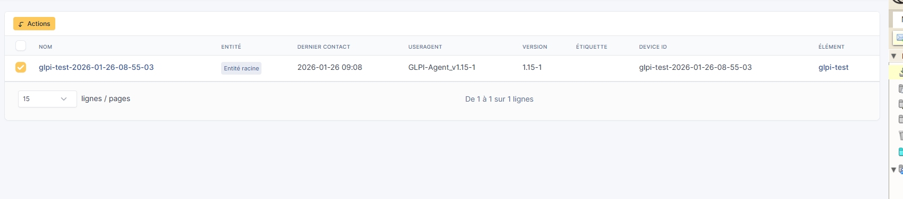

### Création des identifiants SNMPv3

L'agent a besoin d'identifiants chiffrés pour interroger les switchs de manière sécurisée sans que les données transitent en clair sur le réseau.

* Aller dans **Administration > Inventaire > Authentification SNMP**.
* Cliquer sur **Ajouter**.
* **Nom :** SW-STD-DAT-01.
* **Version SNMP :** 3
* **Utilisateurs :** ADMIN_GLPI
* **Protocole d'authentification :** SHA256
* **Protocole de chiffrement des données :** AES128

### Définition de la cible (Plage IP)

* Aller dans **Administration > GLPI Inventory > Plages IP**.
* Créer une nouvelle plage (ex: "Switchs VLAN 20 - St Donat" ou "Switchs VLAN 20 - Mauves").
* Renseigner l'IP de début et de fin correspondant à notre plan d'adressage cible :
  * *Exemple pour cibler le sous-réseau complet de St Donat :* `10.61.20.1` à `10.61.20.254`.
  * *Exemple pour cibler le switch répartiteur SW-STD-DAT-01 spécifiquement :* `10.61.20.1` à `10.61.20.1`.
  * *Exemple pour le réseau d'équipements du site principal (Mauves) :* `10.50.20.1` à `10.50.20.254`.

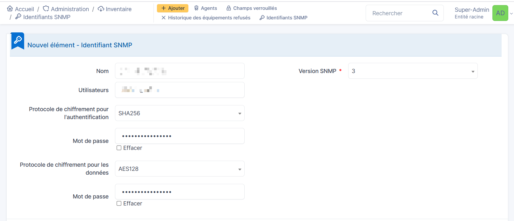

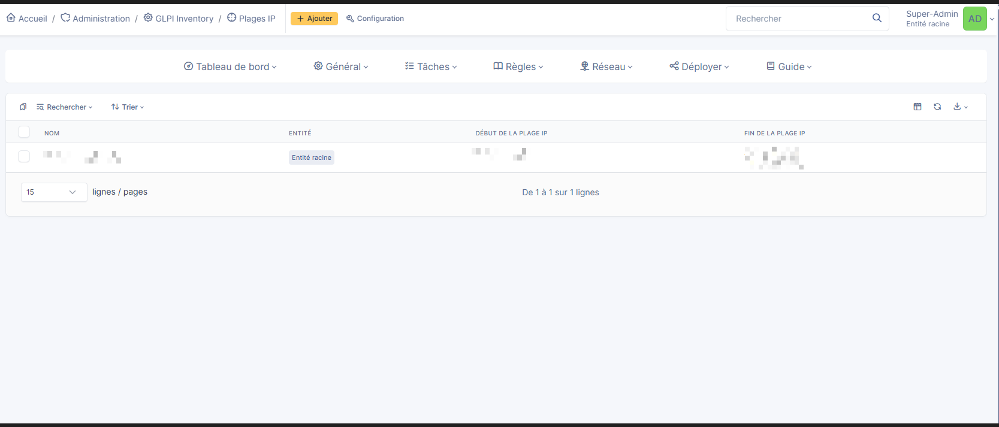

**Création de la Tâche**

Cette étape lie l'agent, la cible et les identifiants.

* Aller dans **Administration > GLPI Inventory > Tâches > Gestion des tâches**.
* Créer une tâche nommée "Scan Découverte" par exemple et cocher la case **Actif**.
* Dans l'onglet **Configuration du Job** :
  * **Nom** : Mettre le nom qu'on veut
  * **Méthode du module** : Sélectionner Découverte réseau.
  * **Cibles** : Ajouter la Plage IP créée précédemment.
  * **Acteurs** : Ajouter l' Agent configuré.
* Cliquer sur **Mettre à jour**.

* Action finale : Dans la liste des tâches (ou via le bouton d'action), cliquer sur "Forcer le démarrage" pour préparer le travail.

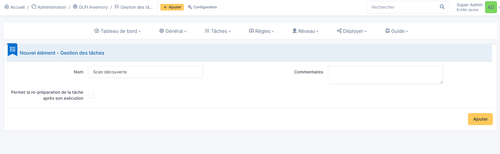
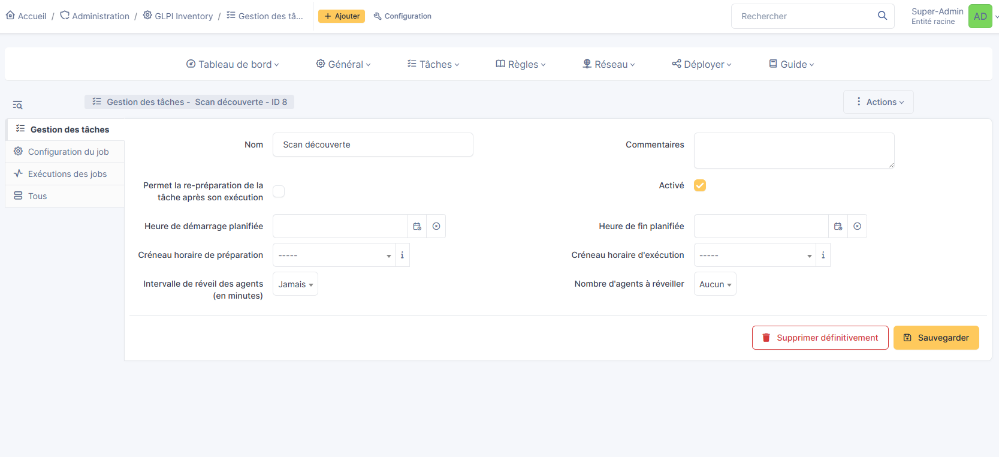
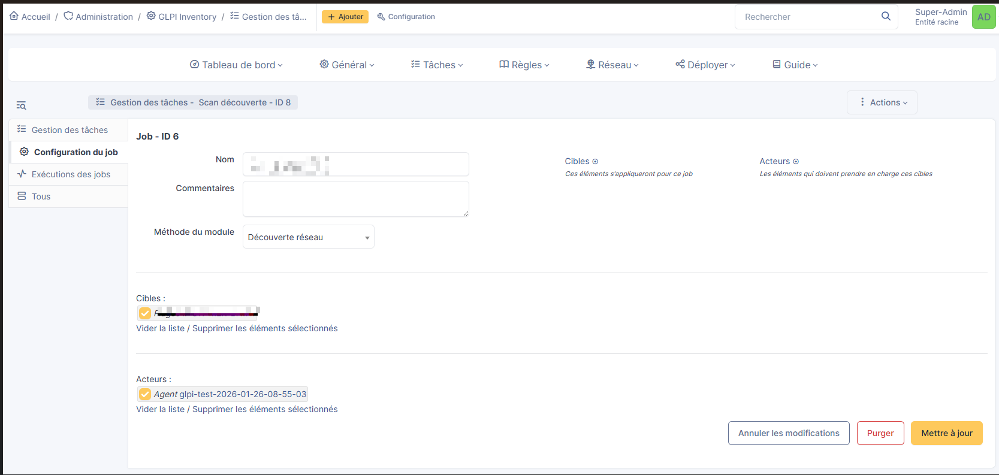
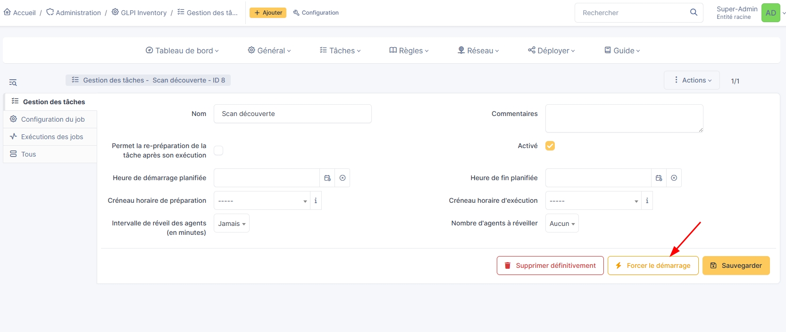
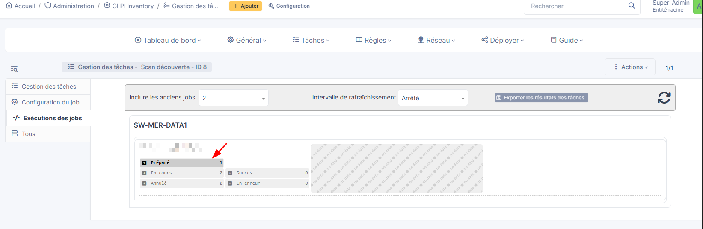


### Partie 4 : Exécution et Vérification

**Lancer le scan (Force Run)**

Sur le serveur Linux, nous forçons l'agent à récupérer sa tâche immédiatement sans attendre le cycle planifié :

```Bash
sudo glpi-agent --force
```

Vérification : Le terminal doit afficher running task NetDiscovery.

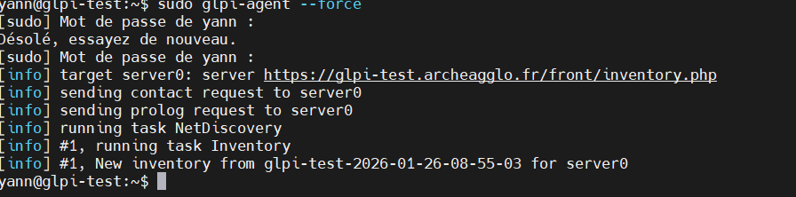

**Vérification de l'importation**

Grâce à la configuration SNMP correcte, GLPI possède désormais toutes les informations (Adresse MAC, Numéro de Série) pour identifier le matériel. L'importation est donc automatique.

Aller dans **Parc** > **Matériel réseau**.

Vérifier la présence du nouveau switch dans la liste.

Cliquer sur le nom du switch pour valider la remontée des informations (Ports, Modèle, Firmware).

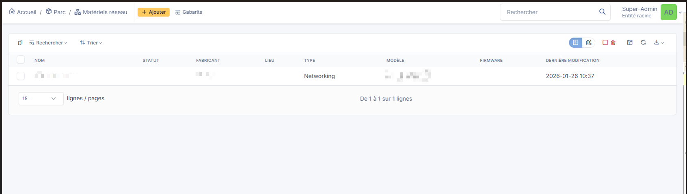


### Cas de dépannage (Si le switch n'apparaît pas)

Si le switch n'est pas dans le Parc, c'est que l'identification a échoué (souvent un problème d'authentification ou de chiffrement SNMPv3). Il est alors mis en quarantaine.

* Aller dans **Administration > GLPI Inventory > Nombre de Actifs non gérés**.
* Si le switch est présent ici, c'est qu'il manque des informations critiques (MAC/Serial) pour l'import automatique.
* **Action corrective :** Vérifier les mots de passe et les protocoles de chiffrement SNMPv3 (SHA/AES) dans GLPI et sur le switch, puis relancer le scan.

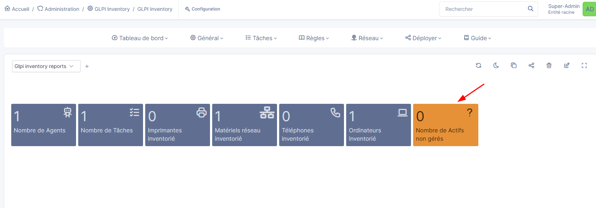

### Conclusion

Ce déploiement assure désormais une remontée automatique et détaillée des équipements réseau vers GLPI. Cette solution garantit une **CMDB (Configuration Management Database)** toujours à jour sans intervention humaine, offrant ainsi une vision précise de l'infrastructure pour une gestion proactive du parc informatique.