<p align="center">
  
</p>


# Procédure d’installation et de préparation de GLPI 11


## Sommaire

- [Procédure d’installation et de préparation de GLPI 11](#procédure-dinstallation-et-de-préparation-de-glpi-11)
  - [Sommaire](#sommaire)
  - [1. Présentation](#1-présentation)
    - [1.1 Objectifs](#11-objectifs)
  - [2. Prérequis](#2-prérequis)
    - [2.1 Matériel](#21-matériel)
    - [2.2 Logiciel](#22-logiciel)
    - [2.3 Réseau et flux](#23-réseau-et-flux)
  - [3. Préparation du serveur Debian 13](#3-préparation-du-serveur-debian-13)
    - [3.1 Mise à jour](#31-mise-à-jour)
  - [4. Installation de la stack LAMP](#4-installation-de-la-stack-lamp)
    - [4.1 Installation Apache, PHP-FPM et MariaDB](#41-installation-apache-php-fpm-et-mariadb)
    - [4.2 Installation des extensions PHP](#42-installation-des-extensions-php)
  - [5. Préparation de MariaDB](#5-préparation-de-mariadb)
    - [5.1 Sécurisation](#51-sécurisation)
    - [5.2 Création de la base GLPI](#52-création-de-la-base-glpi)
  - [6. Téléchargement et préparation de GLPI](#6-téléchargement-et-préparation-de-glpi)
    - [6.1 Téléchargement](#61-téléchargement)
    - [6.2 Préparation des répertoires et permissions](#62-préparation-des-répertoires-et-permissions)
  - [7. Configuration Apache pour GLPI](#7-configuration-apache-pour-glpi)
    - [7.1 VirtualHost complet](#71-virtualhost-complet)
    - [7.2 Activation et redémarrage](#72-activation-et-redémarrage)
  - [8. Configuration PHP-FPM](#8-configuration-php-fpm)
    - [8.1 Configuration PHP-FPM](#81-configuration-php-fpm)
    - [8.2 Liaison Apache ↔ PHP-FPM](#82-liaison-apache--php-fpm)
    - [8.3 Validation du fonctionnement PHP-FPM](#83-validation-du-fonctionnement-php-fpm)
  - [9. Installation via l’interface web](#9-installation-via-linterface-web)
  - [10. Sécurisation post-installation](#10-sécurisation-post-installation)
  - [11. Sauvegardes et PRA](#11-sauvegardes-et-pra)
  - [12. Tests et validation](#12-tests-et-validation)
    - [12.1 Vérifier accès HTTPS](#121-vérifier-accès-https)
    - [12.2 Authentification LDAP](#122-authentification-ldap)
    - [12.3 Envoi notifications SMTP](#123-envoi-notifications-smtp)
    - [12.4 Création et gestion tickets](#124-création-et-gestion-tickets)
    - [12.5 Ajout d’équipements et gestion des utilisateurs](#125-ajout-déquipements-et-gestion-des-utilisateurs)
    - [12.6 Sauvegardes restaurables](#126-sauvegardes-restaurables)
    - [12.7 SSO : non implémenté (évolution prévue)](#127-sso-non-implémenté-évolution-prévue)
    - [12.8 Conclusion des tests](#128-conclusion-des-tests)
  - [13. Durcissement post-validation (FINAL)](#13-durcissement-post-validation-final)
    - [13.1 Durcissement du système Debian](#131-durcissement-du-système-debian)
      - [Désactivation de la connexion SSH root](#désactivation-de-la-connexion-ssh-root)
    - [13.2 Durcissement du serveur Apache](#132-durcissement-du-serveur-apache)
    - [13.3 Durcissement PHP / PHP-FPM](#133-durcissement-php--php-fpm)
    - [13.4 Sécurisation spécifique à GLPI](#134-sécurisation-spécifique-à-glpi)
    - [13.5 Sécurisation de la base de données](#135-sécurisation-de-la-base-de-données)
    - [13.6 Journalisation et supervision](#136-journalisation-et-supervision)
    - [13.7 Politique de mises à jour](#137-politique-de-mises-à-jour)
    - [13.8 Conclusion du durcissement](#138-conclusion-du-durcissement)
    - [14. Table de correspondance DAT ↔ Procédure](#14-table-de-correspondance-dat--procédure)
  - [15. Conclusion](#15-conclusion)


## 1. Présentation

### 1.1 Objectifs

Installer GLPI 11 sur Debian 13 dans un environnement de test conforme aux exigences du DAT :
- gestion de parc
- helpdesk
- intégration LDAP
- sécurité
- sauvegardes et PRA


## 2. Prérequis

### 2.1 Matériel

- VM Proxmox  
- 2 vCPU  
- 4 Go RAM  
- 50 Go SSD  

Partitionnement recommandé :
- `/` : 15 Go  
- `/var` : 10 Go  
- `/var/log` : 5 Go  
- `/var/lib/mysql` : 15 Go  
- `/home` : 5 Go  

### 2.2 Logiciel

- Debian 13
- Apache2
- MariaDB ≥ 10.11
- PHP 8.4
- Extensions PHP requises :
  - mysqli, curl, gd, intl, ldap, zip, mbstring, xml, bz2

### 2.3 Réseau et flux

- IP fixe
- DNS fonctionnel
- Ports :
  - 22 (SSH)
  - 443 (HTTPS)
  - 636 (LDAPS)
  - 587 (SMTP)
  - 161 (SNMP)


## 3. Préparation du serveur Debian 13

### 3.1 Mise à jour

```bash
sudo apt update && sudo apt upgrade -y
```


## 4. Installation de la stack LAMP

### 4.1 Installation Apache, PHP-FPM et MariaDB

```bash
sudo apt install apache2 php8.4-fpm mariadb-server
```

### 4.2 Installation des extensions PHP

```bash
sudo apt install php8.4-{curl,gd,intl,mysql,zip,bcmath,mbstring,xml,bz2,ldap}
```


## 5. Préparation de MariaDB

### 5.1 Sécurisation

```bash
sudo mariadb-secure-installation
```


### 5.2 Création de la base GLPI

```sql
CREATE DATABASE dbyann_glpi;
GRANT ALL PRIVILEGES ON dbyann_glpi.* TO glpi_admin@localhost IDENTIFIED BY 'Monmotdepasse';
FLUSH PRIVILEGES;
EXIT;
```


## 6. Téléchargement et préparation de GLPI

### 6.1 Téléchargement

```bash
cd /tmp
wget https://github.com/glpi-project/glpi/releases/download/11.0.4/glpi-11.0.4.tgz
sudo tar -xzvf glpi-11.0.4.tgz -C /var/www/
```

### 6.2 Préparation des répertoires et permissions

```bash
# 1. Création des répertoires
sudo mkdir -p /etc/glpi /var/lib/glpi /var/log/glpi

# 2. Déplacement AVANT permissions
sudo mv /var/www/glpi/config /etc/glpi/
sudo mv /var/www/glpi/files /var/lib/glpi/

# 3. Créer fichiers de configuration :
sudo nano /var/www/glpi/inc/downstream.php
```

```php
<?php
define('GLPI_CONFIG_DIR', '/etc/glpi/');
if (file_exists(GLPI_CONFIG_DIR . '/local_define.php')) {
    require_once GLPI_CONFIG_DIR . '/local_define.php';
}
```

```bash
sudo nano /etc/glpi/local_define.php
```

```php
<?php
define('GLPI_VAR_DIR', '/var/lib/glpi/files');
define('GLPI_LOG_DIR', '/var/log/glpi');
```

```bash
# 4. Permissions finales (récursives)
sudo chown -R www-data:www-data \
  /var/www/glpi \
  /etc/glpi \
  /var/lib/glpi \
  /var/log/glpi

sudo chmod -R 750 \
  /var/www/glpi \
  /etc/glpi \
  /var/lib/glpi \
  /var/log/glpi
```


## 7. Configuration Apache pour GLPI

### 7.1 VirtualHost complet

```bash
sudo nano /etc/apache2/sites-available/glpi_test.archeagglo.fr.conf
```

```apache
<VirtualHost *:80>
    ServerName glpi_test.archeagglo.fr

    DocumentRoot /var/www/glpi/public

    # Alias optionnel
    # Alias "/glpi" "/var/www/glpi/public"

    <Directory /var/www/glpi/public>
        Require all granted

        RewriteEngine On
        RewriteCond %{HTTP:Authorization} ^(.+)$
        RewriteRule .* - [E=HTTP_AUTHORIZATION:%{HTTP:Authorization}]

        RewriteCond %{REQUEST_FILENAME} !-f
        RewriteRule ^(.*)$ index.php [QSA,L]
    </Directory>
</VirtualHost>
```


### 7.2 Activation et redémarrage

```bash
sudo a2ensite glpi_test.archeagglo.fr.conf
sudo a2dissite 000-default.conf
sudo a2enmod rewrite proxy_fcgi setenvif
sudo systemctl restart apache2
```


## 8. Configuration PHP-FPM

L’utilisation de PHP-FPM permet une meilleure
gestion des processus PHP, améliore les performances et renforce la sécurité
en séparant l’exécution PHP du serveur Apache

### 8.1 Configuration PHP-FPM

Éditer le fichier de configuration PHP :

```bash
sudo nano /etc/php/8.4/fpm/php.ini
```

Paramètres de sécurité recommandés :

```ini
session.cookie_httponly = on
session.cookie_samesite = Lax
```

**Ces paramètres permettent :**

* de protéger les cookies de session contre les accès JavaScript,
* de limiter les attaques de type CSRF,
* de renforcer la sécurité des sessions utilisateurs.

Redémarrer le service PHP-FPM afin d’appliquer les modifications :


Redémarrage PHP-FPM :

```bash
sudo systemctl restart php8.4-fpm
```

### 8.2 Liaison Apache ↔ PHP-FPM

Afin qu’Apache transmette l’exécution des fichiers PHP à PHP-FPM, il est
nécessaire de configurer le VirtualHost GLPI.

Éditer le fichier du VirtualHost :

```bash
sudo nano /etc/apache2/sites-available/glpi_test.archeagglo.fr.conf
```

Ajouter la directive suivante à l’intérieur du VirtualHost :

```bash
<FilesMatch \.php$>
    SetHandler "proxy:unix:/run/php/php8.4-fpm.sock|fcgi://localhost/"
</FilesMatch>
```

Cette configuration indique à Apache :

* d’utiliser le socket PHP-FPM dédié,
* de déléguer l’exécution des scripts PHP à PHP-FPM


Activer les modules nécessaires si ce n’est pas déjà fait :

```bash
sudo a2enmod proxy_fcgi setenvif
```
(Si ce n’est pas déjà fait à l’étape précédente)


Le module setenvif est requis pour la gestion correcte des variables d’environnement HTTP, notamment pour l’authentification et certaines fonctionnalités applicatives de GLPI

Redémarrer Apache pour appliquer la configuration :

```bash
sudo systemctl restart apache2
```

### 8.3 Validation du fonctionnement PHP-FPM

Le bon fonctionnement de PHP-FPM est validé par :

* l’accès fonctionnel à l’interface GLPI,
* l’absence d’erreurs PHP dans les journaux Apache et PHP-FPM,
* l’exécution correcte des pages dynamiques.

Cette configuration garantit une exécution PHP performante, sécurisée
et conforme aux bonnes pratiques pour un environnement GLPI.


## 9. Installation via l’interface web

* Vérifier prérequis
* Configurer BDD `dbyann_glpi` / utilisateur `glpi_admin`
* Créer compte administrateur
* Supprimer `/install`

```bash
sudo rm /var/www/glpi/install/install.php
```


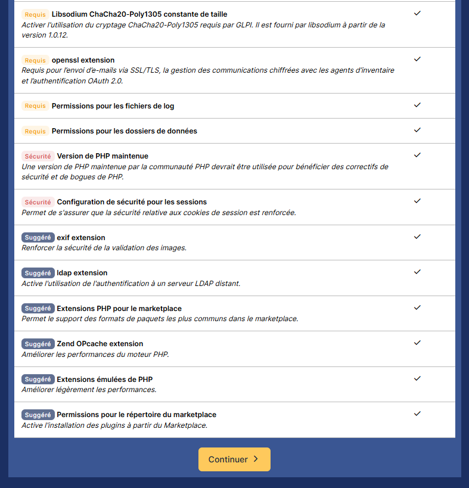


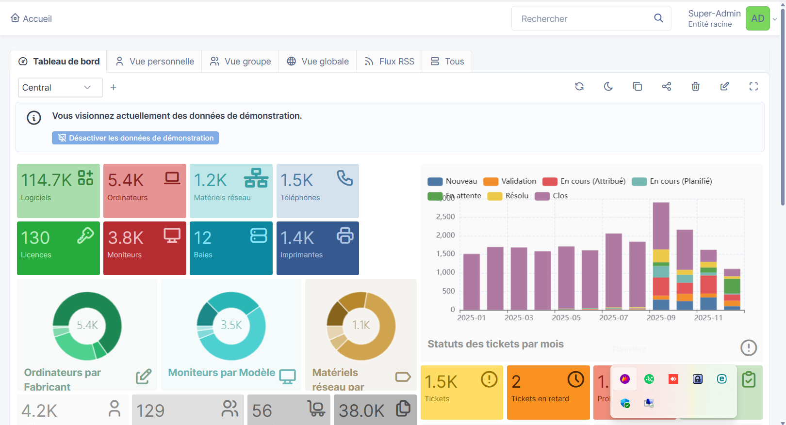


## 10. Sécurisation post-installation

* HTTPS (Let's Encrypt en production)
Pour ce test, un certificat SSL auto-signé a été utilisé afin de sécuriser l’accès en HTTPS à GLPI.
Ce type de certificat n’est pas reconnu par défaut par les navigateurs. Il est donc adapté pour un environnement de test.

Pour un usage en production, il est recommandé d’utiliser un certificat signé par une autorité de certification reconnue afin d’éviter les alertes de sécurité dans les navigateurs

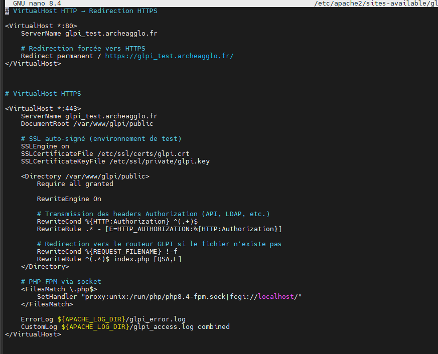

* SSH restreint / clé
* Fail2ban
* Mises à jour régulières


## 11. Sauvegardes et PRA

* Dump quotidien MariaDB
* Backup répertoires `/etc/glpi` et `/var/lib/glpi`
* Snapshots VM Proxmox
* Rétention 30 jours
* Stratégie 3-2-1 (3 Sauvegardes, 2 supports différents dont 1 hors site)


## 12. Tests et validation

Cette section décrit les tests réalisés afin de valider le bon fonctionnement
de la plateforme GLPI déployée dans l’environnement de test

### 12.1 Vérifier accès HTTPS

**Objectif :**

S’assurer que l’application GLPI est accessible de manière sécurisée via HTTPS.

**Actions réalisées :**
- Mise en place d’un certificat SSL auto-signé
- Configuration Apache avec redirection HTTPS
- Test d’accès via navigateur et commande `curl`

**Résultat :**
- Accès HTTPS fonctionnel
- Certificat fonctionnel (auto-signé, accepté dans le cadre de l’environnement de test)
- Communication chiffrée confirmée

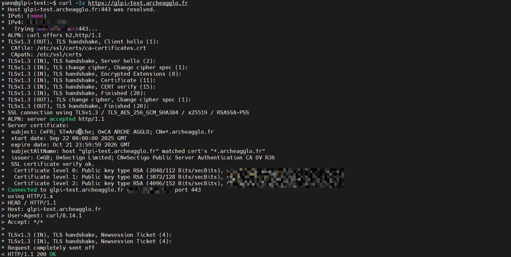

**Statut :** validé

### 12.2 Authentification LDAP

**Objectif :**  
Valider l’authentification des utilisateurs via un annuaire LDAP.

**Actions réalisées :**
- Configuration du serveur LDAP dans GLPI
- Création d’un utilisateur LDAP de test
- Test d’authentification depuis l’interface GLPI

**Résultat :**
- Connexion LDAP réussie
- Synchronisation correcte des comptes utilisateurs

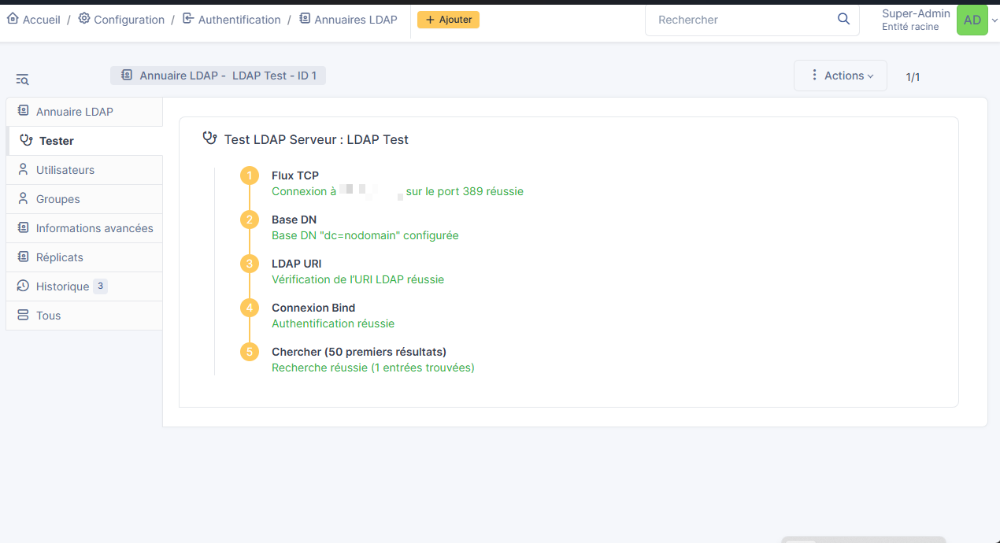

**Statut :** validé

### 12.3 Envoi notifications SMTP

**Objectif :**  
Vérifier l’envoi et la réception des notifications par e-mail depuis GLPI.

**Actions réalisées :**
- Configuration du service de messagerie local
- Paramétrage des notifications GLPI
- Test d’envoi depuis l’interface GLPI
- Test de réception via la commande `mail`

**Résultat :**
- Envoi d’e-mails fonctionnel
- Réception des messages confirmée

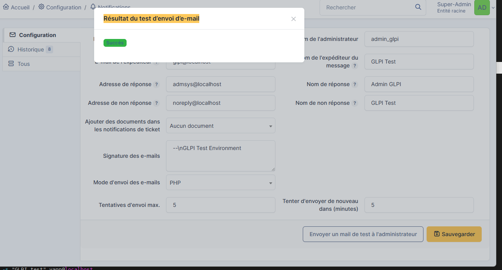
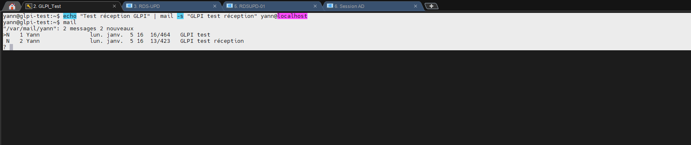

**Statut :** validé

### 12.4 Création et gestion tickets

**Objectif :**  
Valider le fonctionnement du module helpdesk

**Actions réalisées :**
- Création de tickets depuis un compte utilisateur
- Attribution à un technicien
- Changement de statut
- Ajout de commentaires

**Résultat :**
- Cycle de vie des tickets fonctionnel
- Notifications associées envoyées correctement

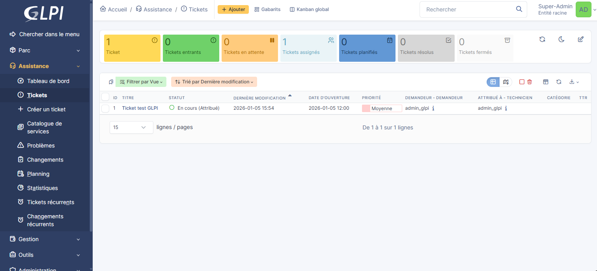
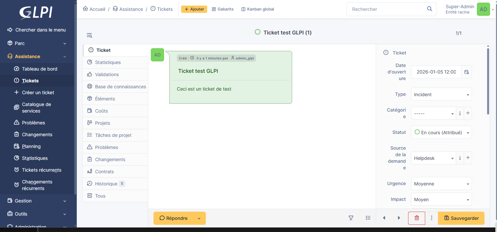
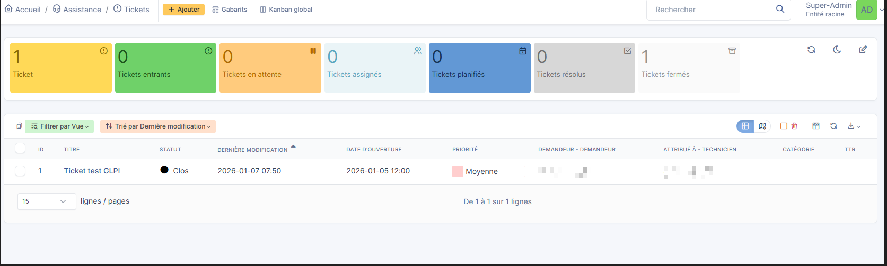
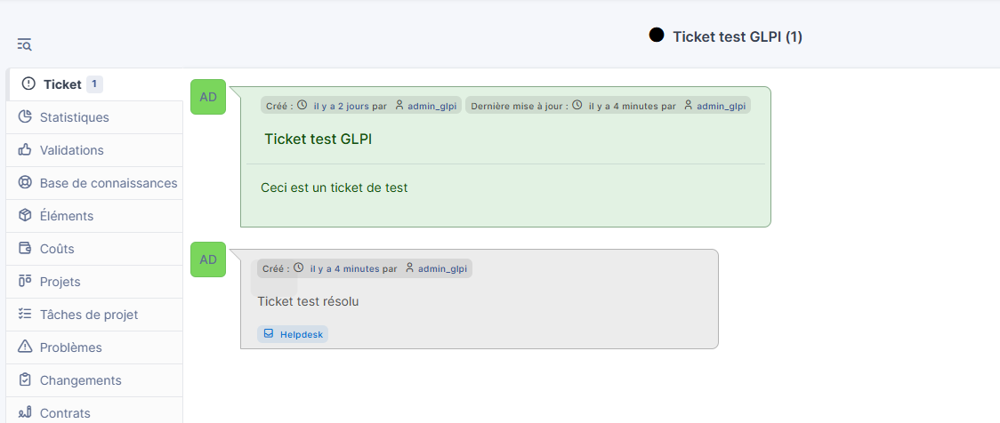

**Statut :** validé

### 12.5 Ajout d’équipements et gestion des utilisateurs

La fonctionnalité de gestion du parc a été testée par l’ajout manuel
d’un équipement depuis l’interface GLPI. L’équipement créé est correctement enregistré et visible dans l’inventaire, confirmant le bon fonctionnement du module de gestion des matériels.

La gestion des utilisateurs a également été validée par un import au
format CSV. Cet import permet la création en masse de comptes utilisateurs.
Le test s’est déroulé avec succès et les utilisateurs importés sont
correctement accessibles et exploitables dans l’application.

Ces tests confirment la capacité de la solution à gérer un parc informatique et des comptes utilisateurs, aussi bien en création unitaire qu’en import groupé.


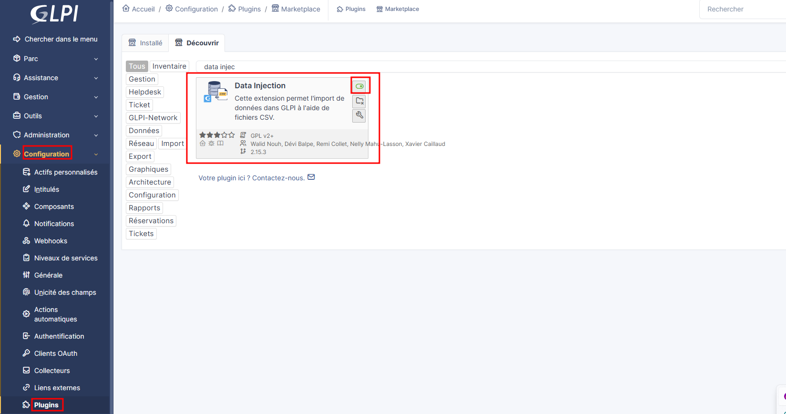
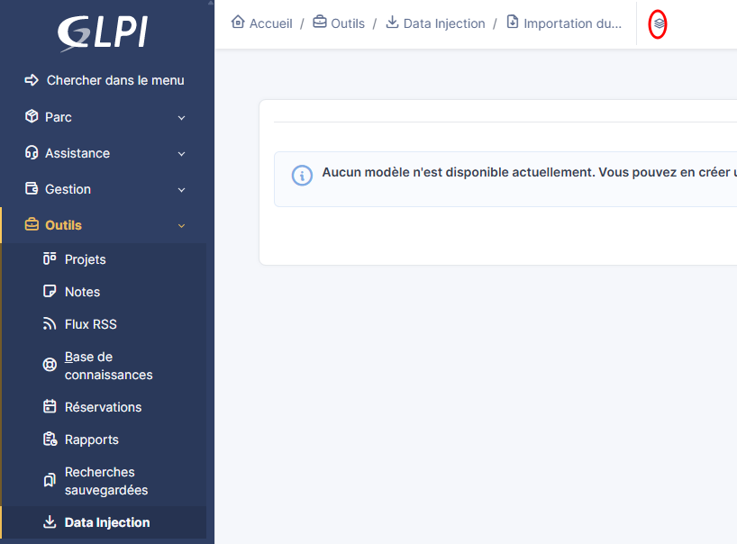


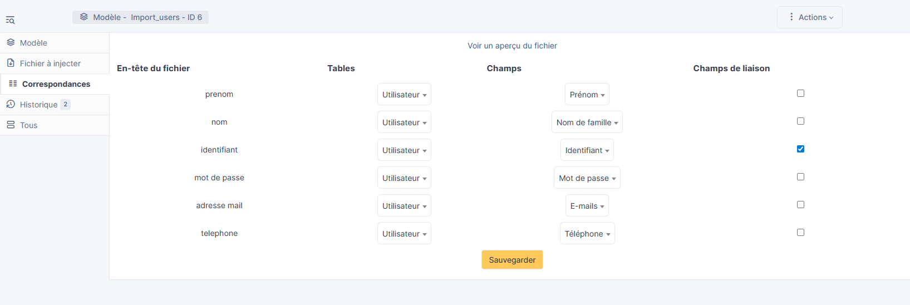
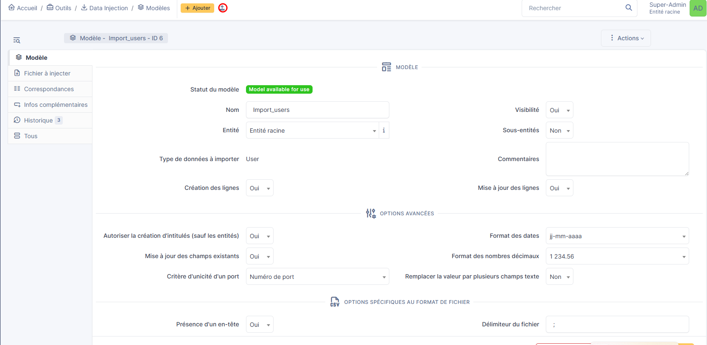
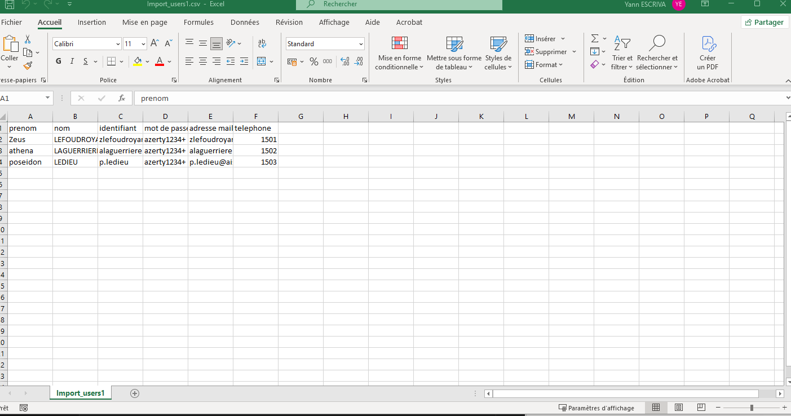
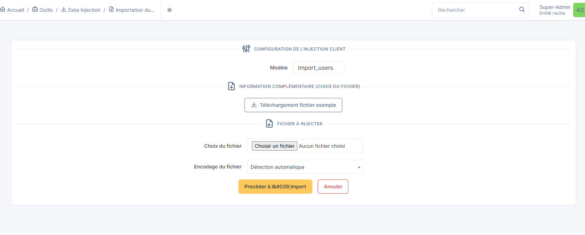

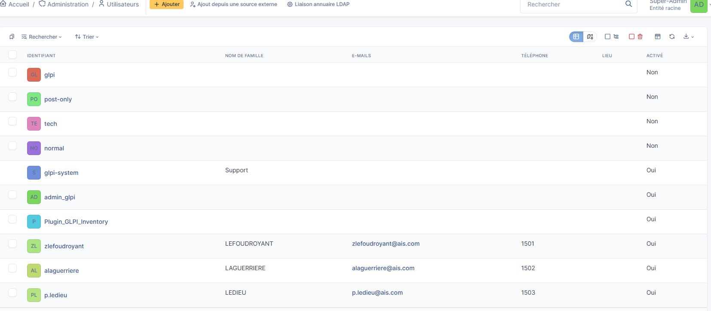

**Statut :** validé

### 12.6 Sauvegardes restaurables

**Objectif :**  
S’assurer que les données GLPI peuvent être sauvegardées et restaurées.

**Actions réalisées :**

J'ai effectué une sauvegarde de test :
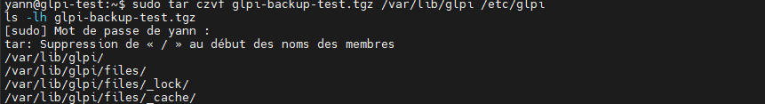

J’ai vérifié la présence de la sauvegarde ainsi que la cohérence de sa taille :
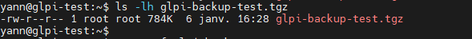

Enfin, j’ai effectué un test de restauration de cette sauvegarde dans un dossier temporaire.

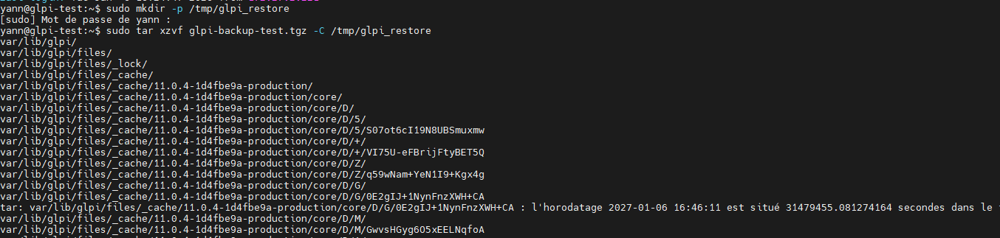
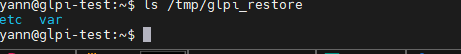

**Statut :** validé

Ces tests valident la capacité de restauration des données GLPI en cas
d’incident, conformément aux exigences du PRA

### 12.7 SSO : non implémenté (évolution prévue)

**Objectif :**
Étudier la faisabilité d’une authentification centralisée.

**État actuel :**

Non implémenté

**Justification :**
Cette évolution n’a pas été intégrée afin de préserver la stabilité
et la simplicité de l’architecture

### 12.8 Conclusion des tests

L’ensemble des fonctionnalités essentielles de GLPI ont été testées
et validées avec succès dans l’environnement de test.

**La plateforme est :**

* Fonctionnelle
* Sécurisée
* Conforme aux objectifs définis dans le DAT


## 13. Durcissement post-validation (FINAL)

Le durcissement de la plateforme est appliqué **après validation complète
du bon fonctionnement de GLPI** (tests fonctionnels, accès HTTPS,
LDAP, SMTP, sauvegardes).

Cette approche permet d’éviter tout blocage pendant les phases
d’installation et de tests.

### 13.1 Durcissement du système Debian

#### Désactivation de la connexion SSH root

```bash
sudo nano /etc/ssh/sshd_config
```

```ini
PermitRootLogin no
PasswordAuthentication no
```

```bash
sudo systemctl restart ssh
```

**Objectifs :**

* empêcher les connexions directes avec le compte root
* réduire les risques de compromission par force brute
* imposer l’utilisation de comptes nominaux

**Mise en place du pare-feu UFW**

```bash
sudo apt install ufw -y
sudo ufw default deny incoming
sudo ufw default allow outgoing
```

```bash
sudo ufw allow 22/tcp
sudo ufw allow 443/tcp
sudo ufw allow 636/tcp
sudo ufw allow 587/tcp
sudo ufw allow 161/udp
```

```bash
sudo ufw enable
```

**Objectifs :**

* limiter les flux réseau aux seuls services nécessaires 
* réduire la surface d’attaque du serveur

**Protection contre les attaques par force brute (Fail2ban)**

```bash
sudo apt install fail2ban -y
sudo systemctl enable fail2ban
sudo systemctl start fail2ban
```

**Objectifs :**

* bloquer automatiquement les tentatives de connexion abusives
* protéger les services SSH et Apache

### 13.2 Durcissement du serveur Apache

**Masquage des informations serveur**

```bash
sudo nano /etc/apache2/conf-available/security.conf
```

```ini
ServerTokens Prod
ServerSignature Off
```

```bash
sudo systemctl restart apache2
```

**Objectifs :**

* ne pas exposer la version d’Apache
* limiter les informations fournies aux clients et attaquants potentiels

### 13.3 Durcissement PHP / PHP-FPM

**Masquage de la version PHP exposée aux clients**

```bash
sudo nano /etc/php/8.4/fpm/php.ini
```

```ini
expose_php = Off
```

```bash
sudo systemctl restart php8.4-fpm
sudo systemctl restart apache2
```

**Objectif :**

* Empêcher l’exposition de la version PHP dans les en-têtes HTTP
* Sécurisation des cookies de session

```bash
session.cookie_httponly = On
session.cookie_samesite = Lax
```
(rappel et durcissement final des paramètres PHP-FPM validés précédemment)

**Objectifs :**

* Empêcher l’accès aux cookies via JavaScript
* Limiter les attaques XSS et CSRF

### 13.4 Sécurisation spécifique à GLPI

**Suppression du script d’installation**

```bash
sudo rm -f /var/www/glpi/install/install.php
```
(rappel de sécurité post-validation)

**Objectif :**

* empêcher toute réinstallation ou détournement de l’application
* Renforcement des permissions sur les fichiers GLPI

```bash
sudo chown -R www-data:www-data /var/www/glpi /etc/glpi /var/lib/glpi /var/log/glpi
sudo chmod -R 750 /var/www/glpi /etc/glpi /var/lib/glpi /var/log/glpi
```

**Objectifs :**

* limiter l’accès aux fichiers sensibles
* empêcher toute modification non autorisée

**Forcer l’utilisation du HTTPS**

Dans l’interface GLPI :

* Configuration > Générale > Sécurité
* Activation de l’obligation HTTPS
* Activation des cookies sécurisés

**Objectif :**

* garantir le chiffrement des sessions utilisateurs

### 13.5 Sécurisation de la base de données

* Utilisation d’un compte MariaDB dédié à GLPI
* Mot de passe fort
* Accès limité à localhost
* Aucun accès distant au compte root
* Sauvegardes régulières de la base de données

### 13.6 Journalisation et supervision

Les journaux suivants sont surveillés :

* Apache : /var/log/apache2/
* PHP-FPM : /var/log/php8.4-fpm.log
* GLPI : /var/log/glpi/

**Objectifs :**

* détection rapide des erreurs
* analyse des incidents et tentatives d’attaque

### 13.7 Politique de mises à jour

```bash
sudo apt install unattended-upgrades -y
sudo dpkg-reconfigure unattended-upgrades
```

**Objectif :**

* Appliquer automatiquement les correctifs de sécurité du système

### 13.8 Conclusion du durcissement

Le durcissement mis en place :

* Renforce significativement la sécurité du serveur et de GLPI
* Respecte les bonnes pratiques système et applicatives
* N’altère pas le fonctionnement validé de la plateforme
* Prépare l’environnement à une mise en production future


### 14. Table de correspondance DAT ↔ Procédure

| Exigence DAT              | Description DAT                                      | Section(s) Procédure |
|---------------------------|------------------------------------------------------|----------------------|
| Gestion de parc           | Inventaire matériel et logiciel                     | Sections 6, 12       |
| Helpdesk                  | Gestion des tickets et notifications                | Sections 9, 12       |
| Authentification LDAP/AD  | Centralisation des comptes utilisateurs              | Sections 12          |
| Sécurité HTTPS            | Accès sécurisé à l’application                      | Sections 10, 13      |
| Sécurité système          | Sécurisation du système et des services              | Sections 13     |
| Durcissement              | Renforcement post-validation de la sécurité          | Section 13           |
| Sauvegardes               | Sauvegarde BDD et fichiers applicatifs               | Sections 11, 12      |
| PRA                       | Reprise d’activité après incident                    | Section 11           |
| Supervision               | Disponibilité et surveillance du service             | Sections 7, 12       |


## 15. Conclusion

Procédure complète, conforme aux besoins du DAT, sécurisée et prête pour mise en production.


**Auteur :** ESCRIVA Yann

**Projet :** Décembre 2025