<p align="center">
  
</p>

# Procédure d’installation et de préparation de GLPI 11


## Sommaire

- [Procédure d’installation et de préparation de GLPI 11](#procédure-dinstallation-et-de-préparation-de-glpi-11)
  - [Sommaire](#sommaire)
  - [1. Présentation](#1-présentation)
    - [1.1 Objectifs](#11-objectifs)
  - [2. Prérequis](#2-prérequis)
    - [2.1 Matériel](#21-matériel)
    - [2.2 Logiciel](#22-logiciel)
    - [2.3 Réseau et flux](#23-réseau-et-flux)
  - [3. Préparation du serveur Debian 13](#3-préparation-du-serveur-debian-13)
    - [3.1 Mise à jour](#31-mise-à-jour)
    - [3.2 Durcissement de base](#32-durcissement-de-base)
  - [4. Installation de la stack LAMP](#4-installation-de-la-stack-lamp)
    - [4.1 Installation Apache, PHP-FPM et MariaDB](#41-installation-apache-php-fpm-et-mariadb)
    - [4.2 Installation des extensions PHP](#42-installation-des-extensions-php)
  - [5. Préparation de MariaDB](#5-préparation-de-mariadb)
    - [5.1 Sécurisation](#51-sécurisation)
    - [5.2 Création de la base GLPI](#52-création-de-la-base-glpi)
  - [6. Téléchargement et préparation de GLPI](#6-téléchargement-et-préparation-de-glpi)
    - [6.1 Téléchargement](#61-téléchargement)
    - [6.2 Préparation des répertoires et permissions](#62-préparation-des-répertoires-et-permissions)
  - [7. Configuration Apache pour GLPI](#7-configuration-apache-pour-glpi)
    - [7.1 VirtualHost complet](#71-virtualhost-complet)
    - [7.2 Activation et redémarrage](#72-activation-et-redémarrage)
  - [8. Configuration PHP-FPM](#8-configuration-php-fpm)
  - [9. Installation via l’interface web](#9-installation-via-linterface-web)
  - [10. Sécurisation post-installation](#10-sécurisation-post-installation)
  - [11. Sauvegardes et PRA](#11-sauvegardes-et-pra)
  - [12. Tests et validation](#12-tests-et-validation)
  - [13. Table de correspondance DAT ↔ Procédure](#13-table-de-correspondance-dat--procédure)
  - [14. Conclusion](#14-conclusion)


## 1. Présentation

### 1.1 Objectifs

Installer GLPI 11.04 sur Debian 13 en environnement de test, en respectant les besoins du DAT : gestion de parc, helpdesk, intégration LDAP, sécurité, supervision et stratégie de sauvegarde.

## 2. Prérequis

### 2.1 Matériel

* VM Proxmox
* 2 vCPU, 4 Go RAM, 50 Go SSD
* Partitionnement recommandé : `/` 15 Go, `/var` 10 Go, `/var/log` 5 Go, `/var/lib/mysql` 15 Go, `/home` 5 Go

### 2.2 Logiciel

* Debian 13
* Apache2
* MariaDB 10.11+
* PHP 8.4
* Extensions : php-mysqli, php-curl, php-gd, php-intl, php-ldap, php-zip, php-mbstring, php-xml

### 2.3 Réseau et flux

* IP fixe, DNS configuré
* Ports : 22 (SSH), 443 (HTTPS), 636 (LDAPS), 587 (SMTP), 161 (SNMP)

## 3. Préparation du serveur Debian 13

### 3.1 Mise à jour

```bash
sudo apt update && sudo apt upgrade -y
```

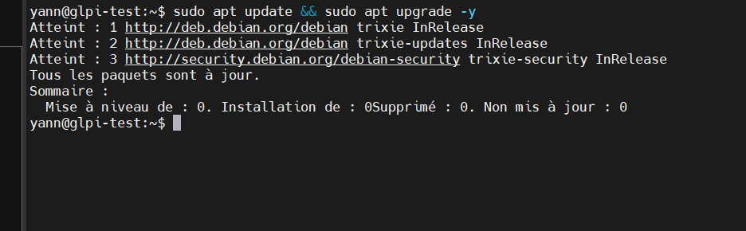

### 3.2 Durcissement de base

* Désactiver SSH root
* Authentification par clé
* Pare-feu UFW activé

## 4. Installation de la stack LAMP

### 4.1 Installation Apache, PHP-FPM et MariaDB

```bash
sudo apt install apache2 php8.4-fpm mariadb-server
```

### 4.2 Installation des extensions PHP

```bash
sudo apt install php8.4-{curl,gd,intl,mysql,zip,bcmath,mbstring,xml,bz2,ldap}
```

## 5. Préparation de MariaDB

### 5.1 Sécurisation

```bash
sudo mariadb-secure-installation
```

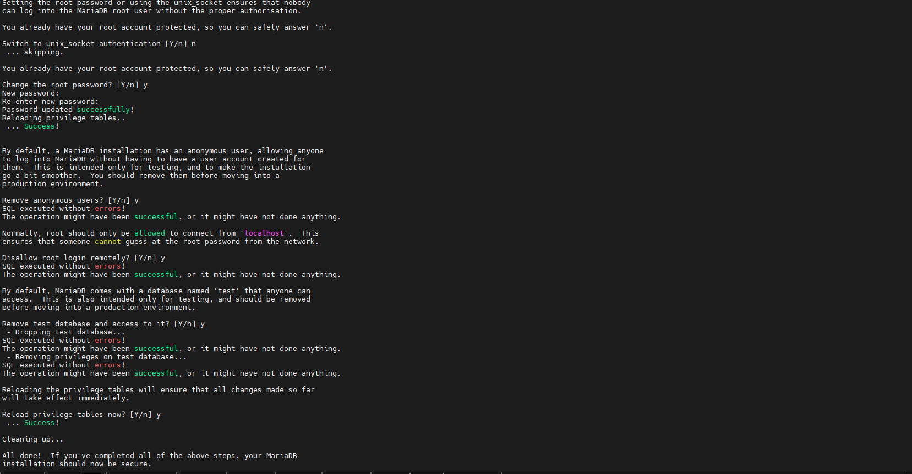

### 5.2 Création de la base GLPI

```sql
CREATE DATABASE dbyann_glpi;
GRANT ALL PRIVILEGES ON dbyann_glpi.* TO glpi_admin@localhost IDENTIFIED BY 'Monmotdepasse';
FLUSH PRIVILEGES;
EXIT;
```

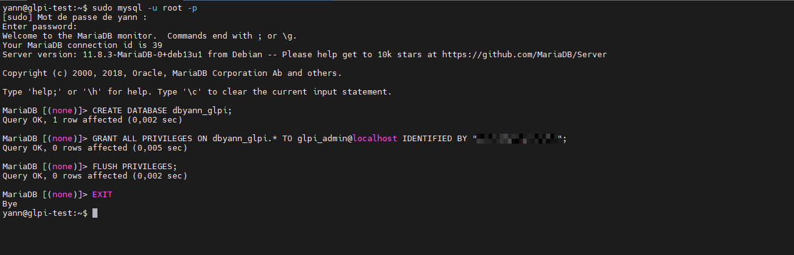

## 6. Téléchargement et préparation de GLPI

### 6.1 Téléchargement

```bash
cd /tmp
wget https://github.com/glpi-project/glpi/releases/download/11.0.4/glpi-11.0.4.tgz
sudo tar -xzvf glpi-11.0.4.tgz -C /var/www/
```

### 6.2 Préparation des répertoires et permissions

```bash
sudo chown www-data:www-data /var/www/glpi -R
sudo mkdir /etc/glpi /var/lib/glpi /var/log/glpi
sudo chown www-data:www-data /etc/glpi /var/lib/glpi /var/log/glpi
sudo mv /var/www/glpi/config /etc/glpi
sudo mv /var/www/glpi/files /var/lib/glpi
```

Créer fichiers de configuration :

```bash
sudo nano /var/www/glpi/inc/downstream.php
```

```php
<?php
define('GLPI_CONFIG_DIR', '/etc/glpi/');
if (file_exists(GLPI_CONFIG_DIR . '/local_define.php')) {
    require_once GLPI_CONFIG_DIR . '/local_define.php';
}
```

```bash
sudo nano /etc/glpi/local_define.php
```

```php
<?php
define('GLPI_VAR_DIR', '/var/lib/glpi/files');
define('GLPI_LOG_DIR', '/var/log/glpi');
```

## 7. Configuration Apache pour GLPI

### 7.1 VirtualHost complet

```bash
sudo nano /etc/apache2/sites-available/glpi_test.archeagglo.fr.conf
```

```apache
<VirtualHost *:80>
    ServerName glpi_test.archeagglo.fr

    DocumentRoot /var/www/glpi/public

    # Alias optionnel
    # Alias "/glpi" "/var/www/glpi/public"

    <Directory /var/www/glpi/public>
        Require all granted

        RewriteEngine On
        RewriteCond %{HTTP:Authorization} ^(.+)$
        RewriteRule .* - [E=HTTP_AUTHORIZATION:%{HTTP:Authorization}]

        RewriteCond %{REQUEST_FILENAME} !-f
        RewriteRule ^(.*)$ index.php [QSA,L]
    </Directory>
</VirtualHost>
```

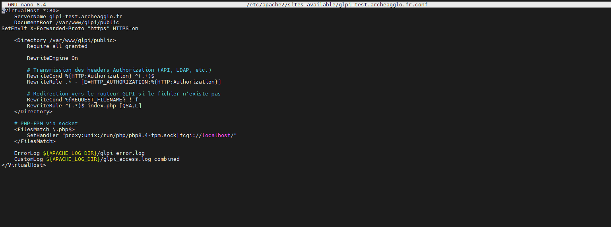

### 7.2 Activation et redémarrage

```bash
sudo a2ensite glpi.test.archeagglo.fr.conf
sudo a2dissite 000-default.conf
sudo a2enmod rewrite proxy_fcgi setenvif
sudo systemctl restart apache2
```

## 8. Configuration PHP-FPM

```bash
sudo nano /etc/php/8.4/fpm/php.ini
```

```ini
session.cookie_httponly = on
session.cookie_samesite = Lax
```

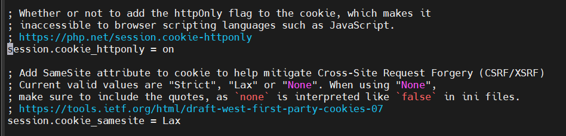

Redémarrage PHP-FPM :

```bash
sudo systemctl restart php8.4-fpm
```

Pour terminer, il est nécessaire d’adapter le VirtualHost Apache afin d’indiquer que le traitement des fichiers PHP doit être assuré par PHP-FPM.

Cette configuration permet à Apache2 de transmettre l’exécution des fichiers .php au socket PHP-FPM dédié.

Éditez le fichier glpi_test.archeagglo.fr.conf et ajoutez la configuration suivante

```bash
<FilesMatch \.php$>
    SetHandler "proxy:unix:/run/php/php8.4-fpm.sock|fcgi://localhost/"
</FilesMatch>
```

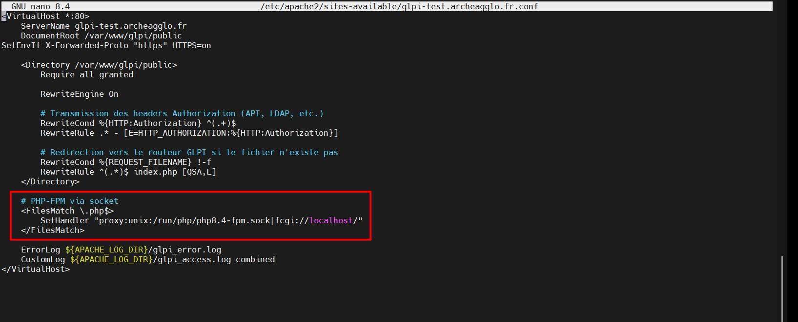

Quand c'est fait, relancer Apache2

```bash
sudo systemctl restart apache2
```

La configuration est maintenant terminée. Il ne reste plus qu’à lancer l’installation de GLPI via l’interface web.

## 9. Installation via l’interface web

* Vérifier prérequis
* Configurer BDD `dbyann_glpi` / utilisateur `glpi_admin`
* Créer compte administrateur
* Supprimer `/install`

```bash
sudo rm /var/www/glpi/install/install.php
```


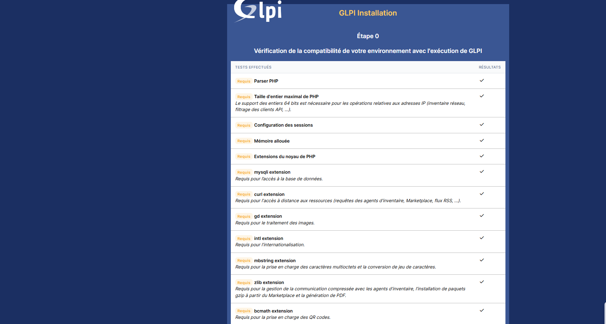

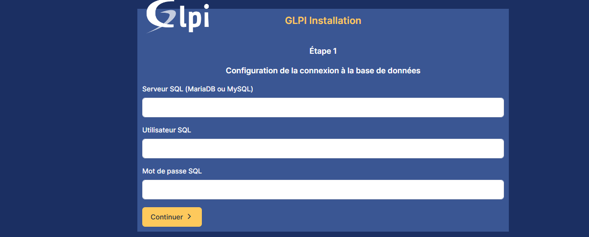

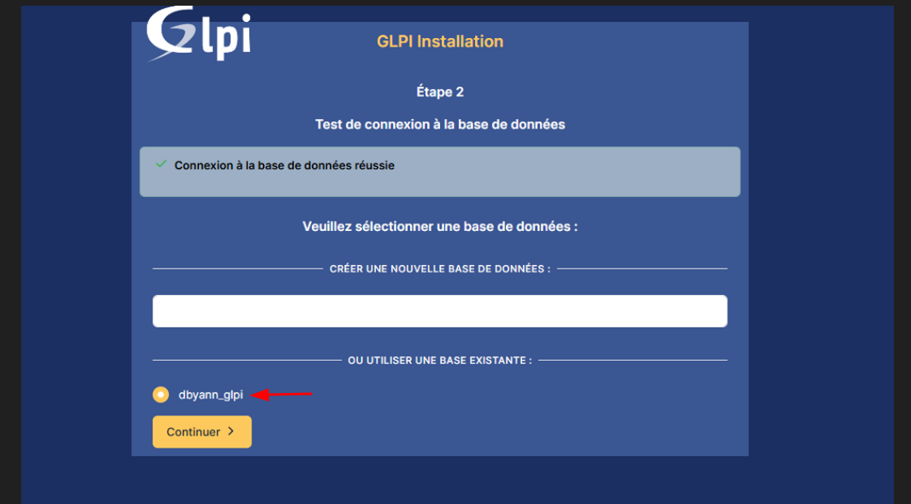
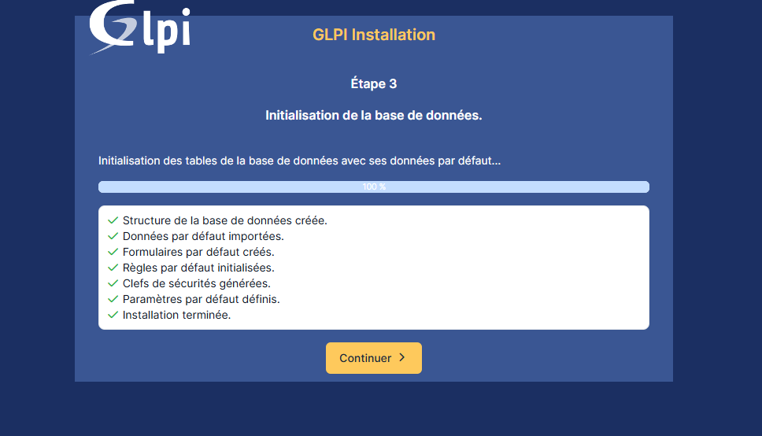
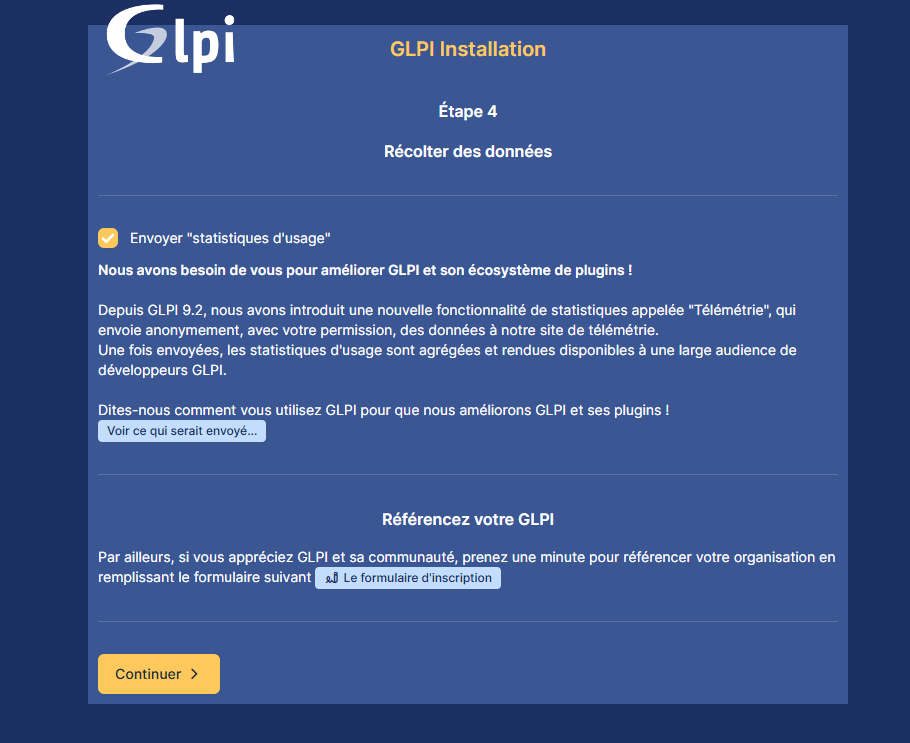
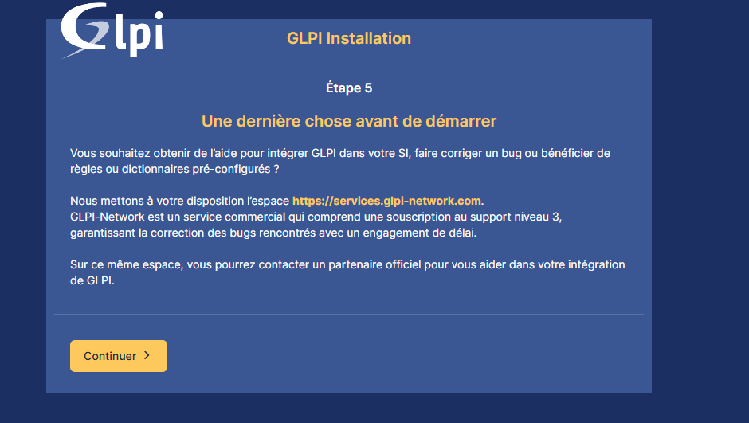
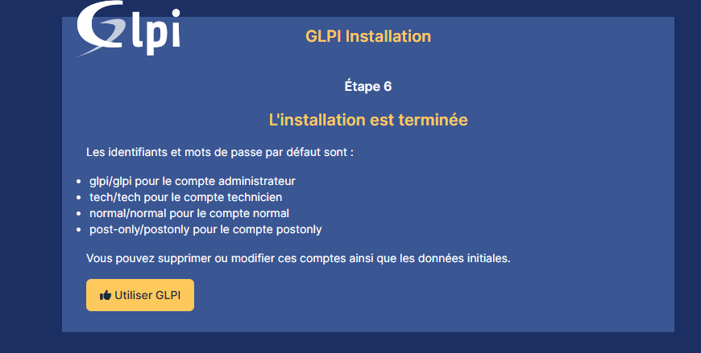

## 10. Sécurisation post-installation

* HTTPS (Let's Encrypt en production)
* SSH restreint / clé
* Fail2ban
* Mises à jour régulières

## 11. Sauvegardes et PRA

* Dump quotidien MariaDB
* Backup répertoires `/etc/glpi` et `/var/lib/glpi`
* Snapshots VM Proxmox
* Rétention 30 jours
* Stratégie 3-2-1

## 12. Tests et validation

* Vérifier accès HTTPS
* Authentification LDAP
* Envoi notifications SMTP
* Création et gestion tickets
* Ajout équipements
* Sauvegardes restaurables

## 13. Table de correspondance DAT ↔ Procédure

| Exigence DAT        | Section Procédure |
| ------------------- | ----------------- |
| Gestion de parc     | Sections 6, 12    |
| Helpdesk            | Sections 9, 12    |
| Authentification AD | Section 13.2      |
| Sécurité HTTPS      | Section 10        |
| Sauvegardes         | Section 11        |
| PRA                 | Section 11        |
| Supervision         | Section 12        |
| Sécurité système    | Sections 3.2, 8   |

## 14. Conclusion

Procédure complète, conforme aux besoins du DAT, sécurisée et prête pour mise en production.

**Auteur :** ESCRIVA Yann

**Projet :** Décembre 2025