<p align="center">
  
</p>

# Procédure pour installation de GLPI 11 sur Débian 13

### Sommaire

1. Présentation
2. Les Prérequis d'installation
3. Préparation du serveur
  * Installation du socle LAMP (Linux, Apache, MariaDB, PHP)
  * Préparation de la base de donnée MariaDB
  * Télécharger GLPI 11.04
  * Préparation de GLPI
  * Configurer Apache 2 pour GLPI
  * Utiliser PHP8.4-FPM qui est la dernière version recommandé pour Apache2
4. Installation de GLPI 
5. Conclusion

### 1. Présentation

Afin de faire cette procédure d'installation de GLPI 11.04 qui est la dernière version en date, je vais l'installer sur une machine Debian 13. GLPI est un logiciel libre de gestion de parc informatique. Il permet la gestion du support informatique grace à un système de tickets, ainsi que l'inventaire des équipements informatiques (postes de travail, téléphones, imprimantes, licences etc). Créé en 2003 et maintenu par l'éditeur français Teclib, GLPI est une solution open source gratuite pouvant ètre installée sur un serveur interne ou utilisée pour la gestion du support de clients.

Une offre optionnelle, **GLPI Network**, est également proposé par l'éditeur. Elle peut ètre déployée sur site ou en mode cloud et permet de bénéficier de fonctionnalités supplémentaires et d'un support avancé.

### 2. Les prérequis d'installation

Avant de passer à l’installation, il est nécessaire de vérifier les prérequis. GLPI fonctionne avec un serveur web, PHP et une base de données. Même s’il peut être installé sur Windows Server avec IIS, une installation sous Linux est recommandée. GLPI est compatible avec plusieurs serveurs web comme Apache2, Nginx ou IIS.

Pour GLPI 11, la version minimale requise est PHP 8.2, ainsi qu’une base de données MySQL (8.0 minimum) ou MariaDB (10.6 minimum). Certaines extensions PHP sont également nécessaires au bon fonctionnement de l’application.

Dans cette procédure, l’installation sera réalisée sur une machine Debian 13 avec Apache2, PHP 8.4 et MariaDB, versions disponibles dans les dépôts Debian.

Pour plus d’informations, la documentation officielle de GLPI peut être consultée. https://github.com/glpi-project/glpi

### 3. Préparation du serveur

L’installation débute par la mise à jour des paquets du système sur la machine Debian 13. Il est également nécessaire de configurer l’adresse IP, le nom d’hôte et, si besoin, l’enregistrement DNS associé à l’application.

Etape suivante en pratique: 

```bash
sudo apt update && sudo apt upgrade -y
```

### Installation du socle LAMP

La première étape consiste à installer les composants du socle LAMP nécessaires au fonctionnement de GLPI : Linux, Apache2, MariaDB et PHP.

Sous Debian 13, PHP 8.4 est disponible par défaut dans les dépôts officiels. Dans cette procédure, PHP sera utilisé via PHP-FPM, afin d’améliorer les performances par rapport au module PHP intégré à Apache.

L’installation débute par la mise en place des paquets principaux :

```bash
sudo apt install apache2 php8.4-fpm mariadb-server
```

Ensuite, les extensions PHP nécessaires au bon fonctionnement de GLPI seront installées, celles-ci n’étant pas incluses dans le paquet php8.4-common.

```bash
sudo apt install php8.4-{curl,gd,intl,mysql,zip,bcmath,mbstring,xml,bz2}
```

   * **curl** : permet à GLPI de communiquer avec des services externes, comme le téléchargement de plugins depuis la marketplace ou la récupération de flux distants.

   * **gd** : sert au traitement des images, notamment pour l’affichage ou la génération d’éléments graphiques dans l’interface.

   * **intl** : gère les paramètres régionaux, tels que les formats de date, de nombre et les langues, afin d’assurer une bonne internationalisation de l’application.

   * **mysql** : assure la connexion entre GLPI et la base de données MySQL ou MariaDB pour le stockage et l’accès aux données.

   * **zlib** : utilisée pour la compression et la décompression des fichiers, notamment lors de l’utilisation de la marketplace et pour la génération de documents.

   * **bcmath** : fournit des fonctions de calcul précis, nécessaires entre autres à la génération des QR codes.

   * **mbstring** : permet la gestion correcte des caractères multioctets, indispensable pour le support de l’UTF-8 et la compatibilité avec plusieurs langues.

   * **xml** (dom, simplexml, xmlreader, xmlwriter) : fournit les outils nécessaires à la lecture et au traitement des fichiers XML utilisés par certaines fonctionnalités de GLPI.

   * **openssl** : permet l’utilisation de connexions sécurisées, comme le HTTPS ou l’authentification via des services externes.

   * **bz2** : utilisée pour la gestion des fichiers compressés nécessaires au bon fonctionnement de la marketplace GLPI.

Ces commandes permettent d’installer les extensions PHP requises pour PHP 8.4.

L’extension LDAP est uniquement nécessaire si GLPI doit être connecté à un annuaire, comme Active Directory. Dans le cas contraire, son installation peut être réalisée ultérieurement si le besoin se présente.

```bash
sudo apt install php8.4-ldap
```

L’installation de Apache2, MariaDB, PHP et de toutes les extensions nécessaires est maintenant terminée.

### Préparation de la base de donnée

Nous allons préparer MariaDB pour héberger la base de données de GLPI.
La première étape consiste à exécuter la commande suivante afin de réaliser les réglages de sécurité de base de MariaDB.

```bash
sudo mariadb-secure-installation
```

Ensuite, nous allons créer une base de données dédiée pour GLPI, accessible via un utilisateur spécifique.
Il est important de ne pas utiliser le compte root de MariaDB et d’appliquer le principe du moindre privilège : une base = un utilisateur.

Connectez-vous à votre instance MariaDB avec la commande suivante :

```bash
sudo mysql -u root -p
```

Saisissez le mot de passe root de MariaDB défini précédemment.

Ensuite, exécutez les requêtes SQL suivantes pour créer la base de données dbyann_glpi et l’utilisateur glpi_admin avec son mot de passe (à personnaliser).
Cet utilisateur disposera de tous les droits sur cette base, et uniquement sur celle-ci.

```bash
CREATE DATABASE dbyann_glpi;
GRANT ALL PRIVILEGES ON dbyann_glpi.* TO glpi_admin@localhost IDENTIFIED BY "*Militaire26100@";
FLUSH PRIVILEGES;
EXIT
```

### Télécharger GLPI 11.04

L’étape suivante consiste à télécharger l’archive .tgz contenant les fichiers d’installation de GLPI.
Depuis le dépôt GitHub officiel de, récupérez le lien correspondant à la dernière version disponible.

* https://github.com/glpi-project/glpi/releases/

```bash
cd /tmp
wget https://github.com/glpi-project/glpi/releases/download/11.0.4/glpi-11.0.4.tgz
```

Si le wget n'est pas installé, faire un : 

```bash
sudo apt install wget
```
Ensuite, exécutez la commande suivante afin de décompresser l’archive .tgz dans le répertoire /var/www/.
Les fichiers de GLPI seront alors accessibles via le chemin /var/www/glpi.

```bash
sudo tar -xzvf glpi-11.0.4.tgz -C /var/www/
```

### Préparation de GLPI

Nous allons maintenant préparer l’installation de GLPI 11 en créant les répertoires nécessaires et en configurant les permissions.

Dans un premier temps, l’utilisateur www-data (utilisé par Apache2 sous Debian/Ubuntu) sera défini comme propriétaire des fichiers GLPI.

```bash
sudo chown www-data /var/www/glpi/ -R
```

Ensuite, plusieurs répertoires doivent être créés afin de déplacer certaines données en dehors de la racine web /var/www/glpi. Cette organisation permet de renforcer la sécurité de l’installation, conformément aux recommandations de l’éditeur.

Répertoire /etc/glpi
Ce répertoire est destiné à accueillir les fichiers de configuration de GLPI. Des droits d’accès sont accordés à l’utilisateur www-data afin de permettre à l’application d’y accéder correctement.

```bash
sudo mkdir /etc/glpi
sudo chown www-data /etc/glpi/
```

Ensuite, le répertoire sensible config de GLPI est déplacé vers /etc/glpi afin de le sortir de la racine web :

```bash
sudo mv /var/www/glpi/config /etc/glpi
```

* Le répertoire /var/lib/glpi

Répétons la même opération avec la création du répertoire /var/lib/glpi :

```bash
sudo mkdir /var/lib/glpi
sudo chown www-data /var/lib/glpi/
```

Dans lequel nous déplaçons également le dossier files qui contient la majorité des fichiers de GLPI : CSS, plugins, etc.

```bash
sudo mv /var/www/glpi/files /var/lib/glpi
```

* Répertoire /var/log/glpi

Cette dernière étape consiste à créer le répertoire /var/log/glpi, destiné au stockage des journaux (logs) de GLPI.
Comme précédemment, les droits nécessaires sont attribués à l’utilisateur www-data afin de permettre le bon fonctionnement de l’application.

```bash
sudo mkdir /var/log/glpi
sudo chown www-data /var/log/glpi
```

Aucun déplacement de fichiers n’est nécessaire dans ce répertoire.

* Création des fichiers de configuration

Il faut maintenant configurer GLPI pour lui indiquer l’emplacement des nouveaux répertoires créés.
Le premier fichier de configuration sera créé à cette étape.

```bash
sudo nano /var/www/glpi/inc/downstream.php
```

Nous allons maintenant renseigner le fichier de configuration afin d’indiquer à GLPI l’emplacement du répertoire /etc/glpi.
Insérez le contenu suivant dans le fichier :

```bash
<?php
define('GLPI_CONFIG_DIR', '/etc/glpi/');
if (file_exists(GLPI_CONFIG_DIR . '/local_define.php')) {
    require_once GLPI_CONFIG_DIR . '/local_define.php';
}
```

Une fois ce fichier configuré, créez un second fichier de configuration avec la commande suivante :

```bash
sudo nano /etc/glpi/local_define.php
```

```bash
<?php
define('GLPI_VAR_DIR', '/var/lib/glpi/files');
define('GLPI_LOG_DIR', '/var/log/glpi');
```

GLPI permet de définir d’autres variables pour personnaliser l’emplacement de différents répertoires. À titre d’exemple, la variable **GLPI_CACHE_DIR** peut être utilisée pour spécifier un répertoire dédié au cache.

Cette étape de configuration est maintenant terminée.

### Configurer Apache 2 pour GLPI

La configuration du serveur web Apache2 passe par la création d’un VirtualHost spécifique à GLPI.

Pour cet environnement de test, le fichier de configuration utilisé est glpi.test.archeagglo.fr.conf, correspondant au nom de domaine glpi.test.archeagglo.fr, choisi pour accéder à l’application.

L’utilisation d’un nom de domaine dédié, même en interne, permet de structurer les environnements et facilite par la suite la mise en place d’une connexion sécurisée via HTTPS.

```bash
sudo nano /etc/apache2/sites-available/glpi.test.archeagglo.conf
```

```bash
<VirtualHost *:80>
    ServerName glpi.test.archeagglo.fr

    DocumentRoot /var/www/glpi/public

    # If you want to place GLPI in a subfolder of your site (e.g. your virtual host is serving multiple applications),
    # you can use an Alias directive. If you do this, the DocumentRoot directive MUST NOT target the GLPI directory itself.
    # Alias "/glpi" "/var/www/glpi/public"

    <Directory /var/www/glpi/public
        Require all granted

        RewriteEngine On

        # Ensure authorization headers are passed to PHP.
        # Some Apache configurations may filter them and break usage of API, CalDAV, ...
        RewriteCond %{HTTP:Authorization} ^(.+)$
        RewriteRule .* - [E=HTTP_AUTHORIZATION:%{HTTP:Authorization}]

        # Redirect all requests to GLPI router, unless file exists.
        RewriteCond %{REQUEST_FILENAME} !-f
        RewriteRule ^(.*)$ index.php [QSA,L]

    </Directory>
</VirtualHost>
```

Une fois la configuration terminée, enregistrez le fichier.

Il est ensuite nécessaire d’activer ce nouveau VirtualHost au sein d’Apache2 à l’aide de la commande suivante :

```bash
sudo a2ensite glpi.test.archeagglo.fr.conf
```

Par la même occasion, le site configuré par défaut dans Apache2 est désactivé, celui-ci n’étant pas nécessaire.

```bash
sudo a2dissite 000-default.conf
```

Le module rewrite d’Apache doit également être activé. Il est indispensable au fonctionnement des règles de réécriture définies dans le fichier de configuration du VirtualHost, notamment via les directives RewriteCond et RewriteRule.

```bash
sudo a2enmod rewrite
```

Il ne reste plus qu'à redémarrer le service Apache2

```bash
sudo systemctl restart apache2
```


* A. Installer le socle LAMP (Linux, Apache, MariaDB, PHP)
* B. Préparer une base de donnée pour GLPI
* C. Télécharger GLPI
* D. Préparer l'installation
* E. Configurer Apache2 pour GLPI
* F. Utiliser PHP8.4-FPM avec Apache 2 (dernière version en date compatible Apache 2)
* IV. Installation de GLPI
* V. Conclusion

**I. Présentation**

**GLPI** est un logiciel libre de **gestion de parc informatique** permettant d'avoir une solution de ticketing gratuite pour le support informatique, de gérer l'inventaire des équipements, notamment les ordinateurs et les téléphones, de gérer ses contrats, ses licences, ses consommables, ses baies serveurs, etc.... Créé en 2003, GLPI est une solution populaire utilisée par des milliers d'entreprises et maintenue par un éditeur français nommé Teclib.

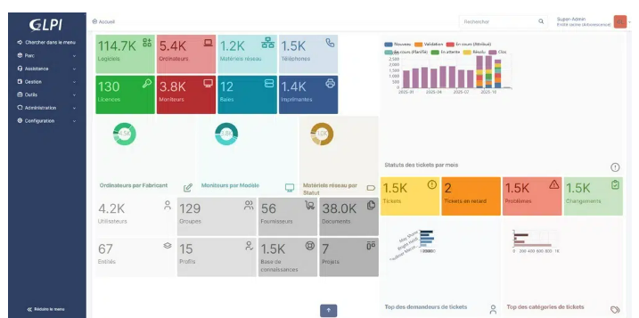

**II. Préréquis de GLPI**

Avant d'évoquer l'installation, parlons des prérequis. GLPI a besoin d'**un serveur Web, de PHP et d'une base de données** pour fonctionner. Bien que l'installation de GLPI soit possible sur Windows Server via IIS, l'installation sur Linux est recommandée. D'une façon générale, GLPI supporte **plusieurs serveurs Web** : Apache2, Nginx, lighttpd et IIS.

Pour l'**installation** de GLPI, nous avons besoin de :

* **Version de PHP** : au minimum **PHP 8.2** pour GLPI 11.
* Base de données
  * MySQL 8.0 minimum
  * MariaDB 10.6 minimum

Il y aura également plusieurs extensions PHP à installer pour que GLPI puisse fonctionner.

III. **Préparer le sereveur pour installer GLPI**

Commençons par l'installation par une **mise à jour des paquets sur la machine Debian 13**. Bien Penser également à lui attribuer une adresse IP, un nom d'hôte (avec un enregistrement DNS pour notre application) et à effectuer la configuration du système.

La suite des opérations s'effectue directement depuis le Terminal :

```bash
sudo apt update && sudo apt upgrade
```

**A. Installer le socle LAMP**

La première grande étape consiste à installer les paquets du socle LAMP : **Linux Apache2 MariaDB PHP**. Sous **Debian 13 Trixie** qui est la dernière version majeure stable de Debian, **PHP 8.4** est distribué par défaut dans les dépôts officiels. Il est à noter que l'intégration de PHP sera effectuée via PHP-FPM plutôt que l'extension PHP pour Apache, pour des raisons de performance.

Commençons par installer les trois paquets principaux :

```bash
sudo apt-get install apache2 php8.4-fpm mariadb-server
```

Puis, nous allons installer toutes les extensions nécessaires au bon fonctionnement de GLPI et qui ne sont pas intégrées au paquet **php8.4-common.**

```bash
sudo apt install php8.4-{curl,gd,intl,mysql,zip,bcmath,mbstring,xml,bz2}
```

Voici, à titre d'information, le rôle de chaque extension installée :

* **curl** : utilisée pour accéder à des ressources distantes (marketplace, flux RSS, etc.).
* **gd** : permet la manipulation et la génération d’images.
* **intl** : fournit les fonctions d’internationalisation (formats, locale, conversions…).
* **mysql** : gère la connexion et les opérations avec une base de données MySQL/MariaDB.
* `**zlib**` : nécessaire pour la compression/décompression, notamment pour les paquets gzip du marketplace et la génération de PDF.
* **bcmath** : utilisé pour générer des QR codes (calculs de précision arbitraire).
* **mbstring** : indispensable pour la gestion des chaînes de caractères multioctets (UTF-8, conversions, compatibilité internationale).
* **xml** (inclut **dom**, **simplexml**, **xmlreader**, **xmlwriter**) : fournit les outils nécessaires au traitement XML utilisés par diverses fonctions de l’application.
* **openssl** : permet la communication chiffrée (connexion HTTPS, authentification OAuth 2.0, etc.).
* **bz2** : pour le bon fonctionnement de la marketplace.

Ces commandes vont permettre de récupérer les versions de ces extentions pour php 8.4

Pour associer GLPI avec un annuaire LDAP comme active directory, on doit installer l'extention LDAP de PHP, sinon sinon ce n'est pas nécessaire

```bash
sudo apt install php8.4-ldap
```

Nous venons d'installer Apache2, MariaDB, PHP et un ensemble d'extensions.

**B. Préparer une base de données pour GLPI**

Nous allons préparer MariaDB afin qu'il puisse héberger la base de données de GLPI, La première action à effectuer, c'est d'exécuter la commande ci-dessous pour **effectuer le minimum syndical en matière de sécurisation de MariaDB**

```bash
sudo mariadb-secure-installation
#  Si vous utilisez MySQL : 
sudo mysql_secure_installation
```

Ensuite, nous allons changer le mot de passe root, supprimer les utilisateurs anonnymes et désactiver l'accès root à distance.

Ci dessous un exemple de bonne configuration.

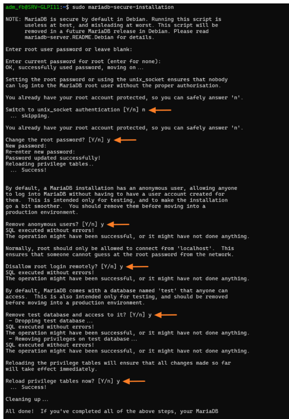

Ensuite, nous allons créer **une base de données dédiée pour GLPI** et celle-ci sera accessible par **un utilisateur dédié**. Hors de question d'utiliser le compte root de MariaDB : appliquons le principe de moindre privilège. Donc : une base de données = un utilisateur.

Se connecter à l'instance MariaDB: 

```bash
sudo mysql -u root -p
```

Saisir le mot de passe root qu'on vient de définir à l'étape précédente.

```bash
CREATE DATABASE **db25_glpi**;
GRANT ALL PRIVILEGES ON **db25_glpi**.* TO **glpi_adm**@localhost IDENTIFIED BY "**MotDePasseRobuste**"; FLUSH PRIVILEGES;
EXIT
```

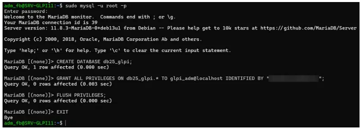

**C. Télécharger GLPI**

Maintenant, nous allons télécharger l'archive **".tgz"** qui contient les sources d'installation de GLPI. À partir du **GitHub de GLPI**, récupérez le lien vers la dernière version. Ici, c'est la version **GLPI 11.0.4** qui est installée.

* [https://github.com/glpi-project/glpi/releases/](https://github.com/glpi-project/glpi/releases/)

l'archive sera téléchargé dans le répertoire `/tmp` :

```bash
cd /tmp 
wget https://github.com/glpi-project/glpi/releases/download/11.0.4/glpi-11.0.4.tgz
```

Ensuite, nous allons exécuter la commande ci-dessous pour **décompresser l'archive .tgz dans le répertoire** `/var/www/`, ce qui donnera le chemin d'accès `/var/www/glpi` pour GLPI.

```bash
sudo tar -xzvf glpi-11.0.4.tgz -C /var/www/
```

**D. Préparer l'installation**

Nous allons préparer l'**installation de GLPI 11** via la création de plusieurs répertoires et la personnalisation des permissions.

Tout d'abord, nous allons définir l'utilisateur `www-data` correspondant à **Apache2** (sur Debian/Ubuntu), en tant que **propriétaire** sur les fichiers GLPI.

```bash
sudo chown www-data /var/www/glpi/ -R
```

Ensuite, nous allons devoir **créer plusieurs dossiers** et sortir des données de la racine Web (/var/www/glpi) de manière à les stocker dans les nouveaux dossiers que nous allons créer. Ceci va permettre de faire une **installation sécurisée de GLPI, qui suit les recommandations de l'éditeur.**

* Le répertoire `/etc/glpi`

Commencez par **créer le répertoire** `/etc/glpi` qui va recevoir les fichiers de configuration de GLPI. Nous donnons des autorisations à `www-data` sur ce répertoire car il a besoin de pouvoir y accéder.

```bash
sudo mkdir /etc/glpi
sudo chown www-data /etc/glpi/
```

Puis nous allons déplacerle répertoire sensible config de GLPI vers ce nouveau dossier:

```bash
sudo mv /var/www/glpi/config /etc/glpi
```

* **Le répertoire**  `/var/lib/glpi`:

Répétons la même opération avec la création du répertoire `/var/lib/glpi`:

```bash
sudo mkdir /var/lib/glpi
sudo chown www-data /var/lib/glpi/
```

Dans lequel nous déplaçons également le dossier files qui contient la majorité des fichiers de GLPI : CSS, plugins, etc.

```bash
sudo mv /var/www/glpi/files /var/lib/glpi
```

* **Le répertoire** `/var/log/glpi`

erminons par la création du répertoire `/var/log/glpi` destiné à stocker les journaux de GLPI. Toujours sur le même principe :

```bash
sudo mkdir /var/log/glpi
sudo chown www-data /var/log/glpi
```

* **Créer les fichiers de configuration**

Nous allons déclarer les nouveaux répertoires fraichement créés. Nous allons créer ce premier fichier :

```bash
sudo nano /var/www/glpi/inc/downstream.php
```

Afin d'ajouter le contenu ci-dessous qui indique le chemin vers le **répertoire de configuration**:

```bash
<?php
define('GLPI_CONFIG_DIR', '/etc/glpi/');
if (file_exists(GLPI_CONFIG_DIR . '/local_define.php')) {
    require_once GLPI_CONFIG_DIR . '/local_define.php';
}
```

Ensuite, nous allons créer ce second fichier :

```bash
sudo nano /etc/glpi/local_define.php
```

Afin d'ajouter le contenu ci-dessous permettant **de déclarer deux variables** permettant de préciser les chemins vers **les répertoires files et log**. Pour rappel, ces deux répertoires ont été préparés précédemment.

```bash
<?php
define('GLPI_VAR_DIR', '/var/lib/glpi/files');
define('GLPI_LOG_DIR', '/var/log/glpi');
```

GLPI prend en charge de nombreuses variables pour personnaliser l'emplacement des répertoires, bien au-delà des deux variables spécifiées ci-dessus. Par exemple, la variable `GLPI_CACHE_DIR` sert à spécifier un emplacement personnalisé pour le stockage du cache.

Voilà, cette étape est terminée.

**E. Configurer Apache2 pour GLPI**

Passons à la configuration du serveur web Apache2. Nous allons créer un nouveau fichier de configuration qui va permettre de configurer le VirtualHost dédié à GLPI. Dans mon cas, le fichier s'appelle `support.it-connectlab.fr.conf` en référence au nom de domaine choisi pour accéder à GLPI : `support.it-connectlab.fr`. L'idéal étant d'avoir un nom de domaine (même interne) pour accéder à GLPI afin de pouvoir positionner un certificat TLS/SSL par la suite.

```bash
sudo nano /etc/apache2/sites-available/support.it-connectlab.fr.conf
```

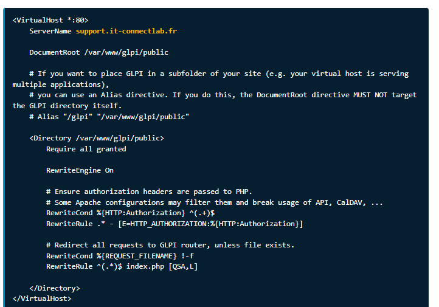
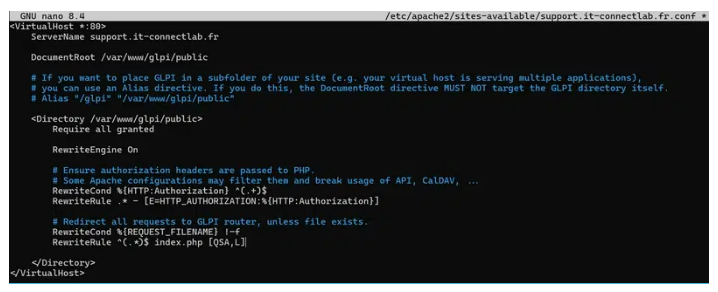

Puis, nous allons **activer ce nouveau site dans Apache2**:

```bash
sudo a2ensite support.it-connectlab.fr.conf
```

Nous en profitons également pour désactiver le site par défaut car il est inutile :

```bash
sudo a2dissite 000-default.conf
```

Nous allons aussi **activer le module** `rewrite` (nécessaire pour activer la prise en charge des règles de réécriture) car nous l'avons utilisé dans le fichier de configuration du VirtualHost (via les directives `RewriteCond` / `RewriteRule`).

```bash
sudo a2enmod rewrite
```

Il ne reste plus qu'à **redémarrer le service Apache2**:

```bash
sudo systemctl restart apache2
```

**F. Utiliser PHP8.4-FPM avec Apache2**

Pour utiliser PHP en tant que moteur de scripts avec Apache2, il y a deux possibilités : **utiliser le module PHP pour Apache2 (libapache2-mod-php8.4) ou utiliser PHP-FPM**. Il est **recommandé d'utiliser PHP-FPM** car il est plus performant et se présente comme un service indépendant. Dans l'autre mode, chaque processus Apache2 exécute son propre moteur de scripts PHP.

Pour rappel, nous avons déjà fait le choix d'utiliser PHP-FPM : le paquet `php8.4-fpm` a été installé précédemment, au même moment que ceux pour Apache2 et MariaDB. Néanmoins, nous devons configurer l'intégration de PHP-FPM avec Apache.

Commençons par activer deux modules dans Apache et la configuration de PHP-FPM, avant de recharger Apache2 :

```bash
sudo a2enmod proxy_fcgi setenvif
sudo a2enconf php8.4-fpm
sudo systemctl reload apache2
```

Pour configurer PHP-FPM pour Apache2, nous n'allons pas éditer le fichier /etc/php/8.4/apache2/php.ini. À la place, le fichier que vous devez éditer est celui-ci :

```bash
sudo nano /etc/php/8.4/fpm/php.ini
```

Dans ce fichier, recherchez l'option `session.cookie_httponly` (CTRL+W avec nano) et indiquez la valeur on pour l'activer, afin de protéger les cookies de GLPI.

```bash
; Whether or not to add the httpOnly flag to the cookie, which makes it
; inaccessible to browser scripting languages such as JavaScript.
; https://php.net/session.cookie-httponly
session.cookie_httponly = on
```

Toujours pour renforcer la sécurité, configurez la directive `session.cookie_samesite` avec la valeur Lax conseillée par la documentation de GLPI. Elle contrôle la façon dont le navigateur envoie le cookie de session, ce qui bloque notamment certaines **attaques CSRF** (Cross-Site Request Forgery).

```bash
; Add SameSite attribute to cookie to help mitigate Cross-Site Request Forgery (CSRF/XSRF)
; Current valid values are "Strict", "Lax" or "None". When using "None",
; make sure to include the quotes, as `none` is interpreted like `false` in ini files.
; https://tools.ietf.org/html/draft-west-first-party-cookies-07
session.cookie_samesite = Lax
```

Enregistrez le fichier quand c'est fait. Par la suite, vous pourriez être amené à effectuer d'autres modifications, notamment pour augmenter la taille des uploads sur GLPI (`upload_max_filesize` limité à 2 Mo par défaut), etc. Je pense aussi à la directive `session.cookie_secure` que nous passerons sur `on` une fois GLPI accessible en HTTPS.

Pour appliquer les modifications, nous devons redémarrer PHP-FPM :

```bash
sudo systemctl restart php8.4-fpm.service
```

Pour finir, nous allons modifier le virtualHost pour dire à Apache que PHP-FPM doit ètre utilisé pour les fichiers PHP. Editez le fichier `support.it-connectlab.fr.conf` pour ajouter ceci:

```bash
<FilesMatch \.php$>
    SetHandler "proxy:unix:/run/php/php8.4-fpm.sock|fcgi://localhost/"
</FilesMatch>
```

Ci dessous un exemple :

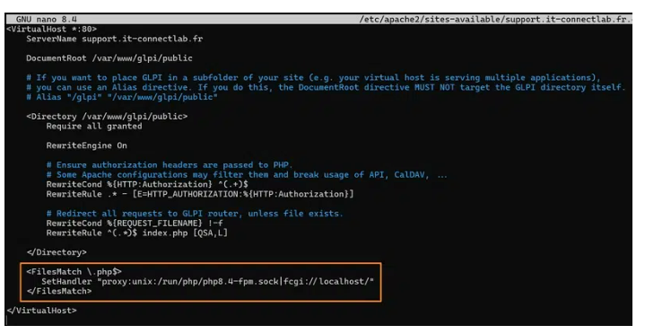

Quand c'est fait, on relance apache2:

```bash
sudo systemctl restart apache2
```

Voilà tout est prêt, il ne reste plus qu'à relancer GLPI!

**. Installation de GLPI**

Pour effectuer l'installation de GLPI, nous devons utiliser un navigateur Web afin d'accéder à l'adresse du GLPI. Il s'agit de l'adresse déclarée dans le fichier de configuration Apache2 (`servername`).

Si vous avez suivi toutes les étapes correctement, vous devriez obtenir la page visible ci-dessous. Cliquez simplement sur le bouton au centre.

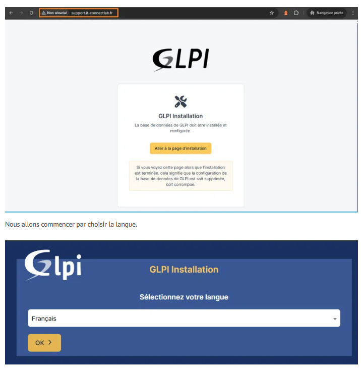

Nous allons commencer par choisir la langue.
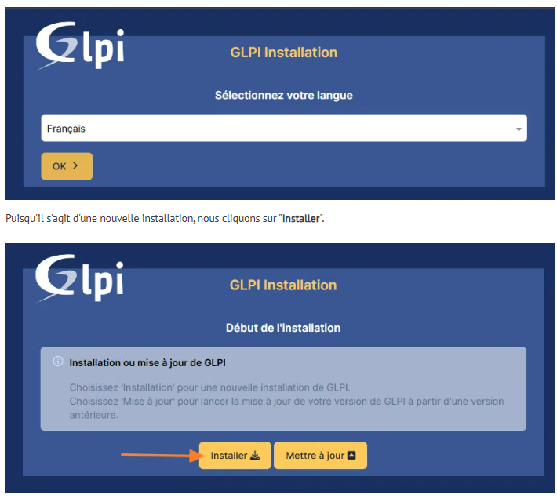
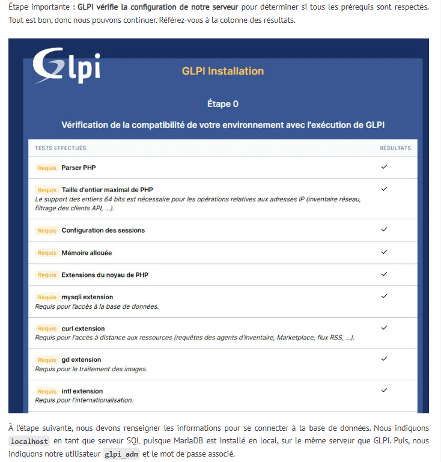
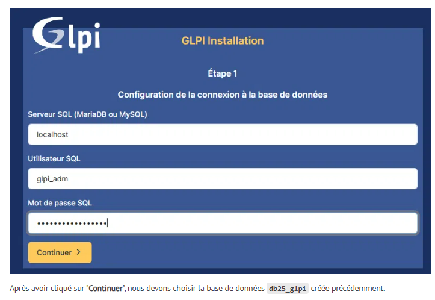
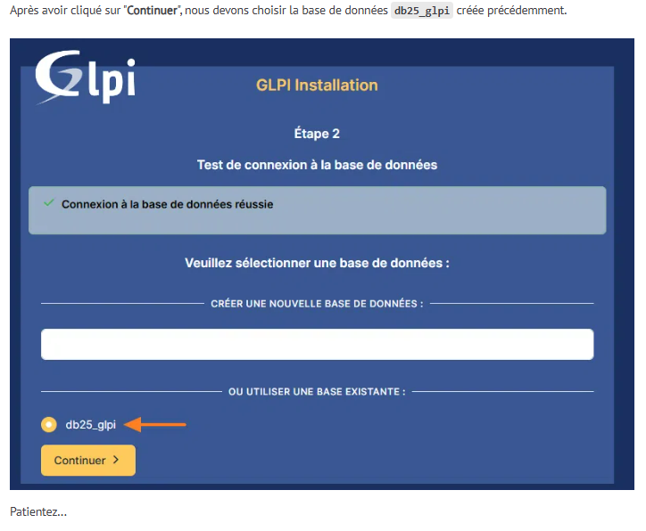
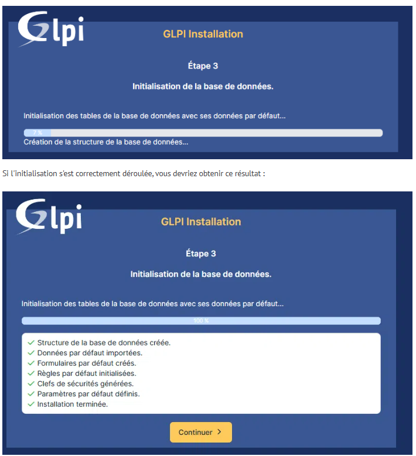
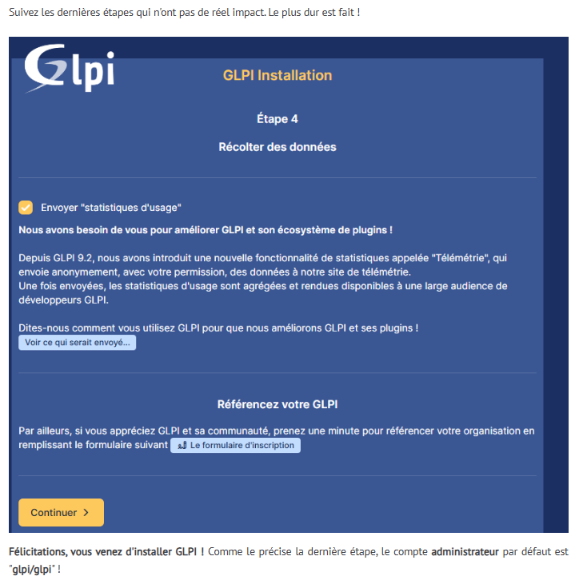


```bash
sudo rm /var/www/glpi/install/install.php
```

**V. Conclusion**

**En suivant ce tutoriel pas à pas, vous devriez être en mesure d'installer GLPI sur un serveur Debian 13 !**A quelques détails près, cette procédure peut s'appliquer à d'autres systèmes et versions.

### Auteur : ESCRIVA Yann

### Projet : Décembre 2025

