<p align="center">
  
</p>


# Dossier projet AIS

**Auteur :** Yann (Administrateur Infrastructure Sécurisée) 

**Projet :** Décembre 2025 à Avril 2026

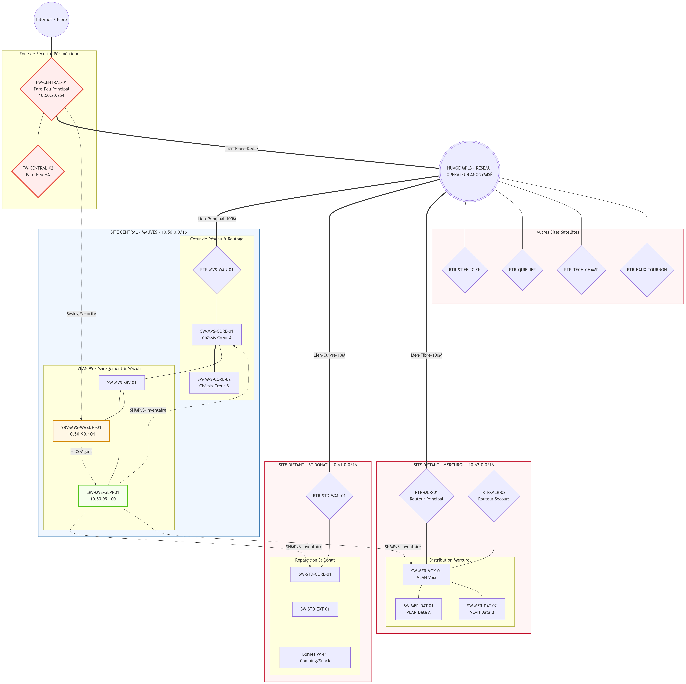

## Table des matières

- [Dossier projet AIS](#dossier-projet-ais)
  - [Table des matières](#table-des-matières)
  - [1. Liste des compétences mises en œuvre dans le cadre du projet](#1-liste-des-compétences-mises-en-œuvre-dans-le-cadre-du-projet)
    - [1.1. Mes missions au quotidien](#11-mes-missions-au-quotidien)
  - [2. Cahier des charges ou expression des besoins du projet](#2-cahier-des-charges-ou-expression-des-besoins-du-projet)
    - [2.1. Présentation de l’entreprise](#21-présentation-de-lentreprise)
      - [2.1.1. Organigramme](#211-organigramme)
      - [2.1.2. Implantation de l’entreprise](#212-implantation-de-lentreprise)
    - [2.2. Contexte](#22-contexte)
    - [2.3. Objectif](#23-objectif)
    - [2.4. La mission](#24-la-mission)
    - [2.5. Expression des besoins](#25-expression-des-besoins)
  - [3. Gestion de projet](#3-gestion-de-projet)
    - [3.1. Planification et suivi](#31-planification-et-suivi)
    - [3.2. Macro-planning](#32-macro-planning)
    - [3.3. Environnement humain](#33-environnement-humain)
      - [3.3.1. Les acteurs du projet](#331-les-acteurs-du-projet)
  - [4. Environnement technique](#4-environnement-technique)
    - [4.1. Objectifs de qualité](#41-objectifs-de-qualité)
    - [4.2. Choix des solutions](#42-choix-des-solutions)
      - [4.2.1. Localisation des services](#421-localisation-des-services)
    - [4.3. Tableau comparatif des solutions](#43-tableau-comparatif-des-solutions)
    - [4.4. Proposition de solution](#44-proposition-de-solution)
      - [A. Architecture Réseau Globale](#a-architecture-réseau-globale)
      - [B. Plan d'adressage cible et Segmentation (VLAN)](#b-plan-dadressage-cible-et-segmentation-vlan)
      - [C. Les fonctionnalités clés de GLPI exploitées](#c-les-fonctionnalités-clés-de-glpi-exploitées)
      - [D. Focus technique : La différence entre Découverte et Inventaire réseau](#d-focus-technique--la-différence-entre-découverte-et-inventaire-réseau)
    - [4.5. Solution retenue et détails techniques](#45-solution-retenue-et-détails-techniques)
      - [A. Ressources et Partitionnement (Proxmox)](#a-ressources-et-partitionnement-proxmox)
      - [B. Stack applicative logicielle (L.A.M.P)](#b-stack-applicative-logicielle-lamp)
      - [C. Espace d'adressage et Filtrage local (UFW)](#c-espace-dadressage-et-filtrage-local-ufw)
      - [D. Cartographie des Flux Applicatifs et Sécurité](#d-cartographie-des-flux-applicatifs-et-sécurité)
    - [4.6. Sécurisation de l'infrastructure (Durcissement OS et Flux)](#46-sécurisation-de-linfrastructure-durcissement-os-et-flux)
    - [4.7 Analyse des risques](#47-analyse-des-risques)
    - [4.8 Supervision et exploitation](#48-supervision-et-exploitation)
      - [4.8.1 Déploiement automatisé des agents GLPI](#481-déploiement-automatisé-des-agents-glpi)
      - [4.8.2 Gestion des mises à jour des agents GLPI](#482-gestion-des-mises-à-jour-des-agents-glpi)
      - [4.8.3 Exploitation des fonctionnalités ITSM](#483-exploitation-des-fonctionnalités-itsm)
    - [4.9 Continuité de service](#49-continuité-de-service)
    - [4.10 Justification des choix de sécurité et évolutions](#410-justification-des-choix-de-sécurité-et-évolutions)
  - [5. L’organisation de la mise en œuvre](#5-lorganisation-de-la-mise-en-œuvre)
    - [5.1 Revue de code et configuration](#51-revue-de-code-et-configuration)
      - [A. Installation du socle applicatif et liaison PHP-FPM\*\*](#a-installation-du-socle-applicatif-et-liaison-php-fpm)
      - [B. Déploiement de l'agent GLPI sous Debian](#b-déploiement-de-lagent-glpi-sous-debian)
      - [C. Installation](#c-installation)
    - [5.2. Schéma détaillé](#52-schéma-détaillé)
    - [5.3. Diagramme de Séquence du Protocole SNMP](#53-diagramme-de-séquence-du-protocole-snmp)
  - [6. Mise en place d'une solution de supervision et de détection d'intrusion](#6-mise-en-place-dune-solution-de-supervision-et-de-détection-dintrusion)
    - [6.1 Mise en place de la supervision avec Wazuh](#61-mise-en-place-de-la-supervision-avec-wazuh)
    - [6.2 Déploiement du socle de sécurité](#62-déploiement-du-socle-de-sécurité)
    - [6.3 Enrôlement des agents (Surveillance du serveur GLPI)](#63-enrôlement-des-agents-surveillance-du-serveur-glpi)
    - [6.4 Configuration et validation de Wazuh SIEM](#64-configuration-et-validation-de-wazuh-siem)
      - [6.4.1 Validation de la détection de Brute Force SSH](#641-validation-de-la-détection-de-brute-force-ssh)
      - [6.4.2 Validation du File Integrity Monitoring (FIM)](#642-validation-du-file-integrity-monitoring-fim)
      - [6.4.3 Réponse Active (IPS - Active Response)](#643-réponse-active-ips---active-response)
    - [6.5 — Mise en place de Fail2ban](#65--mise-en-place-de-fail2ban)
      - [6.5.1 Objectifs de Fail2ban](#651-objectifs-de-fail2ban)
    - [6.5.2 Défense en profondeur](#652-défense-en-profondeur)
    - [6.5.3 Configuration Fail2ban](#653-configuration-fail2ban)
      - [6.5.4 Test de validation](#654-test-de-validation)
  - [7. Les relations avec les principaux acteurs du projet](#7-les-relations-avec-les-principaux-acteurs-du-projet)
  - [8. Synthèse et conclusion](#8-synthèse-et-conclusion)
  - [9. Annexes](#9-annexes)


## 1. Liste des compétences mises en œuvre dans le cadre du projet

Ce projet de déploiement d'un environnement GLPI de test m'a permis de mobiliser plusieurs compétences clés du titre professionnel d'Administrateur d'Infrastructures Sécurisées :

| Compétences visées par le titre AIS                                              | Actions réalisées dans le cadre du projet GLPI de test                                                                                                                            |
| :------------------------------------------------------------------------------- | :-------------------------------------------------------------------------------------------------------------------------------------------------------------------------------- |
| **Administrer et sécuriser les infrastructures systèmes**                        | Installation, durcissement et sécurisation d'une machine virtuelle Linux/LAMP pour héberger le l'outil open source GLPI dans un environnement isolé.                              |
| **Gérer le patrimoine informatique et les réseaux**                              | Configuration du protocole SNMP pour la découverte réseau et test de déploiement automatisé d'agents d'inventaire sur les postes cibles.                                          |
| **Participer à l'élaboration et à la mise en œuvre de la politique de sécurité** | Lutte contre le *Shadow IT* via la découverte réseau et cartographie des équipements actifs pour identifier les vulnérabilités du parc (systèmes obsolètes, failles matérielles). |

Ce projet s’inscrit pleinement dans les compétences attendues du titre professionnel d’Administrateur d’Infrastructures Sécurisées.

Il m’a permis de mobiliser l’ensemble des activités du référentiel, notamment :

* l’administration et la sécurisation d’une infrastructure système

* la conception et le déploiement d’un environnement technique sécurisé

* la mise en œuvre de mécanismes de supervision et de maintien en conditions de sécurité

À travers l’analyse des besoins, la mise en place d’une architecture cloisonnée, l’intégration de mesures de sécurité adaptées au contexte, ainsi que la définition d’une stratégie de continuité de service, ce projet démontre ma capacité à intervenir sur l’ensemble du cycle de vie d’une infrastructure sécurisée.

### 1.1. Mes missions au quotidien

En tant qu'alternant en administration d'infrastructures sécurisées au sein d'ARCHE Agglo, mon rôle au quotidien se concentre sur le maintien en conditions opérationnelles de l'infrastructure informatique, répartie sur 41 communes. 

Mes missions principales incluent :
* **Le support utilisateur (Niveau 2 et 3) :** Résolution des incidents complexes, gestion des droits d'accès et accompagnement des agents de la collectivité.
* **L'administration système et réseau :** Supervision des équipements réseaux, gestion des serveurs locaux et maintien de la connectivité entre les différents sites distants de l'agglomération.
* **La gestion de projet et l'amélioration continue :** Déploiement de nouvelles solutions techniques (comme les tests sur l'environnement GLPI) visant à optimiser les processus de l'équipe informatique, fiabiliser les données du parc et renforcer la sécurité globale du système d'information de la collectivité.


## 2. Cahier des charges ou expression des besoins du projet

### 2.1. Présentation de l’entreprise

**Ce qu'est ARCHE Agglo :**
ARCHE Agglo est une collectivité publique (Établissement Public de Coopération Intercommunale) créée en 2017. Située à cheval entre l'Ardèche et la Drôme, elle regroupe 41 communes pour environ 60 000 habitants.

Ses 5 grands pôles d'activités sont :
* **L'économie :** Aider les entreprises et développer l'emploi local.
* **L'environnement :** Collecter les déchets et entretenir les cours d'eau.
* **Les services aux habitants :** Gérer la petite enfance (crèches) et l'action sociale.
* **L'aménagement :** Organiser les transports et la politique du logement.
* **Le tourisme :** Développer l'attractivité (office de tourisme, sentiers de randonnée).

#### 2.1.1. Organigramme

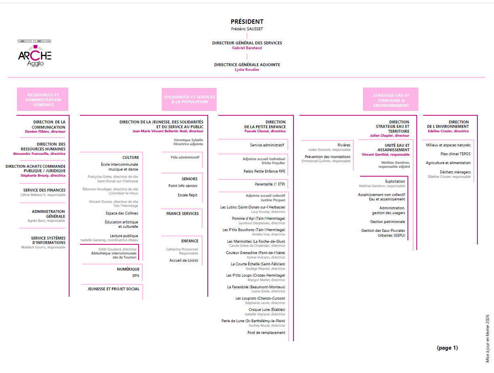
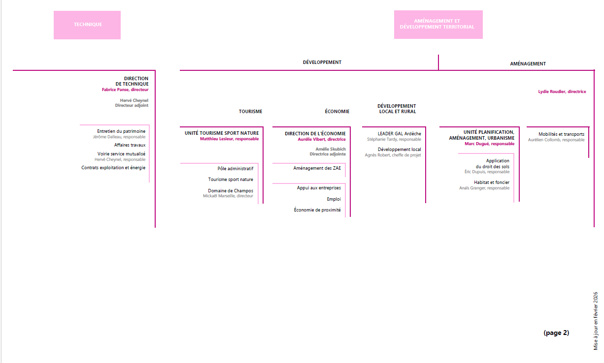
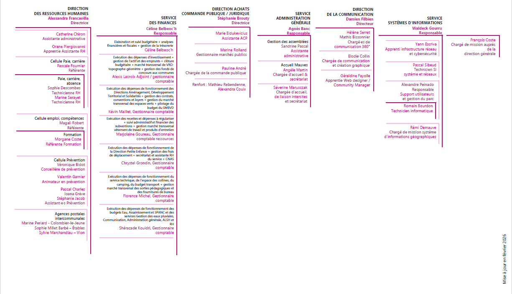
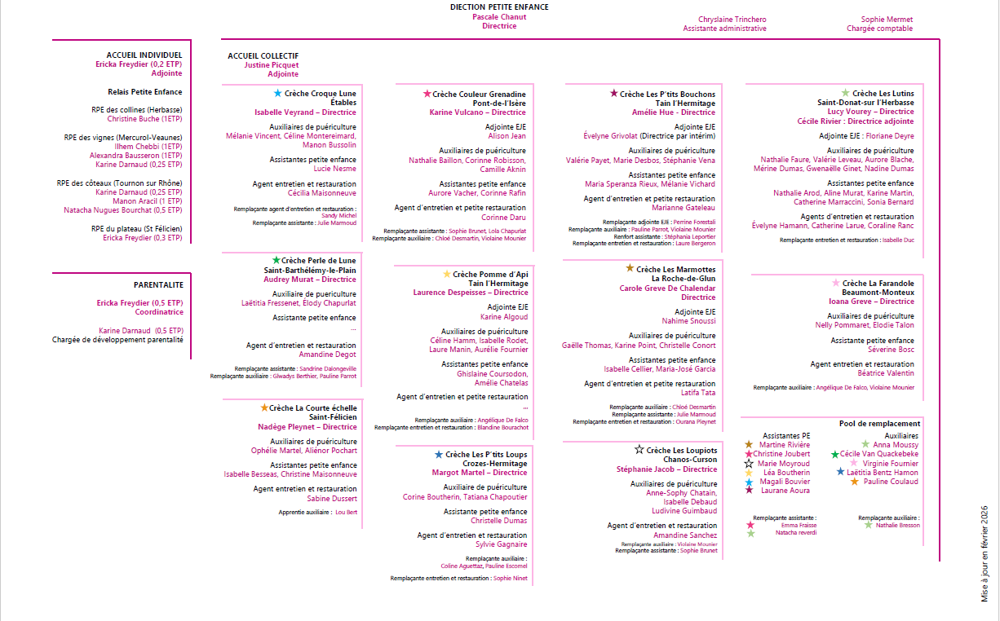
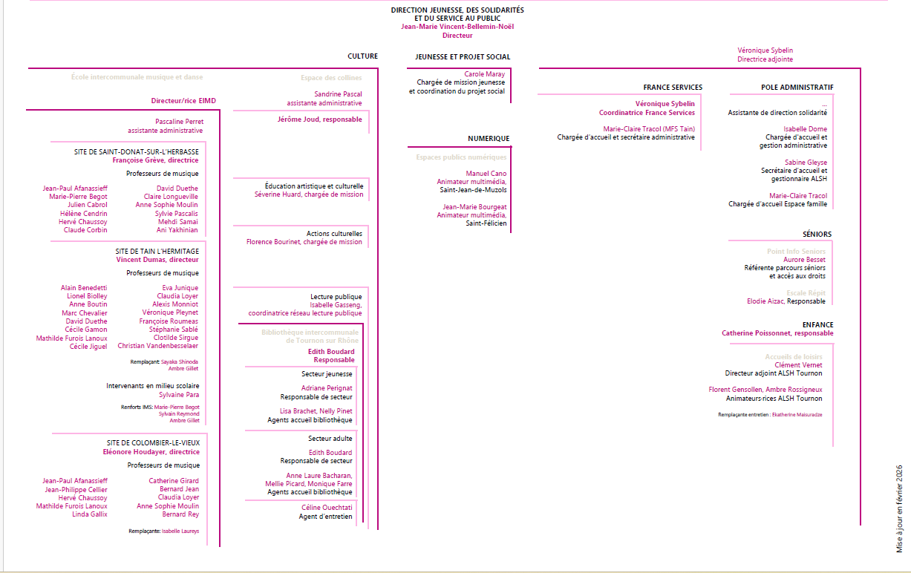
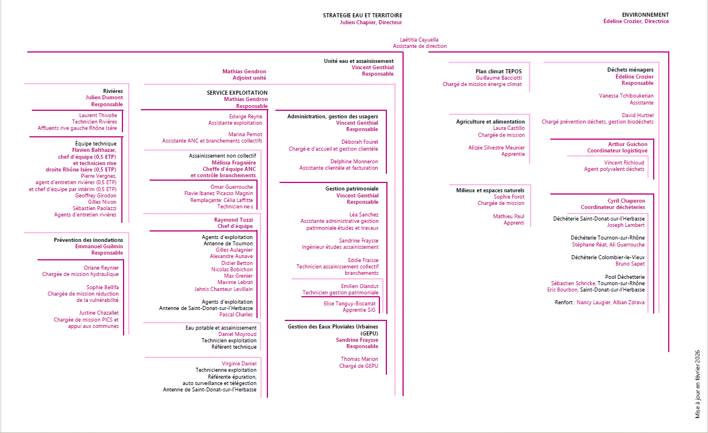
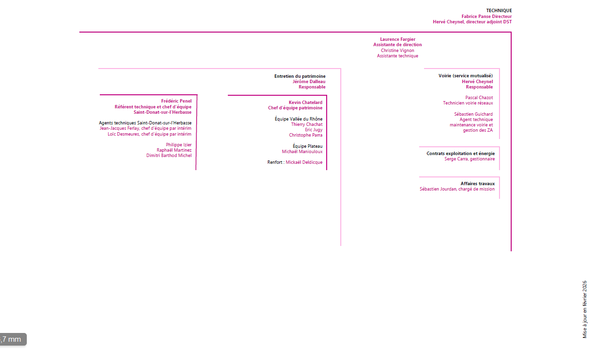
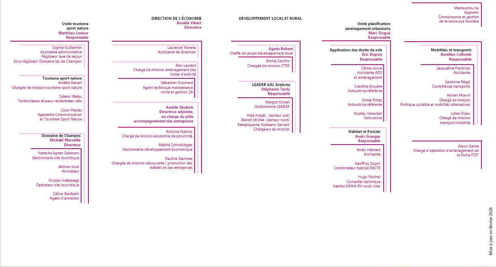

#### 2.1.2. Implantation de l’entreprise

**Les sites principaux :**
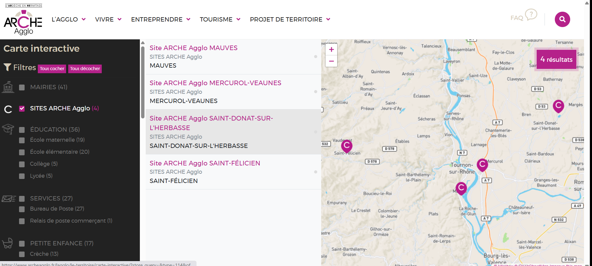

**Tous les sites :**
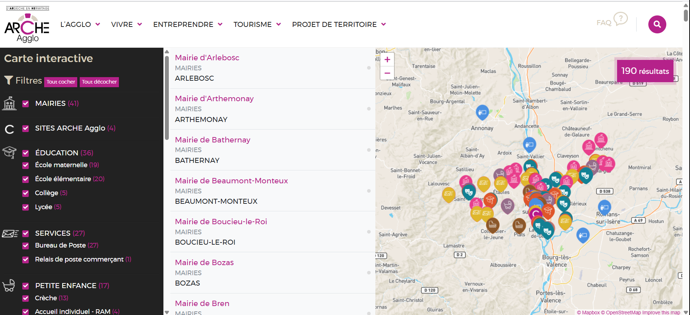

### 2.2. Contexte

ARCHE Agglo dispose déjà d’une solution GLPI en environnement de production afin d’assurer la gestion du parc informatique et le support aux utilisateurs.

Cependant, l’évolution des besoins internes, notamment en matière d’inventaire automatisé et de visibilité sur les équipements réseau, a conduit à envisager l’intégration de nouvelles fonctionnalités telles que :

* le déploiement d’agents d’inventaire sur les postes,
* la découverte réseau via le protocole SNMP.

La mise en œuvre de ces fonctionnalités directement sur l’environnement de production aurait présenté un risque potentiel d’instabilité, notamment en cas d’erreur de configuration ou de mauvaise interprétation des données remontées.

Dans une logique de sécurisation du système d’information et de limitation des impacts sur les services existants, il est apparu nécessaire de concevoir un environnement de test isolé permettant :

* de valider les procédures techniques,
* de tester les flux réseau nécessaires,
* d’anticiper les éventuelles contraintes de sécurité.

Ce projet s’inscrit donc dans une démarche d’amélioration continue du système d’information, visant à renforcer la connaissance du parc informatique tout en garantissant la stabilité de l’environnement de production.

### 2.3. Objectif

Le projet a pour objectif de concevoir, déployer et sécuriser une maquette (environnement de test/pré-production) d'un serveur GLPI. Cet environnement permettra de valider techniquement la procédure d'installation sécurisée, le déploiement automatisé des agents d'inventaire, et la configuration du scan SNMP pour les équipements réseau, avant d'envisager une quelconque mise en production.

### 2.4. La mission

Ma mission principale dans le cadre de ce projet est de réaliser les actions suivantes de bout-en-bout :
* Concevoir l'architecture de l'environnement de test et rédiger le Document d'Architecture Technique (DAT).
* Installer et sécuriser le serveur Linux hébergeant cette maquette.
* Définir, tester et valider une stratégie de déploiement massif des agents d'inventaire.
* Configurer et tester l'inventaire réseau automatisé via le protocole SNMP pour les équipements non-agentés (switchs, imprimantes).
* Produire les livrables documentaires (procédures d'installation et de déploiement) transférables à terme vers la production.

### 2.5. Expression des besoins

Pour répondre aux contraintes techniques et fonctionnelles d'ARCHE Agglo, la solution mise en place doit respecter les besoins suivants :
* **Centralisation :** Une interface web unique accessible par l'équipe IT pour consolider les données.
* **Automatisation :** La remontée des informations (hardware, software, réseau) doit s'effectuer sans intervention humaine régulière.
* **Découverte réseau :** Capacité à scanner les différents sous-réseaux (VLANs) des sites distants via le protocole SNMP.
* **Sécurité et Isolation :** L'environnement de test doit être parfaitement cloisonné pour ne pas impacter la production, tout en assurant des flux chiffrés (HTTPS).
* **Économie :** En tant que collectivité publique, il est primordial de privilégier une solution Open Source robuste (sans coût de licence) cohérente avec l'existant.


## 3. Gestion de projet

### 3.1. Planification et suivi

Pour mener à bien ce projet de déploiement, j’ai opté pour une approche de gestion de projet visuelle et itérative, inspirée de la méthode Kanban.

Cette méthode m’a permis de structurer l’avancement du projet tout en conservant une flexibilité indispensable dans un contexte d’alternance, où les missions de Maintien en Conditions Opérationnelles peuvent ponctuellement impacter le temps dédié au projet.

Le suivi des tâches a été réalisé via l’outil Trello, organisé en plusieurs colonnes permettant de visualiser l’état d’avancement du projet à chaque étape de sa réalisation.

Cette organisation comprenait :

* Backlog (À faire) : ensemble des tâches identifiées lors de la phase de conception, constituant le périmètre initial du projet (ex : rédaction du DAT, création de la VM, sécurisation du serveur).
* En cours : tâches en cours de réalisation à un instant donné, permettant de prioriser les actions en fonction des contraintes techniques ou organisationnelles.
* En attente / Bloqué : tâches dépendantes d’un facteur externe, comme une validation, une ressource ou une configuration réseau (ex : ouverture de flux).
* Terminé : tâches finalisées, validées techniquement et documentées.

Bien que l’ensemble des tâches soit aujourd’hui achevé, cette structuration a permis tout au long du projet de :

* maintenir une vision claire de l’avancement,
* gérer les dépendances techniques,
* sécuriser la progression jusqu’à la phase de clôture.

### 3.2. Macro-planning

Le projet s'est déroulé en plusieurs phases distinctes, allant de l'expression du besoin jusqu'à la livraison de la documentation. Afin de sécuriser l'avancement, des jalons de validation ont été définis avec la DSI à la fin de chaque étape clé :

| Phase                                   | Période                           | Description des tâches                                                                                      | Livrables associés                                           | Jalons (Points de validation)                                      |
| :-------------------------------------- | :-------------------------------- | :---------------------------------------------------------------------------------------------------------- | :----------------------------------------------------------- | :----------------------------------------------------------------- |
| **1. Cadrage et Architecture**          | **8 au 22 Décembre 2025**         | Analyse des besoins, étude de l'existant, choix des solutions et conception de l'architecture.              | Cahier des charges, DAT (Document d'Architecture Technique). | **Jalon 1 :** Validation de l'architecture (DAT) par le tuteur     |
| **2. Préparation de l'infrastructure**  | **19 au 29 Janvier 2026**         | Création de la VM sur Proxmox, installation de Debian 13, configuration réseau et sécurité (Firewall, SSH). | VM opérationnelle et sécurisée.                              | **Jalon 2 :** Serveur accessible, durci et isolé sur le réseau     |
| **3. Déploiement applicatif**           | **30 Janvier au 20 Février 2026** | Installation de la stack LAMP, déploiement de GLPI, connexion au LDAP et configuration de base.             | Interface GLPI accessible en HTTPS.                          | **Jalon 3 :** Application web fonctionnelle et connectée à l'AD    |
| **4. Tests et Validation (Inventaire)** | **23 au 26 Mars 2026**            | Déploiement d'agents de test, configuration de l'inventaire SNMP, validation des remontées d'informations.  | Remontée des équipements dans la maquette.                   | **Jalon 4 :** Réussite du premier scan SNMP et intégration en base |
| **5. Documentation et Clôture**         | **7 au 23 Avril 2026**            | Rédaction des procédures d'installation, de déploiement et d'exploitation pour l'équipe technique.          | Procédures documentées sur GitHub.                           | **Jalon 5 :** Recette finale et livraison des livrables à l'équipe |

### 3.3. Environnement humain

#### 3.3.1. Les acteurs du projet

La réussite de ce projet repose sur la collaboration de plusieurs acteurs au sein du service informatique d'ARCHE Agglo :

* **Moi-même (Alternant Administrateur d'Infrastructures Sécurisées) - *Chef de projet*** : 
  En charge de l'analyse, de la conception (DAT), du déploiement technique de la maquette, de la réalisation des tests d'inventaire et de la rédaction de la documentation.
* **Mon Tuteur en entreprise / Chef du SI** : 
  Il valide l'architecture proposée, alloue les ressources matérielles nécessaires (accès à l'hyperviseur Proxmox, attribution des adresses IP) et s'assure de l'alignement du projet avec la stratégie informatique de la collectivité.
* **L'équipe technique (Techniciens Support et Réseau) - *Utilisateurs finaux*** : 
  Consultés lors de la phase d'expression des besoins, ils sont les futurs utilisateurs de la procédure d'exploitation et interviennent pour valider que les informations remontées par la maquette de test sont pertinentes pour leur travail quotidien.


## 4. Environnement technique

### 4.1. Objectifs de qualité

Avant tout déploiement technique, l'analyse des besoins et des risques a permis de définir les objectifs de qualité suivants pour l'environnement GLPI :
* **Disponibilité :** Garantir un accès constant au service de gestion de parc et au helpdesk (mesures de réduction des risques : sauvegardes régulières, snapshots VM).
* **Intégrité :** S'assurer que les données d'inventaire et les bases de données (MariaDB) ne soient pas corrompues ou perdues.
* **Sécurité et Confidentialité :** Protéger l'application contre les failles (MCO régulier, flux HTTPS) et sécuriser l'authentification (LDAPS).
* **Évolutivité :** Prévoir une architecture capable d'absorber une future charge de production (ajout de RAM/CPU), d'intégrer à terme un système SSO (OpenID Connect) et d'évoluer vers une architecture hybride grâce à l'intégration d'un cloud privé Nextcloud.

Maintenabilité : Permettre une restauration rapide du service grâce aux sauvegardes et snapshots.

### 4.2. Choix des solutions

Le choix s'est porté sur des technologies Open Source robustes et reconnues sur le marché, garantissant une maîtrise totale des coûts et de la sécurité. 
L'infrastructure repose sur une Machine Virtuelle (VM) équipée du système d'exploitation **Debian 13**, hébergeant une stack **LAMP** (Linux, Apache, MariaDB, PHP).

#### 4.2.1. Localisation des services

* **Modèle de déploiement :** sur site.  
* **Hébergement :** La machine virtuelle est hébergée sur l'infrastructure virtualisée existante d'ARCHE Agglo, gérée par l'hyperviseur **Proxmox**.  
* **PRA / Sauvegarde :** La stratégie de sauvegarde respecte la **règle 3-2-1** (3 copies, 2 supports différents dont un NAS local, 1 copie hors site dans le Cloud) automatisée via **Veeam Backup**.

**Infrastructure Cloud privé**

Une solution de cloud privé basée sur Nextcloud était déjà déployée au sein de l’infrastructure interne d’ARCHE Agglo.

Cette solution est hébergée sur l’infrastructure virtualisée de la collectivité, permettant de garantir la souveraineté des données et la maîtrise complète de l’environnement technique.

Dans le cadre de ce projet, cette solution a été intégrée à l’architecture globale afin de renforcer la continuité de service et la stratégie de sauvegarde hors site.

Le serveur Nextcloud permet :

* Le stockage centralisé des sauvegardes  
* Le partage sécurisé des fichiers  
* L'accès distant sécurisé pour les administrateurs  
* Le support d'une sauvegarde hors site dans le cadre du PRA  

Caractéristiques techniques :

* Serveur : SRV-MVS-NEXTCLOUD-01  
* Hébergement : Infrastructure interne ARCHE Agglo  
* Accès sécurisé : HTTPS  
* Utilisation : Sauvegarde hors site et partage sécurisé  

L'intégration de cette solution existante permet de mettre en évidence une architecture hybride combinant infrastructure locale et cloud privé interne, renforçant ainsi la résilience globale du système d'information.

### 4.3. Tableau comparatif des solutions

Pour répondre aux besoins d'inventaire automatisé et de gestion de parc, plusieurs solutions ont été étudiées :

| Critères / Fonctionnalités           | Solution 01 : GLPI + GLPI Inventory | Solution 02 : OCS Inventory |    Solution 03 : Snipe-IT    |
| :----------------------------------- | :---------------------------------: | :-------------------------: | :--------------------------: |
| **Inventaire automatisé par Agent**  |                 Oui                 |             Oui             | Non (Saisie manuelle ou API) |
| **Découverte réseau (SNMP)**         |                 Oui                 |             Oui             |             Non              |
| **Gestion du Helpdesk (Tickets)**    |                 Oui                 |             Non             |             Non              |
| **Solution Open Source et gratuite** |                 Oui                 |             Oui             |  Oui (version auto-hébérgé)  |
| **Cohérence avec l'existant (Prod)** |                 Oui                 |             Non             |             Non              |

### 4.4. Proposition de solution

La Solution 01 (GLPI) est retenue. Bien que son interface d'administration soit parfois dense, elle est la seule à couvrir nativement l'ensemble du périmètre fonctionnel exigé : gestion de parc complète (hardware/software), helpdesk intégré, et découverte réseau via SNMP. De plus, la collectivité utilisant déjà GLPI en production, le choix de cette solution pour la maquette de test garantit une transférabilité immédiate des compétences et des scripts développés.

Afin de garantir un haut niveau de sécurité, l'architecture cible a été pensée pour isoler les services et contrôler strictement les flux réseau.

#### A. Architecture Réseau Globale

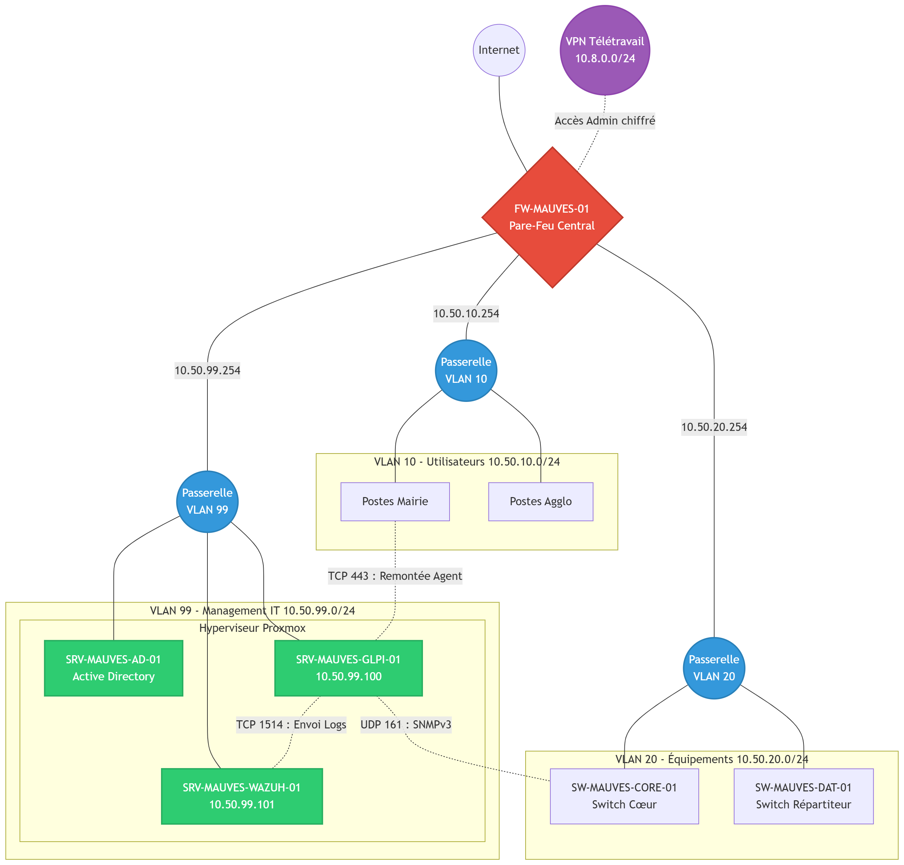

#### B. Plan d'adressage cible et Segmentation (VLAN)

Pour éviter toute compromission depuis les postes utilisateurs et cloisonner l'administration, l'infrastructure s'appuie sur une segmentation logique stricte de niveau 2. La maquette virtualisée sous Proxmox valide le plan d'adressage cible suivant pour le site principal :
* **VLAN 10 - Utilisateurs (Bureautique) :** `10.50.10.0/24` (Réseau standard hébergeant les postes de travail des agents).
* **VLAN 20 - Équipements Réseaux :** `10.50.20.0/24` (Réseau dédié aux interfaces de management des switchs, routeurs et bornes Wi-Fi).
* **VLAN 99 - Management (Serveurs IT) :** `10.50.99.0/24` (Réseau d'administration isolé hébergeant le serveur GLPI avec l'IP statique `10.50.99.100`, et le serveur SIEM Wazuh avec l'IP `10.50.99.101`).
* **Réseau VPN - Télétravail IT :** `10.8.0.0/24` (Plage d'adresses attribuée dynamiquement aux techniciens se connectant à distance de manière chiffrée pour administrer l'infrastructure).

#### C. Les fonctionnalités clés de GLPI exploitées

Au-delà de la simple installation du socle web, la valeur ajoutée du projet réside dans l'exploitation des modules avancés de GLPI pour structurer le système d'information :
* **La CMDB (Gestion de parc) :** Elle permet de maintenir un inventaire exhaustif et dynamique du matériel (PC, serveurs, équipements réseau) et des licences logicielles, offrant une excellente visibilité pour contrer le Shadow IT.
* **Le Helpdesk (aligné ITIL) :** Il offre une gestion centralisée du cycle de vie des tickets (Incidents et Demandes), le suivi des accords de niveau de service (SLA), et permet la constitution d'une base de connaissances technique.

#### D. Focus technique : La différence entre Découverte et Inventaire réseau

Pour automatiser la remontée des équipements réseau sans agent, le projet exploite deux mécanismes distincts mais complémentaires opérés par l'agent GLPI :

1. **La Découverte Réseau :** L'agent effectue un balayage actif (sweep) d'une plage d'adresses IP cible (ex: `10.50.20.0/24` pour le site principal ou `10.61.20.0/24` pour St Donat) en testant les identifiants SNMPv3 configurés. Il détecte les équipements joignables et crée une fiche basique dans la base GLPI contenant l'adresse IP, l'adresse MAC et le nom de l'équipement.
2. **L'Inventaire Réseau :** Une fois le switch administrable découvert, l'agent lance des requêtes SNMP approfondies pour lire ses tables internes (tables de routage, tables ARP, et tables FDB/MAC associées aux ports physiques). C'est ce processus complexe qui permet à GLPI de cartographier la topologie physique et de savoir précisément quel ordinateur est connecté sur quel port physique du switch.

### 4.5. Solution retenue et détails techniques

Le déploiement technique de la solution retenue s'articule autour des caractéristiques suivantes, pensées pour garantir performance et sécurité :

#### A. Ressources et Partitionnement (Proxmox)
La machine virtuelle hébergeant GLPI est dimensionnée selon les recommandations de l'éditeur, avec une isolation stricte des données via LVM :
* **vCPU :** 2 vCPU (Suffisant pour le traitement PHP/Web standard).
* **RAM :** 4 Go (Minimum recommandé, évolutif).
* **Stockage :** 50 Go (SSD) avec un partitionnement LVM strict pour isoler les composants critiques et prévenir la saturation du système :
  * `/` : 15 Go (Système Debian 13 + LAMP + GLPI)
  * `/var` : 10 Go (Données applicatives et cache)
  * `/var/log` : 5 Go (Journaux système)
  * `/var/lib/mysql` : 15 Go (Base de données)
  * `/home` : 5 Go (Comptes administrateurs)

#### B. Stack applicative logicielle (L.A.M.P)
* **Serveur Web :** Apache2
* **Base de données :** MariaDB 10.11 minimum
* **Langage :** PHP 8.4-fpm (Version requise pour la compatibilité avec GLPI 11, avec extensions `mysqli`, `curl`, `gd`, `intl`, `ldap`, `zip`, etc.)

#### C. Espace d'adressage et Filtrage local (UFW)

Le serveur dispose d'une adresse IPv4 fixe (`10.50.99.100`) et d'un enregistrement DNS. En complément du pare-feu périmétrique, les ouvertures de ports locales (Firewall UFW) sont strictement limitées :

| Direction | Port | Protocole | Service | Justification |
| :--- | :--- | :--- | :--- | :--- |
| **Entrant (IN)** | **80** | **TCP** | **HTTP** | **Flux web applicatif et agents relayés par le Reverse Proxy NPM** |
| **Entrant (IN)** | 22 | TCP | SSH | Administration (restreint aux IP administrateurs) |
| **Sortant (OUT)** | 443 | TCP | HTTPS | Mises à jour système et plugins |
| **Sortant (OUT)** | 636 | TCP | LDAPS | Authentification sécurisée vers l'Active Directory |
| **Sortant (OUT)** | 587 | TCP | SMTP | Envoi des notifications mail (STARTTLS) |
| **Sortant (OUT)** | 161 | UDP | SNMP | Requêtes de découverte et d'inventaire réseau |

#### D. Cartographie des Flux Applicatifs et Sécurité

Ce diagramme synthétise les interactions réseaux entrantes et sortantes du serveur GLPI au sein de l'infrastructure :


### 4.6. Sécurisation de l'infrastructure (Durcissement OS et Flux)

La sécurisation de l'environnement GLPI a été traitée selon le principe de défense en profondeur, en appliquant les bonnes pratiques de durcissement recommandées par l'ANSSI.

**Durcissement du Système (OS) :**
* **Cloisonnement réseau :** Le pare-feu local UFW est configuré avec une politique par défaut stricte (Default Deny) en entrée, n'autorisant que les ports strictement nécessaires au service **(TCP 22 pour l'administration SSH, et TCP 80 pour le flux applicatif relayé par le Reverse Proxy)**.
* **Accès distant sécurisé (SSH) :** L'authentification par mot de passe et l'accès direct en tant que *root* ont été désactivés (`PermitRootLogin no`, `PasswordAuthentication no`). L'administration se fait uniquement via des clés cryptographiques robustes (ex: ED25519 ou RSA 4096) depuis le réseau VPN IT.
* **Lutte contre le bruteforce :** L'outil *fail2ban* est déployé avec des "jails" (prisons) actives surveillant les logs d'authentification SSH (sshd) et web (apache-auth), bannissant automatiquement et dynamiquement les adresses IP suspectes.

**Sécurité Applicative et Flux :**
* **Chiffrement en transit :** L'accès client à l'interface web est **sécurisé et forcé en HTTPS grâce à un mécanisme de SSL Offloading porté par le Reverse Proxy Nginx Proxy Manager**. Les requêtes d'authentification du serveur vers l'Active Directory transitent via un tunnel chiffré LDAPS (Port TCP 636) pour éviter toute compromission des identifiants sur le réseau local.
* **Hygiène applicative :** Conformément aux prérequis de sécurité de l'éditeur, le dossier `/install` de GLPI a été définitivement supprimé de l'arborescence après le déploiement.

**Résilience et PRA :**
* Une politique de sauvegarde automatisée (via Veeam) assure des snapshots réguliers de la machine virtuelle, couplés à des "dumps" logiques quotidiens de la base de données MariaDB. Une rétention de 30 jours permet de valider un Plan de Reprise d'Activité (PRA) efficace.

**Supervision et Audit :**
* Le monitoring système (CPU, RAM, Disque) s'effectue via SNMPv3, et l'intégration avec le serveur centralisé Wazuh qui assure la remontée et l'analyse continue des événements de sécurité.

### 4.7 Analyse des risques

Dans le cadre du déploiement de la maquette GLPI, une analyse des risques a été réalisée afin d’identifier les menaces potentielles liées à l’environnement de test et d’anticiper leur impact sur le système d’information.

| Risque identifié                    | Impact potentiel                                       | Probabilité | Mesures de réduction mises en place                                 |
| ----------------------------------- | ------------------------------------------------------ | ----------- | ------------------------------------------------------------------- |
| **Compromission des clés SNMPv3** | **Fuite d'informations de supervision système/réseau** | **Faible** | **Utilisation du mode AuthPriv (Authentification + Chiffrement AES)**|
| Flux interne non chiffré (HTTP)     | Interception réseau (Sniffing) entre Proxy et GLPI     | Faible      | Confinement sur un VLAN backend d'administration hyper-sécurisé     |
| Machine virtuelle unique            | Point de défaillance unique (SPOF)                     | Moyen       | Snapshots réguliers + sauvegardes                                   |
| Mauvaise configuration LDAP         | Échec d’authentification                               | Moyen       | Tests réalisés en pré-production                                    |
| Saturation disque                   | Indisponibilité du service                             | Faible      | Supervision du stockage                                             |
| Vulnérabilités applicatives         | Compromission GLPI                                     | Faible      | Mises à jour automatiques                                           |
| Accès SSH non maîtrisé              | Compromission serveur                                  | Faible      | Authentification par clé + Fail2ban                                 |

### 4.8 Supervision et exploitation

Au-delà de l’identification des risques, la mise en place d’une supervision constitue un élément essentiel pour assurer la disponibilité et la stabilité du service dans le temps.

Afin de garantir sa disponibilité et sa fiabilité, le serveur hébergeant GLPI a été intégré dans notre solution globale de supervision (SIEM Wazuh) pour surveiller sa santé et sa sécurité de manière proactive."

**Indicateurs surveillés**

* Disponibilité du service HTTPS  
* Charge CPU  
* Utilisation mémoire  
* Espace disque  
* Statut Apache  
* Statut MariaDB  

**Seuils d’alerte**

| Indicateur           | Seuil d’alerte |
| -------------------- | -------------- |
| CPU                  | > 80%          |
| RAM                  | > 85%          |
| Disque               | > 90%          |
| Apache indisponible  | Critique       |
| MariaDB indisponible | Critique       |

**Méthodes de supervision**

* SNMP pour les ressources système  
* HTTP(S) pour la disponibilité applicative  

**Bénéfices**

* Détection anticipée des incidents  
* Meilleure continuité de service  
* Exploitation facilitée en production

#### 4.8.1 Déploiement automatisé des agents GLPI

**Objectif**

Afin de garantir une remontée homogène et automatisée des informations du parc informatique, une stratégie de déploiement centralisée des agents GLPI a été mise en place.

**Principe**

Le déploiement repose sur l’utilisation des stratégies de groupe Active Directory (GPO), permettant :

* une installation automatique des agents  
* une standardisation des configurations  
* une réduction des erreurs humaines  

**Mise en œuvre technique**

Le package d’installation MSI de l’agent GLPI a été téléchargé puis déposé sur un partage réseau accessible par les machines du domaine :

\\srv-ad\deploy\glpi-agent.msi

Une GPO a ensuite été créée et appliquée à l’ensemble des postes utilisateurs :

* Chemin :  
  Configuration ordinateur → Paramètres logiciels → Installation de logiciel  

* Mode de déploiement :  
  Assigné 

**Installation silencieuse**

Afin d’automatiser entièrement le processus, une installation silencieuse a été utilisée avec les paramètres suivants :

msiexec /i glpi-agent.msi /quiet /norestart SERVER=https://glpi-test.archeagglo.fr/front/inventory.php

**Résultat**

* Installation automatique au démarrage des postes  
* Remontée immédiate des informations dans GLPI  
* Aucun besoin d’intervention utilisateur  

**Sécurité**

* Accès au partage limité aux machines du domaine  
* Flux HTTP/HTTPS contrôlé via firewall  
* Flux intégralement chiffrés en HTTPS entre les postes clients et le Reverse Proxy.

#### 4.8.2 Gestion des mises à jour des agents GLPI

**Objectif**

Maintenir les agents GLPI à jour afin de garantir la compatibilité, la sécurité et la fiabilité des remontées d’inventaire.

**Mise à jour sous Windows**

Deux méthodes ont été définies :

**Via GPO (méthode principale)**

* Mise à jour du package MSI sur le partage réseau  
* Redéploiement automatique via GPO  

**Via script**

msiexec /i glpi-agent.msi /quiet /norestart REINSTALL=ALL REINSTALLMODE=vomus

**Mise à jour sous Debian**

* Mise à jour via APT

```bash
sudo apt update 
sudo apt --only-upgrade install glpi-agent glpi-agent-task-network -y
```

**Vérification**

glpi-agent --version  

**Résultat**

* Maintien en condition opérationnelle (MCO)  
* Correction des vulnérabilités  
* Compatibilité avec GLPI  

#### 4.8.3 Exploitation des fonctionnalités ITSM

Bien que la découverte réseau soit le moteur de l'inventaire, GLPI a été configuré pour exploiter ses capacités de gestion des services informatiques (ITSM) conformément aux bonnes pratiques ITIL.

**Fonctionnalités mises en œuvre :**

* Helpdesk et Ticketing : Centralisation des demandes d'assistance des utilisateurs avec un portail dédié.

* Gestion des SLA (Service Level Agreement) : Création de règles d'affectation automatiques et de temps de résolution cibles (ex: SLA de 4h pour un incident critique réseau).

* Liaison Parc / Incident : Chaque ticket ouvert peut être lié directement à l'équipement matériel remonté par l'agent (ex: le switch SW-MER-DATA1), permettant un suivi précis de l'historique des pannes par équipement.

* Gestion administrative : Suivi des licences logicielles et des dates de fin de garantie des équipements pour anticiper le renouvellement du matériel.

### 4.9 Continuité de service

La supervision seule ne suffit pas à garantir la résilience du service. Il est également nécessaire de définir des objectifs de reprise afin d’anticiper les scénarios de défaillance.

Afin d’assurer la résilience du service GLPI, des objectifs de reprise ont été définis.

| Indicateur | Objectif  |
| ---------- | --------- |
| RTO        | 4 heures  |
| RPO        | 24 heures |

Ces objectifs sont rendus possibles grâce à :

* Sauvegardes quotidiennes automatisées  
* Dumps MariaDB  
* Snapshots VM  
* Stockage multi-supports (3-2-1)  

En cas d’incident majeur :

* Restauration complète de la VM possible  
* Restauration de la base GLPI indépendante  

Cette organisation garantit une remise en service rapide tout en limitant la perte de données.

### 4.10 Justification des choix de sécurité et évolutions

Certains choix techniques ont été réalisés de manière itérative, en tenant compte des contraintes de l'environnement de test et des exigences de cybersécurité.

**Élévation de la sécurité SNMP (de la v2c à la v3)**

Dans un premier temps, le protocole SNMP v2c (avec la communauté `public`) a été utilisé lors des phases de test afin de valider rapidement l’ouverture des flux réseau et le bon fonctionnement du module de découverte de GLPI.

Cependant, ce protocole ne proposant ni authentification forte ni chiffrement, il présente des vulnérabilités importantes, notamment face aux attaques de type interception réseau (sniffing).

Afin de répondre aux exigences de sécurité du titre AIS, la configuration a été migrée vers SNMPv3 en mode `AuthPriv`. Cette configuration garantit :

* une authentification forte via l’algorithme SHA  
* un chiffrement des échanges via AES  
* une protection des données d’inventaire contre toute interception  

La mise en œuvre a été réalisée via la création d’un utilisateur SNMPv3 dédié et la restriction des accès aux équipements autorisés. Des tests de validation ont été effectués à l’aide de la commande `snmpwalk`, confirmant le bon fonctionnement des échanges sécurisés.

**Centralisation HTTPS et déchargement SSL (SSL Offloading)**

Afin de sécuriser l’accès à l’interface GLPI, une architecture reposant sur un reverse proxy a été mise en place (Nginx Proxy Manager).

Ce choix permet de centraliser la gestion des certificats SSL, notamment via l’utilisation d’un certificat wildcard (`*.archeagglo.fr`), tout en évitant la gestion individuelle des certificats sur chaque serveur applicatif.

Le fonctionnement est le suivant :

* le trafic client est chiffré en HTTPS jusqu’au reverse proxy  
* le proxy relaie ensuite les requêtes vers le serveur GLPI en HTTP sur un réseau interne isolé  
* le serveur GLPI n’est pas exposé directement à Internet  

Cette architecture présente plusieurs avantages :

* réduction de la surface d’attaque  
* masquage de l’infrastructure interne  
* amélioration des performances grâce au déchargement des opérations cryptographiques  
* centralisation et simplification de la gestion des certificats  

Ce choix s’inscrit dans une logique de défense en profondeur, en combinant cloisonnement réseau, chiffrement des flux et contrôle des accès.


## 5. L’organisation de la mise en œuvre

La mise en œuvre de la maquette GLPI s'est déroulée de manière itérative, en veillant à documenter chaque étape technique. L'organisation s'est découpée en l'installation du socle applicatif, la sécurisation du serveur, et enfin le déploiement de l'agent Linux pour la découverte réseau.

### 5.1 Revue de code et configuration

Pour illustrer le travail technique réalisé, voici des extraits significatifs des configurations et commandes mises en place pour assurer le déploiement de la solution.

#### A. Installation du socle applicatif et liaison PHP-FPM**

L'installation de GLPI a été réalisée sur un serveur Debian 13 en utilisant une stack LAMP comprenant Apache2, MariaDB (version ≥ 10.11) et PHP 8.4-fpm.

L'utilisation de PHP-FPM permet une meilleure gestion des processus et une isolation renforcée des traitements PHP. Le VirtualHost Apache a été configuré pour déléguer l'exécution des scripts via un socket Unix :

```apache
<FilesMatch \.php$>
    SetHandler "proxy:unix:/run/php/php8.4-fpm.sock|fcgi://localhost/"
</FilesMatch>
```

**Sécurisation des permissions du répertoire web**

Afin d'éviter toute compromission par une faille applicative, les droits sur le répertoire GLPI ont été strictement verrouillés pour que seul l'utilisateur d'Apache (www-data) puisse y accéder, avec des permissions restreintes :

```Bash
sudo chown -R www-data:www-data /var/www/html/glpi
sudo find /var/www/html/glpi -type d -exec chmod 755 {} \;
sudo find /var/www/html/glpi -type f -exec chmod 644 {} \;
```

#### B. Déploiement de l'agent GLPI sous Debian

Afin d'assurer la remontée automatique de l'inventaire, l'agent GLPI a été déployé sur un serveur Debian en version 1.15 avec le module réseau.

#### C. Installation

```bash
wget https://github.com/glpi-project/glpi-agent/releases/download/1.15/glpi-agent_1.15-1_all.deb
wget https://github.com/glpi-project/glpi-agent/releases/download/1.15/glpi-agent-task-network_1.15-1_all.deb

sudo apt install ./glpi-agent_1.15-1_all.deb ./glpi-agent-task-network_1.15-1_all.deb -y
```

### 5.2. Schéma détaillé

L'architecture détaillée du déploiement met en évidence le cloisonnement des services. La machine virtuelle repose sur un hyperviseur Proxmox et interagit avec l'Active Directory ainsi que les équipements réseau.

### 5.3. Diagramme de Séquence du Protocole SNMP

Ce diagramme de séquence détaille les interactions réseau entre l'agent Linux (équipé du module network) et les équipements lors du processus de découverte SNMP.


## 6. Mise en place d'une solution de supervision et de détection d'intrusion

La mise en place d'une infrastructure robuste nécessite une visibilité complète sur les événements de sécurité. Pour répondre aux exigences de maintien en condition de sécurité (MCS) du titre AIS, la solution open-source Wazuh a été déployée. Elle combine des capacités de SIEM (Security Information and Event Management) et de XDR (Extended Detection and Response).

### 6.1 Mise en place de la supervision avec Wazuh

Afin de garantir la sécurité de l’infrastructure, une solution de supervision centralisée a été mise en place à l’aide de Wazuh. Cette solution permet de collecter, analyser et corréler les événements de sécurité provenant des différents systèmes.

La supervision constitue un élément essentiel dans une architecture sécurisée, permettant de détecter rapidement les anomalies et les tentatives d’intrusion.

**Objectifs de la supervision**

La mise en place de Wazuh répond aux objectifs suivants :

* Centralisation des journaux système
* Détection des tentatives d'intrusion
* Surveillance de l'intégrité des fichiers
* Corrélation des événements de sécurité
* Génération d’alertes en temps réel

**Architecture Wazuh**

L’architecture Wazuh repose sur plusieurs composants :

* Wazuh Manager : analyse et corrélation des événements
* Wazuh Indexer : stockage et indexation des logs
* Wazuh Dashboard : interface de supervision
* Wazuh Agent : installé sur les serveurs supervisés

Cette architecture permet une supervision centralisée et une gestion efficace des incidents de sécurité.

**Architecture de communication Wazuh**

Les communications entre les différents composants utilisent les flux suivants :

* Agent vers Manager : TCP 1514 (Transmission des logs)
* Agent vers Manager : TCP 1515 (Enrôlement des agents)
* Dashboard vers Indexer : HTTPS 443

Ces communications sont sécurisées via TLS afin de garantir :

* La confidentialité des données
* L'intégrité des logs
* L'authentification des composants

**Mise en place de l'agent Wazuh**

L’agent Wazuh a été installé sur le serveur GLPI afin de superviser les éléments critiques :

* Connexions SSH
* Services système
* Fichiers sensibles
* Activité utilisateur

Cette configuration permet une supervision complète du serveur et une détection rapide des anomalies.

### 6.2 Déploiement du socle de sécurité

Afin de garantir une installation standardisée et, surtout, d'assurer la génération sans faille des certificats cryptographiques liant les trois composants, le déploiement a été réalisé via l'assistant d'installation automatisé officiel de Wazuh.

Le script d'installation a été exécuté avec l'argument `-a` pour un déploiement autonome:

```bash
curl -sO [https://packages.wazuh.com/4.x/wazuh-install.sh](https://packages.wazuh.com/4.x/wazuh-install.sh)
sudo bash ./wazuh-install.sh -a
```

À l'issue de l'installation, un condensé sécurisé (wazuh-install-files.tar) contenant l'ensemble des certificats PKI et des mots de passe générés aléatoirement pour les administrateurs a été archivé en lieu sûr.

Validation du socle :
Une vérification des démons système confirme que le socle de sécurité est pleinement opérationnel et prêt à recevoir les connexions chiffrées (port 1514) des agents de l'infrastructure :

```bash
systemctl is-active wazuh-manager wazuh-indexer wazuh-dashboard
# Résultat obtenu : active (pour les 3 services)
```

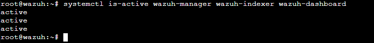

### 6.3 Enrôlement des agents (Surveillance du serveur GLPI)

**Objectif de la supervision**

Le serveur GLPI centralisant l'inventaire matériel et les données d'assistance (Helpdesk) de la collectivité, il constitue une cible de choix pour d'éventuels attaquants. Afin d'assurer sa protection (détection d'intrusions, surveillance de l'intégrité des fichiers web, analyse des journaux système), le déploiement de l'agent Wazuh s'est avéré indispensable.

**Principe de communication sécurisée**

L'agent Wazuh est un composant léger qui collecte les événements système et applicatifs pour les transmettre au Manager. Afin de respecter les exigences de confidentialité et d'intégrité, la communication entre l'agent (sur le serveur Debian GLPI) et le Manager (serveur Ubuntu) s'effectue sur le port TCP 1514 de manière intégralement chiffrée (AES) et authentifiée par un échange de clés (Pre-Shared Key).

**Procédure de déploiement sous Debian 13**

L'installation de l'agent a été réalisée en ligne de commande via l'ajout du dépôt officiel sécurisé par une clé GPG, garantissant l'intégrité des paquets téléchargés. La variable d'environnement `WAZUH_MANAGER` a été utilisée pour automatiser l'enrôlement de l'agent vers l'adresse IP du socle de sécurité lors de l'installation :

**1. Télécharger et importer la clé de sécurité GPG :**

```bash
curl -s https://packages.wazuh.com/key/GPG-KEY-WAZUH | sudo gpg --no-default-keyring --keyring gnupg-ring:/usr/share/keyrings/wazuh.gpg --import
```

**2. Appliquer les bonnes permissions sur le fichier de clé :**

```bash
sudo chmod 644 /usr/share/keyrings/wazuh.gpg
```

**3. Ajouter le dépôt officiel de Wazuh aux sources du système :**

```bash
echo "deb [signed-by=/usr/share/keyrings/wazuh.gpg] https://packages.wazuh.com/4.x/apt/ stable main" | sudo tee /etc/apt/sources.list.d/wazuh.list
```

**4. Mettre à jour la liste des paquets :**

```bash
sudo apt-get update
```

**5. Lancer l'installation avec pointage vers le Manager :**

```bash
sudo env WAZUH_MANAGER="10.50.99.101" apt-get install wazuh-agent -y
```

Une fois l'installation terminée, le démon de l'agent a été activé pour garantir son exécution automatique à chaque redémarrage du serveur :

**6. Activer et démarrer le service de l'agent :**

```bash
systemctl daemon-reload
systemctl enable wazuh-agent
systemctl start wazuh-agent
```

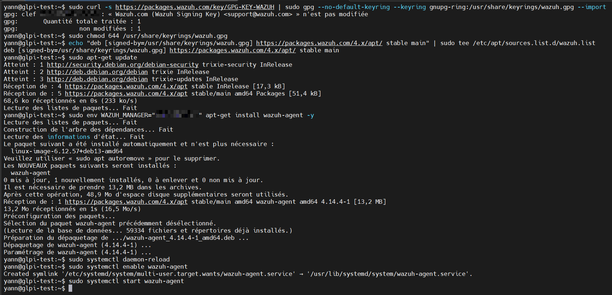

**Validation de l'enrôlement**

Afin de confirmer la bonne intégration du serveur dans le SIEM, une vérification a été effectuée depuis la console d'administration centralisée de Wazuh (Dashboard). L'agent installé sur le serveur glpi-test remonte avec le statut Active, confirmant que le canal de communication chiffré est opérationnel et que les premiers événements de sécurité sont en cours d'indexation.

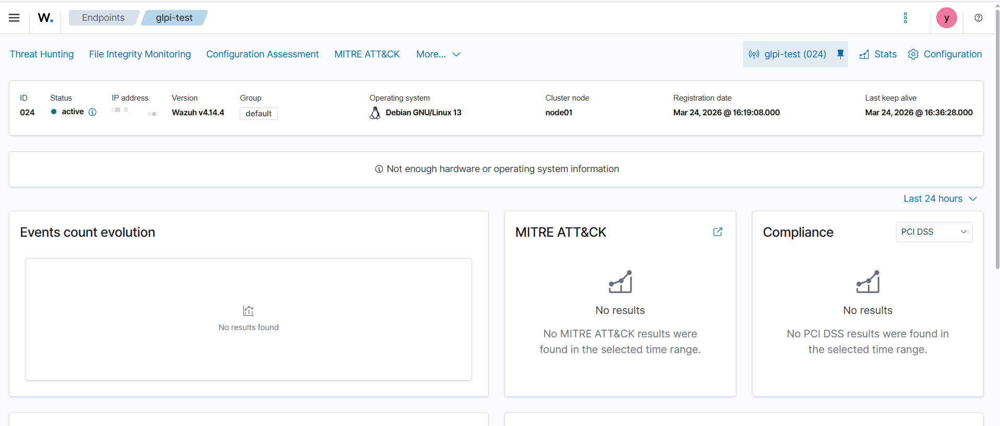

**Sécurisation des communications**

Les communications entre les agents et le serveur Wazuh sont sécurisées via TLS.

Cette sécurisation permet :

* Confidentialité des données
* Intégrité des journaux
* Authentification des composants

Cette configuration permet de garantir la fiabilité de la supervision.

Isolation du serveur de supervision

Le serveur Wazuh est isolé dans un VLAN dédié afin de renforcer la sécurité globale.

Cette segmentation permet :

* Limitation de l'exposition réseau
* Protection contre les attaques latérales
* Sécurisation du socle de supervision

Cette architecture renforce la sécurité globale de l'infrastructure.

### 6.4 Configuration et validation de Wazuh SIEM

Afin de valider le bon fonctionnement de la chaîne de supervision et la pertinence des règles de sécurité déployées, plusieurs scénarios d'incidents ont été simulés sur le serveur GLPI. L'objectif est de démontrer la capacité du SIEM Wazuh à détecter, indexer et alerter en temps réel lors de comportements suspects.

#### 6.4.1 Validation de la détection de Brute Force SSH

Dans cette partie, nous validons la capacité de Wazuh à identifier une activité anormale sur le protocole SSH. Pour ce faire, nous avons réalisé des tentatives d'authentification manuelles répétées avec des identifiants erronés depuis une machine tierce afin de simuler un début d'attaque par force brute.

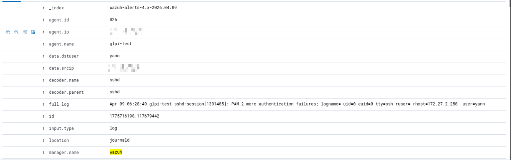

#### 6.4.2 Validation du File Integrity Monitoring (FIM)

Le module FIM (File Integrity Monitoring) est un pilier de la surveillance d'infrastructure. Il a été configuré pour surveiller en temps réel les fichiers sensibles du serveur GLPI, notamment /etc/shadow et /etc/passwd.

Pour valider cette fonctionnalité, une modification manuelle a été effectuée sur le fichier /etc/shadow. Wazuh a instantanément généré une alerte de Niveau 7 (Rule 550: Integrity checksum changed).

La preuve technique ci-dessous est extraite du journal d'alerte. Elle est particulièrement probante car elle affiche la comparaison des empreintes cryptographiques (hashes MD5 et SHA256) avant ("before") et après ("after") la modification, garantissant une traçabilité totale de l'intégrité du fichier.

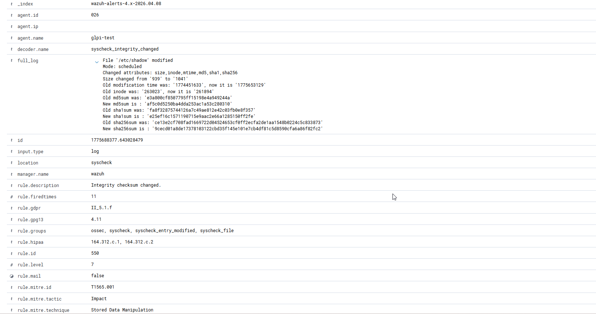

#### 6.4.3 Réponse Active (IPS - Active Response)

L'enjeu ici est de passer d'une détection passive (IDS) à une protection active (IPS). Wazuh est configuré pour interagir directement avec le pare-feu local du serveur GLPI.

Mise en œuvre technique :
Une règle de réponse active a été définie dans le fichier ossec.conf du Manager :

Déclencheur : Alerte de niveau >= 10.

Action : Exécution du script firewall-drop.

Durée : Bannissement de l'IP source via iptables pendant 180 secondes.

Preuve d'exécution :
Le succès de la protection est confirmé par la lecture du journal active-responses.log sur l'agent glpi-test.

Phase d'ajout (08:26:49) : L'IP est bannie dès la détection de l'attaque.

Phase de libération (08:29:49) : L'accès est rétabli automatiquement après 3 minutes.

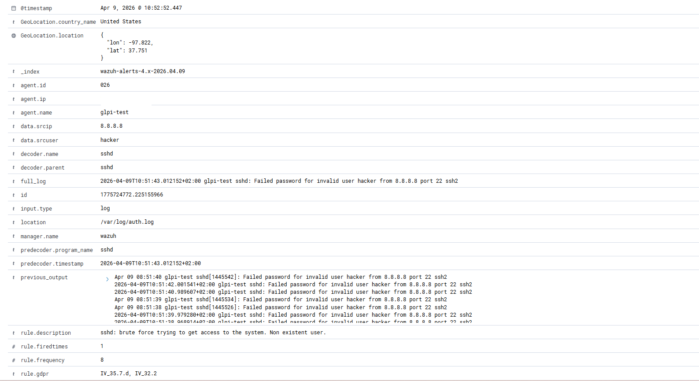

**Preuve d'exécution sur l'agent :** Le succès de la mesure de protection est confirmé par la consultation du journal local active-responses.log sur le serveur **glpi-test.**

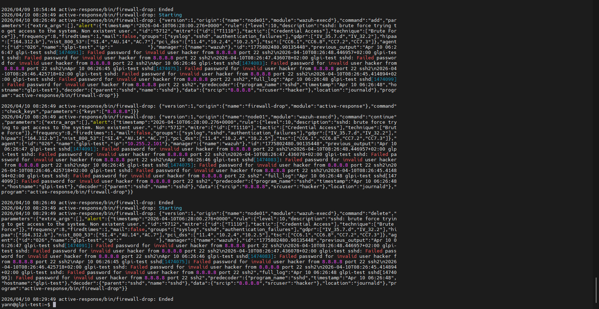

**Analyse du cycle de protection :** 

1. **Phase d'ajout :** Le Manager ordonne le blocage. On observe l'état Starting du script firewall-drop pour l'IP 8.8.8.8. À cet instant, l'attaquant ne peut plus communiquer avec le serveur.
2. **Phase de maintien :** L'agent maintient la règle DROP dans iptables.
3. **Phase de libération :** Conformément au timeout de 180s, le système lance la commande delete, purgeant la règle du pare-feu et rétablissant l'état initial du serveur.

**Conclusion technique :** L'implémentation de l'Active Response permet de sécuriser les services critiques (comme GLPI) contre les scans automatisés et les tentatives d'intrusion répétées, assurant une résilience accrue de l'infrastructure périmétrique.

### 6.5 — Mise en place de Fail2ban

Afin de renforcer la sécurité du serveur, une protection supplémentaire a été mise en place à l’aide de Fail2ban.

Fail2ban permet de bloquer automatiquement les adresses IP réalisant des tentatives d’accès non autorisées, notamment sur le service SSH.

#### 6.5.1 Objectifs de Fail2ban

La mise en place de Fail2ban permet :

* Protection contre les attaques brute force
* Blocage automatique des adresses IP malveillantes
* Renforcement de la sécurité SSH
* Réduction des tentatives d'intrusion

### 6.5.2 Défense en profondeur

Bien que Wazuh dispose d’une fonctionnalité Active Response permettant le blocage automatique des adresses IP, l’ajout de Fail2ban permet de renforcer la stratégie de défense en profondeur.

Wazuh assure :

* Supervision centralisée
* Corrélation des événements
* Analyse des incidents

Fail2ban assure :

* Protection locale rapide
* Blocage immédiat des attaques
* Sécurisation du service SSH

L'utilisation conjointe de Wazuh et Fail2ban permet d’améliorer la sécurité globale de l’infrastructure.

### 6.5.3 Configuration Fail2ban

Fail2ban a été configuré pour protéger le service SSH avec les paramètres suivants :

* maxretry : 3 tentatives
* findtime : 10 minutes
* bantime : 30 minutes

Cette configuration permet de bloquer rapidement les tentatives de brute force.

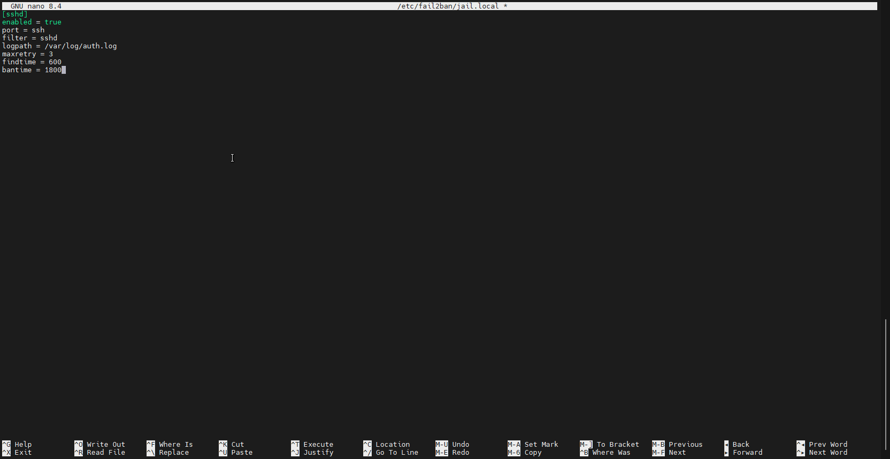

#### 6.5.4 Test de validation

Afin de valider la configuration, plusieurs tentatives de connexion SSH incorrectes ont été réalisées.

Après plusieurs tentatives échouées, l’adresse IP a été automatiquement bloquée par Fail2ban, confirmant le bon fonctionnement de la protection.

Cette configuration permet de renforcer la sécurité du serveur face aux attaques automatisées.

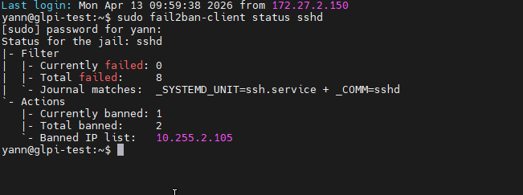

## 7. Les relations avec les principaux acteurs du projet

La réussite de cette preuve de concept a nécessité une communication fluide et régulière avec les différentes parties prenantes au sein de la Direction des Systèmes d'Information (DSI) d'ARCHE Agglo. 

* **Avec la Direction (Mon Tuteur / Responsable Informatique) :**
  
  Les échanges ont été réguliers, principalement lors des phases de cadrage et de validation. J'ai soumis le Document d'Architecture Technique (DAT) à mon tuteur pour validation des choix technologiques (Debian 13, GLPI 11, PHP 8.4) et des exigences de sécurité. Cette relation m'a permis d'obtenir les ressources nécessaires (Machine Virtuelle sur l'hyperviseur Proxmox, adresse IP fixe) et de m'assurer que le projet s'inscrivait bien dans la politique de sécurité globale de la collectivité.

* **Avec l'Équipe Technique (Techniciens Réseau et Support) :**
  
  La relation a été très collaborative. L'équipe technique étant la destinataire finale de la solution (notamment pour l'utilisation du Helpdesk et la consultation de l'inventaire), je les ai impliqués lors des tests fonctionnels. Leurs retours ont été précieux pour valider la pertinence des informations remontées par le scan SNMP sur les switchs. Enfin, je leur ai fourni les livrables documentaires (procédures d'installation et de déploiement) afin de garantir un transfert de compétences efficace.

* **Posture personnelle :**
  
  En tant qu'alternant AIS, j'ai agi en tant que référent technique sur ce projet. J'ai dû vulgariser certains concepts de sécurité (comme la nécessité du durcissement système ou de l'isolation des flux) pour justifier mes choix d'architecture lors des points de suivi, renforçant ainsi ma posture de conseil.


## 8. Synthèse et conclusion

Le projet de déploiement d'un environnement de test GLPI pour ARCHE Agglo s'est achevé avec succès. L'ensemble des objectifs définis dans le cahier des charges a été atteint : la plateforme est fonctionnelle, sécurisée, et répond parfaitement aux exigences du Document d'Architecture Technique (DAT). 

Techniquement, ce projet m'a permis de déployer une infrastructure complète et robuste. J'ai mis en place un serveur LAMP sous Debian 13, configuré de manière sécurisée grâce à des mesures de durcissement telles que le filtrage des flux via UFW, la protection contre les attaques par force brute avec Fail2ban, et la désactivation des accès SSH root. 
Par ailleurs, l'automatisation de l'inventaire via le déploiement de l'agent GLPI et la configuration de la découverte réseau (protocole SNMP) garantit désormais à la collectivité une vision précise, centralisée et constamment à jour de son parc informatique. 

D'un point de vue professionnel, ce projet valide pleinement les compétences visées par mon titre d'Administrateur d'Infrastructures Sécurisées (AIS). Il démontre ma capacité à :

* concevoir une architecture,
* déployer une solution sécurisée,
* superviser un environnement,
* maintenir la sécurité dans le temps grâce à des mécanismes de sauvegarde et de résilience.

**Perspectives et évolutions :**

La maquette ayant fait ses preuves de stabilité et de sécurité, la prochaine étape logique sera la migration de cette configuration vers l'environnement de production. À plus long terme, comme identifié lors de l'étude d'architecture, l'implémentation d'un système d'authentification unique (SSO) basé sur le protocole OpenID Connect constituera une évolution majeure. Cela permettra de centraliser la gestion des identités tout en offrant une expérience utilisateur simplifiée et plus sécurisée aux agents de la collectivité.


## 9. Annexes

* **Annexe 1 :** Document d'Architecture Technique (DAT) GLPI.

[DAT](Document_d'Architecture_Technique_GLPI.md)


* **Annexe 2 :** Procédure d'installation et de préparation de GLPI 11.

[Installation](Procédure_pour_installation_GLPI.md)

* **Annexe 3 :** Procédure de déploiement (Agent GLPI et Inventaire Réseau SNMP).

[SNMP](<Procédure_de_déploiement _Agent_GLPI_et_Inventaire_Réseau_SNMP_sous_Debian.md>)