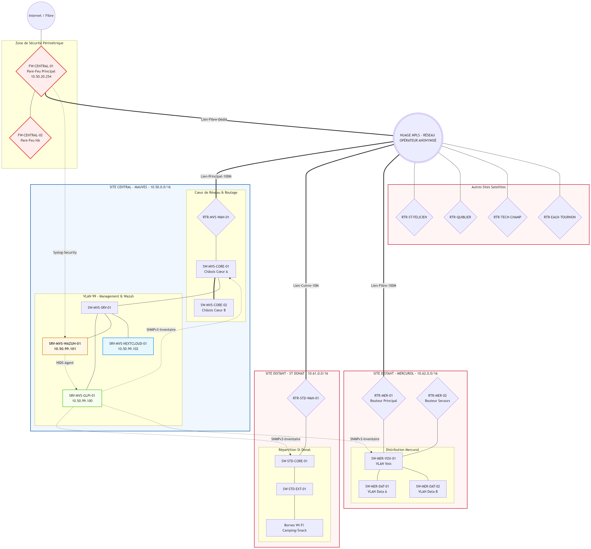
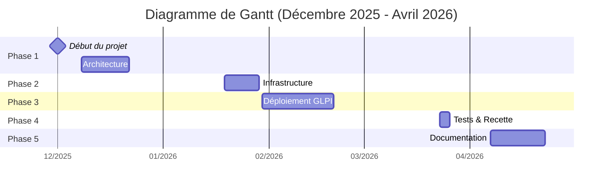
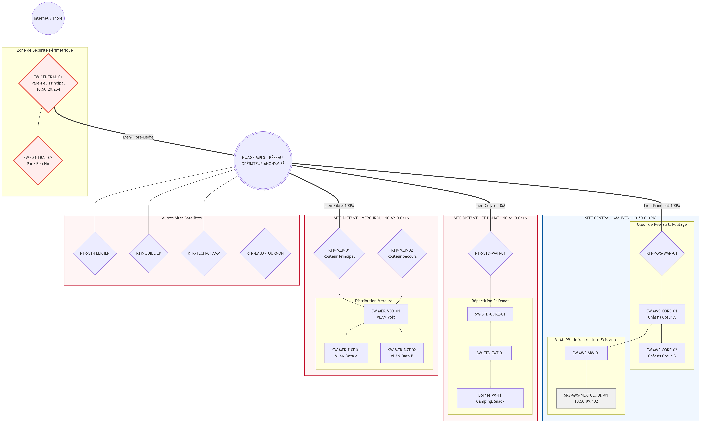
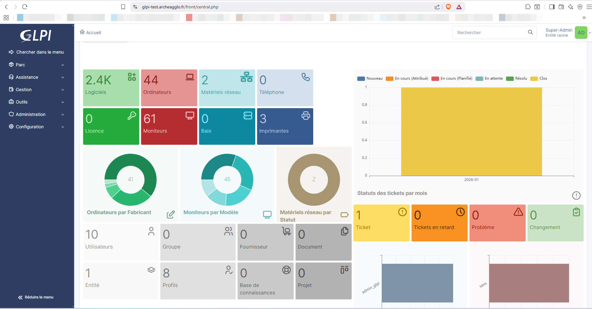
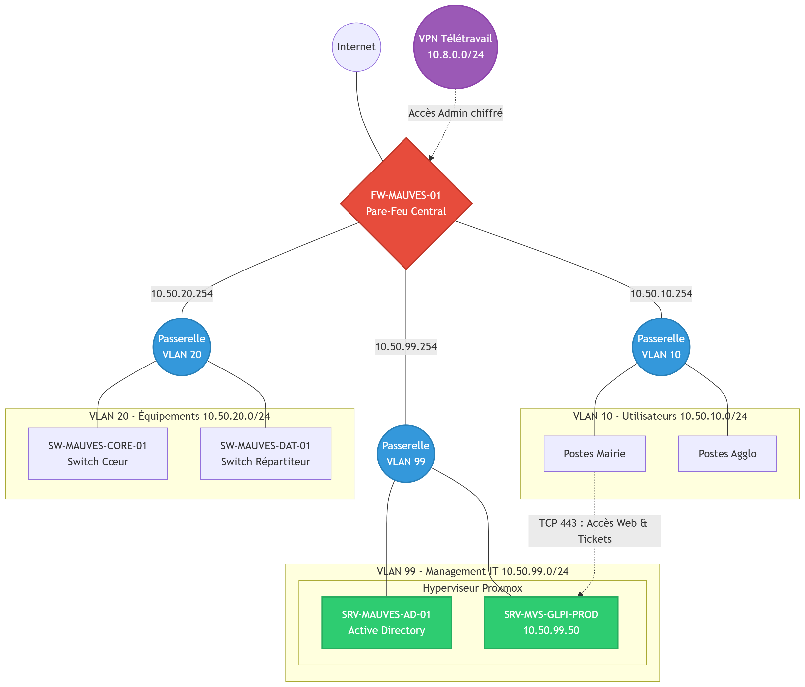

<p align="center">
  
</p>

<h1 align="center">Projet GLPI </h1>

<p align="center">
<strong>Yann ESCRIVA</strong><br>
Alternant Administrateur d’Infrastructures Sécurisées<br><br>
<i>13/10/2025 - 16/10/2026</i>
</p>

<p align="center">
  
</p>

<p align="center">
<b>Projet de déploiement et sécurisation d’une infrastructure SI</b><br>
GLPI • Supervision • Fail2ban • Wazuh
</p>

**Référence du document :** RP-AIS-2026-GLPI  
**Version :** 1.0  
**Date de création :** 13/10/2025  
**Date de modification :** 05/06/2026  
**Confidentialité :** Interne DSI / Restreint (Diffusion examen)  
**Diffusion :** Membres du jury d'examen AIS, Direction des Systèmes d'Information ARCHE Agglo  
**Destinataires :** Jury du Titre Professionnel AIS (Ministère du Travail), Waldeck GOURRU (Tuteur), Formateurs Simplon


## Remerciements

Je tiens à remercier l’ensemble des personnes ayant contribué à la réalisation de ce projet.

Je remercie particulièrement mes formateurs, notamment **Yanis AFENDOU** et **Rémi BRUSSE**, pour leur accompagnement, leur pédagogie et les compétences techniques transmises tout au long de ma formation.

Je remercie également **Christine CAVARETTA** pour son suivi et son accompagnement dans le cadre de mon parcours de formation.

Je tiens à exprimer ma reconnaissance envers mon environnement professionnel, qui m’a permis d’évoluer dans un contexte technique exigeant et formateur, favorisant le développement de mes compétences en administration systèmes et réseaux.

Enfin, je remercie l’ensemble des collaborateurs avec lesquels j’ai pu échanger et travailler, pour leur disponibilité et leur contribution aux différentes phases du projet.
Je tiens également à remercier ARCHE Agglo pour m’avoir accueilli au sein de son service informatique et m’avoir permis de réaliser ce projet dans des conditions professionnelles réelles.

Je remercie particulièrement Monsieur **Waldeck GOURRU**, chef du système d’information, pour sa confiance, son accompagnement et les moyens mis à disposition tout au long du projet.

À toutes et à tous, je renouvelle mes remerciements.


## Table des matières

- [Remerciements](#remerciements)
- [Table des matières](#table-des-matières)
- [Table des mises à jour du document](#table-des-mises-à-jour-du-document)
- [Méthodologie de lecture](#méthodologie-de-lecture)
- [Résumé Exécutif](#résumé-exécutif)
- [Introduction](#introduction)
- [Présentation du candidat](#présentation-du-candidat)
- [Présentation de l'entreprise](#présentation-de-lentreprise)
- [Enjeux du projet](#enjeux-du-projet)
- [Problématique](#problématique)
- [Objectifs réalisés](#objectifs-réalisés)
- [Environnement Technique](#environnement-technique)
- [1. Liste des compétences mises en œuvre dans le cadre du projet](#1-liste-des-compétences-mises-en-œuvre-dans-le-cadre-du-projet)
  - [1.1. Mes missions au quotidien](#11-mes-missions-au-quotidien)
- [2. Cahier des charges ou expression des besoins du projet](#2-cahier-des-charges-ou-expression-des-besoins-du-projet)
  - [2.1. Présentation de l’entreprise](#21-présentation-de-lentreprise)
  - [Présentation de l'organisme de formation](#présentation-de-lorganisme-de-formation)
  - [Compléments Historiques et Budgétaires d'ARCHE Agglo](#compléments-historiques-et-budgétaires-darche-agglo)
    - [2.1.1. Organigramme](#211-organigramme)
    - [2.1.2. Implantation de l’entreprise](#212-implantation-de-lentreprise)
  - [2.2. Contexte](#22-contexte)
  - [2.3. Objectif](#23-objectif)
  - [2.4. La mission](#24-la-mission)
  - [2.5. Expression des besoins](#25-expression-des-besoins)
    - [Analyse Fonctionnelle du besoin](#analyse-fonctionnelle-du-besoin)
      - [A. Le graphique de la "Bête à corne"](#a-le-graphique-de-la-bête-à-corne)
      - [B. Diagramme de "La Pieuvre" (Analyse des fonctions)](#b-diagramme-de-la-pieuvre-analyse-des-fonctions)
    - [Spécifications détaillées des besoins\[cite: 1\]](#spécifications-détaillées-des-besoinscite-1)
- [3. Gestion de projet](#3-gestion-de-projet)
  - [3.1. Planification et suivi](#31-planification-et-suivi)
  - [3.2. Macro-planning](#32-macro-planning)
  - [3.3 Work Breakdown Structure (WBS)](#33-work-breakdown-structure-wbs)
  - [3.4. Environnement humain](#34-environnement-humain)
    - [3.4.1. Les acteurs du projet](#341-les-acteurs-du-projet)
  - [3.5. Matrice RACI](#35-matrice-raci)
    - [Légende](#légende)
  - [3.6. Indicateurs de réussite](#36-indicateurs-de-réussite)
    - [Critères de validation](#critères-de-validation)
  - [3.7. Contraintes du projet](#37-contraintes-du-projet)
    - [Contraintes techniques](#contraintes-techniques)
    - [Contraintes organisationnelles](#contraintes-organisationnelles)
    - [Contraintes de sécurité](#contraintes-de-sécurité)
    - [Contraintes de production](#contraintes-de-production)
    - [Contraintes temporelles](#contraintes-temporelles)
  - [3.8. Périmètre du projet](#38-périmètre-du-projet)
    - [Périmètre inclus](#périmètre-inclus)
    - [Périmètre exclu](#périmètre-exclu)
    - [Environnement du projet](#environnement-du-projet)
    - [Livrables du projet](#livrables-du-projet)
  - [3.9. Enveloppe budgétaire du projet](#39-enveloppe-budgétaire-du-projet)
- [4. Environnement technique](#4-environnement-technique)
  - [4.1. Objectifs de qualité](#41-objectifs-de-qualité)
  - [4.2. Choix des solutions](#42-choix-des-solutions)
    - [4.2.1. Localisation des services](#421-localisation-des-services)
  - [4.3. Tableau comparatif des solutions](#43-tableau-comparatif-des-solutions)
  - [4.4. Proposition de solution](#44-proposition-de-solution)
    - [A. Architecture Réseau Globale](#a-architecture-réseau-globale)
      - [1. Architecture réseau initiale (Avant projet)](#1-architecture-réseau-initiale-avant-projet)
      - [2. Architecture réseau cible (Après projet)](#2-architecture-réseau-cible-après-projet)
    - [B. Plan d'adressage cible et Segmentation (VLAN)](#b-plan-dadressage-cible-et-segmentation-vlan)
    - [C. Les fonctionnalités clés de GLPI exploitées](#c-les-fonctionnalités-clés-de-glpi-exploitées)
    - [D. Focus technique : La différence entre Découverte et Inventaire réseau](#d-focus-technique--la-différence-entre-découverte-et-inventaire-réseau)
  - [4.5. Solution retenue et détails techniques](#45-solution-retenue-et-détails-techniques)
    - [A. Ressources et Partitionnement (Proxmox)](#a-ressources-et-partitionnement-proxmox)
    - [B. Stack applicative logicielle (L.A.M.P)](#b-stack-applicative-logicielle-lamp)
    - [C. Espace d'adressage et Filtrage local (UFW)](#c-espace-dadressage-et-filtrage-local-ufw)
    - [D. Cartographie des Flux Applicatifs et Sécurité](#d-cartographie-des-flux-applicatifs-et-sécurité)
  - [4.6. Sécurisation de l'infrastructure (Durcissement OS et Flux)](#46-sécurisation-de-linfrastructure-durcissement-os-et-flux)
  - [4.7 Analyse des risques (Méthode EBIOS RM)](#47-analyse-des-risques-méthode-ebios-rm)
    - [1. Identification et traitement des risques](#1-identification-et-traitement-des-risques)
    - [2. Cartographie des risques (Matrice de criticité)](#2-cartographie-des-risques-matrice-de-criticité)
  - [4.8 Supervision et exploitation](#48-supervision-et-exploitation)
    - [4.8.1 Déploiement automatisé des agents GLPI](#481-déploiement-automatisé-des-agents-glpi)
    - [4.8.2 Gestion des mises à jour des agents GLPI](#482-gestion-des-mises-à-jour-des-agents-glpi)
    - [4.8.3 Exploitation des fonctionnalités ITSM](#483-exploitation-des-fonctionnalités-itsm)
  - [4.9 Continuité de service](#49-continuité-de-service)
  - [4.10 Justification des choix de sécurité et évolutions](#410-justification-des-choix-de-sécurité-et-évolutions)
- [5. L’organisation de la mise en œuvre](#5-lorganisation-de-la-mise-en-œuvre)
  - [5.1 Déploiement technique et configuration du service](#51-déploiement-technique-et-configuration-du-service)
    - [A. Installation du socle applicatif et liaison PHP-FPM](#a-installation-du-socle-applicatif-et-liaison-php-fpm)
    - [B. Déploiement de l'agent GLPI sous Debian](#b-déploiement-de-lagent-glpi-sous-debian)
    - [C. Installation](#c-installation)
  - [5.2. Schéma détaillé](#52-schéma-détaillé)
    - [A. Architecture détaillée initiale (Avant projet)](#a-architecture-détaillée-initiale-avant-projet)
    - [B. Architecture détaillée cible (Après projet)](#b-architecture-détaillée-cible-après-projet)
  - [5.3. Diagramme de Séquence du Protocole SNMP](#53-diagramme-de-séquence-du-protocole-snmp)
  - [5.4 Politique de sécurité mise en œuvre](#54-politique-de-sécurité-mise-en-œuvre)
    - [Intégration dans la politique de sécurité du SI](#intégration-dans-la-politique-de-sécurité-du-si)
    - [Objectifs de sécurité](#objectifs-de-sécurité)
    - [Analyse des risques (synthèse)](#analyse-des-risques-synthèse)
    - [Mesures mises en œuvre](#mesures-mises-en-œuvre)
    - [Approche globale](#approche-globale)
    - [Amélioration continue](#amélioration-continue)
- [6. Mise en place d'une solution de supervision et de détection d'intrusion](#6-mise-en-place-dune-solution-de-supervision-et-de-détection-dintrusion)
  - [6.1 Mise en place de la supervision avec Wazuh](#61-mise-en-place-de-la-supervision-avec-wazuh)
  - [6.2 Déploiement du socle de sécurité](#62-déploiement-du-socle-de-sécurité)
  - [6.3 Enrôlement des agents (serveur GLPI)](#63-enrôlement-des-agents-serveur-glpi)
  - [6.4 Exploitation et validation de la détection](#64-exploitation-et-validation-de-la-détection)
    - [6.4.1 Détection de brute force SSH](#641-détection-de-brute-force-ssh)
    - [6.4.2 File Integrity Monitoring (FIM)](#642-file-integrity-monitoring-fim)
    - [6.4.3 Réponse active (Active Response)](#643-réponse-active-active-response)
  - [6.5 Mise en place de Fail2ban](#65-mise-en-place-de-fail2ban)
    - [6.5.1 Rôle de Fail2ban](#651-rôle-de-fail2ban)
    - [6.5.2 Complémentarité avec Wazuh](#652-complémentarité-avec-wazuh)
    - [6.5.3 Configuration](#653-configuration)
    - [6.5.4 Test de validation](#654-test-de-validation)
  - [6.6 Conclusion sécurité](#66-conclusion-sécurité)
- [7. Les relations avec les principaux acteurs du projet](#7-les-relations-avec-les-principaux-acteurs-du-projet)
  - [7.1. Accompagnement au changement et Formation du personnel](#71-accompagnement-au-changement-et-formation-du-personnel)
- [8. Retour d'expérience](#8-retour-dexpérience)
  - [Difficultés rencontrées](#difficultés-rencontrées)
  - [Méthodologie adoptée](#méthodologie-adoptée)
  - [Compétences développées](#compétences-développées)
  - [Bilan personnel](#bilan-personnel)
  - [Apports professionnels](#apports-professionnels)
- [9. Synthèse et conclusion](#9-synthèse-et-conclusion)
  - [Objectifs réalisés](#objectifs-réalisés-1)
- [10. Glossaire](#10-glossaire)
  - [A](#a)
  - [C](#c)
  - [D](#d)
  - [F](#f)
  - [G](#g)
  - [H](#h)
  - [I](#i)
  - [M](#m)
  - [N](#n)
  - [P](#p)
  - [R](#r)
  - [S](#s)
  - [V](#v)
  - [W](#w)
- [Bibliographie et Webographie](#bibliographie-et-webographie)
- [11. Annexes](#11-annexes)


## Table des mises à jour du document

| Version | Date | Auteur | Description des modifications |
| :--- | :--- | :--- | :--- |
| 0.1 | 15/12/2025 | Yann ESCRIVA | Création de la structure et rédaction de la partie Architecture (DAT). |
| 0.2 | 15/02/2026 | Yann ESCRIVA | Ajout de la partie Déploiement GLPI et Stack LAMP. |
| 0.3 | 10/04/2026 | Yann ESCRIVA | Intégration des sections Sécurité (Wazuh, Fail2ban) et Tests de validation. |
| 1.0 | 01/06/2026 | Yann ESCRIVA | Finalisation du rapport, relecture et mise en conformité avec le gabarit. |

## Méthodologie de lecture
Ce rapport de projet est structuré de manière chronologique, suivant le cycle de vie du projet (Cadrage, Conception, Réalisation, Validation, Clôture). Les blocs de texte sur fond sombre représentent des commandes à exécuter dans un terminal Linux ou des extraits de fichiers de configuration. Un glossaire et une webographie sont mis à disposition en fin de document pour expliciter les termes techniques et référencer les documentations officielles utilisées.


## Résumé Exécutif

Dans un contexte d'accroissement des cybermenaces et de nécessité d'optimisation de la gestion du parc informatique multi-sites d'ARCHE Agglo, ce projet a pour but de concevoir et déployer une infrastructure sécurisée de gestion et de supervision. 

La solution technique retenue s'articule autour d'un environnement virtualisé (Proxmox / Debian 13) hébergeant la plateforme **GLPI** (pour l'inventaire automatisé et le Helpdesk), couplée au SIEM **Wazuh** et à **Fail2ban** (pour la détection et la réponse active aux incidents de sécurité).

S'appuyant exclusivement sur des technologies Open Source éprouvées, cette architecture représente un **coût de licence logiciel nul (0€)** pour la collectivité. 

Le retour sur investissement sécuritaire et opérationnel est immédiat :
* **Automatisation :** Visibilité exhaustive du parc réseau via des requêtes SNMPv3 chiffrées, réduisant le temps de gestion manuel.
* **Résilience :** Réduction drastique de la surface d'attaque grâce au durcissement système, à l'isolation dans un VLAN de management (VLAN 99), et à un Plan de Reprise d'Activité (PRA) validé via Nextcloud.
* **Supervision proactive :** Capacité inédite à détecter, tracer et bloquer automatiquement les comportements suspects.

Cette preuve de concept valide une architecture hautement sécurisée, prête pour une future mise en production.


## Introduction

Dans le cadre de ma formation au titre professionnel Administrateur d’Infrastructures Sécurisées, j’ai été amené à travailler sur des problématiques liées à la gestion, la sécurisation et la supervision des systèmes d’information.

Au sein d’ARCHE Agglo, le système d’information repose sur une organisation multi-sites interconnectée, nécessitant des outils fiables pour assurer la gestion du parc informatique, la sécurité des systèmes et la supervision des infrastructures.

Cependant, plusieurs limites ont été identifiées :
* absence d’inventaire automatisé
* manque de visibilité sur le parc informatique
* absence de supervision centralisée
* niveau de sécurité perfectible

Dans ce contexte, ce projet a pour objectif de concevoir et de déployer une solution permettant :
* l’automatisation de l’inventaire (GLPI + SNMP)
* la mise en place d’une supervision sécurité (Wazuh)
* le renforcement de la sécurité des systèmes

Ce projet s’inscrit dans une démarche globale d’amélioration du système d’information, en apportant une meilleure visibilité, une sécurité renforcée et une base évolutive pour les futurs besoins.
 
Cependant, l'absence de visibilité sur le parc informatique et le manque de supervision centralisée représentent un risque opérationnel et de sécurité pour la collectivité. Dans un contexte où les cybermenaces sont en constante augmentation, il devient essentiel de disposer d’outils permettant une gestion proactive et sécurisée du système d’information.


## Présentation du candidat

Dans le cadre de ma formation AIS, j’effectue mon alternance au sein d’ARCHE Agglo.

Mon parcours m’a permis de développer des compétences en administration systèmes et réseaux, notamment sur des environnements Linux, la virtualisation et la cybersécurité.

Au cours de ma formation, j’ai travaillé sur :
* l’administration Linux (Debian)
* la virtualisation avec Proxmox
* la supervision (Wazuh)
* la sécurisation des accès (SSH, Fail2ban, UFW)
* l’inventaire automatisé (GLPI, SNMP)

Ce projet s’inscrit dans la continuité de cette montée en compétences et constitue une mise en application concrète des compétences attendues pour le métier d’administrateur d’infrastructures sécurisées.


## Présentation de l'entreprise

ARCHE Agglo est une communauté de communes située entre l’Ardèche et la Drôme, regroupant plusieurs communes et disposant d’un système d’information réparti sur plusieurs sites.

Cette organisation multi-sites repose sur une interconnexion réseau de type MPLS, permettant de centraliser les services informatiques tout en desservant les différents sites distants.

Les enjeux principaux sont :
* la centralisation des services IT
* la gestion du parc informatique multi-sites
* la sécurisation des accès et des données
* la supervision globale de l’infrastructure


## Enjeux du projet

Dans ce contexte, plusieurs enjeux ont été identifiés :

* Améliorer la visibilité sur le parc informatique
* Automatiser l’inventaire des équipements
* Mettre en place une supervision de sécurité efficace
* Renforcer la sécurité des systèmes et des accès
* Fiabiliser la gestion des incidents

Ces enjeux sont essentiels pour garantir la disponibilité, l’intégrité et la confidentialité du système d’information.


## Problématique

Comment mettre en place une solution centralisée permettant d’assurer un inventaire fiable, une supervision efficace et un renforcement de la sécurité, dans un environnement multi-sites contraint, sans impacter l’infrastructure de production existante ?


## Objectifs réalisés
* **Déploiement maîtrisé :** Mise en place d'une stack LAMP optimisée et cloisonnée sous Debian 13.
* **Automatisation de l'inventaire :** Découverte réseau et remontée via le protocole SNMPv3 (chiffré et authentifié).
* **Défense en profondeur :** Sécurisation des flux (HTTPS/LDAPS), durcissement système (UFW, Fail2Ban) et mise en place d'une réponse active.
* **Supervision proactive :** Intégration du SIEM Wazuh pour la détection d'intrusions et le contrôle d'intégrité (FIM).
* **Continuité de service :** Stratégie de sauvegarde PRA de type 3-2-1 (Proxmox, Veeam, Nextcloud).


## Environnement Technique

| Domaine | Technologies |
|--------|-------------|
| Virtualisation | Proxmox |
| OS | Debian 13 |
| Supervision | Wazuh |
| Sauvegarde | Veeam, Nextcloud |
| Réseau | SNMPv3, VLAN |




## 1. Liste des compétences mises en œuvre dans le cadre du projet

Ce projet de déploiement d'un environnement GLPI de test m'a permis de mobiliser plusieurs compétences clés du titre professionnel d'Administrateur d'Infrastructures Sécurisées :

| Compétences visées par le titre AIS                                              | Actions réalisées dans le cadre du projet GLPI de test                                                                                                                            |
| :------------------------------------------------------------------------------- | :-------------------------------------------------------------------------------------------------------------------------------------------------------------------------------- |
| **Administrer et sécuriser les infrastructures**                        | Installation, durcissement et sécurisation d'une machine virtuelle Linux/LAMP pour héberger le l'outil open source GLPI dans un environnement isolé.                              |
| **Concevoir et mettre en oeuvre une solution en réponse à un besoin d’évolution**                              | Configuration du protocole SNMP pour la découverte réseau et test de déploiement automatisé d'agents d'inventaire sur les postes cibles.                                          |
| **Participer à la gestion de la cybersécurité** | Lutte contre le *Shadow IT* via la découverte réseau et cartographie des équipements actifs pour identifier les vulnérabilités du parc (systèmes obsolètes, failles matérielles). |

Ce projet s’inscrit pleinement dans les compétences attendues du titre professionnel d’Administrateur d’Infrastructures Sécurisées.

Il m’a permis de mobiliser l’ensemble des activités du référentiel, notamment :

* l’administration et la sécurisation d’une infrastructure système

* la conception et le déploiement d’un environnement technique sécurisé

* la mise en œuvre de mécanismes de supervision et de maintien en conditions de sécurité

À travers l’analyse des besoins, la mise en place d’une architecture cloisonnée, l’intégration de mesures de sécurité adaptées au contexte, ainsi que la définition d’une stratégie de continuité de service, ce projet démontre ma capacité à intervenir sur l’ensemble du cycle de vie d’une infrastructure sécurisée.

### 1.1. Mes missions au quotidien

En tant qu'alternant en administration d'infrastructures sécurisées au sein d'ARCHE Agglo, mon rôle au quotidien se concentre sur le maintien en conditions opérationnelles de l'infrastructure informatique, répartie sur 41 communes. 

Mes missions principales incluent :
* **Le support utilisateur (Niveau 2 et 3) :** Résolution des incidents complexes, gestion des droits d'accès et accompagnement des agents de la collectivité.
* **L'administration système et réseau :** Supervision des équipements réseaux, gestion des serveurs locaux et maintien de la connectivité entre les différents sites distants de l'agglomération.
* **La gestion de projet et l'amélioration continue :** Déploiement de nouvelles solutions techniques (comme les tests sur l'environnement GLPI) visant à optimiser les processus de l'équipe informatique, fiabiliser les données du parc et renforcer la sécurité globale du système d'information de la collectivité.


## 2. Cahier des charges ou expression des besoins du projet

### 2.1. Présentation de l’entreprise

**Ce qu'est ARCHE Agglo :**
ARCHE Agglo est une collectivité publique (Établissement Public de Coopération Intercommunale) créée en 2017. Située à cheval entre l'Ardèche et la Drôme, elle regroupe 41 communes pour environ 60 000 habitants.

Ses 5 grands pôles d'activités sont :
* **L'économie :** Aider les entreprises et développer l'emploi local.
* **L'environnement :** Collecter les déchets et entretenir les cours d'eau.
* **Les services aux habitants :** Gérer la petite enfance (crèches) et l'action sociale.
* **L'aménagement :** Organiser les transports et la politique du logement.
* **Le tourisme :** Développer l'attractivité (office de tourisme, sentiers de randonnée).

### Présentation de l'organisme de formation
**SIMPLON.CO** est un réseau d'entreprises sociales et solidaires qui propose des formations intensives et qualifiantes aux métiers du numérique. Le parcours d'Administrateur d'Infrastructures Sécurisées (AIS) dispensé prépare aux compétences clés de gestion des systèmes, de virtualisation, d'automatisation et de durcissement de la sécurité des SI en entreprise.

### Compléments Historiques et Budgétaires d'ARCHE Agglo
Née en 2017 de la fusion de trois communautés de communes, ARCHE Agglo gère un territoire vaste à forte interconnexion. En tant qu'Établissement Public, la collectivité ne réalise pas de "Chiffre d'Affaires" mais fonctionne avec un **budget annuel consolidé (fonctionnement et investissement) d'environ 60 à 70 millions d'euros**. Ce budget impose une gestion rigoureuse et une rationalisation des coûts IT, ce qui justifie le choix constant de solutions Open Source robustes et sans coût de licence (GLPI, Wazuh) dans le cadre de ce projet.

#### 2.1.1. Organigramme


#### 2.1.2. Implantation de l’entreprise

**Les sites principaux :**


**Tous les sites :**


### 2.2. Contexte

ARCHE Agglo dispose déjà d’une solution GLPI en environnement de production afin d’assurer la gestion du parc informatique et le support aux utilisateurs.

Cependant, l’évolution des besoins internes, notamment en matière d’inventaire automatisé et de visibilité sur les équipements réseau, a conduit à envisager l’intégration de nouvelles fonctionnalités telles que :

* le déploiement d’agents d’inventaire sur les postes,
* la découverte réseau via le protocole SNMP.

La mise en œuvre de ces fonctionnalités directement sur l’environnement de production aurait présenté un risque potentiel d’instabilité, notamment en cas d’erreur de configuration ou de mauvaise interprétation des données remontées.

Dans une logique de sécurisation du système d’information et de limitation des impacts sur les services existants, il est apparu nécessaire de concevoir un environnement de test isolé permettant :

* de valider les procédures techniques,
* de tester les flux réseau nécessaires,
* d’anticiper les éventuelles contraintes de sécurité.

Ce projet s’inscrit donc dans une démarche d’amélioration continue du système d’information, visant à renforcer la connaissance du parc informatique tout en garantissant la stabilité de l’environnement de production.

### 2.3. Objectif

Le projet a pour objectif de concevoir, déployer et sécuriser une maquette (environnement de test/pré-production) d'un serveur GLPI. Cet environnement permettra de valider techniquement la procédure d'installation sécurisée, le déploiement automatisé des agents d'inventaire, et la configuration du scan SNMP pour les équipements réseau, avant d'envisager une quelconque mise en production.

### 2.4. La mission

Ma mission principale dans le cadre de ce projet est de réaliser les actions suivantes de bout-en-bout :
* Concevoir l'architecture de l'environnement de test et rédiger le Document d'Architecture Technique (DAT).
* Installer et sécuriser le serveur Linux hébergeant cette maquette.
* Définir, tester et valider une stratégie de déploiement massif des agents d'inventaire.
* Configurer et tester l'inventaire réseau automatisé via le protocole SNMP pour les équipements non-agentés (switchs, imprimantes).
* Produire les livrables documentaires (procédures d'installation et de déploiement) transférables à terme vers la production.

### 2.5. Expression des besoins

Pour répondre aux contraintes techniques et fonctionnelles d'ARCHE Agglo, la solution mise en place doit respecter les besoins suivants :

#### Analyse Fonctionnelle du besoin

##### A. Le graphique de la "Bête à corne"
Pour valider l'existence réelle du besoin, l'outil d'analyse "Bête à corne" permet de poser trois questions fondamentales :
*   **À qui le produit rend-il service ?** À la Direction des Systèmes d'Information (DSI) et aux techniciens support d'ARCHE Agglo.
*   **Sur quoi le produit agit-il ?** Sur la visibilité, la sécurité et la connaissance fine du parc informatique multi-sites.
*   **Dans quel but ?** Centraliser la gestion de parc informatique, automatiser l'inventaire via scan réseau et détecter de manière proactive les menaces de sécurité sans impacter la production.

##### B. Diagramme de "La Pieuvre" (Analyse des fonctions)
La solution globale (GLPI + Wazuh + Agents) est au centre d'un écosystème de contraintes et d'interactions qu'on peut lister ainsi :
*   **Fonction Principale (FP1) :** Permettre à l'équipe IT de visualiser l'intégralité du parc et ses événements de sécurité depuis une interface centralisée.
*   **Fonction Contrainte 1 (FC1 - Sécurité/ANSSI) :** Chiffrer l'ensemble des flux (HTTPS, LDAPS, SNMPv3 AuthPriv) pour empêcher l'interception de données sur le réseau.
*   **Fonction Contrainte 2 (FC2 - Infrastructure) :** S'intégrer parfaitement sur l'infrastructure existante (Hyperviseur Proxmox, Active Directory).
*   **Fonction Contrainte 3 (FC3 - Économie) :** S'appuyer uniquement sur des briques applicatives Open Source (coût de licence logiciel égal à 0€).

#### Spécifications détaillées des besoins[cite: 1]

* **Centralisation :** Une interface web unique accessible par l'équipe IT pour consolider les données.
* **Automatisation :** La remontée des informations (hardware, software, réseau) doit s'effectuer sans intervention humaine régulière.
* **Découverte réseau :** Capacité à scanner les différents sous-réseaux (VLANs) des sites distants via le protocole SNMP.
* **Sécurité et Isolation :** L'environnement de test doit être parfaitement cloisonné pour ne pas impacter la production, tout en assurant des flux chiffrés (HTTPS).
* **Économie :** En tant que collectivité publique, il est primordial de privilégier une solution Open Source robuste (sans coût de licence) cohérente avec l'existant.


## 3. Gestion de projet

### 3.1. Planification et suivi

Pour mener à bien ce projet de déploiement, j’ai opté pour une approche de gestion de projet visuelle et itérative, inspirée de la méthode Kanban.

Cette méthode m’a permis de structurer l’avancement du projet tout en conservant une flexibilité indispensable dans un contexte d’alternance, où les missions de Maintien en Conditions Opérationnelles peuvent ponctuellement impacter le temps dédié au projet.

Le suivi des tâches a été réalisé via l’outil Trello, organisé en plusieurs colonnes permettant de visualiser l’état d’avancement du projet à chaque étape de sa réalisation.

Cette organisation comprenait :

* Backlog (À faire) : ensemble des tâches identifiées lors de la phase de conception, constituant le périmètre initial du projet (ex : rédaction du DAT, création de la VM, sécurisation du serveur).
* En cours : tâches en cours de réalisation à un instant donné, permettant de prioriser les actions en fonction des contraintes techniques ou organisationnelles.
* En attente / Bloqué : tâches dépendantes d’un facteur externe, comme une validation, une ressource ou une configuration réseau (ex : ouverture de flux).
* Terminé : tâches finalisées, validées techniquement et documentées.

Bien que l’ensemble des tâches soit aujourd’hui achevé, cette structuration a permis tout au long du projet de :

* maintenir une vision claire de l’avancement,
* gérer les dépendances techniques,
* sécuriser la progression jusqu’à la phase de clôture.

### 3.2. Macro-planning



Le projet s'est déroulé en plusieurs phases distinctes, allant de l'expression du besoin jusqu'à la livraison de la documentation. Afin de sécuriser l'avancement, des jalons de validation ont été définis avec la DSI à la fin de chaque étape clé :

| Phase                                   | Période                           | Description des tâches                                                                                      | Livrables associés                                           | Jalons (Points de validation)                                      |
| :-------------------------------------- | :-------------------------------- | :---------------------------------------------------------------------------------------------------------- | :----------------------------------------------------------- | :----------------------------------------------------------------- |
| **1. Cadrage et Architecture**          | **8 au 22 Décembre 2025**         | Analyse des besoins, étude de l'existant, choix des solutions et conception de l'architecture.              | Cahier des charges, DAT (Document d'Architecture Technique). | **Jalon 1 :** Validation de l'architecture (DAT) par le tuteur     |
| **2. Préparation de l'infrastructure**  | **19 au 29 Janvier 2026**         | Création de la VM sur Proxmox, installation de Debian 13, configuration réseau et sécurité (Firewall, SSH). | VM opérationnelle et sécurisée.                              | **Jalon 2 :** Serveur accessible, durci et isolé sur le réseau     |
| **3. Déploiement applicatif**           | **30 Janvier au 20 Février 2026** | Installation de la stack LAMP, déploiement de GLPI, connexion au LDAP et configuration de base.             | Interface GLPI accessible en HTTPS.                          | **Jalon 3 :** Application web fonctionnelle et connectée à l'AD    |
| **4. Tests et Validation (Inventaire)** | **23 au 26 Mars 2026**            | Déploiement d'agents de test, configuration de l'inventaire SNMP, validation des remontées d'informations.  | Remontée des équipements dans la maquette.                   | **Jalon 4 :** Réussite du premier scan SNMP et intégration en base |
| **5. Documentation et Clôture**         | **7 au 23 Avril 2026**            | Rédaction des procédures d'installation, de déploiement et d'exploitation pour l'équipe technique.          | Procédures documentées sur GitHub.                           | **Jalon 5 :** Recette finale et livraison des livrables à l'équipe |

### 3.3 Work Breakdown Structure (WBS)

| 1. Analyse & prépa | 2. Conception | 3. Déploiement | 4. Sécurisation | 5. Supervision | 6. Sauvegarde | 7. Validation | 8. Documentation |
| :--- | :--- | :--- | :--- | :--- | :--- | :--- | :--- |
| 1.1 Analyse du besoin | 2.1 Définition de l'architecture | 3.1 Création VM Proxmox | 4.1 Configuration pare-feu UFW | 5.1 Installation Wazuh | 6.1 Mise en place sauvegarde Proxmox | 7.1 Tests fonctionnels | 8.1 Documentation technique |
| 1.2 Étude de l'existant | 2.2 Choix des solutions techniques | 3.2 Installation Debian 13 | 4.2 Installation Fail2ban | 5.2 Déploiement des agents | 6.2 Configuration Veeam | 7.2 Tests sécurité | 8.2 Rédaction du rapport |
| 1.3 Identification des contraintes | 2.3 Conception du schéma d'infrastructure | 3.3 Installation Stack LAMP | 4.3 Sécurisation accès SSH | 5.3 Configuration des alertes | 6.3 Intégration Nextcloud | 7.3 Validation infrastructure | 8.3 Préparation présentation orale |
| 1.4 Analyse des risques | 2.4 Définition de la stratégie de sauvegarde | 3.4 Installation et configuration GLPI | 4.4 Durcissement système | | 6.4 Tests de restauration | | |

### 3.4. Environnement humain

#### 3.4.1. Les acteurs du projet

La réussite de ce projet repose sur la collaboration de plusieurs acteurs au sein du service informatique d'ARCHE Agglo :

* **Moi-même (Alternant Administrateur d'Infrastructures Sécurisées) - *Chef de projet*** : 
  En charge de l'analyse, de la conception (DAT), du déploiement technique de la maquette, de la réalisation des tests d'inventaire et de la rédaction de la documentation.
  
* **Mon Tuteur en entreprise / Chef du SI** : 
  Il valide l'architecture proposée, alloue les ressources matérielles nécessaires (accès à l'hyperviseur Proxmox, attribution des adresses IP) et s'assure de l'alignement du projet avec la stratégie informatique de la collectivité.
  
* **L'équipe technique (Techniciens Support et Réseau) - *Utilisateurs finaux*** : 
  Consultés lors de la phase d'expression des besoins, ils sont les futurs utilisateurs de la procédure d'exploitation et interviennent pour valider que les informations remontées par la maquette de test sont pertinentes pour leur travail quotidien.

### 3.5. Matrice RACI

La matrice RACI permet de définir clairement les rôles et responsabilités des différents acteurs du projet.

| Activités du projet | Alternant AIS | Tuteur / Chef du SI | Équipe technique |
|---------------------|-------------------------------|---------------------|------------------|
| Analyse du besoin | R | A | C |
| Rédaction du DAT | R | A | C |
| Conception de l'architecture | R | A | C |
| Création de la VM Debian | R | C | I |
| Installation GLPI | R | C | I |
| Configuration MariaDB | R | C | I |
| Mise en place SNMP | R | C | C |
| Configuration sécurité (UFW, Fail2ban) | R | C | I |
| Déploiement Wazuh | R | C | I |
| Tests techniques | R | A | C |
| Validation fonctionnelle | R | A | C |
| Documentation | R | C | I |
| Présentation du projet | R | A | I |

#### Légende

* **R (Responsible)** : Responsable de la réalisation  
* **A (Accountable)** : Valide et prend les décisions  
* **C (Consulted)** : Consulté pour expertise  
* **I (Informed)** : Informé de l'avancement

### 3.6. Indicateurs de réussite

Afin de mesurer l'efficacité et la réussite du projet, plusieurs indicateurs ont été définis.  
Ces indicateurs permettent de valider que l'infrastructure mise en place répond aux objectifs fonctionnels, techniques et de sécurité.

| Objectif | Indicateur de réussite | Méthode de validation |
|----------|------------------------|------------------------|
| Disponibilité du service GLPI | Accès à l'interface GLPI sans interruption | Test d'accès via navigateur web |
| Sécurisation des accès | Accès HTTPS fonctionnel | Vérification certificat SSL |
| Inventaire automatique | Remontée des postes dans GLPI | Test agent GLPI |
| Supervision de sécurité | Détection d'événements dans Wazuh | Simulation d'événements |
| Protection contre attaques | Blocage IP via Fail2ban | Test tentative brute force SSH |
| Collecte SNMP | Remontée des équipements réseau | Test interrogation SNMP |
| Sauvegarde fonctionnelle | Sauvegarde automatisée opérationnelle | Vérification sauvegarde Veeam |
| Restaurabilité du service | Restauration VM fonctionnelle | Test snapshot Proxmox |
| Performance système | Temps de réponse acceptable | Test utilisation GLPI |
| Documentation complète | Procédures disponibles | Vérification dossier documentaire |

#### Critères de validation

Le projet est considéré comme réussi si :

* Le service GLPI est accessible en HTTPS
* L'inventaire automatique fonctionne correctement
* La supervision Wazuh détecte les événements de sécurité
* La protection Fail2ban bloque les tentatives malveillantes
* Les sauvegardes sont fonctionnelles et restaurables
* La documentation technique est complète et exploitable

### 3.7. Contraintes du projet

La mise en œuvre du projet s'inscrit dans un environnement technique et organisationnel comportant plusieurs contraintes à prendre en compte.

#### Contraintes techniques

* Utilisation de l'infrastructure virtualisée existante (Proxmox)
* Ressources matérielles limitées pour la machine virtuelle de test
* Compatibilité avec l'environnement réseau existant
* Respect des politiques de sécurité de la collectivité
* Intégration avec les outils déjà en place (Nextcloud, supervision existante)

#### Contraintes organisationnelles

* Projet réalisé dans le cadre d'une alternance avec un temps limité
* Disponibilité limitée des équipes techniques pour les validations
* Validation obligatoire par le tuteur avant certaines étapes critiques
* Respect du calendrier de formation et des périodes en entreprise

#### Contraintes de sécurité

* Respect des bonnes pratiques de cybersécurité
* Isolation de l'environnement de test
* Limitation des droits d'accès à l'infrastructure
* Protection des données de test

#### Contraintes de production

* Aucun impact sur l'infrastructure de production existante
* Déploiement dans un environnement de test isolé
* Préservation de la continuité des services existants

#### Contraintes temporelles

* Projet à réaliser sur la durée de l'alternance
* Respect des jalons définis dans le macro planning
* Livraison du projet dans les délais pédagogiques

### 3.8. Périmètre du projet

Afin de cadrer précisément le projet, il est nécessaire de définir clairement les éléments inclus et exclus du périmètre.

#### Périmètre inclus

Le projet comprend les éléments suivants :

* Mise en place d'une machine virtuelle sous Proxmox
* Installation et configuration de GLPI
* Mise en place de l'inventaire automatique via agent GLPI
* Configuration du protocole SNMP pour la supervision
* Intégration de la supervision de sécurité avec Wazuh
* Mise en place de Fail2ban pour la protection contre les attaques
* Sécurisation de l'accès au service via HTTPS
* Réalisation des tests de fonctionnement
* Rédaction de la documentation technique (DAT)
* Élaboration des procédures d'exploitation

#### Périmètre exclu

Les éléments suivants ne font pas partie du projet :

* Déploiement en production sur l'ensemble du parc informatique
* Migration complète des équipements existants
* Formation complète des utilisateurs finaux
* Intégration avec l'ensemble du système d'information existant
* Supervision complète de tous les équipements réseau de la collectivité
* Mise en place d'une haute disponibilité

#### Environnement du projet

Le projet est réalisé dans :

* Un environnement virtualisé sous Proxmox
* Une infrastructure de test isolée
* Un réseau interne dédié à la maquette
* Une machine virtuelle dédiée au projet

#### Livrables du projet

Les livrables attendus sont :

* Maquette fonctionnelle GLPI sécurisée
* Documentation d'architecture technique
* Procédures d'installation et d'exploitation
* Rapport de projet
* Résultats des tests de validation

### 3.9. Enveloppe budgétaire du projet

Bien que le projet s'appuie exclusivement sur des technologies Open Source gratuites, la mise en œuvre d'une telle infrastructure engendre des coûts indirects liés aux ressources humaines et matérielles de la collectivité :

| Poste de dépense | Solution retenue | Coût Logiciel | Coût Estimé (Ressources / Temps) |
| :--- | :--- | :--- | :--- |
| **Système & Application** | Debian 13 / GLPI 11 | 0 € | Implication Alternant AIS (environ 120 heures de travail valorisées) |
| **Supervision Sécurité** | Wazuh SIEM / XDR | 0 € | Temps de supervision et validation de la DSI (10 heures tuteur) |
| **Protection Locale** | UFW / Fail2ban | 0 € | Inclus dans le temps de durcissement système |
| **Hébergement & Infra** | VM de test sur Proxmox | 0 € | Allocation de ressources existantes (2 vCPU, 4 Go RAM, 50 Go SSD) |
| **Stratégie Sauvegarde** | Proxmox / Veeam (licence existante) | 0 € | Allocation espace de stockage sur NAS local + Cloud Nextcloud |
| **TOTAL** | | **0 €** | **~ 130 heures de ressources humaines internes** |


## 4. Environnement technique

### 4.1. Objectifs de qualité

Avant tout déploiement technique, l'analyse des besoins et des risques a permis de définir les objectifs de qualité suivants pour l'environnement GLPI :
* **Disponibilité :** Garantir un accès constant au service de gestion de parc et au helpdesk (mesures de réduction des risques : sauvegardes régulières, snapshots VM).
* **Intégrité :** S'assurer que les données d'inventaire et les bases de données (MariaDB) ne soient pas corrompues ou perdues.
* **Sécurité et Confidentialité :** Protéger l'application contre les failles (MCO régulier, flux HTTPS) et sécuriser l'authentification (LDAPS).
* **Évolutivité :** Prévoir une architecture capable d'absorber une future charge de production (ajout de RAM/CPU), d'intégrer à terme un système SSO (OpenID Connect) et d'évoluer vers une architecture hybride grâce à l'intégration d'un cloud privé Nextcloud.

Maintenabilité : Permettre une restauration rapide du service grâce aux sauvegardes et snapshots.

### 4.2. Choix des solutions

Le choix s'est porté sur des technologies Open Source robustes et reconnues sur le marché, garantissant une maîtrise totale des coûts et de la sécurité. 
L'infrastructure repose sur une Machine Virtuelle (VM) équipée du système d'exploitation **Debian 13**, hébergeant une stack **LAMP** (Linux, Apache, MariaDB, PHP).

#### 4.2.1. Localisation des services

* **Modèle de déploiement :** sur site.  
* **Hébergement :** La machine virtuelle est hébergée sur l'infrastructure virtualisée existante d'ARCHE Agglo, gérée par l'hyperviseur **Proxmox**.  
* **PRA / Sauvegarde :** La stratégie de sauvegarde respecte la **règle 3-2-1** (3 copies, 2 supports différents dont un NAS local, 1 copie hors site dans le Cloud) automatisée via **Veeam Backup**.

**Infrastructure Cloud privé**

Une solution de cloud privé basée sur Nextcloud était déjà déployée au sein de l’infrastructure interne d’ARCHE Agglo.

Cette solution est hébergée sur l’infrastructure virtualisée de la collectivité, permettant de garantir la souveraineté des données et la maîtrise complète de l’environnement technique.

Dans le cadre de ce projet, cette solution a été intégrée à l’architecture globale afin de renforcer la continuité de service et la stratégie de sauvegarde hors site.

Le serveur Nextcloud permet :

* Le stockage centralisé des sauvegardes  
* Le partage sécurisé des fichiers  
* L'accès distant sécurisé pour les administrateurs  
* Le support d'une sauvegarde hors site dans le cadre du PRA  

Caractéristiques techniques :

* Serveur : SRV-MVS-NEXTCLOUD-01  
* Hébergement : Infrastructure interne ARCHE Agglo  
* Accès sécurisé : HTTPS  
* Utilisation : Sauvegarde hors site et partage sécurisé  

L'intégration de cette solution existante permet de mettre en évidence une architecture hybride combinant infrastructure locale et cloud privé interne, renforçant ainsi la résilience globale du système d'information.

### 4.3. Tableau comparatif des solutions

Pour répondre aux besoins d'inventaire automatisé et de gestion de parc, plusieurs solutions ont été étudiées :

| Critères / Fonctionnalités           | Solution 01 : GLPI + GLPI Inventory | Solution 02 : OCS Inventory |    Solution 03 : Snipe-IT    |
| :----------------------------------- | :---------------------------------: | :-------------------------: | :--------------------------: |
| **Inventaire automatisé par Agent**  |                 Oui                 |             Oui             | Non (Saisie manuelle ou API) |
| **Découverte réseau (SNMP)**         |                 Oui                 |             Oui             |             Non              |
| **Gestion du Helpdesk (Tickets)**    |                 Oui                 |             Non             |             Non              |
| **Solution Open Source et gratuite** |                 Oui                 |             Oui             |  Oui (version auto-hébérgé)  |
| **Cohérence avec l'existant (Prod)** |                 Oui                 |             Non             |             Non              |

### 4.4. Proposition de solution

La Solution 01 (GLPI) est retenue. Bien que son interface d'administration soit parfois dense, elle est la seule à couvrir nativement l'ensemble du périmètre fonctionnel exigé : gestion de parc complète (hardware/software), helpdesk intégré, et découverte réseau via SNMP. De plus, la collectivité utilisant déjà GLPI en production, le choix de cette solution pour la maquette de test garantit une transférabilité immédiate des compétences et des scripts développés.

Afin de garantir un haut niveau de sécurité, l'architecture cible a été pensée pour isoler les services et contrôler strictement les flux réseau.

#### A. Architecture Réseau Globale

L'évolution de l'infrastructure réseau et de la cinématique des flux applicatifs est découpée en deux phases distinctes afin de bien matérialiser les apports techniques du projet.

##### 1. Architecture réseau initiale (Avant projet)
Dans la configuration d'origine, l'ancien serveur GLPI de production (`SRV-MVS-GLPI-PROD`) est isolé sur l'adresse IP `10.50.99.50`. Son rôle est purement passif : il reçoit uniquement les requêtes HTTPS (port TCP 443) provenant des postes de travail des utilisateurs (VLAN 10 Mairie et Agglo) pour la saisie manuelle des tickets de support. À ce stade, il n'existe aucune découverte automatisée des équipements du réseau ni de centralisation des événements de sécurité.



##### 2. Architecture réseau cible (Après projet)
Cette topologie représente l'intégration finale de la solution de test au sein du VLAN 99. Le nouveau serveur GLPI de maquette (`10.50.99.100`) pilote désormais la découverte et l'inventaire automatique des commutateurs du VLAN 20 en utilisant le protocole sécurisé SNMPv3 AuthPriv (port UDP 161). 

L'évolution majeure réside également dans l'introduction du serveur SIEM/XDR Wazuh (`10.50.99.101`), qui collecte en continu les journaux d'événements et les logs applicatifs chiffrés du serveur GLPI via le port TCP 1514. En local, le couplage avec Fail2ban permet de déclencher des réponses actives immédiates en cas de détection de brute force.


#### B. Plan d'adressage cible et Segmentation (VLAN)

Pour éviter toute compromission depuis les postes utilisateurs et cloisonner l'administration, l'infrastructure s'appuie sur une segmentation logique stricte de niveau 2. La maquette virtualisée sous Proxmox valide le plan d'adressage cible suivant pour le site principal :
* **VLAN 10 - Utilisateurs (Bureautique) :** `10.50.10.0/24` (Réseau standard hébergeant les postes de travail des agents).
* **VLAN 20 - Équipements Réseaux :** `10.50.20.0/24` (Réseau dédié aux interfaces de management des switchs, routeurs et bornes Wi-Fi).
* **VLAN 99 - Management (Serveurs IT) :** `10.50.99.0/24` (Réseau d'administration isolé hébergeant le serveur GLPI avec l'IP statique `10.50.99.100`, et le serveur SIEM Wazuh avec l'IP `10.50.99.101`).
* **Réseau VPN - Télétravail IT :** `10.8.0.0/24` (Plage d'adresses attribuée dynamiquement aux techniciens se connectant à distance de manière chiffrée pour administrer l'infrastructure).

#### C. Les fonctionnalités clés de GLPI exploitées

Au-delà de la simple installation du socle web, la valeur ajoutée du projet réside dans l'exploitation des modules avancés de GLPI pour structurer le système d'information :
* **La CMDB (Gestion de parc) :** Elle permet de maintenir un inventaire exhaustif et dynamique du matériel (PC, serveurs, équipements réseau) et des licences logicielles, offrant une excellente visibilité pour contrer le Shadow IT.
* **Le Helpdesk (aligné ITIL) :** Il offre une gestion centralisée du cycle de vie des tickets (Incidents et Demandes), le suivi des accords de niveau de service (SLA), et permet la constitution d'une base de connaissances technique.

#### D. Focus technique : La différence entre Découverte et Inventaire réseau

Pour automatiser la remontée des équipements réseau sans agent, le projet exploite deux mécanismes distincts mais complémentaires opérés par l'agent GLPI :

1. **La Découverte Réseau :** L'agent effectue un balayage actif d'une plage d'adresses IP cible (ex: `10.50.20.0/24` pour le site principal ou `10.61.20.0/24` pour St Donat) en testant les identifiants SNMPv3 configurés. Il d'étecte les équipements joignables et crée une fiche basique dans la base GLPI contenant l'adresse IP, l'adresse MAC et le nom de l'équipement.
2. **L'Inventaire Réseau :** Une fois le switch administrable découvert, l'agent lance des requêtes SNMP approfondies pour lire ses tables internes (tables de routage, tables ARP, et tables FDB/MAC associées aux ports physiques). C'est ce processus complexe qui permet à GLPI de cartographier la topologie physique et de savoir précisément quel ordinateur est connecté sur quel port physique du switch.

### 4.5. Solution retenue et détails techniques

Le déploiement technique de la solution retenue s'articule autour des caractéristiques suivantes, pensées pour garantir performance et sécurité :

#### A. Ressources et Partitionnement (Proxmox)
La machine virtuelle hébergeant GLPI est dimensionnée selon les recommandations de l'éditeur, avec une isolation stricte des données via LVM :
* **vCPU :** 2 vCPU (Suffisant pour le traitement PHP/Web standard).
* **RAM :** 4 Go (Minimum recommandé, évolutif).
* **Stockage :** 50 Go (SSD) avec un partitionnement LVM strict pour isoler les composants critiques et prévenir la saturation du système :
  * `/` : 15 Go (Système Debian 13 + LAMP + GLPI)
  * `/var` : 10 Go (Données applicatives et cache)
  * `/var/log` : 5 Go (Journaux système)
  * `/var/lib/mysql` : 15 Go (Base de données)
  * `/home` : 5 Go (Comptes administrateurs)

#### B. Stack applicative logicielle (L.A.M.P)
* **Serveur Web :** Apache2
* **Base de données :** MariaDB 10.11 minimum
* **Langage :** PHP 8.4-fpm (Version requise pour la compatibilité avec GLPI 11, avec extensions `mysqli`, `curl`, `gd`, `intl`, `ldap`, `zip`, etc.)

#### C. Espace d'adressage et Filtrage local (UFW)

Le serveur dispose d'une adresse IPv4 fixe (`10.50.99.100`) et d'un enregistrement DNS. En complément du pare-feu périmétrique, les ouvertures de ports locales (Firewall UFW) sont strictement limitées :

| Direction | Port | Protocole | Service | Justification |
| :--- | :--- | :--- | :--- | :--- |
| **Entrant (IN)** | **80** | **TCP** | **HTTP** | **Flux web applicatif et agents relayés par le Reverse Proxy NPM** |
| **Entrant (IN)** | 22 | TCP | SSH | Administration (restreint aux IP administrateurs) |
| **Sortant (OUT)** | 443 | TCP | HTTPS | Mises à jour système et plugins |
| **Sortant (OUT)** | 636 | TCP | LDAPS | Authentification sécurisée vers l'Active Directory |
| **Sortant (OUT)** | 587 | TCP | SMTP | Envoi des notifications mail (STARTTLS) |
| **Sortant (OUT)** | 161 | UDP | SNMP | Requêtes de découverte et d'inventaire réseau |

#### D. Cartographie des Flux Applicatifs et Sécurité

Ce diagramme synthétise les interactions réseaux entrantes et sortantes du serveur GLPI au sein de l'infrastructure :


### 4.6. Sécurisation de l'infrastructure (Durcissement OS et Flux)

La sécurisation de l'environnement GLPI a été traitée selon le principe de défense en profondeur, en appliquant les bonnes pratiques de durcissement recommandées par l'ANSSI.

**Durcissement du Système (OS) :**
* **Cloisonnement réseau :** Le pare-feu local UFW est configuré avec une politique par défaut stricte (Default Deny) en entrée, n'autorisant que les ports strictement nécessaires au service **(TCP 22 pour l'administration SSH, et TCP 80 pour le flux applicatif relayé par le Reverse Proxy)**.
* **Accès distant sécurisé (SSH) :** L'authentification par mot de passe et l'accès direct en tant que *root* ont été désactivés (`PermitRootLogin no`, `PasswordAuthentication no`). L'administration se fait uniquement via des clés cryptographiques robustes (ex: ED25519 ou RSA 4096) depuis le réseau VPN IT.
* **Lutte contre le bruteforce :** L'outil *fail2ban* est déployé avec des "jails" (prisons) actives surveillant les logs d'authentification SSH (sshd) et web (apache-auth), bannissant automatiquement et dynamiquement les adresses IP suspectes.

**Sécurité Applicative et Flux :**
* **Chiffrement en transit :** L'accès client à l'interface web est **sécurisé et forcé en HTTPS grâce à un mécanisme de SSL Offloading porté par le Reverse Proxy Nginx Proxy Manager**. Les requêtes d'authentification du serveur vers l'Active Directory transitent via un tunnel chiffré LDAPS (Port TCP 636) pour éviter toute compromission des identifiants sur le réseau local.
* **Hygiène applicative :** Conformément aux prérequis de sécurité de l'éditeur, le dossier `/install` de GLPI a été définitivement supprimé de l'arborescence après le déploiement.

**Résilience et PRA :**
* Une politique de sauvegarde automatisée (via Veeam) assure des snapshots réguliers de la machine virtuelle, couplés à des "dumps" logiques quotidiens de la base de données MariaDB. Une rétention de 30 jours permet de valider un Plan de Reprise d'Activité (PRA) efficace.

**Supervision et Audit :**
* Le monitoring système (CPU, RAM, Disque) s'effectue via SNMPv3, et l'intégration avec le serveur centralisé Wazuh qui assure la remontée et l'analyse continue des événements de sécurité.

### 4.7 Analyse des risques (Méthode EBIOS RM)

Afin de sécuriser le déploiement de la maquette GLPI face aux menaces numériques, une analyse des risques inspirée de la méthode **EBIOS RM** (recommandée par l'ANSSI) a été menée. Cette démarche permet d'identifier les événements redoutés, d'évaluer leur impact sur les missions de la DSI, et de formaliser les mesures de sécurité associées.

#### 1. Identification et traitement des risques

| Réf. | Événement redouté (Scénario de menace) | Impact sur le SI (D / I / C) | Mesures de sécurité et de traitement mises en œuvre |
| :--- | :--- | :--- | :--- |
| **R1** | **Compromission des secrets SNMPv3** (Interception ou vol des identifiants réseau) | **Confidentialité / Intégrité :** Fuite d'informations sur la topologie du réseau et les switchs. | Utilisation exclusive du mode **AuthPriv** (Authentification forte SHA + Chiffrement matériel AES). |
| **R2** | **Interception des flux d'administration** (Écoute réseau sur le trafic interne) | **Confidentialité :** Risque de sniffing ou d'attaque de l'homme du milieu (MitM). | Confinement du serveur GLPI sur le **VLAN 99 (Management)** isolé et restriction stricte des accès. |
| **R3** | **Panne ou crash du serveur unique** (Indisponibilité de la maquette de test) | **Disponibilité :** Perte de l'accès à l'inventaire et interruption des tests en cours. | Application d'une stratégie de sauvegarde automatisée **Veeam** et snapshots réguliers sur l'hyperviseur **Proxmox**. |
| **R4** | **Usurpation d'identité sur l'application** (Attaque par brute force sur les accès) | **Confidentialité / Intégrité :** Accès non autorisé à la console d'administration GLPI. | Liaison chiffrée **LDAPS (TCP 636)** vers l'AD, désactivation du compte root SSH, authentification par clés asymétriques et **Fail2ban**. |
| **R5** | **Saturation de l'espace de stockage** (Logs Wazuh ou dumps de BD volumineux) | **Disponibilité :** Crash des services MariaDB et Apache suite à un disque saturé. | Partitionnement logique strict via **LVM** (`/var`, `/var/log`, `/var/lib/mysql`) et supervision des alertes via **Wazuh**. |
| **R6** | **Exploitation d'une faille applicative** (Injection ou vulnérabilité web non corrigée) | **Intégrité / Confidentialité :** Compromission locale du serveur web Apache. | Suppression du dossier `/install` après déploiement, durcissement des permissions via `www-data` et MCO régulier. |

#### 2. Cartographie des risques (Matrice de criticité)

<div style="overflow-x:auto;">
  <table style="width: 100%; text-align: center; border-collapse: collapse; font-family: sans-serif;">
    <tbody>
      <tr>
        <td style="border: none; font-weight: bold; width: 10%;">4</td>
        <td style="background-color: #ED7D31; color: white; border: 1px solid #fff; height: 60px; width: 22%; font-weight: bold;">R6</td>
        <td style="background-color: #C00000; color: white; border: 1px solid #fff; width: 22%; font-weight: bold;"></td>
        <td style="background-color: #C00000; color: white; border: 1px solid #fff; width: 22%; font-weight: bold;">R4</td>
        <td style="background-color: #C00000; color: white; border: 1px solid #fff; width: 22%; font-weight: bold;"></td>
      </tr>
      <tr>
        <td style="border: none; font-weight: bold;">3</td>
        <td style="background-color: #FFC000; color: black; border: 1px solid #fff; height: 60px; font-weight: bold;"></td>
        <td style="background-color: #ED7D31; color: white; border: 1px solid #fff; font-weight: bold;">R1</td>
        <td style="background-color: #ED7D31; color: white; border: 1px solid #fff; font-weight: bold;">R3</td>
        <td style="background-color: #C00000; color: white; border: 1px solid #fff; font-weight: bold;"></td>
      </tr>
      <tr>
        <td style="border: none; font-weight: bold;">2</td>
        <td style="background-color: #92D050; color: black; border: 1px solid #fff; height: 60px; font-weight: bold;">R2</td>
        <td style="background-color: #FFC000; color: black; border: 1px solid #fff; font-weight: bold;">R5</td>
        <td style="background-color: #FFC000; color: black; border: 1px solid #fff; font-weight: bold;"></td>
        <td style="background-color: #ED7D31; color: white; border: 1px solid #fff; font-weight: bold;"></td>
      </tr>
      <tr>
        <td style="border: none; font-weight: bold;">1</td>
        <td style="background-color: #92D050; color: black; border: 1px solid #fff; height: 60px;"></td>
        <td style="background-color: #92D050; color: black; border: 1px solid #fff;"></td>
        <td style="background-color: #92D050; color: black; border: 1px solid #fff;"></td>
        <td style="background-color: #FFC000; color: black; border: 1px solid #fff;"></td>
      </tr>
      <tr>
        <td style="border: none;"></td>
        <td style="border: none; font-weight: bold; padding-top: 10px;">1</td>
        <td style="border: none; font-weight: bold; padding-top: 10px;">2</td>
        <td style="border: none; font-weight: bold; padding-top: 10px;">3</td>
        <td style="border: none; font-weight: bold; padding-top: 10px;">4</td>
      </tr>
      <tr>
        <td style="border: none;"></td>
        <td colspan="4" style="border: none; font-weight: bold; padding-top: 5px;">Vraisemblance (Probabilité) &rarr;</td>
      </tr>
    </tbody>
  </table>
</div>

<br>

**Légende des couleurs et Niveaux de Criticité :**
* 🔴 **Rouge (Inacceptable) :** Le risque menace la survie du service. Traitement prioritaire et obligatoire.
* 🟠 **Orange (Indésirable) :** Le risque est préoccupant. Nécessite des mesures de traitement fortes.
* 🟡 **Jaune (Tolérable sous contrôle) :** Le risque est contenu mais nécessite une surveillance (Wazuh).
* 🟢 **Vert (Acceptable) :** Le risque est marginal. Surveillance classique via les outils en place.

### 4.8 Supervision et exploitation

Au-delà de l’identification des risques, la mise en place d’une supervision constitue un élément essentiel pour assurer la disponibilité et la stabilité du service dans le temps.

Afin de garantir sa disponibilité et sa fiabilité, le serveur hébergeant GLPI a été intégré dans notre solution globale de supervision (SIEM Wazuh) pour surveiller sa santé et sa sécurité de manière proactive."

**Indicateurs surveillés**

* Disponibilité du service HTTPS  
* Charge CPU  
* Utilisation mémoire  
* Espace disque  
* Statut Apache  
* Statut MariaDB  

**Seuils d’alerte**

| Indicateur           | Seuil d’alerte |
| -------------------- | -------------- |
| CPU                  | > 80%          |
| RAM                  | > 85%          |
| Disque               | > 90%          |
| Apache indisponible  | Critique       |
| MariaDB indisponible | Critique       |

**Méthodes de supervision**

* SNMP pour les ressources système  
* HTTP(S) pour la disponibilité applicative  

**Bénéfices**

* Détection anticipée des incidents  
* Meilleure continuité de service  
* Exploitation facilitée en production

#### 4.8.1 Déploiement automatisé des agents GLPI

**Objectif**

Afin de garantir une remontée homogène et automatisée des informations du parc informatique, une stratégie de déploiement centralisée des agents GLPI a été mise en place.

**Principe**

Le déploiement repose sur l’utilisation des stratégies de groupe Active Directory (GPO), permettant :

* une installation automatique des agents  
* une standardisation des configurations  
* une réduction des erreurs humaines  

**Mise en œuvre technique**

Le package d’installation MSI de l’agent GLPI a été téléchargé puis déposé sur un partage réseau accessible par les machines du domaine :

\\srv-ad\deploy\glpi-agent.msi

Une GPO a ensuite été créée et appliquée à l’ensemble des postes utilisateurs :

* Chemin :  
  Configuration ordinateur → Paramètres logiciels → Installation de logiciel  

* Mode de déploiement :  
  Assigné 

**Installation silencieuse**

Afin d’automatiser entièrement le processus, une installation silencieuse a été utilisée avec les paramètres suivants :

msiexec /i glpi-agent.msi /quiet /norestart SERVER=https://glpi-test.archeagglo.fr/front/inventory.php

**Résultat**

* Installation automatique au démarrage des postes  
* Remontée immédiate des informations dans GLPI  
* Aucun besoin d’intervention utilisateur  

**Sécurité**

* Accès au partage limité aux machines du domaine  
* Flux HTTP/HTTPS contrôlé via firewall  
* Flux intégralement chiffrés en HTTPS entre les postes clients et le Reverse Proxy.

#### 4.8.2 Gestion des mises à jour des agents GLPI

**Objectif**

Maintenir les agents GLPI à jour afin de garantir la compatibilité, la sécurité et la fiabilité des remontées d’inventaire.

**Mise à jour sous Windows**

Deux méthodes ont été définies :

**Via GPO (méthode principale)**

* Mise à jour du package MSI sur le partage réseau  
* Redéploiement automatique via GPO  

**Via script**

msiexec /i glpi-agent.msi /quiet /norestart REINSTALL=ALL REINSTALLMODE=vomus

**Mise à jour sous Debian**

* Mise à jour via APT

```bash
sudo apt update 
sudo apt --only-upgrade install glpi-agent glpi-agent-task-network -y
```

**Vérification**

glpi-agent --version  

**Résultat**

* Maintien en condition opérationnelle (MCO)  
* Correction des vulnérabilités  
* Compatibilité avec GLPI  

#### 4.8.3 Exploitation des fonctionnalités ITSM

Bien que la découverte réseau soit le moteur de l'inventaire, GLPI a été configuré pour exploiter ses capacités de gestion des services informatiques (ITSM) conformément aux bonnes pratiques ITIL.

**Fonctionnalités mises en œuvre :**

* Helpdesk et Ticketing : Centralisation des demandes d'assistance des utilisateurs avec un portail dédié.

* Gestion des SLA (Service Level Agreement) : Création de règles d'affectation automatiques et de temps de résolution cibles (ex: SLA de 4h pour un incident critique réseau).

* Liaison Parc / Incident : Chaque ticket ouvert peut être lié directement à l'équipement matériel remonté par l'agent (ex: le switch SW-MER-DATA1), permettant un suivi précis de l'historique des pannes par équipement.

* Gestion administrative : Suivi des licences logicielles et des dates de fin de garantie des équipements pour anticiper le renouvellement du matériel.

### 4.9 Continuité de service

La supervision seule ne suffit pas à garantir la résilience du service. Il est également nécessaire de définir des objectifs de reprise afin d’anticiper les scénarios de défaillance.

Afin d’assurer la résilience du service GLPI, des objectifs de reprise ont été définis.

| Indicateur | Objectif  |
| ---------- | --------- |
| RTO        | 4 heures  |
| RPO        | 24 heures |

Ces objectifs sont rendus possibles grâce à :

* Sauvegardes quotidiennes automatisées  
* Dumps MariaDB  
* Snapshots VM  
* Stockage multi-supports (3-2-1)  

En cas d’incident majeur :

* Restauration complète de la VM possible  
* Restauration de la base GLPI indépendante  

Afin de valider cette stratégie, un test réel de Plan de Reprise d'Activité a été exécuté. À l'issue de la restauration de la machine virtuelle et de la réinjection du dump de la base de données, l'intégrité des données a été confirmée.



Cette organisation garantit une remise en service rapide tout en limitant la perte de données.

### 4.10 Justification des choix de sécurité et évolutions

Certains choix techniques ont été réalisés de manière itérative, en tenant compte des contraintes de l'environnement de test et des exigences de cybersécurité.

**Élévation de la sécurité SNMP (de la v2c à la v3)**

Dans un premier temps, le protocole SNMP v2c (avec la communauté `public`) a été utilisé lors des phases de test afin de valider rapidement l’ouverture des flux réseau et le bon fonctionnement du module de découverte de GLPI.

Cependant, ce protocole ne proposant ni authentification forte ni chiffrement, il présente des vulnérabilités importantes, notamment face aux attaques de type interception réseau (sniffing).

Afin de répondre aux exigences de sécurité du titre AIS, la configuration a été migrée vers SNMPv3 en mode `AuthPriv`. Cette configuration garantit :

* une authentification forte via l’algorithme SHA  
* un chiffrement des échanges via AES  
* une protection des données d’inventaire contre toute interception  

La mise en œuvre a été réalisée via la création d’un utilisateur SNMPv3 dédié et la restriction des accès aux équipements autorisés. Des tests de validation ont été effectués à l’aide de la commande `snmpwalk`, confirmant le bon fonctionnement des échanges sécurisés.

**Centralisation HTTPS et déchargement SSL (SSL Offloading)**

Afin de sécuriser l’accès à l’interface GLPI, une architecture reposant sur un reverse proxy a été mise en place (Nginx Proxy Manager).

Ce choix permet de centraliser la gestion des certificats SSL, notamment via l’utilisation d’un certificat wildcard (`*.archeagglo.fr`), tout en évitant la gestion individuelle des certificats sur chaque serveur applicatif.

Le fonctionnement est le suivant :

* le trafic client est chiffré en HTTPS jusqu’au reverse proxy  
* le proxy relaie ensuite les requêtes vers le serveur GLPI en HTTP sur un réseau interne isolé  
* le serveur GLPI n’est pas exposé directement à Internet  

Cette architecture présente plusieurs avantages :

* réduction de la surface d’attaque  
* masquage de l’infrastructure interne  
* amélioration des performances grâce au déchargement des opérations cryptographiques  
* centralisation et simplification de la gestion des certificats  

Ce choix s’inscrit dans une logique de défense en profondeur, en combinant cloisonnement réseau, chiffrement des flux et contrôle des accès.


## 5. L’organisation de la mise en œuvre

La mise en œuvre de la maquette GLPI s'est déroulée de manière itérative, en veillant à documenter chaque étape technique. L'organisation s'est découpée en l'installation du socle applicatif, la sécurisation du serveur, et enfin le déploiement de l'agent Linux pour la découverte réseau.

### 5.1 Déploiement technique et configuration du service

Pour illustrer le travail technique réalisé, voici des extraits significatifs des configurations et commandes mises en place pour assurer le déploiement de la solution.

#### A. Installation du socle applicatif et liaison PHP-FPM

L'installation de GLPI a été réalisée sur un serveur Debian 13 en utilisant une stack LAMP comprenant Apache2, MariaDB (version ≥ 10.11) et PHP 8.4-fpm.

L'utilisation de PHP-FPM permet une meilleure gestion des processus et une isolation renforcée des traitements PHP. 

L'utilisation de PHP-FPM permet également de limiter les risques de saturation du serveur web et d'améliorer l'isolation des processus, réduisant ainsi l'impact potentiel d'une compromission applicative.

Le VirtualHost Apache a été configuré pour déléguer l'exécution des scripts via un socket Unix :

```apache
<FilesMatch \.php$>
    SetHandler "proxy:unix:/run/php/php8.4-fpm.sock|fcgi://localhost/"
</FilesMatch>
```

**Sécurisation des permissions du répertoire web**

Afin de limiter les risques de compromission liés à une faille applicative, les droits sur le répertoire GLPI ont été strictement verrouillés afin de restreindre l’accès au seul utilisateur du serveur web (www-data) avec des permissions minimales nécessaires.

```bash
sudo chown -R www-data:www-data /var/www/html/glpi
sudo find /var/www/html/glpi -type d -exec chmod 755 {} \;
sudo find /var/www/html/glpi -type f -exec chmod 644 {} \;
```

#### B. Déploiement de l'agent GLPI sous Debian

Afin d'assurer la remontée automatique de l'inventaire, l'agent GLPI a été déployé sur un serveur Debian en version 1.15 avec le module réseau.

Le déploiement de cet agent permet d’automatiser l’inventaire du parc informatique tout en limitant les interventions humaines, réduisant ainsi les erreurs et améliorant la fiabilité des données.

Il renforce également la visibilité du système d’information, élément essentiel pour une supervision efficace et une meilleure détection des anomalies.

#### C. Installation

```bash
wget https://github.com/glpi-project/glpi-agent/releases/download/1.15/glpi-agent_1.15-1_all.deb
wget https://github.com/glpi-project/glpi-agent/releases/download/1.15/glpi-agent-task-network_1.15-1_all.deb

sudo apt install ./glpi-agent_1.15-1_all.deb ./glpi-agent-task-network_1.15-1_all.deb -y
```

### 5.2. Schéma détaillé

L'architecture détaillée du déploiement met en évidence le cloisonnement des services, la segmentation réseau ainsi que la séparation des rôles (supervision, inventaire, authentification). Afin de mettre en relief l'évolution de l'infrastructure et l'apport sécuritaire de la maquette, la topologie détaillée est découpée en deux phases distinctes.

#### A. Architecture détaillée initiale (Avant projet)
Dans cette configuration d'origine, l'ancien serveur GLPI de production (`SRV-MVS-GLPI-PROD`) est isolé sur l'IP `10.50.99.50`. Son rôle est purement passif : il reçoit uniquement les flux HTTP/HTTPS des utilisateurs du VLAN 10 pour la saisie manuelle des tickets. Il n'existe aucune communication de supervision de sécurité ni de découverte de parc automatisée.



#### B. Architecture détaillée cible (Après projet)
Cette vue représente l'implémentation finale de la solution de test sécurisée. On y observe l'introduction du nouveau serveur GLPI (`10.50.99.100`) configuré avec l'agent d'inventaire automatique et interrogeant le switch de cœur en SNMPv3 AuthPriv. Le serveur SIEM/XDR Wazuh (`10.50.99.101`) fait son apparition pour collecter les logs chiffrés du serveur GLPI, tandis que Fail2ban assure la protection active en couche locale.


### 5.3. Diagramme de Séquence du Protocole SNMP

Ce diagramme de séquence détaille les interactions réseau entre l'agent Linux (équipé du module network) et les équipements lors du processus de découverte SNMP.


### 5.4 Politique de sécurité mise en œuvre

Dans le cadre du projet, une approche globale de la sécurité a été adoptée afin de protéger l’infrastructure, les services et les données.

Cette démarche s’inscrit dans une logique de **défense en profondeur**, consistant à multiplier les mécanismes de sécurité afin de réduire les risques d’intrusion et d’exploitation de vulnérabilités.

#### Intégration dans la politique de sécurité du SI

Les mesures mises en œuvre dans ce projet s’inscrivent dans une démarche plus globale de sécurisation du système d’information d’ARCHE Agglo.

Elles respectent les principes fondamentaux de sécurité :
- Cloisonnement des réseaux (VLAN, segmentation)
- Principe du moindre privilège
- Traçabilité des actions (journalisation)
- Supervision continue

Ce projet constitue ainsi une brique opérationnelle contribuant à l’amélioration de la posture de sécurité globale du SI.

#### Objectifs de sécurité

- Protéger les accès aux systèmes et aux services  
- Réduire la surface d’exposition aux attaques  
- Détecter rapidement les comportements anormaux  
- Garantir l’intégrité et la confidentialité des données  

#### Analyse des risques (synthèse)

Les principaux risques identifiés sont :

- Intrusion via accès non sécurisés
- Attaques par brute force
- Absence de visibilité sur les incidents
- Compromission des données

Les mesures mises en place permettent de réduire significativement ces risques.

#### Mesures mises en œuvre

Plusieurs mécanismes complémentaires ont été déployés :

- **Contrôle des accès**
  - Sécurisation des connexions SSH (port personnalisé, authentification par clé)
  - Mise en place de l’authentification centralisée via LDAP (LDAPS)

- **Filtrage réseau**
  - Configuration d’un pare-feu (UFW) limitant les flux aux services strictement nécessaires

- **Protection contre les attaques**
  - Déploiement de Fail2ban pour bloquer les tentatives de brute force

- **Supervision et détection**
  - Intégration de Wazuh pour la collecte des logs, la détection d’intrusion et la remontée d’alertes

#### Approche globale

L’ensemble de ces mesures permet de mettre en œuvre une stratégie cohérente de sécurisation du système d’information, reposant sur plusieurs couches de protection.

Cette approche améliore significativement la résilience du système face aux menaces et facilite la détection des incidents de sécurité.

Cette démarche s’aligne avec les bonnes pratiques de sécurité recommandées par l’ANSSI et s’inspire des standards reconnus tels que la norme ISO 27001.

#### Amélioration continue

La sécurité étant un processus évolutif, les mécanismes mis en place nécessitent un suivi régulier :

- Analyse des alertes Wazuh
- Mise à jour des systèmes (MCO)
- Tests de restauration des sauvegardes
- Ajustement des règles de filtrage

Cette démarche garantit le maintien du niveau de sécurité dans le temps.


## 6. Mise en place d'une solution de supervision et de détection d'intrusion

La mise en place d'une infrastructure robuste nécessite une visibilité complète sur les événements de sécurité. Pour répondre aux exigences de maintien en condition de sécurité (MCS) du titre AIS, la solution open-source Wazuh a été déployée. Elle combine des capacités de SIEM (Security Information and Event Management) et de XDR (Extended Detection and Response).

### 6.1 Mise en place de la supervision avec Wazuh

Afin d’assurer une visibilité complète sur l’état de sécurité de l’infrastructure, une solution de supervision centralisée a été déployée à l’aide de Wazuh (SIEM/XDR).

L’objectif n’est pas uniquement la collecte de logs, mais la mise en place d’un système de détection et de corrélation d’événements permettant d’identifier rapidement les comportements anormaux sur le serveur GLPI et les systèmes associés.

**Objectifs opérationnels**

* Centralisation des journaux système et applicatifs
* Détection d'incidents de sécurité en temps réel
* Surveillance de l'intégrité des systèmes critiques
* Corrélation des événements multi-sources (SSH, système, fichiers)
* Support à l’investigation en cas d’incident

**Architecture retenue**

La solution repose sur une architecture composée de trois composants principaux côté serveur :

* Wazuh Manager : collecte, analyse et corrélation des événements
* Wazuh Indexer : stockage et indexation des logs pour recherche et analyse
* Wazuh Dashboard : interface de visualisation et d’exploitation des alertes

À cela s’ajoute **une couche distribuée d’agents Wazuh**, déployés sur les systèmes supervisés, chargés de remonter les événements vers le Manager.

**S**écurisation des échanges**

Les communications entre les différents composants sont sécurisées via TLS, garantissant :

* la confidentialité des données en transit
* l’intégrité des journaux
* l’authentification des composants

**Périmètre de supervision du serveur GLPI**

Le serveur GLPI a été intégré à la supervision en raison de sa criticité dans le système d’information (gestion du parc et helpdesk).

La supervision a été ciblée sur les éléments suivants :

* les accès SSH (détection de tentatives d’intrusion)
* l’intégrité des fichiers applicatifs GLPI (détection de modifications non autorisées)
* les événements système critiques

Ce périmètre a été défini selon une approche de sécurisation par criticité, en priorisant les services ayant un impact direct sur la disponibilité et la sécurité du SI.

### 6.2 Déploiement du socle de sécurité

Le déploiement du socle Wazuh a été réalisé via le script officiel afin de garantir une installation standardisée et reproductible, incluant la génération automatique des certificats PKI.

```bash
curl -sO https://packages.wazuh.com/4.x/wazuh-install.sh
sudo bash ./wazuh-install.sh -a
```

Ce mode d’installation permet :

* la génération automatisée des certificats de chiffrement
* la réduction des erreurs de configuration manuelle
* une cohérence entre les composants du cluster

À l’issue de l’installation, les éléments sensibles (certificats et secrets) ont été archivés dans un fichier sécurisé **wazuh-install-files.tar**.

**Validation du déploiement**

Les services ont été vérifiés afin de confirmer le bon fonctionnement du socle :

```bash
systemctl is-active wazuh-manager wazuh-indexer wazuh-dashboard
```

Résultat: 

active active active


**Le socle de supervision est opérationnel et prêt à recevoir les agents**.

### 6.3 Enrôlement des agents (serveur GLPI)

Le serveur GLPI constitue un actif critique car il centralise :

* l’inventaire du SI
* les données de support (Helpdesk)
* les informations d’équipements

Il est donc intégré à la supervision Wazuh afin d’assurer une surveillance continue de son état de sécurité.

**Principe**

L’agent Wazuh agit comme un collecteur local qui :

* surveille les logs système
* détecte les anomalies
* remonte les événements au manager

La communication est :

* chiffrée (AES via TLS)
* authentifiée (clé partagée)
* centralisée via le port TCP 1514

**Déploiement de l’agent**

Installation depuis le dépôt officiel sécurisé :

```bash
curl -s https://packages.wazuh.com/key/GPG-KEY-WAZUH | sudo gpg --no-default-keyring --keyring gnupg-ring:/usr/share/keyrings/wazuh.gpg --import
sudo chmod 644 /usr/share/keyrings/wazuh.gpg
```

Ajout du dépôt :

```bash
echo "deb [signed-by=/usr/share/keyrings/wazuh.gpg] https://packages.wazuh.com/4.x/apt/ stable main" | sudo tee /etc/apt/sources.list.d/wazuh.list
sudo apt update
```

Installation et enrôlement automatique :

```bash
sudo env WAZUH_MANAGER="10.50.99.101" apt-get install wazuh-agent -y
```

Activation du service :

```bash
systemctl daemon-reload
systemctl enable wazuh-agent
systemctl start wazuh-agent
```


**Validation de l’intégration**

L’agent est visible dans le dashboard Wazuh avec le statut :

**Active**

Cela confirme :

* la connexion sécurisée avec le manager
* la remontée des premiers événements
* l’intégration correcte dans le SIEM


### 6.4 Exploitation et validation de la détection

Afin de valider l’efficacité de la supervision, plusieurs scénarios d’attaque contrôlés ont été simulés.

L’objectif est de vérifier la capacité de Wazuh à :

* détecter les comportements suspects
* générer des alertes exploitables
* fournir un contexte d’analyse

#### 6.4.1 Détection de brute force SSH

Des tentatives d’authentification SSH avec identifiants incorrects ont été réalisées.

Résultat :

* détection immédiate par les règles Wazuh
* génération d’alertes de type authentication_failed
* identification de l’adresse IP source

Validation du comportement IDS attendu


#### 6.4.2 File Integrity Monitoring (FIM)

Le module FIM a été configuré sur les fichiers critiques du système :

* /etc/passwd
* /etc/shadow
* répertoires système GLPI

**Test réalisé**

Une modification volontaire du fichier /etc/shadow a été effectuée.

Résultat :

* alerte Wazuh niveau élevé
* calcul automatique des empreintes avant/après (hash SHA256)
* traçabilité complète de la modification

Le système garantit l’intégrité des fichiers critiques


#### 6.4.3 Réponse active (Active Response)

Wazuh a été configuré pour passer d’un rôle de détection (IDS) à un rôle de réponse active (IPS léger).

**Principe**

Lorsqu’une alerte critique est détectée :

* exécution automatique d’un script firewall-drop
* blocage de l’IP via iptables
* durée de blocage définie (180 secondes)

**Comportement observé**

* ajout dynamique de règle firewall
* blocage immédiat du trafic entrant
* suppression automatique après expiration

**Analyse**

Cette fonctionnalité permet :

* une réaction immédiate aux attaques automatisées
* une réduction du temps d’exposition
* une limitation des scans et brute force


Limite : cette fonction ne remplace pas un firewall périmétrique (type Fortinet / pfSense), mais agit comme une couche de défense complémentaire.

### 6.5 Mise en place de Fail2ban

En complément de Wazuh, Fail2ban a été déployé pour renforcer la protection locale des services, notamment SSH.

#### 6.5.1 Rôle de Fail2ban

Fail2ban permet :

* le blocage automatique des IP suspectes
* la protection des services exposés
* la réduction des attaques par force brute

#### 6.5.2 Complémentarité avec Wazuh

| Outil    | Rôle                           |
| -------- | ------------------------------ |
| Wazuh    | Supervision + corrélation SIEM |
| Fail2ban | Réaction locale immédiate      |

#### 6.5.3 Configuration

```bash
maxretry = 3
findtime = 10m
bantime = 30m
```

Ce paramétrage limite efficacement les tentatives d’authentification répétées sur SSH.


#### 6.5.4 Test de validation

Après plusieurs tentatives SSH échouées :

l’IP a été automatiquement bannie
la règle a été appliquée sans intervention humaine

Protection effective contre brute force automatisé


### 6.6 Conclusion sécurité

L’association de Wazuh et Fail2ban permet de mettre en place une architecture de sécurité en couches :

* Wazuh : supervision, détection, corrélation
* Fail2ban : protection locale immédiate
* Firewall système : contrôle des flux
* VLAN isolés : segmentation réseau

Cette approche permet de réduire significativement la surface d’attaque du serveur GLPI tout en assurant une capacité de détection et de réaction en temps réel.


## 7. Les relations avec les principaux acteurs du projet

La réussite de cette preuve de concept a nécessité une communication fluide et régulière avec les différentes parties prenantes au sein de la Direction des Systèmes d'Information d'ARCHE Agglo. 

* **Avec la Direction (Mon Tuteur / Responsable Informatique) :**
  Les échanges ont été réguliers, principalement lors des phases de cadrage et de validation[cite: 1]. J'ai soumis le Document d'Architecture Technique (DAT) à mon tuteur pour validation des choix technologiques (Debian 13, GLPI 11, PHP 8.4) et des exigences de sécurité. Cette relation m'a permis d'obtenir les ressources nécessaires (Machine Virtuelle sur l'hyperviseur Proxmox, adresse IP fixe) et de m'assurer que le projet s'inscrivait bien dans la politique de sécurité globale de la collectivité.

* **Avec l'Équipe Technique (Techniciens Réseau et Support) :**
  La relation a été très collaborative. L'équipe technique étant la destinataire finale de la solution (notamment pour l'utilisation du Helpdesk et la consultation de l'inventaire), je les ai impliqués lors des tests fonctionnels. Leurs retours ont été précieux pour valider la pertinence des informations remontées par le scan SNMP sur les switchs. Enfin, je leur ai fourni les livrables documentaires (procédures d'installation et de déploiement) afin de garantir un transfert de compétences efficace.

* **Posture personnelle :**
  En tant qu'alternant AIS, j'ai agi en tant que référent technique sur ce projet. J'ai dû vulgariser certains concepts de sécurité (comme la nécessité du durcissement système ou de l'isolation des flux) pour justifier mes choix d'architecture lors des points de suivi, renforçant ainsi ma posture de conseil.

### 7.1. Accompagnement au changement et Formation du personnel

La réussite technique d'une maquette ne suffit pas ; il est indispensable d'anticiper l'adhésion de l'équipe face à ces nouveaux outils pour garantir une bonne clôture de projet[cite: 2]. Dans le cadre de la conduite du changement, j'ai planifié des **ateliers de transfert de compétences (2 sessions de 1h30)** à destination des techniciens support. 

L'objectif de cette formation technique était de :
* Leur présenter la nouvelle interface de gestion.
* Leur montrer comment relier un ticket d'incident à un switch découvert par SNMPv3.
* Les familiariser avec la lecture des alertes de sécurité dans le Dashboard Wazuh.

Les procédures documentées (livrables de production et d'exploitation) que j'ai publiées sur GitHub servent de support de formation continu pour l'équipe


## 8. Retour d'expérience

Ce projet m'a permis de mettre en pratique les compétences acquises durant ma formation d'Administrateur d'Infrastructures Sécurisées dans un contexte proche d'un environnement de production.

La réalisation de cette maquette m'a amené à intervenir sur plusieurs domaines techniques complémentaires :

- administration système Linux ;
- virtualisation sous Proxmox ;
- gestion de parc informatique avec GLPI ;
- supervision de sécurité avec Wazuh ;
- sécurisation des services réseau ;
- documentation technique et gestion de projet.

### Difficultés rencontrées

Plusieurs difficultés ont été rencontrées au cours du projet :

- configuration des échanges SNMP entre les équipements réseau et GLPI ;
- intégration et validation des agents de supervision Wazuh ;
- compréhension et paramétrage des mécanismes de détection et de réponse active ;
- sécurisation des flux entre les différents composants de l'infrastructure.

Ces problématiques ont nécessité de nombreuses phases de recherche, de tests et de validation avant d'obtenir une solution stable et fonctionnelle.

### Méthodologie adoptée

Afin de résoudre les difficultés rencontrées, une démarche méthodique a été appliquée :

- analyse des journaux système et applicatifs ;
- consultation de la documentation officielle ;
- réalisation de tests en environnement isolé ;
- validation progressive de chaque composant avant intégration complète.

Cette approche a permis de limiter les risques d'erreur et de faciliter le diagnostic lors des phases de dépannage.

### Compétences développées

Ce projet m'a permis de renforcer mes compétences dans les domaines suivants :

- conception d'une architecture sécurisée ;
- administration avancée de systèmes Linux ;
- supervision et détection d'incidents de sécurité ;
- gestion des sauvegardes et de la continuité de service ;
- rédaction de documentation technique ;
- communication avec les différents acteurs d'un projet informatique.

### Bilan personnel

Ce projet a constitué ma première mise en œuvre complète d'une solution intégrant à la fois la gestion de parc informatique, la supervision de sécurité et les mécanismes de protection active. Il m'a permis d'appréhender l'ensemble du cycle de vie d'un projet d'infrastructure, depuis l'étude de l'existant jusqu'à la validation technique de la solution déployée.

J'ai particulièrement développé ma capacité à analyser un besoin, à justifier des choix techniques et à résoudre des problématiques complexes en autonomie. Cette expérience a renforcé mon intérêt pour les domaines de l'administration système et de la cybersécurité.

### Apports professionnels

Au-delà de l'aspect technique, ce projet m'a permis de mieux comprendre les contraintes réelles d'une collectivité territoriale en matière de gestion de parc, de sécurité et de disponibilité des services.

Il a également renforcé ma capacité à justifier des choix techniques, à vulgariser des concepts de cybersécurité et à adopter une posture de conseil auprès des utilisateurs et des responsables informatiques.


## 9. Synthèse et conclusion

Le projet de déploiement d'un environnement de test GLPI pour ARCHE Agglo s'est achevé avec succès. L'ensemble des objectifs définis dans le cahier des charges a été atteint : la plateforme est fonctionnelle, sécurisée, et répond parfaitement aux exigences du Document d'Architecture Technique (DAT). 

Techniquement, ce projet m'a permis de déployer une infrastructure complète et robuste. J'ai mis en place un serveur LAMP sous Debian 13, configuré de manière sécurisée grâce à des mesures de durcissement telles que le filtrage des flux via UFW, la protection contre les attaques par force brute avec Fail2ban, et la désactivation des accès SSH root. 
Par ailleurs, l'automatisation de l'inventaire via le déploiement de l'agent GLPI et la configuration de la découverte réseau (protocole SNMP) garantit désormais à la collectivité une vision précise, centralisée et constamment à jour de son parc informatique. 

D'un point de vue professionnel, ce projet valide pleinement les compétences visées par mon titre d'Administrateur d'Infrastructures Sécurisées (AIS). Il démontre ma capacité à :

* concevoir une architecture,
* déployer une solution sécurisée,
* superviser un environnement,
* maintenir la sécurité dans le temps grâce à des mécanismes de sauvegarde et de résilience.

### Objectifs réalisés
* **Déploiement maîtrisé :** Mise en place d'une stack LAMP optimisée et cloisonnée sous Debian 13.
* **Automatisation de l'inventaire :** Découverte réseau et remontée via le protocole SNMPv3 (chiffré et authentifié).
* **Défense en profondeur :** Sécurisation des flux (HTTPS/LDAPS), durcissement système (UFW, Fail2Ban) et mise en place d'une réponse active.
* **Supervision proactive :** Intégration du SIEM Wazuh pour la détection d'intrusions et le contrôle d'intégrité (FIM).
* **Continuité de service :** Stratégie de sauvegarde PRA de type 3-2-1 (Proxmox, Veeam, Nextcloud).

**Perspectives et évolutions :**

La maquette ayant fait ses preuves de stabilité et de sécurité, la prochaine étape logique sera la migration de cette configuration vers l'environnement de production. À plus long terme, comme identifié lors de l'étude d'architecture, l'implémentation d'un système d'authentification unique (SSO) basé sur le protocole OpenID Connect constituera une évolution majeure. Cela permettra de centraliser la gestion des identités tout en offrant une expérience utilisateur simplifiée et plus sécurisée aux agents de la collectivité.


## 10. Glossaire

### A

**Architecture hybride**

Infrastructure combinant plusieurs environnements, par exemple une infrastructure locale et un cloud privé.

### C

**Cloud privé**

Infrastructure cloud dédiée à une organisation, hébergée en interne ou chez un prestataire privé.

**Continuité de service**

Capacité d’un système informatique à rester opérationnel malgré un incident.

### D

**Debian**

Distribution Linux utilisée pour héberger les serveurs du projet.

**Durcissement (Hardening)**

Ensemble des actions visant à renforcer la sécurité d’un système informatique.

### F

**Fail2Ban**

Outil de sécurité permettant de bloquer automatiquement les adresses IP effectuant des tentatives de connexion suspectes.

### G

**GLPI**

Solution open source de gestion de parc informatique et de gestion des tickets.

### H

**HTTPS**

Protocole sécurisé permettant le chiffrement des communications web.

### I

**IDS (Intrusion Detection System)**

Système permettant de détecter des tentatives d'intrusion sur un réseau ou un système.

**Infrastructure virtualisée**

Environnement informatique utilisant des machines virtuelles pour exécuter plusieurs systèmes sur un même serveur physique.

### M

**Machine Virtuelle (VM)**

Ordinateur virtuel fonctionnant sur un hyperviseur.

### N

**Nextcloud**

Solution de cloud privé permettant le stockage et le partage sécurisé de fichiers.

### P

**PRA (Plan de Reprise d’Activité)**

Procédure permettant de restaurer les services informatiques après un incident majeur.

**Proxmox**

Solution de virtualisation open source permettant la gestion de machines virtuelles.

### R

**Réseau Local (LAN)**

Réseau informatique interne d'une organisation.

**RPO (Recovery Point Objective)**

Objectif de point de reprise. Il définit la quantité maximale de données pouvant être perdues en cas d'incident.

**RTO (Recovery Time Objective)**

Objectif de temps de reprise. Il définit le temps maximal acceptable pour restaurer un service après une interruption.

### S

**SI (Système d’Information)**

Ensemble des ressources informatiques permettant le traitement et la gestion des informations.

**Supervision**

Surveillance continue des systèmes informatiques afin de détecter les anomalies.

### V

**Virtualisation**

Technologie permettant d'exécuter plusieurs systèmes d'exploitation sur un même serveur physique.

### W

**Wazuh**

Solution open source de supervision de sécurité et de détection d'intrusion.

## Bibliographie et Webographie

1. **GLPI Project** - *Documentation officielle d'installation et de configuration de GLPI 11 et de l'agent d'inventaire* : [https://glpi-project.org/documentation/](https://glpi-project.org/documentation/)
2. **Wazuh SIEM/XDR** - *Guide officiel de déploiement du manager et enrôlement des agents sous Debian Linux* : [https://documentation.wazuh.com/](https://documentation.wazuh.com/)
3. **ANSSI** - *Guide de durcissement des systèmes d'exploitation GNU/Linux et recommandations sur la configuration SSH* : [https://www.ssi.gouv.fr/](https://www.ssi.gouv.fr/)
4. **Fail2ban** - *Documentation de configuration des filtres de protection locaux (jails)* : [https://www.fail2ban.org/](https://www.fail2ban.org/)

## 11. Annexes

* **Annexe 1 :** Document d'Architecture Technique (DAT) GLPI.

[DAT](Document_d'Architecture_Technique_GLPI.md)


* **Annexe 2 :** Procédure d'installation et de préparation de GLPI 11.

[Installation](Procédure_pour_installation_GLPI.md)

* **Annexe 3 :** Procédure de déploiement (Agent GLPI et Inventaire Réseau SNMP).

[SNMP](<Procédure_de_déploiement _Agent_GLPI_et_Inventaire_Réseau_SNMP_sous_Debian.md>)