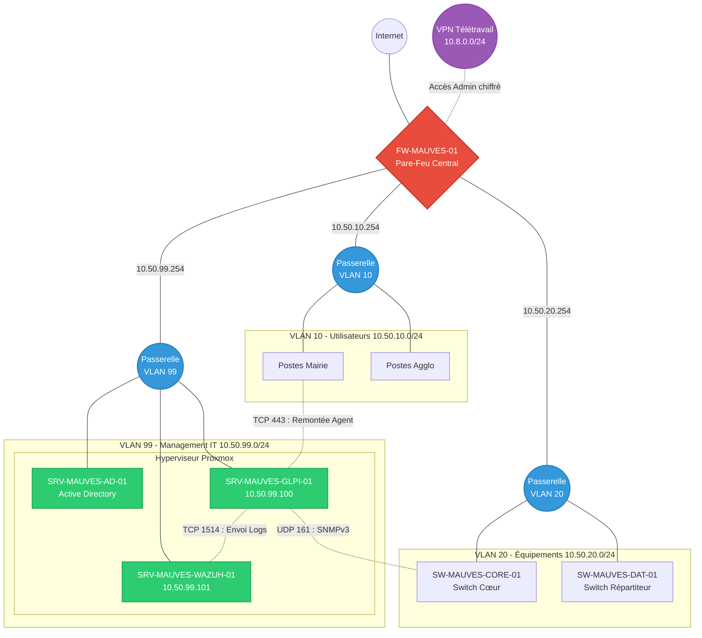
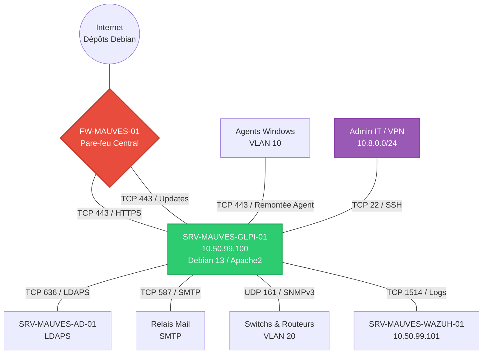
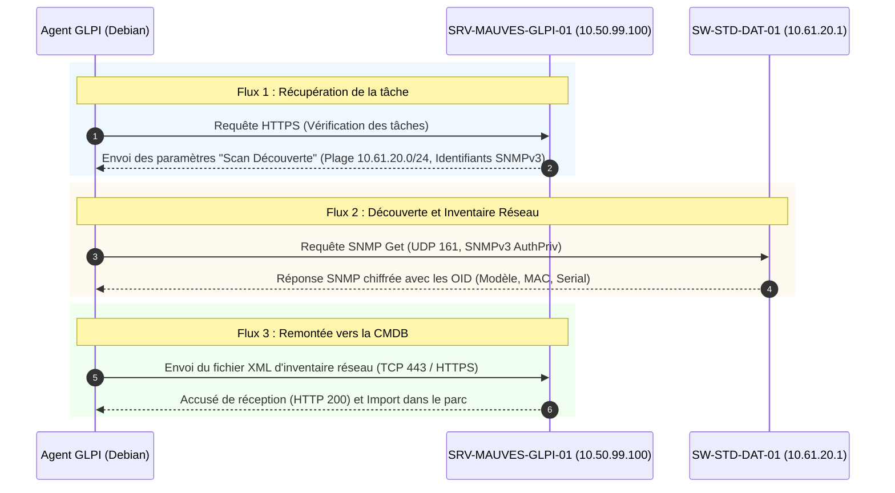

<p align="center">
  
</p>


# Dossier projet AIS

**Auteur :** Yann (Administrateur Infrastructure Sécurisée) 

**Projet :** Décembre 2025 à Avril 2026

```mermaid
graph TD
    %% ==========================================
    %% CŒUR DE RÉSEAU OPÉRATEUR & INTERNET
    %% ==========================================
    Internet((Internet))
    FW{FW-CENTRAL-01<br>Pare-Feu<br>10.50.20.254}
    MPLS(((Nuage MPLS<br>Réseau Opérateur)))
    
    Internet --- FW
    FW ===|Lien Principal| MPLS

    %% ==========================================
    %% 1. SITE MAUVES (HQ / Datacenter) - 10.50.x.x
    %% ==========================================
    subgraph SITE_MAUVES [MAUVES - HQ - 10.50.0.0/16]
        direction TB
        RT_MVS_1{RTR-MVS-01<br>Routeur<br>10.50.20.253}
        RT_MVS_2{RTR-MVS-02<br>Routeur Secours<br>10.50.20.252}
        
        SW_MVS_CORE[SW-MVS-CORE-01<br>Switch Cœur<br>10.50.20.1]
        SW_MVS_VOX_1[SW-MVS-VOX-01<br>Switch Voix<br>10.50.30.1]
        SW_MVS_DAT_1[SW-MVS-DAT-01<br>Switch Data<br>10.50.10.1]
        SW_MVS_DAT_2[SW-MVS-DAT-02<br>Switch Data<br>10.50.10.2]
        
        SRV_GLPI[SRV-MVS-GLPI-01<br>Serveur Inventaire<br>10.50.99.100]
        
        RT_MVS_1 --- SW_MVS_CORE
        RT_MVS_2 --- SW_MVS_CORE
        SW_MVS_CORE --- SW_MVS_VOX_1
        SW_MVS_CORE --- SW_MVS_DAT_1
        SW_MVS_CORE --- SW_MVS_DAT_2
        SW_MVS_CORE -.- SRV_GLPI
    end

    %% ==========================================
    %% 2. SITE ST DONAT - 10.61.x.x
    %% ==========================================
    subgraph SITE_STD [ST DONAT - 10.61.0.0/16]
        direction TB
        RT_STD{RTR-STD-01<br>Routeur<br>10.61.20.254}
        
        SW_STD_DAT1[SW-STD-DAT-01<br>Switch Data<br>10.61.10.1]
        SW_STD_DAT2[SW-STD-DAT-02<br>Switch Data<br>10.61.10.2]
        SW_STD_DAT3[SW-STD-DAT-03<br>Switch Data<br>10.61.10.3]
        SW_STD_DAT4[SW-STD-DAT-04<br>Switch Data<br>10.61.10.4]
        
        SW_STD_VOX1[SW-STD-VOX-01<br>Switch Voix<br>10.61.30.1]
        SW_STD_VOX2[SW-STD-VOX-02<br>Switch Voix<br>10.61.30.2]
        SW_STD_VOX3[SW-STD-VOX-03<br>Switch Voix<br>10.61.30.3]
        
        SW_STD_CAM[SW-STD-EXT-01<br>Switch Extérieur<br>10.61.40.1]
        SW_STD_CAM2[SW-STD-EXT-02<br>Switch Extérieur<br>10.61.40.2]
        SW_STD_CAM3[SW-STD-EXT-03<br>Switch Extérieur<br>10.61.40.3]
        SW_STD_CAM4[SW-STD-EXT-04<br>Switch Extérieur<br>10.61.40.4]
        
        %% Bornes Wi-Fi
        AP_CAMPING[AP-STD-CAMPING-01<br>Borne Wi-Fi<br>10.61.40.10]
        AP_SNACK[AP-STD-SNACK-01<br>Borne Wi-Fi<br>10.61.40.11]
        AP_CAB1[AP-STD-CABANE-01<br>Borne Wi-Fi<br>10.61.40.12]
        AP_CAB2[AP-STD-CABANE-02<br>Borne Wi-Fi<br>10.61.40.13]
        AP_BAT[AP-STD-BATIMENT-01<br>Borne Wi-Fi<br>10.61.40.14]
        AP_TOUR[AP-STD-TOUR-01<br>Borne Wi-Fi<br>10.61.40.15]
        
        RT_STD --- SW_STD_DAT1
        SW_STD_DAT1 --- SW_STD_DAT2
        SW_STD_DAT1 --- SW_STD_DAT3
        SW_STD_DAT1 --- SW_STD_DAT4
        SW_STD_DAT1 --- SW_STD_VOX1
        SW_STD_DAT2 --- SW_STD_VOX2
        SW_STD_DAT3 --- SW_STD_VOX3
        
        SW_STD_DAT1 --- SW_STD_CAM
        SW_STD_CAM --- SW_STD_CAM2
        SW_STD_CAM --- SW_STD_CAM3
        SW_STD_CAM --- SW_STD_CAM4
        
        %% Connexions Wi-Fi
        SW_STD_CAM --- AP_CAMPING
        SW_STD_CAM --- AP_SNACK
        SW_STD_CAM --- AP_CAB1
        SW_STD_CAM --- AP_CAB2
        SW_STD_CAM --- AP_BAT
        SW_STD_CAM --- AP_TOUR
    end

    %% ==========================================
    %% 3. SITE MERCUROL - 10.62.x.x
    %% ==========================================
    subgraph SITE_MER [MERCUROL - 10.62.0.0/16]
        RT_MER_1{RTR-MER-01<br>Routeur<br>10.62.20.254}
        RT_MER_2{RTR-MER-02<br>Routeur Secours<br>10.62.20.253}
        
        SW_MER_VOX1[SW-MER-VOX-01<br>Switch Voix<br>10.62.30.1]
        SW_MER_VOX2[SW-MER-VOX-02<br>Switch Voix<br>10.62.30.2]
        SW_MER_VOX3[SW-MER-VOX-03<br>Switch Voix<br>10.62.30.3]
        
        SW_MER_DAT1[SW-MER-DAT-01<br>Switch Data<br>10.62.10.1]
        SW_MER_DAT2[SW-MER-DAT-02<br>Switch Data<br>10.62.10.2]
        
        RT_MER_1 --- SW_MER_VOX1
        RT_MER_2 --- SW_MER_VOX1
        SW_MER_VOX1 --- SW_MER_VOX2
        SW_MER_VOX1 --- SW_MER_VOX3
        SW_MER_VOX1 --- SW_MER_DAT1
        SW_MER_VOX1 --- SW_MER_DAT2
    end

    %% ==========================================
    %% 4. SITE ST FÉLICIEN - 10.63.x.x
    %% ==========================================
    subgraph SITE_STF [ST FÉLICIEN - 10.63.0.0/16]
        RT_STF1{RTR-STF-01<br>Routeur<br>10.63.20.254}
        RT_STF2{RTR-STF-02<br>Routeur Secours<br>10.63.20.253}
        RT_STF1 --- RT_STF2
    end

    %% ==========================================
    %% 5. SITE QUIBLIER - 10.64.x.x
    %% ==========================================
    subgraph SITE_QUI [QUIBLIER - 10.64.0.0/16]
        RT_QUI1{RTR-QUI-01<br>Routeur<br>10.64.20.254}
        RT_QUI2{RTR-QUI-02<br>Routeur Secours<br>10.64.20.253}
        SW_QUI_CORE[SW-QUI-CORE-01<br>Switch Cœur<br>10.64.20.1]
        
        RT_QUI1 --- SW_QUI_CORE
        RT_QUI2 --- SW_QUI_CORE
    end

    %% ==========================================
    %% 6. SITE TECH CHAMPAGNE - 10.65.x.x
    %% ==========================================
    subgraph SITE_TCH [TECH CHAMPAGNE - 10.65.0.0/16]
        RT_TCH1{RTR-TCH-01<br>Routeur<br>10.65.20.254}
        RT_TCH2{RTR-TCH-02<br>Routeur Secours<br>10.65.20.253}
        RT_TCH1 --- RT_TCH2
    end

    %% ==========================================
    %% 7. SITE EAUX DE TOURNON - 10.66.x.x
    %% ==========================================
    subgraph SITE_EDT [EAUX TOURNON - 10.66.0.0/16]
        RT_EDT1{RTR-EDT-01<br>Routeur<br>10.66.20.254}
        RT_EDT2{RTR-EDT-02<br>Routeur Secours<br>10.66.20.253}
        SW_EDT_DAT[SW-EDT-DAT-01<br>Switch Data<br>10.66.10.1]
        SW_EDT_VOX1[SW-EDT-VOX-01<br>Switch Voix<br>10.66.30.1]
        SW_EDT_VOX2[SW-EDT-VOX-02<br>Switch Voix<br>10.66.30.2]
        
        RT_EDT1 --- SW_EDT_DAT
        RT_EDT2 --- SW_EDT_DAT
        SW_EDT_DAT --- SW_EDT_VOX1
        SW_EDT_DAT --- SW_EDT_VOX2
    end

    %% ==========================================
    %% CONNEXIONS AU NUAGE MPLS
    %% ==========================================
    MPLS ===|Lien Fibre 100M| RT_MVS_1
    MPLS ===|Lien 10M| RT_STD
    MPLS ===|Lien Fibre 100M| RT_MER_1
    MPLS ===|Lien VDSL| RT_STF1
    MPLS ===|Lien Fibre 10M| RT_QUI1
    MPLS ===|Lien Fibre 100M| RT_TCH1
    MPLS ===|Lien Fibre| RT_EDT1

    %% ==========================================
    %% STYLES
    %% ==========================================
    classDef hq fill:#e8f4f8,stroke:#3498db,stroke-width:2px;
    classDef site fill:#f9ebea,stroke:#e74c3c,stroke-width:2px;
    classDef firewall fill:#c0392b,stroke:#922b21,stroke-width:2px,color:#fff;
    classDef router fill:#e67e22,stroke:#d35400,stroke-width:2px,color:#fff;
    classDef switch fill:#27ae60,stroke:#1e8449,stroke-width:2px,color:#fff;
    classDef wifi fill:#f1c40f,stroke:#f39c12,stroke-width:2px,color:#000;
    classDef server fill:#8e44ad,stroke:#732d91,stroke-width:2px,color:#fff;

    class SITE_MAUVES hq;
    class SITE_STD,SITE_MER,SITE_STF,SITE_QUI,SITE_TCH,SITE_EDT site;
    class FW firewall;
    class RT_MVS_1,RT_MVS_2,RT_STD,RT_MER_1,RT_MER_2,RT_STF1,RT_STF2,RT_QUI1,RT_QUI2,RT_TCH1,RT_TCH2,RT_EDT1,RT_EDT2 router;
    class SW_MVS_CORE,SW_MVS_VOX_1,SW_MVS_DAT_1,SW_MVS_DAT_2,SW_STD_DAT1,SW_STD_DAT2,SW_STD_DAT3,SW_STD_DAT4,SW_STD_VOX1,SW_STD_VOX2,SW_STD_VOX3,SW_STD_CAM,SW_STD_CAM2,SW_STD_CAM3,SW_STD_CAM4,SW_MER_VOX1,SW_MER_VOX2,SW_MER_VOX3,SW_MER_DAT1,SW_MER_DAT2,SW_QUI_CORE,SW_EDT_DAT,SW_EDT_VOX1,SW_EDT_VOX2 switch;
    class AP_CAMPING,AP_SNACK,AP_CAB1,AP_CAB2,AP_BAT,AP_TOUR wifi;
    class SRV_GLPI server;
```



## Table des matières

- [Dossier projet AIS](#dossier-projet-ais)
  - [Table des matières](#table-des-matières)
  - [1. Liste des compétences mises en œuvre dans le cadre du projet](#1-liste-des-compétences-mises-en-œuvre-dans-le-cadre-du-projet)
    - [1.1. Mes missions au quotidien](#11-mes-missions-au-quotidien)
  - [2. Cahier des charges ou expression des besoins du projet](#2-cahier-des-charges-ou-expression-des-besoins-du-projet)
    - [2.1. Présentation de l’entreprise](#21-présentation-de-lentreprise)
      - [2.1.1. Organigramme](#211-organigramme)
      - [2.1.2. Implantation de l’entreprise](#212-implantation-de-lentreprise)
    - [2.2. Contexte](#22-contexte)
    - [2.3. Objectif](#23-objectif)
    - [2.4. La mission](#24-la-mission)
    - [2.5. Expression des besoins](#25-expression-des-besoins)
  - [3. Gestion de projet](#3-gestion-de-projet)
    - [3.1. Planification et suivi](#31-planification-et-suivi)
    - [3.2. Macro-planning](#32-macro-planning)
    - [3.2. Macro-planning](#32-macro-planning-1)
    - [3.3. Environnement humain](#33-environnement-humain)
      - [3.3.1. Les acteurs du projet](#331-les-acteurs-du-projet)
  - [4. Environnement technique](#4-environnement-technique)
    - [4.1. Objectifs de qualité](#41-objectifs-de-qualité)
    - [4.2. Choix des solutions](#42-choix-des-solutions)
      - [4.2.1. Localisation des services](#421-localisation-des-services)
    - [4.3. Tableau comparatif des solutions](#43-tableau-comparatif-des-solutions)
    - [4.4. Proposition de solution](#44-proposition-de-solution)
      - [A. Architecture Réseau Globale](#a-architecture-réseau-globale)
      - [B. Plan d'adressage cible et Segmentation (VLAN)](#b-plan-dadressage-cible-et-segmentation-vlan)
      - [C. Les fonctionnalités clés de GLPI exploitées](#c-les-fonctionnalités-clés-de-glpi-exploitées)
    - [Focus technique : La différence entre Découverte et Inventaire réseau](#focus-technique--la-différence-entre-découverte-et-inventaire-réseau)
    - [4.5. Solution retenue et détails techniques](#45-solution-retenue-et-détails-techniques)
      - [A. Ressources et Partitionnement (Proxmox)](#a-ressources-et-partitionnement-proxmox)
      - [B. Stack applicative logicielle (L.A.M.P)](#b-stack-applicative-logicielle-lamp)
      - [C. Espace d'adressage et Filtrage local (UFW)](#c-espace-dadressage-et-filtrage-local-ufw)
      - [D. Cartographie des Flux Applicatifs et Sécurité](#d-cartographie-des-flux-applicatifs-et-sécurité)
    - [4.6. Sécurisation de l’infrastructure](#46-sécurisation-de-linfrastructure)
    - [4.7 Analyse des risques](#47-analyse-des-risques)
    - [4.8 Supervision et exploitation](#48-supervision-et-exploitation)
    - [4.9 Continuité de service](#49-continuité-de-service)
    - [4.10 Justification des choix de sécurité](#410-justification-des-choix-de-sécurité)
  - [5. L’organisation de la mise en œuvre](#5-lorganisation-de-la-mise-en-œuvre)
    - [5.1. Revue de code et configuration](#51-revue-de-code-et-configuration)
- [Téléchargement de l'agent et du module réseau](#téléchargement-de-lagent-et-du-module-réseau)
- [Installation simultanée](#installation-simultanée)
    - [5.2. Schéma détaillé](#52-schéma-détaillé)
    - [5.3. Diagramme de Séquence du Protocole SNMP](#53-diagramme-de-séquence-du-protocole-snmp)
  - [6. Les relations avec les principaux acteurs du projet](#6-les-relations-avec-les-principaux-acteurs-du-projet)
  - [7. Synthèse et conclusion](#7-synthèse-et-conclusion)
  - [8. Annexes](#8-annexes)


## 1. Liste des compétences mises en œuvre dans le cadre du projet

Ce projet de déploiement d'un environnement GLPI de test m'a permis de mobiliser plusieurs compétences clés du titre professionnel d'Administrateur d'Infrastructures Sécurisées :

| Compétences visées par le titre AIS                                              | Actions réalisées dans le cadre du projet GLPI de test                                                                                                                            |
| :------------------------------------------------------------------------------- | :-------------------------------------------------------------------------------------------------------------------------------------------------------------------------------- |
| **Administrer et sécuriser les infrastructures systèmes**                        | Installation, durcissement et sécurisation d'une machine virtuelle Linux/LAMP pour héberger le l'outil open source GLPI dans un environnement isolé.                              |
| **Gérer le patrimoine informatique et les réseaux**                              | Configuration du protocole SNMP pour la découverte réseau et test de déploiement automatisé d'agents d'inventaire sur les postes cibles.                                          |
| **Participer à l'élaboration et à la mise en œuvre de la politique de sécurité** | Lutte contre le *Shadow IT* via la découverte réseau et cartographie des équipements actifs pour identifier les vulnérabilités du parc (systèmes obsolètes, failles matérielles). |

Ce projet s’inscrit pleinement dans les compétences attendues du titre professionnel d’Administrateur d’Infrastructures Sécurisées.

Il m’a permis de mobiliser l’ensemble des activités du référentiel, notamment :

* l’administration et la sécurisation d’une infrastructure système

* la conception et le déploiement d’un environnement technique sécurisé

* la mise en œuvre de mécanismes de supervision et de maintien en conditions de sécurité

À travers l’analyse des besoins, la mise en place d’une architecture cloisonnée, l’intégration de mesures de sécurité adaptées au contexte, ainsi que la définition d’une stratégie de continuité de service, ce projet démontre ma capacité à intervenir sur l’ensemble du cycle de vie d’une infrastructure sécurisée.

### 1.1. Mes missions au quotidien

En tant qu'alternant en administration d'infrastructures sécurisées au sein d'ARCHE Agglo, mon rôle au quotidien se concentre sur le maintien en conditions opérationnelles de l'infrastructure informatique, répartie sur 41 communes. 

Mes missions principales incluent :
* **Le support utilisateur (Niveau 2 et 3) :** Résolution des incidents complexes, gestion des droits d'accès et accompagnement des agents de la collectivité.
* **L'administration système et réseau :** Supervision des équipements réseaux, gestion des serveurs locaux et maintien de la connectivité entre les différents sites distants de l'agglomération.
* **La gestion de projet et l'amélioration continue :** Déploiement de nouvelles solutions techniques (comme les tests sur l'environnement GLPI) visant à optimiser les processus de l'équipe informatique, fiabiliser les données du parc et renforcer la sécurité globale du système d'information de la collectivité.


## 2. Cahier des charges ou expression des besoins du projet

### 2.1. Présentation de l’entreprise

**Ce qu'est ARCHE Agglo :**
ARCHE Agglo est une collectivité publique (Établissement Public de Coopération Intercommunale) créée en 2017. Située à cheval entre l'Ardèche et la Drôme, elle regroupe 41 communes pour environ 60 000 habitants.

**Son activité (ses missions) :**
Son rôle est de gérer des services publics de proximité. Ses 5 grands pôles d'activités sont :
* **L'économie :** Aider les entreprises et développer l'emploi local.
* **L'environnement :** Collecter les déchets et entretenir les cours d'eau.
* **Les services aux habitants :** Gérer la petite enfance (crèches) et l'action sociale.
* **L'Aménagement :** Organiser les transports et la politique du logement.
* **Le tourisme :** Développer l'attractivité (office de tourisme, sentiers de randonnée).

#### 2.1.1. Organigramme


#### 2.1.2. Implantation de l’entreprise

**Les sites principaux :**


**Tous les sites :**


### 2.2. Contexte

ARCHE Agglo dispose déjà d’une solution GLPI en environnement de production afin d’assurer la gestion du parc informatique et le support aux utilisateurs.

Cependant, l’évolution des besoins internes, notamment en matière d’inventaire automatisé et de visibilité sur les équipements réseau, a conduit à envisager l’intégration de nouvelles fonctionnalités telles que :

* le déploiement d’agents d’inventaire sur les postes,
* la découverte réseau via le protocole SNMP.

La mise en œuvre de ces fonctionnalités directement sur l’environnement de production aurait présenté un risque potentiel d’instabilité, notamment en cas d’erreur de configuration ou de mauvaise interprétation des données remontées.

Dans une logique de sécurisation du système d’information et de limitation des impacts sur les services existants, il est apparu nécessaire de concevoir un environnement de test isolé permettant :

* de valider les procédures techniques,
* de tester les flux réseau nécessaires,
* d’anticiper les éventuelles contraintes de sécurité.

Ce projet s’inscrit donc dans une démarche d’amélioration continue du système d’information, visant à renforcer la connaissance du parc informatique tout en garantissant la stabilité de l’environnement de production.

### 2.3. Objectif

Le projet a pour objectif de concevoir, déployer et sécuriser une maquette (environnement de test/pré-production) d'un serveur GLPI. Cet environnement permettra de valider techniquement la procédure d'installation sécurisée, le déploiement automatisé des agents d'inventaire, et la configuration du scan SNMP pour les équipements réseau, avant d'envisager une quelconque mise en production.

### 2.4. La mission

Ma mission principale dans le cadre de ce projet est de réaliser les actions suivantes de bout-en-bout :
* Concevoir l'architecture de l'environnement de test et rédiger le Document d'Architecture Technique (DAT).
* Installer et sécuriser le serveur Linux hébergeant cette maquette.
* Définir, tester et valider une stratégie de déploiement massif des agents d'inventaire.
* Configurer et tester l'inventaire réseau automatisé via le protocole SNMP pour les équipements non-agentés (switchs, imprimantes).
* Produire les livrables documentaires (procédures d'installation et de déploiement) transférables à terme vers la production.

### 2.5. Expression des besoins

Pour répondre aux contraintes techniques et fonctionnelles d'ARCHE Agglo, la solution mise en place doit respecter les besoins suivants :
* **Centralisation :** Une interface web unique accessible par l'équipe IT pour consolider les données.
* **Automatisation :** La remontée des informations (hardware, software, réseau) doit s'effectuer sans intervention humaine régulière.
* **Découverte réseau :** Capacité à scanner les différents sous-réseaux (VLANs) des sites distants via le protocole SNMP.
* **Sécurité et Isolation :** L'environnement de test doit être parfaitement cloisonné pour ne pas impacter la production, tout en assurant des flux chiffrés (HTTPS).
* **Économie :** En tant que collectivité publique, il est primordial de privilégier une solution Open Source robuste (sans coût de licence) cohérente avec l'existant.


## 3. Gestion de projet

### 3.1. Planification et suivi

Pour mener à bien ce projet de déploiement, j’ai opté pour une approche de gestion de projet visuelle et itérative, inspirée de la méthode Kanban.

Cette méthode m’a permis de structurer l’avancement du projet tout en conservant une flexibilité indispensable dans un contexte d’alternance, où les missions de Maintien en Conditions Opérationnelles peuvent ponctuellement impacter le temps dédié au projet.

Le suivi des tâches a été réalisé via l’outil Trello, organisé en plusieurs colonnes permettant de visualiser l’état d’avancement du projet à chaque étape de sa réalisation.

Cette organisation comprenait :

* Backlog (À faire) : ensemble des tâches identifiées lors de la phase de conception, constituant le périmètre initial du projet (ex : rédaction du DAT, création de la VM, sécurisation du serveur).
* En cours : tâches en cours de réalisation à un instant donné, permettant de prioriser les actions en fonction des contraintes techniques ou organisationnelles.
* En attente / Bloqué : tâches dépendantes d’un facteur externe, comme une validation, une ressource ou une configuration réseau (ex : ouverture de flux).
* Terminé : tâches finalisées, validées techniquement et documentées.

Bien que l’ensemble des tâches soit aujourd’hui achevé, cette structuration a permis tout au long du projet de :

* maintenir une vision claire de l’avancement,
* gérer les dépendances techniques,
* sécuriser la progression jusqu’à la phase de clôture.

### 3.2. Macro-planning

Le projet s'est déroulé en plusieurs phases distinctes, allant de l'expression du besoin jusqu'à la livraison de la documentation. Voici le macro-planning des grandes étapes :

### 3.2. Macro-planning

Le projet s'est déroulé en plusieurs phases distinctes, allant de l'expression du besoin jusqu'à la livraison de la documentation. Afin de sécuriser l'avancement, des jalons de validation ont été définis avec la DSI à la fin de chaque étape clé :

| Phase                                   | Période                           | Description des tâches                                                                                      | Livrables associés                                           | Jalons (Points de validation)                                      |
| :-------------------------------------- | :-------------------------------- | :---------------------------------------------------------------------------------------------------------- | :----------------------------------------------------------- | :----------------------------------------------------------------- |
| **1. Cadrage et Architecture**          | **8 au 22 Décembre 2025**         | Analyse des besoins, étude de l'existant, choix des solutions et conception de l'architecture.              | Cahier des charges, DAT (Document d'Architecture Technique). | **Jalon 1 :** Validation de l'architecture (DAT) par le tuteur     |
| **2. Préparation de l'infrastructure**  | **19 au 29 Janvier 2026**         | Création de la VM sur Proxmox, installation de Debian 13, configuration réseau et sécurité (Firewall, SSH). | VM opérationnelle et sécurisée.                              | **Jalon 2 :** Serveur accessible, durci et isolé sur le réseau     |
| **3. Déploiement applicatif**           | **30 Janvier au 20 Février 2026** | Installation de la stack LAMP, déploiement de GLPI, connexion au LDAP et configuration de base.             | Interface GLPI accessible en HTTPS.                          | **Jalon 3 :** Application web fonctionnelle et connectée à l'AD    |
| **4. Tests et Validation (Inventaire)** | **23 au 26 Mars 2026**            | Déploiement d'agents de test, configuration de l'inventaire SNMP, validation des remontées d'informations.  | Remontée des équipements dans la maquette.                   | **Jalon 4 :** Réussite du premier scan SNMP et intégration en base |
| **5. Documentation et Clôture**         | **7 au 23 Avril 2026**            | Rédaction des procédures d'installation, de déploiement et d'exploitation pour l'équipe technique.          | Procédures documentées sur GitHub.                           | **Jalon 5 :** Recette finale et livraison des livrables à l'équipe |

### 3.3. Environnement humain

#### 3.3.1. Les acteurs du projet

La réussite de ce projet repose sur la collaboration de plusieurs acteurs au sein du service informatique d'ARCHE Agglo :

* **Moi-même (Alternant Administrateur d'Infrastructures Sécurisées) - *Chef de projet*** : 
  En charge de l'analyse, de la conception (DAT), du déploiement technique de la maquette, de la réalisation des tests d'inventaire et de la rédaction de la documentation.
* **Mon Tuteur en entreprise / Chef du SI** : 
  Il valide l'architecture proposée, alloue les ressources matérielles nécessaires (accès à l'hyperviseur Proxmox, attribution des adresses IP) et s'assure de l'alignement du projet avec la stratégie informatique de la collectivité.
* **L'équipe technique (Techniciens Support et Réseau) - *Utilisateurs finaux*** : 
  Consultés lors de la phase d'expression des besoins, ils sont les futurs utilisateurs de la procédure d'exploitation et interviennent pour valider que les informations remontées par la maquette de test sont pertinentes pour leur travail quotidien.


## 4. Environnement technique

### 4.1. Objectifs de qualité

Avant tout déploiement technique, l'analyse des besoins et des risques a permis de définir les objectifs de qualité suivants pour l'environnement GLPI :
* **Disponibilité :** Garantir un accès constant au service de gestion de parc et au helpdesk (mesures de réduction des risques : sauvegardes régulières, snapshots VM).
* **Intégrité :** S'assurer que les données d'inventaire et les bases de données (MariaDB) ne soient pas corrompues ou perdues.
* **Sécurité et Confidentialité :** Protéger l'application contre les failles (MCO régulier, flux HTTPS) et sécuriser l'authentification (LDAPS).
* **Évolutivité :** Prévoir une architecture capable d'absorber une future charge de production (ajout de RAM/CPU) et de s'intégrer à terme avec un système SSO (OpenID Connect).

Maintenabilité : Permettre une restauration rapide du service grâce aux sauvegardes et snapshots.

### 4.2. Choix des solutions

Le choix s'est porté sur des technologies Open Source robustes et reconnues sur le marché, garantissant une maîtrise totale des coûts et de la sécurité. 
L'infrastructure repose sur une Machine Virtuelle (VM) équipée du système d'exploitation **Debian 13**, hébergeant une stack **LAMP** (Linux, Apache, MariaDB, PHP).

#### 4.2.1. Localisation des services

* **Modèle de déploiement :** sur site.
* **Hébergement :** La machine virtuelle est hébergée sur l'infrastructure virtualisée existante d'ARCHE Agglo, gérée par l'hyperviseur **Proxmox**.
* **PRA / Sauvegarde :** La stratégie de sauvegarde respecte la **règle 3-2-1** (3 copies, 2 supports différents dont un NAS local, 1 copie hors site dans le Cloud) automatisée via Veeam Backup.

### 4.3. Tableau comparatif des solutions

Pour répondre aux besoins d'inventaire automatisé et de gestion de parc, plusieurs solutions ont été étudiées :

| Critères / Fonctionnalités           | Solution 01 : GLPI + GLPI Inventory | Solution 02 : OCS Inventory |    Solution 03 : Snipe-IT    |
| :----------------------------------- | :---------------------------------: | :-------------------------: | :--------------------------: |
| **Inventaire automatisé par Agent**  |                 Oui                 |             Oui             | Non (Saisie manuelle ou API) |
| **Découverte réseau (SNMP)**         |                 Oui                 |             Oui             |             Non              |
| **Gestion du Helpdesk (Tickets)**    |                 Oui                 |             Non             |             Non              |
| **Solution Open Source et gratuite** |                 Oui                 |             Oui             |  Oui (version auto-hébérgé)  |
| **Cohérence avec l'existant (Prod)** |                 Oui                 |             Non             |             Non              |

### 4.4. Proposition de solution

La Solution 01 (GLPI) est retenue. Bien que son interface d'administration soit parfois dense, elle est la seule à couvrir nativement l'ensemble du périmètre fonctionnel exigé : gestion de parc complète (hardware/software), helpdesk intégré, et découverte réseau via SNMP. De plus, la collectivité utilisant déjà GLPI en production, le choix de cette solution pour la maquette de test garantit une transférabilité immédiate des compétences et des scripts développés.

Afin de garantir un haut niveau de sécurité, l'architecture cible a été pensée pour isoler les services et contrôler strictement les flux réseau.

#### A. Architecture Réseau Globale



#### B. Plan d'adressage cible et Segmentation (VLAN)

Pour éviter toute compromission depuis les postes utilisateurs et cloisonner l'administration, l'infrastructure s'appuie sur une segmentation logique stricte de niveau 2. La maquette virtualisée sous Proxmox valide le plan d'adressage cible suivant pour le site principal :
* **VLAN 10 - Utilisateurs (Bureautique) :** `10.50.10.0/24` (Réseau standard hébergeant les postes de travail des agents).
* **VLAN 20 - Équipements Réseaux :** `10.50.20.0/24` (Réseau dédié aux interfaces de management des switchs, routeurs et bornes Wi-Fi).
* **VLAN 99 - Management (Serveurs IT) :** `10.50.99.0/24` (Réseau d'administration isolé hébergeant le serveur GLPI avec l'IP statique `10.50.99.100`, et le serveur SIEM Wazuh avec l'IP `10.50.99.101`).
* **Réseau VPN - Télétravail IT :** `10.8.0.0/24` (Plage d'adresses attribuée dynamiquement aux techniciens se connectant à distance de manière chiffrée pour administrer l'infrastructure).

#### C. Les fonctionnalités clés de GLPI exploitées

Au-delà de la simple installation du socle web, la valeur ajoutée du projet réside dans l'exploitation des modules avancés de GLPI pour structurer le système d'information :
* **La CMDB (Gestion de parc) :** Elle permet de maintenir un inventaire exhaustif et dynamique du matériel (PC, serveurs, équipements réseau) et des licences logicielles, offrant une excellente visibilité pour contrer le Shadow IT.
* **Le Helpdesk (aligné ITIL) :** Il offre une gestion centralisée du cycle de vie des tickets (Incidents et Demandes), le suivi des accords de niveau de service (SLA), et permet la constitution d'une base de connaissances technique.

### Focus technique : La différence entre Découverte et Inventaire réseau

Pour automatiser la remontée des équipements réseau sans agent, le projet exploite deux mécanismes distincts mais complémentaires opérés par l'agent GLPI :

1. **La Découverte Réseau :** L'agent effectue un balayage actif (sweep) d'une plage d'adresses IP cible (ex: `10.50.20.0/24` pour le site principal ou `10.61.20.0/24` pour St Donat) en testant les identifiants SNMPv3 configurés. Il détecte les équipements joignables et crée une fiche basique dans la base GLPI contenant l'adresse IP, l'adresse MAC et le nom de l'équipement.
2. **L'Inventaire Réseau :** Une fois le switch administrable découvert, l'agent lance des requêtes SNMP approfondies pour lire ses tables internes (tables de routage, tables ARP, et tables FDB/MAC associées aux ports physiques). C'est ce processus complexe qui permet à GLPI de cartographier la topologie physique et de savoir précisément quel ordinateur est connecté sur quel port physique du switch.

### 4.5. Solution retenue et détails techniques

Le déploiement technique de la solution retenue s'articule autour des caractéristiques suivantes, pensées pour garantir performance et sécurité :

#### A. Ressources et Partitionnement (Proxmox)
La machine virtuelle hébergeant GLPI est dimensionnée selon les recommandations de l'éditeur, avec une isolation stricte des données via LVM :
* **vCPU :** 2 vCPU (Suffisant pour le traitement PHP/Web standard).
* **RAM :** 4 Go (Minimum recommandé, évolutif).
* **Stockage :** 50 Go (SSD) avec un partitionnement LVM strict pour isoler les composants critiques et prévenir la saturation du système :
  * `/` : 15 Go (Système Debian 13 + LAMP + GLPI)
  * `/var` : 10 Go (Données applicatives et cache)
  * `/var/log` : 5 Go (Journaux système)
  * `/var/lib/mysql` : 15 Go (Base de données)
  * `/home` : 5 Go (Comptes administrateurs)

#### B. Stack applicative logicielle (L.A.M.P)
* **Serveur Web :** Apache2
* **Base de données :** MariaDB 10.11 minimum
* **Langage :** PHP 8.4-fpm (Version requise pour la compatibilité avec GLPI 11, avec extensions `mysqli`, `curl`, `gd`, `intl`, `ldap`, `zip`, etc.)

#### C. Espace d'adressage et Filtrage local (UFW)

Le serveur dispose d'une adresse IPv4 fixe (`10.50.99.100`) et d'un enregistrement DNS. En complément du pare-feu périmétrique, les ouvertures de ports locales (Firewall UFW) sont strictement limitées :

| Direction | Port | Protocole | Service | Justification |
| :--- | :--- | :--- | :--- | :--- |
| **Entrant (IN)** | 443 | TCP | HTTPS | Accès interface web et remontée des agents |
| **Entrant (IN)** | 22 | TCP | SSH | Administration (restreint aux IP administrateurs) |
| **Sortant (OUT)** | 443 | TCP | HTTPS | Mises à jour système et plugins |
| **Sortant (OUT)** | 636 | TCP | LDAPS | Authentification sécurisée vers l'Active Directory |
| **Sortant (OUT)** | 587 | TCP | SMTP | Envoi des notifications mail (STARTTLS) |
| **Sortant (OUT)** | 161 | UDP | SNMP | Requêtes de découverte et d'inventaire réseau |

#### D. Cartographie des Flux Applicatifs et Sécurité

Ce diagramme synthétise les interactions réseaux entrantes et sortantes du serveur GLPI au sein de l'infrastructure :



### 4.6. Sécurisation de l’infrastructure

La sécurisation de l'environnement GLPI est une priorité traitée à plusieurs niveaux :

**Sécurité Applicative et Flux :** Utilisation obligatoire du protocole HTTPS pour chiffrer les échanges web. Les requêtes d'authentification vers l'Active Directory sont encapsulées dans un tunnel sécurisé (LDAPS port 636). Après installation, le dossier `/install` de GLPI est obligatoirement supprimé.

**Durcissement du Système :** Désactivation de l'accès SSH pour l'utilisateur `root`.
  * Authentification SSH par clé cryptographique uniquement.
  * Mise en place d'un pare-feu local (UFW) sur la machine Debian.
  * Déploiement de `Fail2ban` pour contrer les attaques par force brute sur les services SSH et Apache.

**Résilience des données :** Sauvegardes automatisées (Veeam) quotidiennes incluant des dumps de la base MariaDB, avec une politique de rétention de 30 jours, permettant un Plan de Reprise d'Activité (PRA) efficace.

**Supervision :** Monitoring proactif (charge CPU, RAM, espace disque, statut Apache/MariaDB) via requêtes SNMP et HTTP(S).

### 4.7 Analyse des risques

Dans le cadre du déploiement de la maquette GLPI, une analyse des risques a été réalisée afin d’identifier les menaces potentielles liées à l’environnement de test et d’anticiper leur impact sur le système d’information.

| Risque identifié            | Impact potentiel                     | Probabilité | Mesures de réduction mises en place             |
| --------------------------- | ------------------------------------ | ----------- | ----------------------------------------------- |
| Utilisation de SNMP v2c     | Interception des informations réseau | Faible      | Usage limité à un VLAN interne isolé            |
| Certificat SSL auto-signé   | Risque Man-In-The-Middle             | Faible      | Utilisation uniquement en environnement interne |
| Machine virtuelle unique    | Point de défaillance unique (SPOF)   | Moyen       | Snapshots réguliers + sauvegardes               |
| Mauvaise configuration LDAP | Échec d’authentification             | Moyen       | Tests réalisés en pré-production                |
| Saturation disque           | Indisponibilité du service           | Faible      | Supervision du stockage                         |
| Vulnérabilités applicatives | Compromission GLPI                   | Faible      | Mises à jour automatiques                       |
| Accès SSH non maîtrisé      | Compromission serveur                | Faible      | Authentification par clé + Fail2ban             |

### 4.8 Supervision et exploitation

Au-delà de l’identification des risques, la mise en place d’une supervision constitue un élément essentiel pour assurer la disponibilité et la stabilité du service dans le temps.

Afin de garantir la disponibilité et la fiabilité du service GLPI, l’environnement de test a été intégré dans une démarche de supervision proactive.

**Indicateurs surveillés**

- Disponibilité du service HTTPS  
- Charge CPU  
- Utilisation mémoire  
- Espace disque  
- Statut Apache  
- Statut MariaDB  

**Seuils d’alerte**

| Indicateur           | Seuil d’alerte |
| -------------------- | -------------- |
| CPU                  | > 80%          |
| RAM                  | > 85%          |
| Disque               | > 90%          |
| Apache indisponible  | Critique       |
| MariaDB indisponible | Critique       |

**Méthodes de supervision**

- SNMP pour les ressources système  
- HTTP(S) pour la disponibilité applicative  

**Bénéfices**

- Détection anticipée des incidents  
- Meilleure continuité de service  
- Exploitation facilitée en production  

### 4.9 Continuité de service

La supervision seule ne suffit pas à garantir la résilience du service. Il est également nécessaire de définir des objectifs de reprise afin d’anticiper les scénarios de défaillance.

Afin d’assurer la résilience du service GLPI, des objectifs de reprise ont été définis.

| Indicateur | Objectif  |
| ---------- | --------- |
| RTO        | 4 heures  |
| RPO        | 24 heures |

Ces objectifs sont rendus possibles grâce à :

- Sauvegardes quotidiennes automatisées  
- Dumps MariaDB  
- Snapshots VM  
- Stockage multi-supports (3-2-1)  

En cas d’incident majeur :

- Restauration complète de la VM possible  
- Restauration de la base GLPI indépendante  

Cette organisation garantit une remise en service rapide tout en limitant la perte de données.

### 4.10 Justification des choix de sécurité

Certains choix techniques ont été réalisés en tenant compte du contexte d’un environnement de test.

**SNMP v2c**

Le protocole SNMP v2c avec communauté `public` a été retenu afin de :

- Faciliter les tests de découverte réseau  
- Valider les flux d’inventaire  

Cependant :

- Usage limité à un périmètre interne  
- Non exposé à Internet  
- Migration prévue vers SNMPv3 en production  

**Certificat SSL auto-signé**

L’usage d’un certificat auto-signé est justifié par :

- L’absence d’exposition externe  
- La nature temporaire de l’environnement  

> Un certificat reconnu sera déployé en production


## 5. L’organisation de la mise en œuvre

La mise en œuvre de la maquette GLPI s'est déroulée de manière itérative, en veillant à documenter chaque étape technique. L'organisation s'est découpée en l'installation du socle applicatif, la sécurisation du serveur, et enfin le déploiement de l'agent Linux pour la découverte réseau.

### 5.1. Revue de code et configuration

Pour illustrer le travail technique réalisé, voici des extraits significatifs des configurations et commandes mises en place pour assurer le déploiement de la solution.

**A. Installation du socle applicatif et liaison PHP-FPM**

L'installation de GLPI a été réalisée sur un serveur Debian 13 en utilisant une stack LAMP moderne comprenant Apache2, MariaDB (version ≥ 10.11) et PHP 8.4-fpm. L'utilisation de PHP-FPM permet une meilleure gestion des processus et renforce la sécurité. Pour cela, le VirtualHost d'Apache a été configuré pour déléguer l'exécution des scripts via un socket Unix :

```apache
<FilesMatch \.php$>
    SetHandler "proxy:unix:/run/php/php8.4-fpm.sock|fcgi://localhost/"
</FilesMatch>
```

**B. Déploiement de l'Agent GLPI sous Debian**

Afin d'assurer la remontée automatique de l'inventaire réseau, l'agent GLPI a été déployé manuellement sur un serveur Debian en version 1.15. L'installation s'est faite via les paquets .deb officiels, en incluant le module network indispensable pour scanner les switchs

# Téléchargement de l'agent et du module réseau

wget [https://github.com/glpi-project/glpi-agent/releases/download/1.15/glpi-agent_1.15-1_all.deb](https://github.com/glpi-project/glpi-agent/releases/download/1.15/glpi-agent_1.15-1_all.deb)
wget [https://github.com/glpi-project/glpi-agent/releases/download/1.15/glpi-agent-task-network_1.15-1_all.deb](https://github.com/glpi-project/glpi-agent/releases/download/1.15/glpi-agent-task-network_1.15-1_all.deb)

# Installation simultanée

```bash
sudo apt install ./glpi-agent_1.15-1_all.deb ./glpi-agent-task-network_1.15-1_all.deb -y
```

Le fichier de configuration /etc/glpi-agent/agent.cfg a ensuite été modifié pour spécifier l'URL du serveur GLPI et ignorer la vérification SSL (no-ssl-check) du certificat auto-signé de la maquette.

**C. Configuration SNMP pour la découverte réseau.**

La découverte du matériel réseau a été orchestrée depuis l'interface web de GLPI. Les modules de découverte et d'inventaire réseau ont été activés sur l'agent. J'ai ensuite créé les identifiants SNMP en version v2c avec la communauté public, défini les plages IP cibles, et créé une tâche "Scan Découverte". Une exécution forcée (sudo glpi-agent --force) a permis l'importation automatique des switchs avec leurs adresses MAC et numéros de série.

### 5.2. Schéma détaillé

L'architecture détaillée du déploiement met en évidence le cloisonnement des services. La machine virtuelle repose sur un hyperviseur Proxmox et interagit avec l'Active Directory ainsi que les équipements réseau.

### 5.3. Diagramme de Séquence du Protocole SNMP

Ce diagramme de séquence détaille les interactions réseau entre l'agent Linux (équipé du module network) et les équipements lors du processus de découverte SNMP.




## 6. Les relations avec les principaux acteurs du projet

La réussite de cette preuve de concept a nécessité une communication fluide et régulière avec les différentes parties prenantes au sein de la Direction des Systèmes d'Information (DSI) d'ARCHE Agglo. 

* **Avec la Direction (Mon Tuteur / Responsable Informatique) :**
  
  Les échanges ont été réguliers, principalement lors des phases de cadrage et de validation. J'ai soumis le Document d'Architecture Technique (DAT) à mon tuteur pour validation des choix technologiques (Debian 13, GLPI 11, PHP 8.4) et des exigences de sécurité. Cette relation m'a permis d'obtenir les ressources nécessaires (Machine Virtuelle sur l'hyperviseur Proxmox, adresse IP fixe) et de m'assurer que le projet s'inscrivait bien dans la politique de sécurité globale de la collectivité.

* **Avec l'Équipe Technique (Techniciens Réseau et Support) :**
  
  La relation a été très collaborative. L'équipe technique étant la destinataire finale de la solution (notamment pour l'utilisation du Helpdesk et la consultation de l'inventaire), je les ai impliqués lors des tests fonctionnels. Leurs retours ont été précieux pour valider la pertinence des informations remontées par le scan SNMP sur les switchs. Enfin, je leur ai fourni les livrables documentaires (procédures d'installation et de déploiement) afin de garantir un transfert de compétences efficace.

* **Posture personnelle :**
  
  En tant qu'alternant AIS, j'ai agi en tant que référent technique sur ce projet. J'ai dû vulgariser certains concepts de sécurité (comme la nécessité du durcissement système ou de l'isolation des flux) pour justifier mes choix d'architecture lors des points de suivi, renforçant ainsi ma posture de conseil.


## 7. Synthèse et conclusion

Le projet de déploiement d'un environnement de test GLPI pour ARCHE Agglo s'est achevé avec succès. L'ensemble des objectifs définis dans le cahier des charges a été atteint : la plateforme est fonctionnelle, sécurisée, et répond parfaitement aux exigences du Document d'Architecture Technique (DAT). 

Techniquement, ce projet m'a permis de déployer une infrastructure complète et robuste. J'ai mis en place un serveur LAMP sous Debian 13, configuré de manière sécurisée grâce à des mesures de durcissement telles que le filtrage des flux via UFW, la protection contre les attaques par force brute avec Fail2ban, et la désactivation des accès SSH root. 
Par ailleurs, l'automatisation de l'inventaire via le déploiement de l'agent GLPI et la configuration de la découverte réseau (protocole SNMP) garantit désormais à la collectivité une vision précise, centralisée et constamment à jour de son parc informatique. 

D'un point de vue professionnel, ce projet valide pleinement les compétences visées par mon titre d'Administrateur d'Infrastructures Sécurisées (AIS). Il démontre ma capacité à :

* concevoir une architecture,
* déployer une solution sécurisée,
* superviser un environnement,
* maintenir la sécurité dans le temps grâce à des mécanismes de sauvegarde et de résilience.

**Perspectives et évolutions :**

La maquette ayant fait ses preuves de stabilité et de sécurité, la prochaine étape logique sera la migration de cette configuration vers l'environnement de production. À plus long terme, comme identifié lors de l'étude d'architecture, l'implémentation d'un système d'authentification unique (SSO) basé sur le protocole OpenID Connect constituera une évolution majeure. Cela permettra de centraliser la gestion des identités tout en offrant une expérience utilisateur simplifiée et plus sécurisée aux agents de la collectivité.


## 8. Annexes

* **Annexe 1 :** Document d'Architecture Technique (DAT) GLPI.

[DAT](Document_d'Architecture_Technique_GLPI.md)


* **Annexe 2 :** Procédure d'installation et de préparation de GLPI 11.

[Installation](Procédure_pour_installation_GLPI.md)

* **Annexe 3 :** Procédure de déploiement (Agent GLPI et Inventaire Réseau SNMP).

[SNMP](<Procédure_de_déploiement _Agent_GLPI_et_Inventaire_Réseau_SNMP_sous_Debian.md>)